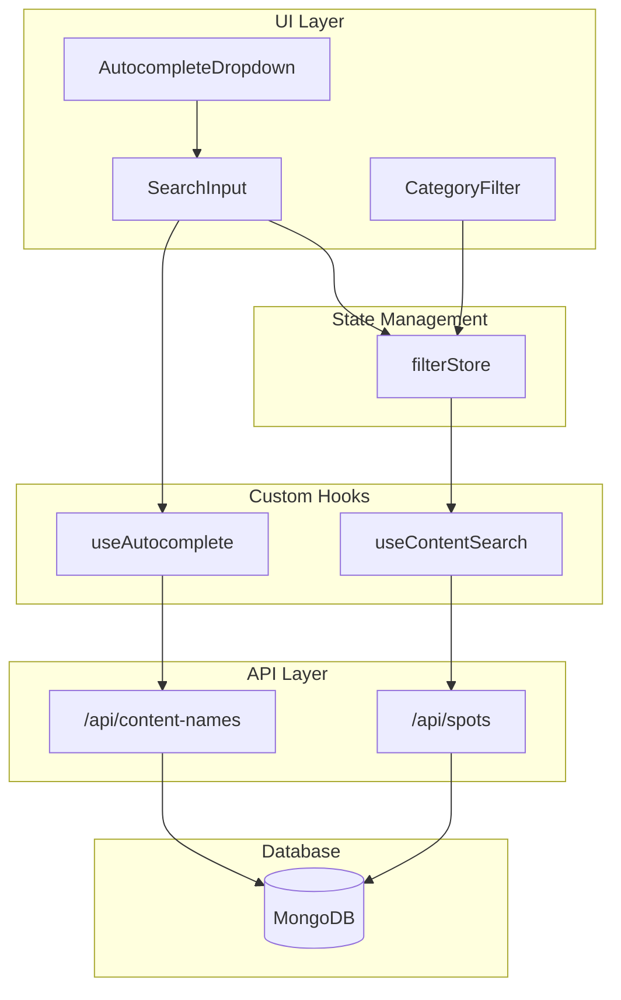

# Design Document: Content Search Filter

## Overview

콘텐츠 검색 필터 기능은 사용자가 작품명, 구단명, 아티스트명 등을 직접 검색하여 관련 스팟을 필터링할 수 있게 합니다. 기존 카테고리 필터와 함께 동작하며, 자동완성 기능을 통해 사용자 경험을 향상시킵니다.

### 핵심 설계 원칙

1. **기존 시스템 확장**: filterStore를 확장하여 검색 상태 관리
2. **서버 사이드 필터링**: MongoDB 쿼리를 활용한 효율적인 검색
3. **점진적 향상**: 자동완성은 UX 향상 기능으로, 기본 검색은 독립적으로 동작

## Architecture



### 데이터 흐름

1. 사용자가 SearchInput에 검색어 입력
2. 2글자 이상 입력 시 useAutocomplete가 자동완성 API 호출
3. 검색어 확정 시 filterStore에 searchQuery 저장
4. useSpots 훅이 filterStore 상태를 구독하여 API 호출
5. API가 category + search 조건으로 MongoDB 쿼리 실행

## Components and Interfaces

### 1. SearchInput 컴포넌트

```typescript
interface SearchInputProps {
  placeholder?: string
  className?: string
}

// 주요 기능
// - 검색어 입력 및 표시
// - 자동완성 드롭다운 트리거
// - 검색어 초기화 버튼
// - 디바운스된 검색어 업데이트
```

### 2. AutocompleteDropdown 컴포넌트

```typescript
interface AutocompleteItem {
  name: string
  category: SpotCategory
  count: number
}

interface AutocompleteDropdownProps {
  items: AutocompleteItem[]
  isLoading: boolean
  onSelect: (item: AutocompleteItem) => void
  onClose: () => void
}

// 주요 기능
// - 자동완성 항목 목록 표시
// - 카테고리 아이콘 및 스팟 개수 표시
// - 키보드 네비게이션 지원
// - 외부 클릭 시 닫기
```

### 3. ContentSearchFilter 컴포넌트 (통합)

```typescript
// SearchInput + AutocompleteDropdown을 결합한 컴포넌트
// CategoryFilter와 나란히 배치
```

### 4. useContentSearch 훅

```typescript
interface UseContentSearchReturn {
  searchQuery: string
  setSearchQuery: (query: string) => void
  clearSearch: () => void
  isSearchActive: boolean
}
```

### 5. useAutocomplete 훅

```typescript
interface UseAutocompleteReturn {
  suggestions: AutocompleteItem[]
  isLoading: boolean
  error: Error | null
}

// 디바운스된 API 호출 (300ms)
// 2글자 미만 입력 시 빈 배열 반환
```

## Data Models

### FilterStore 확장

```typescript
interface FilterStore {
  // 기존 필드
  selectedCategories: SpotCategory[]

  // 새로운 필드
  searchQuery: string

  // 기존 액션
  setSelectedCategories: (categories: SpotCategory[]) => void
  toggleCategory: (category: SpotCategory) => void
  selectAllCategories: () => void
  clearCategories: () => void
  resetFilterState: () => void

  // 새로운 액션
  setSearchQuery: (query: string) => void
  clearSearchQuery: () => void
}
```

### API 응답 타입

```typescript
// GET /api/content-names 응답
interface ContentNamesResponse {
  items: AutocompleteItem[]
  total: number
}

// GET /api/spots 쿼리 파라미터 확장
interface SpotsQueryParams {
  category?: string // 기존
  search?: string // 새로운 파라미터
}
```

### MongoDB 쿼리 구조

```typescript
// 검색 쿼리 예시
const query = {
  // 카테고리 필터
  ...(categories.length > 0 && { category: { $in: categories } }),

  // 검색 필터 (relatedContent.name 부분 일치)
  ...(search && {
    'relatedContent.name': {
      $regex: search,
      $options: 'i', // 대소문자 무시
    },
  }),
}
```

## Correctness Properties

_A property is a characteristic or behavior that should hold true across all valid executions of a system—essentially, a formal statement about what the system should do. Properties serve as the bridge between human-readable specifications and machine-verifiable correctness guarantees._

### Property 1: 검색어 입력 실시간 반영

_For any_ 문자열 입력, SearchInput 컴포넌트에 입력된 값은 즉시 내부 상태에 반영되어야 한다.

**Validates: Requirements 1.3**

### Property 2: 초기화 버튼 클릭 시 검색어 리셋

_For any_ 비어있지 않은 검색어 상태에서, 초기화 버튼 클릭 시 검색어는 빈 문자열이 되고 filterStore의 searchQuery도 빈 문자열이 되어야 한다.

**Validates: Requirements 1.5**

### Property 3: 2글자 이상 입력 시 자동완성 활성화

_For any_ 2글자 이상의 검색어 입력에 대해, useAutocomplete 훅은 API를 호출하고 결과를 반환해야 한다. 2글자 미만의 입력에 대해서는 API를 호출하지 않고 빈 배열을 반환해야 한다.

**Validates: Requirements 2.1**

### Property 4: 자동완성 최대 10개 제한

_For any_ 자동완성 API 응답에 대해, 반환되는 항목 수는 항상 10개 이하여야 한다.

**Validates: Requirements 2.2**

### Property 5: 제안 항목 선택 시 검색어 설정 및 필터 적용

_For any_ 자동완성 제안 항목 선택 시, SearchInput의 값은 선택된 항목의 name으로 설정되고, filterStore의 searchQuery도 동일한 값으로 업데이트되어야 한다.

**Validates: Requirements 2.3, 2.4**

### Property 6: 자동완성 항목 카테고리 정보 포함

_For any_ 자동완성 API 응답의 각 항목에 대해, category 필드가 유효한 SpotCategory 값이어야 한다.

**Validates: Requirements 2.6, 5.3**

### Property 7: 부분 일치 검색 동작

_For any_ 검색어와 스팟 데이터셋에 대해, API가 반환하는 모든 스팟의 relatedContent.name 중 하나 이상이 검색어를 부분 문자열로 포함해야 한다.

**Validates: Requirements 3.1, 6.2**

### Property 8: 대소문자 무시 검색

_For any_ 검색어에 대해, 대문자/소문자 변형(예: "ABC", "abc", "Abc")은 동일한 검색 결과를 반환해야 한다.

**Validates: Requirements 3.2**

### Property 9: 카테고리와 검색어 AND 조건 결합

_For any_ 카테고리 필터와 검색어 조합에 대해, API가 반환하는 모든 스팟은 선택된 카테고리에 속하면서 동시에 검색어와 매칭되는 relatedContent.name을 가져야 한다.

**Validates: Requirements 3.5, 6.3**

### Property 10: 스토어 검색어 상태 독립성

_For any_ filterStore 상태 변경에 대해, searchQuery 변경은 selectedCategories에 영향을 주지 않고, selectedCategories 변경은 searchQuery에 영향을 주지 않아야 한다.

**Validates: Requirements 4.1, 4.3, 4.4**

### Property 11: 자동완성 API 중복 제거

_For any_ 자동완성 API 응답에 대해, 반환되는 Content_Name 목록에 중복된 name 값이 없어야 한다.

**Validates: Requirements 5.2**

## Error Handling

### 네트워크 오류

- 자동완성 API 호출 실패 시 빈 배열 반환, 에러 로깅
- 스팟 API 호출 실패 시 기존 데이터 유지, 사용자에게 에러 토스트 표시

### 입력 유효성

- 특수문자 포함 검색어: 정규식 이스케이프 처리
- 매우 긴 검색어: 최대 100자 제한
- XSS 방지: 검색어 sanitize 처리

### 빈 상태 처리

- 검색 결과 없음: "검색 결과가 없습니다" 메시지 표시
- 자동완성 결과 없음: "일치하는 콘텐츠가 없습니다" 메시지 표시

### 디바운스 처리

- 자동완성 API 호출: 300ms 디바운스
- 검색 필터 적용: 500ms 디바운스 (Enter 키 또는 제안 선택 시 즉시 적용)

## Testing Strategy

### 단위 테스트

- SearchInput 컴포넌트: 입력, 초기화, 포커스 동작
- AutocompleteDropdown 컴포넌트: 항목 렌더링, 선택, 닫기 동작
- filterStore: 검색어 상태 관리 액션
- useAutocomplete 훅: API 호출 조건, 디바운스 동작

### 속성 기반 테스트

테스트 라이브러리: **fast-check** (TypeScript/JavaScript용 PBT 라이브러리)

각 속성 테스트는 최소 100회 반복 실행하며, 다음 형식의 태그를 포함합니다:

```typescript
// Feature: content-search-filter, Property N: {property_text}
```

### 통합 테스트

- CategoryFilter + SearchInput 조합 동작
- API 호출 및 지도 업데이트 흐름
- 필터 초기화 시 전체 상태 리셋

### E2E 테스트 (선택)

- 검색어 입력 → 자동완성 표시 → 항목 선택 → 지도 필터링 전체 흐름
