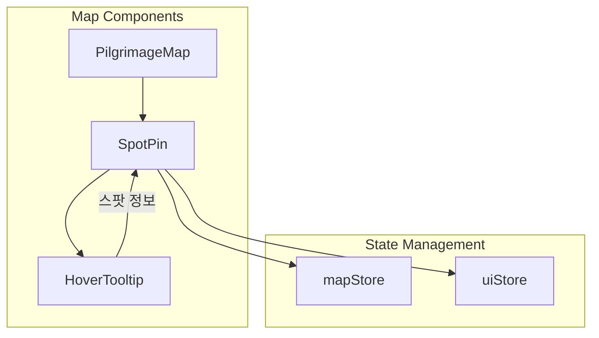
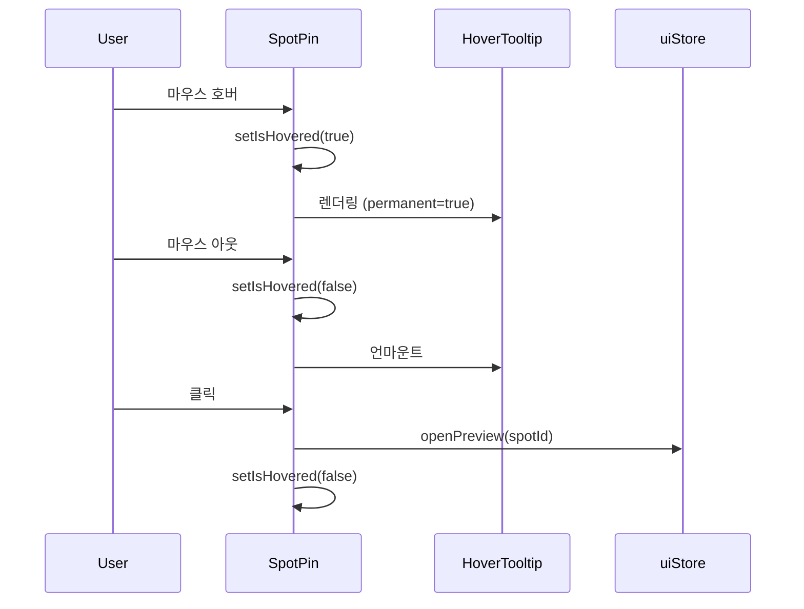

# Design Document: Map Hover Tooltip

## Overview

지도 마커(SpotPin)에 마우스를 올리면 간단한 스팟 정보를 보여주는 호버 툴팁 기능입니다. 기존 SpotPin 컴포넌트의 호버 상태를 활용하여 Leaflet의 Tooltip 기능과 커스텀 React 컴포넌트를 결합합니다.

### 핵심 설계 결정

1. **Leaflet Tooltip 사용**: react-leaflet의 `Tooltip` 컴포넌트를 활용하여 마커와 자연스럽게 연동
2. **기존 호버 상태 활용**: SpotPin의 `isHovered` 상태를 재사용하여 중복 로직 방지
3. **모바일 터치 분기**: 터치 디바이스 감지 후 첫 터치는 툴팁, 두 번째 터치는 상세보기로 동작

## Architecture



### 컴포넌트 흐름



## Components and Interfaces

### HoverTooltip 컴포넌트

```typescript
// src/components/map/HoverTooltip.tsx

interface HoverTooltipProps {
  spot: SpotPinType
  isVisible: boolean
}

/**
 * 마커 호버 시 표시되는 툴팁 컴포넌트
 * Leaflet Tooltip을 래핑하여 커스텀 스타일 적용
 */
function HoverTooltip({
  spot,
  isVisible,
}: HoverTooltipProps): JSX.Element | null
```

### SpotPin 컴포넌트 수정

```typescript
// src/components/map/SpotPin.tsx (수정)

interface SpotPinProps {
  spot: SpotPinType
  onSelect?: (spotId: string) => void
}

// 추가되는 로직:
// - 모바일 터치 감지 (isTouchDevice)
// - 터치 카운트 관리 (touchCount)
// - Tooltip 컴포넌트 조건부 렌더링
```

### 타입 정의

```typescript
// 기존 SpotPin 타입 활용 (변경 없음)
interface SpotPin {
  id: string
  name: string
  coordinates: [number, number]
  thumbnailUrl: string
  category?: SpotCategory
}
```

## Data Models

### 툴팁 표시 데이터

기존 `SpotPin` 타입의 데이터를 그대로 사용합니다. 추가 API 호출 없이 이미 로드된 데이터로 툴팁을 렌더링합니다.

```typescript
// 툴팁에 표시할 정보 (SpotPin에서 추출)
interface TooltipDisplayData {
  name: string // 스팟 이름
  category?: SpotCategory // 카테고리 (아이콘/라벨용)
  thumbnailUrl: string // 썸네일 이미지 URL
}
```

### 상태 관리

```typescript
// SpotPin 내부 상태 (기존 + 추가)
interface SpotPinState {
  isHovered: boolean // 기존: 호버 상태
  touchCount: number // 추가: 모바일 터치 카운트
}
```

## Correctness Properties

_A property is a characteristic or behavior that should hold true across all valid executions of a system—essentially, a formal statement about what the system should do. Properties serve as the bridge between human-readable specifications and machine-verifiable correctness guarantees._

### Property 1: 호버 상태와 툴팁 표시 동기화

_For any_ SpotPin 컴포넌트와 호버 상태(isHovered), isHovered가 true이면 HoverTooltip이 렌더링되고, isHovered가 false이면 HoverTooltip이 렌더링되지 않아야 한다.

**Validates: Requirements 1.1, 2.1**

### Property 2: 툴팁 콘텐츠 정확성

_For any_ SpotPin 데이터(name, category, thumbnailUrl), HoverTooltip 렌더링 결과는 반드시 해당 스팟의 name을 포함하고, category가 있으면 CATEGORY_CONFIG[category]의 icon과 label을 포함하며, thumbnailUrl이 비어있지 않으면 해당 이미지를 포함해야 한다.

**Validates: Requirements 1.2, 1.3, 1.4**

### Property 3: 모바일 터치 카운트 동작

_For any_ 터치 디바이스에서의 SpotPin 터치 시퀀스, 첫 번째 터치는 툴팁을 표시하고, 같은 마커에 대한 두 번째 터치는 SpotPreview를 열어야 한다.

**Validates: Requirements 4.1, 4.3**

## Error Handling

### 이미지 로드 실패

- 썸네일 이미지 로드 실패 시 카테고리 아이콘으로 대체 표시
- `onerror` 핸들러로 fallback 처리

### 카테고리 미정의

- category가 undefined인 경우 기본 아이콘(📍)과 기본 색상(#2d4a6f) 사용
- CATEGORY_CONFIG에 없는 카테고리도 동일하게 처리

### 터치 디바이스 감지 실패

- `window.matchMedia('(hover: none)')` 또는 `'ontouchstart' in window`로 감지
- 감지 실패 시 데스크톱 모드(호버)로 기본 동작

## Testing Strategy

### 단위 테스트

1. **HoverTooltip 렌더링 테스트**
   - 다양한 스팟 데이터로 컴포넌트 렌더링 확인
   - 썸네일 있는 경우/없는 경우 분기 테스트
   - 각 카테고리별 아이콘/라벨 표시 확인

2. **SpotPin 호버 상태 테스트**
   - 호버 이벤트 시 isHovered 상태 변경 확인
   - 호버 아웃 시 상태 초기화 확인

3. **모바일 터치 로직 테스트**
   - 터치 카운트 증가 로직 확인
   - 두 번째 터치 시 openPreview 호출 확인

### 속성 기반 테스트

테스트 라이브러리: **fast-check** (TypeScript/JavaScript용 PBT 라이브러리)

각 테스트는 최소 100회 반복 실행합니다.

1. **Property 1 테스트**: 임의의 boolean 값(isHovered)에 대해 툴팁 렌더링 여부가 일치하는지 검증
   - Tag: **Feature: map-hover-tooltip, Property 1: 호버 상태와 툴팁 표시 동기화**

2. **Property 2 테스트**: 임의의 SpotPin 데이터에 대해 렌더링 결과가 올바른 정보를 포함하는지 검증
   - Tag: **Feature: map-hover-tooltip, Property 2: 툴팁 콘텐츠 정확성**

3. **Property 3 테스트**: 임의의 터치 시퀀스에 대해 터치 카운트에 따른 동작이 올바른지 검증
   - Tag: **Feature: map-hover-tooltip, Property 3: 모바일 터치 카운트 동작**

### 통합 테스트

- SpotPin 클릭 시 툴팁 숨김 + SpotPreview 표시 확인
- 지도 내 여러 마커 간 호버 전환 시 툴팁 정상 동작 확인
