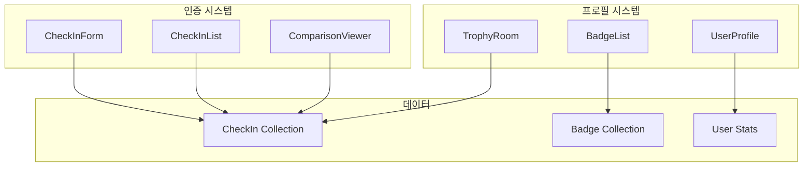

# Design Document: 성지순례 인증 시스템 (Pilgrimage Check-in)

## Overview

기존 커뮤니티 게시판을 **장소 기반 인증(Check-in) 시스템**으로 전면 개편합니다. 유저들이 실제로 성지를 방문하여 애니메이션 장면과 동일한 구도로 사진을 찍고 인증하는 것이 핵심 콘텐츠가 됩니다.

## Architecture



## Components and Interfaces

### 1. CheckIn (인증) 데이터 모델

```typescript
interface CheckIn {
  id: string
  spotId: string
  userId: string
  userName: string
  userImage?: string
  /** 유저가 올린 인증샷 URL */
  photoUrl: string
  /** 비교할 씬 이미지 URL (스팟의 대표 씬) */
  sceneImageUrl?: string
  /** 방문 날짜 */
  visitedAt: Date
  /** 간단한 코멘트 */
  comment?: string
  /** 좋아요 수 */
  likeCount: number
  createdAt: Date
}
```

### 2. Badge (뱃지) 데이터 모델

```typescript
interface Badge {
  id: string
  /** 뱃지 코드 (예: first_step, slam_dunk_explorer) */
  code: string
  /** 뱃지 이름 */
  name: string
  /** 뱃지 설명 */
  description: string
  /** 뱃지 아이콘 URL */
  iconUrl: string
  /** 뱃지 타입 */
  type: 'achievement' | 'content' | 'special'
  /** 관련 콘텐츠 (작품별 뱃지인 경우) */
  contentName?: string
  /** 획득 조건 */
  condition: BadgeCondition
}

interface BadgeCondition {
  type: 'checkin_count' | 'content_progress' | 'first_action'
  /** 필요한 인증 수 */
  requiredCount?: number
  /** 필요한 진행률 (0-100) */
  requiredProgress?: number
  /** 관련 콘텐츠명 */
  contentName?: string
}

interface UserBadge {
  id: string
  userId: string
  badgeId: string
  earnedAt: Date
}
```

### 3. UserStats (유저 통계) 데이터 모델

```typescript
interface UserStats {
  userId: string
  /** 총 인증 수 */
  totalCheckIns: number
  /** 방문한 스팟 수 (중복 제외) */
  uniqueSpots: number
  /** 획득한 뱃지 수 */
  badgeCount: number
  /** 콘텐츠별 진행률 */
  contentProgress: ContentProgress[]
  updatedAt: Date
}

interface ContentProgress {
  contentName: string
  /** 해당 콘텐츠의 총 스팟 수 */
  totalSpots: number
  /** 인증한 스팟 수 */
  checkedSpots: number
  /** 진행률 (0-100) */
  progress: number
}
```

### 4. 주요 컴포넌트

#### CheckInButton

```typescript
interface CheckInButtonProps {
  spotId: string
  spotName: string
  sceneImageUrl?: string
  onSuccess?: (checkIn: CheckIn) => void
}
```

#### CheckInModal

```typescript
interface CheckInModalProps {
  isOpen: boolean
  onClose: () => void
  spotId: string
  spotName: string
  sceneImageUrl?: string
}
```

#### ComparisonViewer (씬 비교 뷰어)

```typescript
interface ComparisonViewerProps {
  sceneImageUrl: string
  userPhotoUrl: string
  mode: 'slider' | 'side-by-side'
}
```

#### CheckInGallery

```typescript
interface CheckInGalleryProps {
  spotId?: string
  userId?: string
  limit?: number
}
```

#### UserProfileCard

```typescript
interface UserProfileCardProps {
  userId: string
  showStats?: boolean
  showBadges?: boolean
}
```

#### BadgeCard

```typescript
interface BadgeCardProps {
  badge: Badge
  earned: boolean
  earnedAt?: Date
  progress?: number
}
```

## API Endpoints

### Check-in APIs

- `POST /api/checkins` - 인증 생성
- `GET /api/checkins?spotId={id}` - 스팟별 인증 목록
- `GET /api/checkins?userId={id}` - 유저별 인증 목록
- `DELETE /api/checkins/{id}` - 인증 삭제 (본인만)

### Badge APIs

- `GET /api/badges` - 전체 뱃지 목록
- `GET /api/users/{id}/badges` - 유저 획득 뱃지
- `POST /api/badges/check` - 뱃지 획득 조건 체크 (내부용)

### User Stats APIs

- `GET /api/users/{id}/stats` - 유저 통계
- `GET /api/users/{id}/progress` - 콘텐츠별 진행률

## Correctness Properties

### Property 1: 인증 생성 무결성

_For any_ 유효한 인증 데이터에 대해, 인증 생성 후 해당 유저의 통계(totalCheckIns, uniqueSpots)가 정확히 업데이트되어야 한다.

**Validates: Requirements 1.3, 3.3**

### Property 2: 뱃지 자동 부여 정확성

_For any_ 뱃지 획득 조건을 만족하는 유저에 대해, 시스템은 해당 뱃지를 자동으로 부여해야 하고, 이미 획득한 뱃지는 중복 부여하지 않아야 한다.

**Validates: Requirements 4.1, 4.2, 4.3**

### Property 3: 진행률 계산 정확성

_For any_ 콘텐츠와 유저에 대해, 진행률은 (인증한 스팟 수 / 총 스팟 수) \* 100으로 정확히 계산되어야 한다.

**Validates: Requirements 3.2, 4.1**

## Error Handling

| 오류 상황           | 처리 방법                             |
| ------------------- | ------------------------------------- |
| 이미지 업로드 실패  | 재시도 버튼 제공, 에러 메시지 표시    |
| 인증 생성 실패      | 입력 데이터 유지, 재시도 안내         |
| 뱃지 조건 체크 실패 | 백그라운드 재시도, 유저에게 영향 없음 |

## Testing Strategy

### 단위 테스트

- 뱃지 획득 조건 체크 로직
- 진행률 계산 로직
- 인증 데이터 유효성 검증

### 통합 테스트

- 인증 생성 → 통계 업데이트 → 뱃지 체크 플로우
- 유저 프로필 데이터 일관성

### 테스트 라이브러리

- Jest + React Testing Library
- fast-check (속성 기반 테스트)

</content>
