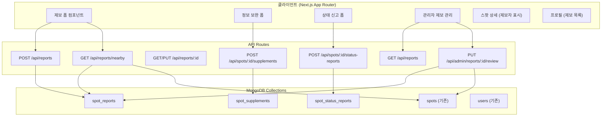
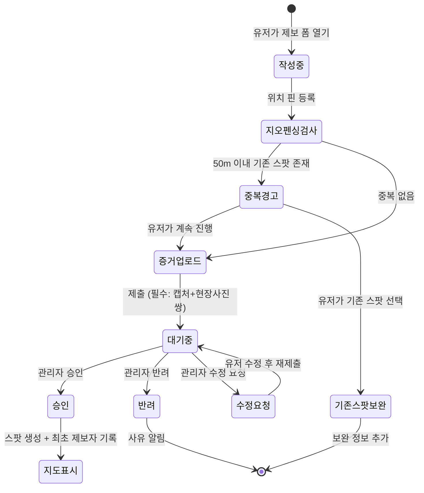

# Design Document: 성지 제보 시스템 (Spot Report Wiki)

## Overview

성지 제보 시스템은 유저들이 새로운 성지를 제보하고, 기존 성지 정보를 보완하며, 스팟 상태 변경을 신고할 수 있는 집단지성 위키 시스템입니다. 관리자 검토 워크플로우를 통해 데이터 품질을 유지하면서, 최초 제보자 명예 시스템으로 참여 동기를 부여합니다.

### 핵심 설계 원칙

1. **증거 기반 제보**: 애니메이션 캡처 + 현장 사진 쌍을 필수로 요구하여 제보 품질 보장
2. **지오펜싱 중복 방지**: 반경 50m 이내 기존 스팟/대기 제보 검사로 중복 제보 방지
3. **관리자 게이트키핑**: 모든 신규 제보는 관리자 승인 후 공개
4. **남용 방지**: 상태 신고 시 사진 증거 또는 3회 이상 누적 조건으로 자동 전환

## Architecture

### 시스템 아키텍처



### 제보 워크플로우




## Components and Interfaces

### API 엔드포인트

| 메서드 | 경로 | 설명 | 인증 |
|--------|------|------|------|
| `POST` | `/api/reports` | 신규 성지 제보 제출 | 필수 |
| `GET` | `/api/reports` | 내 제보 목록 조회 | 필수 |
| `GET` | `/api/reports/:id` | 제보 상세 조회 | 필수 |
| `PUT` | `/api/reports/:id` | 제보 수정 (수정요청 대응) | 필수 |
| `GET` | `/api/reports/nearby` | 반경 50m 이내 기존 스팟/제보 검색 | 필수 |
| `POST` | `/api/spots/:id/supplements` | 기존 스팟 정보 보완 제보 | 필수 |
| `GET` | `/api/spots/:id/supplements` | 스팟 보완 기여자 목록 조회 | 없음 |
| `POST` | `/api/spots/:id/status-reports` | 스팟 상태 신고 | 필수 |
| `GET` | `/api/spots/:id/status-reports` | 스팟 상태 신고 이력 조회 | 없음 |
| `GET` | `/api/admin/reports` | 관리자 제보 목록 (대기중 필터) | 관리자 |
| `PUT` | `/api/admin/reports/:id/review` | 관리자 제보 검토 (승인/반려/수정요청) | 관리자 |

> **SupplementType `photo` vs CheckIn(07-pilgrimage-checkin) 구분 기준:**
> - `photo` 타입 보완 제보: 스팟의 **위키 대표 사진** 또는 **씬 비교 사진**으로 사용. 작품 속 장면과 실제 장소의 대응 관계를 보여주는 증거 사진이며, 스팟 상세 페이지의 정보 섹션에 표시됨.
> - CheckIn 사진 (07 스펙): 유저 개인의 **방문 인증샷**. 갤러리/피드에 표시되며 스팟 정보 자체를 보완하지 않음.
> - 판단 기준: "이 사진이 스팟 정보의 정확성/풍부함을 높이는가?" → 보완 제보, "유저의 방문 경험을 공유하는가?" → CheckIn

### 클라이언트 컴포넌트

#### 제보 관련 컴포넌트

| 컴포넌트 | 경로 | 설명 |
|----------|------|------|
| `SpotReportForm` | `src/components/report/SpotReportForm.tsx` | 신규 성지 제보 폼 (위치 핀, 증거 사진 쌍 업로드) |
| `EvidencePairUpload` | `src/components/report/EvidencePairUpload.tsx` | 애니메이션 캡처 + 현장 사진 쌍 업로드 UI |
| `NearbySpotWarning` | `src/components/report/NearbySpotWarning.tsx` | 50m 이내 기존 스팟 경고 및 목록 표시 |
| `ReportStatusBadge` | `src/components/report/ReportStatusBadge.tsx` | 제보 상태 뱃지 (대기중/승인/반려/수정요청) |
| `MyReportList` | `src/components/report/MyReportList.tsx` | 내 제보 목록 |

#### 정보 보완 컴포넌트

| 컴포넌트 | 경로 | 설명 |
|----------|------|------|
| `SupplementForm` | `src/components/report/SupplementForm.tsx` | 기존 스팟 정보 수정 제안 폼 |
| `ContributorList` | `src/components/report/ContributorList.tsx` | 스팟 정보 보완 기여자 목록 |

#### 상태 신고 컴포넌트

| 컴포넌트 | 경로 | 설명 |
|----------|------|------|
| `StatusReportForm` | `src/components/report/StatusReportForm.tsx` | 스팟 상태 신고 폼 (상태 선택 + 사진 첨부) |
| `SpotStatusIndicator` | `src/components/report/SpotStatusIndicator.tsx` | 지도/상세에서 스팟 상태 시각적 표시 |

#### 관리자 컴포넌트

| 컴포넌트 | 경로 | 설명 |
|----------|------|------|
| `AdminReportList` | `src/components/admin/AdminReportList.tsx` | 대기중 제보 목록 (필터/정렬) |
| `AdminReportReview` | `src/components/admin/AdminReportReview.tsx` | 제보 검토 UI (승인/반려/수정요청) |

#### 페이지

| 페이지 | 경로 | 설명 |
|--------|------|------|
| 성지 제보 페이지 | `src/app/reports/new/page.tsx` | 신규 제보 폼 페이지 |
| 내 제보 목록 | `src/app/reports/page.tsx` | 내 제보 현황 페이지 |
| 제보 상세 | `src/app/reports/[id]/page.tsx` | 제보 상세/수정 페이지 |
| 관리자 제보 관리 | `src/app/admin/reports/page.tsx` | 관리자 제보 검토 페이지 |

### 커스텀 훅

| 훅 | 경로 | 설명 |
|----|------|------|
| `useSpotReport` | `src/hooks/useSpotReport.ts` | 제보 제출/수정 로직 |
| `useNearbyCheck` | `src/hooks/useNearbyCheck.ts` | 50m 반경 중복 검사 |
| `useMyReports` | `src/hooks/useMyReports.ts` | 내 제보 목록 조회 |
| `useStatusReport` | `src/hooks/useStatusReport.ts` | 상태 신고 로직 |

### Zustand 스토어

| 스토어 | 경로 | 설명 |
|--------|------|------|
| `reportStore` | `src/stores/reportStore.ts` | 제보 폼 상태 관리 (멀티스텝 폼 진행 상태, 임시 저장) |


## Data Models

### MongoDB 컬렉션 추가

기존 `COLLECTIONS` 상수에 다음 컬렉션을 추가합니다:

```typescript
// src/lib/db.ts - COLLECTIONS에 추가
SPOT_REPORTS: 'spot_reports',
SPOT_SUPPLEMENTS: 'spot_supplements',
SPOT_STATUS_REPORTS: 'spot_status_reports',
```

### 타입 정의

```typescript
// src/types/report.ts

// ============================================
// 제보 상태 타입
// ============================================

export type ReportStatus = 'pending' | 'approved' | 'rejected' | 'revision_requested'

// ============================================
// 검토 히스토리 (상태 변경 추적)
// ============================================

/** 관리자 검토 이력 (반려/수정요청/승인 히스토리 추적) */
export interface ReviewHistory {
  /** 변경된 상태 */
  status: ReportStatus
  /** 관리자 코멘트 (반려 사유, 수정 요청 내용 등) */
  comment: string
  /** 검토 시각 */
  reviewedAt: Date
  /** 검토자 ID */
  reviewedBy: string
}

// ============================================
// 증거 사진 쌍 (필수)
// ============================================

/** 애니메이션 캡처 + 현장 사진 쌍 */
export interface EvidencePair {
  /** 애니메이션/작품 원본 캡처 이미지 URL */
  captureImageUrl: string
  /** 현장 사진 또는 로드뷰 캡처 URL */
  realPhotoUrl: string
  /** 설명 (선택) */
  description?: string
}

// ============================================
// 성지 제보 (SpotReport)
// ============================================

export interface SpotReport {
  id: string
  /** 제보자 정보 */
  reporterId: string
  reporterName: string
  /** 제보 상태 */
  status: ReportStatus
  /** 장소 정보 */
  name: string
  description: string
  address: string
  coordinates: {
    lat: number
    lng: number
  }
  category: SpotCategory
  /** 작품 정보 */
  relatedContent: RelatedContent[]
  /** 증거 사진 쌍 (최소 1쌍 필수) */
  evidencePairs: EvidencePair[]
  /** 에피소드/타임스탬프 정보 */
  episodeInfo: string
  /** 추가 사진 (선택) */
  additionalPhotos?: string[]
  /** 관리자 검토 (최신 검토 정보 - 빠른 조회용) */
  reviewedBy?: string
  reviewedAt?: Date
  reviewComment?: string
  /** 검토 히스토리 (반려/수정요청/재제출 전체 이력 추적) */
  reviewHistory?: ReviewHistory[]
  /** 승인 시 생성된 스팟 ID */
  approvedSpotId?: string
  createdAt: Date
  updatedAt: Date
}

export interface CreateSpotReportInput {
  name: string
  description: string
  address: string
  coordinates: {
    lat: number
    lng: number
  }
  category: SpotCategory
  relatedContent: RelatedContent[]
  evidencePairs: EvidencePair[]
  episodeInfo: string
  additionalPhotos?: string[]
}

// ============================================
// 정보 보완 제보 (SpotSupplement)
// ============================================

export type SupplementType = 'scene_info' | 'description' | 'photo' | 'other'

export interface SpotSupplement {
  id: string
  spotId: string
  /** 기여자 정보 */
  contributorId: string
  contributorName: string
  /** 보완 유형 */
  type: SupplementType
  /** 보완 내용 */
  content: string
  /** 추가 씬 정보 (scene_info 타입일 때) */
  sceneInfo?: {
    animeTitle: string
    episodeInfo?: string
    captureImageUrl?: string
  }
  /** 추가 사진 */
  photos?: string[]
  /** 승인 여부 */
  approved: boolean
  createdAt: Date
}

export interface CreateSupplementInput {
  type: SupplementType
  content: string
  sceneInfo?: {
    animeTitle: string
    episodeInfo?: string
    captureImageUrl?: string
  }
  photos?: string[]
}

// ============================================
// 스팟 상태 신고 (SpotStatusReport)
// ============================================

export type SpotStatus = 'normal' | 'partially_changed' | 'under_construction' | 'demolished' | 'inaccessible'

export interface SpotStatusReport {
  id: string
  spotId: string
  /** 신고자 정보 */
  reporterId: string
  reporterName: string
  /** 신고 상태 */
  status: SpotStatus
  /** 설명 */
  description: string
  /** 증거 사진 (선택, 있으면 즉시 '검토 중' 전환 트리거) */
  photoUrl?: string
  createdAt: Date
}

export interface CreateStatusReportInput {
  status: SpotStatus
  description: string
  photoUrl?: string
}

// ============================================
// 스팟 확장 필드 (기존 Spot 인터페이스에 추가)
// ============================================

/** 기존 Spot 인터페이스에 추가할 필드 */
export interface SpotReportExtension {
  /** 최초 제보자 ID */
  firstReporterId?: string
  /** 최초 제보자 이름 */
  firstReporterName?: string
  /** 현재 스팟 상태 */
  spotStatus?: SpotStatus
  /** 상태 신고 누적 수 */
  statusReportCount?: number
}
```

### MongoDB 인덱스

```javascript
// spot_reports 컬렉션
db.spot_reports.createIndex({ "coordinates.lat": 1, "coordinates.lng": 1 })
db.spot_reports.createIndex({ reporterId: 1 })
db.spot_reports.createIndex({ status: 1 })
db.spot_reports.createIndex({ createdAt: -1 })
db.spot_reports.createIndex({ status: 1, createdAt: -1 }) // 관리자 대기 목록 조회 최적화

// spot_supplements 컬렉션
db.spot_supplements.createIndex({ spotId: 1 })
db.spot_supplements.createIndex({ contributorId: 1 })

// spot_status_reports 컬렉션
db.spot_status_reports.createIndex({ spotId: 1 })
db.spot_status_reports.createIndex({ spotId: 1, createdAt: -1 })

// spots 컬렉션 (기존에 추가)
db.spots.createIndex({ "coordinates.lat": 1, "coordinates.lng": 1 })
```

### 지오펜싱 검사 로직

반경 50m 이내 중복 검사를 위한 Haversine 거리 계산:

```typescript
// src/lib/geo-utils.ts

/**
 * Haversine 공식으로 두 좌표 간 거리 계산 (미터 단위)
 */
export function calculateDistance(
  lat1: number, lng1: number,
  lat2: number, lng2: number
): number {
  const R = 6371000 // 지구 반지름 (미터)
  const dLat = toRad(lat2 - lat1)
  const dLng = toRad(lng2 - lng1)
  const a =
    Math.sin(dLat / 2) * Math.sin(dLat / 2) +
    Math.cos(toRad(lat1)) * Math.cos(toRad(lat2)) *
    Math.sin(dLng / 2) * Math.sin(dLng / 2)
  const c = 2 * Math.atan2(Math.sqrt(a), Math.sqrt(1 - a))
  return R * c
}

function toRad(deg: number): number {
  return deg * (Math.PI / 180)
}

/**
 * 반경 내 근처 스팟/제보 검색을 위한 바운딩 박스 계산
 * MongoDB 쿼리 최적화용 (정확한 거리는 Haversine으로 후처리)
 */
export function getBoundingBox(lat: number, lng: number, radiusMeters: number) {
  const latDelta = radiusMeters / 111320
  const lngDelta = radiusMeters / (111320 * Math.cos(toRad(lat)))
  return {
    minLat: lat - latDelta,
    maxLat: lat + latDelta,
    minLng: lng - lngDelta,
    maxLng: lng + lngDelta,
  }
}
```

### 상태 신고 자동 전환 로직

```typescript
// 상태 신고 처리 시 자동 전환 조건:
// 1. 사진 증거가 첨부된 경우 → 즉시 '검토 중(경고)' 전환
// 2. 동일 스팟에 대한 신고가 3회 이상 누적 → '검토 중(경고)' 전환

async function processStatusReport(spotId: string, report: CreateStatusReportInput) {
  const shouldAutoFlag =
    report.photoUrl != null ||  // 사진 증거 있음
    (await getStatusReportCount(spotId)) + 1 >= 3  // 3회 이상 누적

  if (shouldAutoFlag) {
    await updateSpotStatus(spotId, report.status) // 스팟 상태 업데이트
  }
}
```

### 관리자 검토 히스토리 기록 로직

```typescript
// 관리자 검토 시 reviewHistory 배열에 이력 추가
// 최신 검토 정보는 reviewedBy/reviewedAt/reviewComment에도 동시 업데이트 (빠른 조회용)

async function processAdminReview(
  reportId: string,
  action: 'approve' | 'reject' | 'request_revision',
  comment: string,
  adminId: string
) {
  const statusMap = {
    approve: 'approved',
    reject: 'rejected',
    request_revision: 'revision_requested',
  } as const

  const newStatus = statusMap[action]
  const now = new Date()

  const historyEntry: ReviewHistory = {
    status: newStatus,
    comment,
    reviewedAt: now,
    reviewedBy: adminId,
  }

  await db.collection(COLLECTIONS.SPOT_REPORTS).updateOne(
    { _id: new ObjectId(reportId) },
    {
      $set: {
        status: newStatus,
        reviewedBy: adminId,
        reviewedAt: now,
        reviewComment: comment,
        updatedAt: now,
      },
      $push: { reviewHistory: historyEntry },
    }
  )
}
```


## Correctness Properties

*속성(Property)은 시스템의 모든 유효한 실행에서 참이어야 하는 특성 또는 동작입니다. 속성은 사람이 읽을 수 있는 명세와 기계가 검증할 수 있는 정확성 보장 사이의 다리 역할을 합니다.*

### Property 1: 제보 필수 필드 유효성 검사

*For any* 제보 입력에서, 장소명, 설명, 주소, 좌표, 카테고리, 작품 정보, 에피소드 정보 중 하나라도 누락되거나, evidencePairs가 비어있거나, evidencePairs 내 captureImageUrl 또는 realPhotoUrl이 누락된 경우, 제보 생성은 거부되어야 하고 에러를 반환해야 한다.

**Validates: Requirements 1.2**

### Property 2: 지오펜싱 거리 계산 정확성

*For any* 두 좌표 쌍 (lat1, lng1)과 (lat2, lng2)에 대해, calculateDistance 함수가 반환하는 거리가 50m 이하이면 nearby 검색 결과에 포함되어야 하고, 50m 초과이면 포함되지 않아야 한다.

**Validates: Requirements 1.3**

### Property 3: 제보 초기 상태 불변성

*For any* 유효한 제보 입력에 대해, 새로 생성된 제보의 status는 항상 'pending'이어야 한다.

**Validates: Requirements 1.4**

### Property 4: 승인 시 스팟 생성 및 제보자 귀속

*For any* 'pending' 상태의 제보에 대해, 관리자가 승인하면 새 스팟이 생성되고, 해당 스팟의 firstReporterId는 원래 제보자의 ID와 일치하며, firstReporterName은 제보자의 이름과 일치해야 한다.

**Validates: Requirements 1.5, 2.1**

### Property 5: 유저별 제보 목록 필터링

*For any* 유저 ID에 대해, 해당 유저의 제보 목록 API가 반환하는 모든 제보의 reporterId는 요청한 유저 ID와 일치해야 한다.

**Validates: Requirements 2.2**

### Property 6: 보완 제보 기여자 추적

*For any* 스팟과 보완 제보에 대해, 보완 제보가 성공적으로 추가되면 해당 스팟의 기여자 목록에 보완 제보자가 포함되어야 한다.

**Validates: Requirements 3.2, 3.3**

### Property 7: 상태 값 유효성

*For any* 상태 신고 입력에서, status 값이 'normal', 'partially_changed', 'under_construction', 'demolished', 'inaccessible' 중 하나가 아니면 신고가 거부되어야 한다.

**Validates: Requirements 4.2**

### Property 8: 상태 신고 자동 전환 조건

*For any* 스팟에 대해, (1) 사진 증거가 첨부된 상태 신고가 제출되면 즉시 스팟 상태가 업데이트되어야 하고, (2) 사진 없는 신고가 3회 이상 누적되면 스팟 상태가 업데이트되어야 한다. 사진 없는 신고가 3회 미만이면 스팟 상태는 변경되지 않아야 한다.

**Validates: Requirements 4.3**

### Property 9: 관리자 제보 목록 필터링

*For any* 관리자 제보 목록 API 응답에서, 기본 필터 적용 시 반환되는 모든 제보의 status는 'pending'이어야 한다.

**Validates: Requirements 5.1**

### Property 10: 관리자 검토 상태 전이

*For any* 'pending' 상태의 제보에 대해, 관리자가 'approve' 액션을 수행하면 status는 'approved'로, 'reject' 액션을 수행하면 status는 'rejected'로, 'request_revision' 액션을 수행하면 status는 'revision_requested'로 변경되어야 한다.

**Validates: Requirements 5.2**

### Property 11: 반려 시 사유 필수

*For any* 제보 반려 요청에서, reviewComment가 비어있거나 누락된 경우 반려가 거부되어야 한다.

**Validates: Requirements 5.3**

## Error Handling

### API 에러 처리

| 상황 | HTTP 상태 | 에러 메시지 |
|------|-----------|-------------|
| 미인증 유저의 제보 시도 | 401 | "로그인이 필요합니다" |
| 필수 필드 누락 | 400 | "유효성 검사 실패" + 상세 에러 목록 |
| 증거 사진 쌍 누락 | 400 | "애니메이션 캡처와 현장 사진을 쌍으로 등록해주세요" |
| 존재하지 않는 제보 ID | 404 | "제보를 찾을 수 없습니다" |
| 권한 없는 제보 수정 | 403 | "수정 권한이 없습니다" |
| 관리자가 아닌 유저의 검토 시도 | 403 | "관리자 권한이 필요합니다" |
| 이미 검토된 제보 재검토 | 400 | "이미 처리된 제보입니다" |
| 반려 시 사유 미입력 | 400 | "반려 사유를 입력해주세요" |
| 유효하지 않은 상태 값 | 400 | "유효하지 않은 상태입니다" |
| 이미지 업로드 실패 | 500 | "이미지 업로드에 실패했습니다" |
| DB 연결 실패 | 500 | "서버 오류가 발생했습니다" |

### 클라이언트 에러 처리

- 네트워크 오류 시 재시도 안내 토스트 표시
- 제보 폼 작성 중 페이지 이탈 시 확인 다이얼로그 표시
- 이미지 업로드 실패 시 개별 재시도 가능
- 지오펜싱 검사 실패 시 (위치 서비스 비활성화) 수동 주소 입력 안내

## Testing Strategy

### 속성 기반 테스트 (Property-Based Testing)

- **라이브러리**: `fast-check` (TypeScript/JavaScript용 PBT 라이브러리)
- **최소 반복 횟수**: 각 속성 테스트당 100회 이상
- **태그 형식**: `Feature: 09-spot-report-wiki, Property {번호}: {속성 설명}`

각 Correctness Property는 하나의 속성 기반 테스트로 구현합니다:

| 속성 | 테스트 대상 | 생성기 |
|------|-------------|--------|
| Property 1 | 제보 유효성 검사 함수 | 임의의 제보 입력 (일부 필드 누락) |
| Property 2 | calculateDistance + nearby 검색 | 임의의 좌표 쌍 |
| Property 3 | 제보 생성 함수 | 임의의 유효한 제보 입력 |
| Property 4 | 승인 처리 함수 | 임의의 pending 제보 |
| Property 5 | 유저별 제보 목록 API | 임의의 유저 ID + 여러 유저의 제보 |
| Property 6 | 보완 제보 + 기여자 목록 | 임의의 스팟 + 보완 입력 |
| Property 7 | 상태 신고 유효성 검사 | 임의의 문자열 상태 값 |
| Property 8 | 상태 신고 자동 전환 로직 | 임의의 스팟 + 신고 시퀀스 |
| Property 9 | 관리자 제보 목록 API | 다양한 상태의 제보 혼합 |
| Property 10 | 관리자 검토 상태 전이 | 임의의 pending 제보 + 액션 |
| Property 11 | 반려 유효성 검사 | 임의의 반려 요청 (사유 유무) |

### 단위 테스트

단위 테스트는 속성 테스트를 보완하여 구체적인 예제와 엣지 케이스를 검증합니다:

- **지오펜싱**: 정확히 50m 경계값, 적도/극지방 좌표, 동일 좌표
- **상태 전환**: 정확히 3회째 신고, 사진 있는 첫 번째 신고
- **승인 워크플로우**: 승인 후 스팟 데이터 정합성
- **뱃지 부여**: 제보 수 경계값 (1개, 5개, 10개 등)
- **증거 사진 쌍**: 캡처만 있고 현장 사진 없는 경우, 빈 URL 문자열

### 테스트 파일 구조

```
src/lib/__tests__/
├── geo-utils.test.ts              # 거리 계산 단위 테스트
├── geo-utils.property.test.ts     # Property 2
├── report-validation.test.ts      # 유효성 검사 단위 테스트
├── report-validation.property.test.ts  # Property 1, 3, 7, 11
├── report-review.property.test.ts # Property 4, 9, 10
├── report-query.property.test.ts  # Property 5
├── supplement.property.test.ts    # Property 6
└── status-report.property.test.ts # Property 8
```
