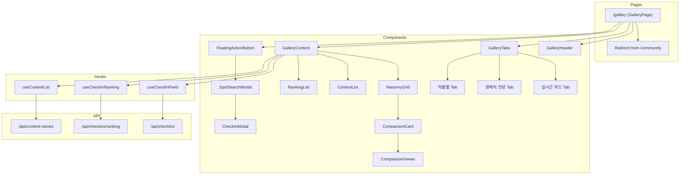

# Design Document: Pilgrimage Gallery

## Overview

순례 갤러리는 기존 커뮤니티 페이지를 사진 중심의 갤러리 경험으로 전면 개편하는 기능입니다. 인스타그램 탐색 탭과 Pinterest의 Masonry 레이아웃을 참고하여, 순례 인증샷이 주인공이 되는 시각적 피드를 제공합니다.

### Key Design Decisions

1. **라우트 변경**: `/community` → `/gallery`로 변경하고 기존 경로는 리다이렉트 처리
2. **컴포넌트 재활용**: 기존 `CheckInGallery`, `ComparisonViewer` 컴포넌트를 확장하여 사용
3. **Masonry 레이아웃**: CSS Grid + JavaScript 기반 동적 높이 계산으로 구현
4. **탭 기반 네비게이션**: URL 쿼리 파라미터로 탭 상태 관리

## Architecture



## Components and Interfaces

### 1. GalleryPage (`src/app/gallery/page.tsx`)

갤러리 메인 페이지 컴포넌트입니다.

```typescript
interface GalleryPageProps {
  searchParams: {
    tab?: 'feed' | 'hall-of-fame' | 'content'
    content?: string // 작품별 탭에서 선택된 작품명
  }
}
```

### 2. GalleryHeader (`src/components/gallery/GalleryHeader.tsx`)

페이지 헤더 컴포넌트로 제목, 부제목, 통계를 표시합니다.

```typescript
interface GalleryHeaderProps {
  totalCheckIns: number
  todayCheckIns: number
}
```

### 3. GalleryTabs (`src/components/gallery/GalleryTabs.tsx`)

탭 네비게이션 컴포넌트입니다.

```typescript
type GalleryTab = 'feed' | 'hall-of-fame' | 'content'

interface GalleryTabsProps {
  activeTab: GalleryTab
  onTabChange: (tab: GalleryTab) => void
}
```

### 4. MasonryGrid (`src/components/gallery/MasonryGrid.tsx`)

Masonry 레이아웃 그리드 컴포넌트입니다.

```typescript
interface MasonryGridProps {
  children: React.ReactNode
  columns?: {
    mobile: number // default: 2
    tablet: number // default: 3
    desktop: number // default: 4
  }
  gap?: number // default: 16 (px)
}
```

### 5. ComparisonCard (`src/components/gallery/ComparisonCard.tsx`)

인증샷 카드 컴포넌트로 씬 비교와 유저 정보를 표시합니다.

```typescript
interface ComparisonCardProps {
  checkIn: CheckIn
  spot: {
    id: string
    name: string
  }
  badges?: Badge[]
  onClick?: () => void
}
```

### 6. SpotSearchModal (`src/components/gallery/SpotSearchModal.tsx`)

스팟 검색 모달 컴포넌트입니다.

```typescript
interface SpotSearchModalProps {
  isOpen: boolean
  onClose: () => void
  onSelectSpot: (spot: Spot) => void
}
```

### 7. FloatingActionButton (`src/components/gallery/FloatingActionButton.tsx`)

플로팅 액션 버튼 컴포넌트입니다.

```typescript
interface FloatingActionButtonProps {
  onClick: () => void
  label?: string // default: "+ 순례 인증하기"
}
```

### 8. ContentGrid (`src/components/gallery/ContentGrid.tsx`)

작품별 탭의 콘텐츠 포스터 그리드입니다.

```typescript
interface ContentGridProps {
  contents: ContentSummary[]
  onSelectContent: (contentName: string) => void
}

interface ContentSummary {
  title: string
  imageUrl?: string
  checkInCount: number
  spotCount: number
}
```

### 9. RankingList (`src/components/gallery/RankingList.tsx`)

명예의 전당 랭킹 리스트 컴포넌트입니다.

```typescript
interface RankingListProps {
  spotRanking: SpotRanking[]
  checkInRanking: CheckInRanking[]
}

interface SpotRanking {
  spot: Spot
  weeklyCheckIns: number
  rank: number
}

interface CheckInRanking {
  checkIn: CheckIn
  likeCount: number
  rank: number
}
```

## Data Models

### Extended CheckIn Response

기존 CheckIn 모델에 스팟 정보와 뱃지 정보를 포함한 확장 응답입니다.

```typescript
interface CheckInWithDetails extends CheckIn {
  spot: {
    id: string
    name: string
    contentName?: string
  }
  badges: Badge[]
}
```

### Gallery Statistics

갤러리 통계 데이터 모델입니다.

```typescript
interface GalleryStats {
  totalCheckIns: number
  todayCheckIns: number
  totalSpots: number
  totalUsers: number
}
```

### Ranking API Response

랭킹 API 응답 모델입니다.

```typescript
interface RankingResponse {
  spotRanking: {
    spotId: string
    spotName: string
    spotThumbnail?: string
    weeklyCheckIns: number
  }[]
  checkInRanking: {
    checkInId: string
    photoUrl: string
    userName: string
    likeCount: number
  }[]
  period: {
    start: Date
    end: Date
  }
}
```

## Correctness Properties

_A property is a characteristic or behavior that should hold true across all valid executions of a system—essentially, a formal statement about what the system should do. Properties serve as the bridge between human-readable specifications and machine-verifiable correctness guarantees._

### Property 1: ComparisonCard 필수 정보 표시

_For any_ CheckIn 데이터와 관련 Spot 정보가 주어졌을 때, ComparisonCard를 렌더링하면 반드시 유저 닉네임, 방문한 스팟 이름, 획득한 뱃지 아이콘이 렌더링된 결과에 포함되어야 한다.

**Validates: Requirements 2.3, 6.4**

### Property 2: 실시간 피드 최신순 정렬

_For any_ 체크인 목록이 주어졌을 때, 실시간 피드 탭에서 표시되는 체크인들은 createdAt 기준 내림차순(최신순)으로 정렬되어야 한다. 즉, 목록의 모든 인접한 두 체크인에 대해 앞의 체크인의 createdAt이 뒤의 체크인의 createdAt보다 크거나 같아야 한다.

**Validates: Requirements 3.2**

### Property 3: 콘텐츠별 필터링 정확성

_For any_ 콘텐츠명과 체크인 목록이 주어졌을 때, 해당 콘텐츠로 필터링된 결과의 모든 체크인은 해당 콘텐츠와 연결된 스팟의 체크인이어야 한다. 필터링 결과에 다른 콘텐츠의 체크인이 포함되어서는 안 된다.

**Validates: Requirements 3.5**

### Property 4: 스팟 검색 결과 정확성

_For any_ 검색어와 스팟 목록이 주어졌을 때, 검색 결과의 모든 스팟은 스팟 이름 또는 관련 콘텐츠 제목에 검색어가 포함되어야 한다. 검색어와 무관한 스팟이 결과에 포함되어서는 안 된다.

**Validates: Requirements 4.3**

### Property 5: 통계 데이터 표시 정확성

_For any_ GalleryStats 데이터가 주어졌을 때, GalleryHeader 컴포넌트를 렌더링하면 totalCheckIns와 todayCheckIns 값이 렌더링된 결과에 정확히 표시되어야 한다.

**Validates: Requirements 5.3**

### Property 6: CheckIn 데이터 모델 호환성

_For any_ 기존 CheckIn API 응답 데이터가 주어졌을 때, 새로운 갤러리 컴포넌트들은 해당 데이터를 오류 없이 파싱하고 렌더링할 수 있어야 한다. 기존 필드(id, spotId, userId, userName, photoUrl, visitedAt, likeCount 등)가 모두 올바르게 접근 가능해야 한다.

**Validates: Requirements 6.1**

## Error Handling

### API 에러 처리

| 에러 상황             | 처리 방법                                      |
| --------------------- | ---------------------------------------------- |
| 체크인 목록 로딩 실패 | 에러 메시지 표시 및 재시도 버튼 제공           |
| 랭킹 데이터 로딩 실패 | 해당 섹션에 "데이터를 불러올 수 없습니다" 표시 |
| 콘텐츠 목록 로딩 실패 | 빈 그리드와 함께 에러 메시지 표시              |
| 스팟 검색 실패        | 검색 모달 내 에러 메시지 표시                  |
| 이미지 로딩 실패      | 플레이스홀더 이미지로 대체                     |

### 인증 에러 처리

| 에러 상황                 | 처리 방법                             |
| ------------------------- | ------------------------------------- |
| 비인증 사용자의 인증 시도 | 로그인 페이지로 리다이렉트            |
| 세션 만료                 | 토스트 메시지 후 로그인 페이지로 이동 |

### 네트워크 에러 처리

- 오프라인 상태 감지 시 "인터넷 연결을 확인해주세요" 메시지 표시
- 무한 스크롤 중 네트워크 에러 시 "더보기" 버튼으로 폴백

## Testing Strategy

### Property-Based Testing

Property-based testing 라이브러리로 **fast-check**를 사용합니다.

각 속성 테스트는 최소 100회 반복 실행되며, 다음 형식의 태그를 포함합니다:

```
Feature: pilgrimage-gallery, Property {number}: {property_text}
```

### Unit Tests

단위 테스트는 다음 영역에 집중합니다:

1. **컴포넌트 렌더링 테스트**
   - GalleryHeader가 올바른 제목/부제목을 표시하는지
   - GalleryTabs가 세 개의 탭을 모두 렌더링하는지
   - FloatingActionButton이 올바른 텍스트를 표시하는지

2. **사용자 인터랙션 테스트**
   - 탭 클릭 시 올바른 콜백이 호출되는지
   - 인증 버튼 클릭 시 모달이 열리는지
   - 스팟 선택 시 다음 단계로 진행되는지

3. **에러 상태 테스트**
   - API 에러 시 에러 메시지가 표시되는지
   - 비인증 사용자가 리다이렉트되는지

### Integration Tests

통합 테스트는 다음 플로우를 검증합니다:

1. **순례 인증 플로우**: 버튼 클릭 → 스팟 검색 → 스팟 선택 → 사진 업로드 → 완료
2. **탭 전환 플로우**: 각 탭 클릭 시 올바른 콘텐츠가 로드되는지
3. **무한 스크롤**: 스크롤 시 추가 데이터가 로드되는지
