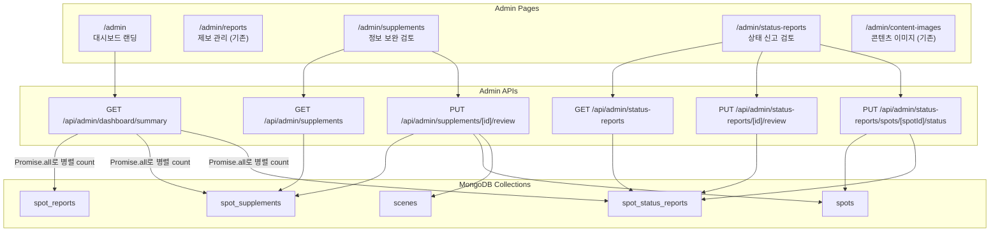
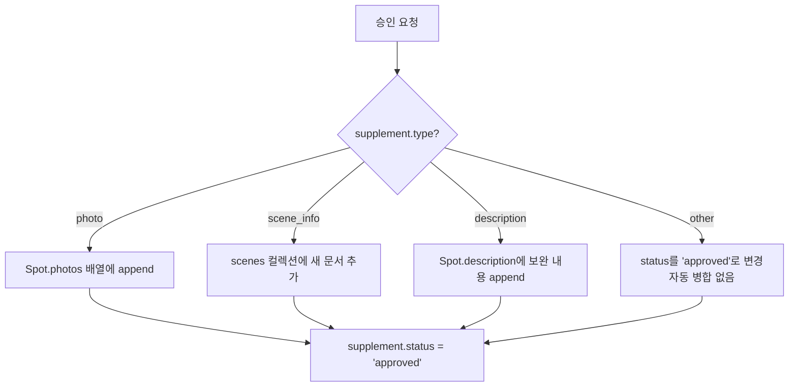
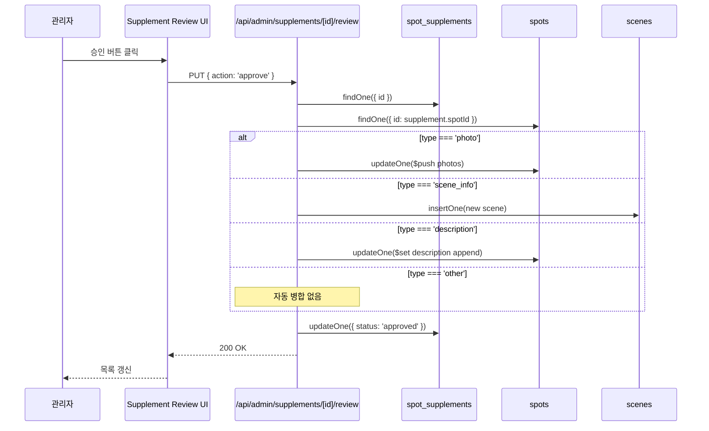

# Design Document: 관리자 대시보드 통합 (Admin Dashboard Integration)

## Overview

현재 관리자 시스템에는 성지 제보(SpotReport) 관리와 콘텐츠 이미지 관리 페이지만 존재합니다. 이 설계는 누락된 두 가지 관리 기능(정보 보완 검토, 상태 신고 검토)과 대시보드 랜딩 페이지를 추가하여, 모든 관리 기능을 `/admin` 경로 아래에서 통합 관리할 수 있도록 합니다.

핵심 설계 원칙:
- 기존 `AdminReportList + AdminReportReview` 패턴을 그대로 따라 일관성 유지
- 기존 `/api/admin/reports` API 패턴(인증/페이지네이션/필터)을 동일하게 적용
- 정보 보완 승인 시 Append 방식 병합 (기존 데이터 보존)
- React 상태 관리는 컴포넌트 로컬 state + fetch 패턴 (기존 admin 페이지와 동일)

## Architecture



### 병합 전략 (Supplement Merge)

정보 보완 승인 시 타입별 병합 로직:



## Components and Interfaces

### 페이지 컴포넌트

| 컴포넌트 | 경로 | 설명 |
|---------|------|------|
| `AdminDashboardPage` | `src/app/admin/page.tsx` | 대시보드 랜딩 (요약 카드 + 네비게이션) |
| `AdminSupplementsPage` | `src/app/admin/supplements/page.tsx` | 정보 보완 검토 (Split-pane) |
| `AdminStatusReportsPage` | `src/app/admin/status-reports/page.tsx` | 상태 신고 검토 (Split-pane) |

### UI 컴포넌트

| 컴포넌트 | 경로 | 설명 |
|---------|------|------|
| `AdminDashboardCard` | `src/components/admin/AdminDashboardCard.tsx` | 대시보드 네비게이션 카드 (아이콘, 제목, 대기 수, 링크) |
| `AdminSupplementList` | `src/components/admin/AdminSupplementList.tsx` | 정보 보완 목록 (필터 + 페이지네이션) |
| `AdminSupplementReview` | `src/components/admin/AdminSupplementReview.tsx` | 정보 보완 상세/검토 (승인/반려 액션) |
| `AdminStatusReportList` | `src/components/admin/AdminStatusReportList.tsx` | 상태 신고 목록 (필터 + 페이지네이션) |
| `AdminStatusReportReview` | `src/components/admin/AdminStatusReportReview.tsx` | 상태 신고 상세/검토 (확인 처리 + 상태 변경) |

### API Route Handlers

| 엔드포인트 | 메서드 | 경로 | 설명 |
|-----------|--------|------|------|
| 대시보드 요약 | GET | `/api/admin/dashboard/summary/route.ts` | 각 컬렉션 대기 항목 count (Promise.all로 3개 쿼리 병렬 실행) |
| 정보 보완 목록 | GET | `/api/admin/supplements/route.ts` | 페이지네이션 + status 필터 |
| 정보 보완 검토 | PUT | `/api/admin/supplements/[id]/review/route.ts` | 승인(병합) / 반려 |
| 상태 신고 목록 | GET | `/api/admin/status-reports/route.ts` | 페이지네이션 + reviewStatus 필터 |
| 상태 신고 확인 | PUT | `/api/admin/status-reports/[id]/review/route.ts` | reviewStatus → resolved |
| 스팟 상태 변경 | PUT | `/api/admin/status-reports/spots/[spotId]/status/route.ts` | spotStatus 수동 변경 + 일괄 resolved |

### 컴포넌트 인터페이스

```typescript
// AdminDashboardCard
interface AdminDashboardCardProps {
  title: string
  description: string
  icon: string
  pendingCount: number
  href: string
}

// AdminSupplementList (AdminReportList 패턴 동일)
interface AdminSupplementListProps {
  onSelectSupplement: (supplement: SpotSupplement) => void
  selectedSupplementId?: string
  refreshKey?: number
}

// AdminSupplementReview (AdminReportReview 패턴 동일)
interface AdminSupplementReviewProps {
  supplement: SpotSupplement
  onReviewComplete: () => void
}

// AdminStatusReportList
interface AdminStatusReportListProps {
  onSelectReport: (report: SpotStatusReport) => void
  selectedReportId?: string
  refreshKey?: number
}

// AdminStatusReportReview
interface AdminStatusReportReviewProps {
  report: SpotStatusReport
  onReviewComplete: () => void
}
```

### API 요청/응답 인터페이스

```typescript
// GET /api/admin/supplements 응답
interface AdminSupplementsResponse {
  supplements: SpotSupplement[]
  total: number
  page: number
  limit: number
  totalPages: number
}

// PUT /api/admin/supplements/[id]/review 요청
interface SupplementReviewRequest {
  action: 'approve' | 'reject'
  rejectionReason?: string  // 반려 시 필수
}

// GET /api/admin/status-reports 응답
interface AdminStatusReportsResponse {
  reports: SpotStatusReport[]
  total: number
  page: number
  limit: number
  totalPages: number
}

// PUT /api/admin/status-reports/[id]/review 요청
interface StatusReportReviewRequest {
  action: 'resolve'
}

// PUT /api/admin/status-reports/spots/[spotId]/status 요청
interface SpotStatusUpdateRequest {
  status: SpotStatus  // 'normal' | 'partially_changed' | 'under_construction' | 'demolished' | 'inaccessible'
}

// GET /api/admin/dashboard/summary 응답
interface DashboardSummaryResponse {
  pendingReports: number      // spot_reports에서 status: 'pending'
  pendingSupplements: number  // spot_supplements에서 status: 'pending'
  pendingStatusReports: number // spot_status_reports에서 reviewStatus: 'pending'
}
```


## Data Models

### 기존 타입 변경 사항

#### SpotSupplement (rejectionReason 필드 추가)

```typescript
// src/types/report.ts - 기존 SpotSupplement에 필드 추가
export interface SpotSupplement {
  id: string
  spotId: string
  contributorId: string
  contributorName: string
  type: SupplementType  // 'scene_info' | 'description' | 'photo' | 'other'
  content: string
  sceneInfo?: {
    animeTitle: string
    episodeInfo?: string
    captureImageUrl?: string
  }
  photos?: string[]
  status: 'pending' | 'approved' | 'rejected'  // 🆕 3-state 명시적 상태 관리
  rejectionReason?: string  // 반려 사유 (status: 'rejected' 시 필수)
  createdAt: Date
}
```

#### SpotStatusReport (reviewStatus 필드 추가)

```typescript
// src/types/report.ts - 기존 SpotStatusReport에 필드 추가
export interface SpotStatusReport {
  id: string
  spotId: string
  reporterId: string
  reporterName: string
  status: SpotStatus
  description: string
  photoUrl?: string
  reviewStatus: 'pending' | 'resolved'  // 🆕 처리 상태
  createdAt: Date
}
```

### 병합 로직 상세 (Supplement Merge)

승인 시 `supplement.type`에 따른 MongoDB 업데이트 연산:

| type | 대상 컬렉션 | MongoDB 연산 | 설명 |
|------|------------|-------------|------|
| `photo` | spots | `$push: { photos: { $each: supplement.photos } }` | 사진 배열에 append |
| `scene_info` | scenes | `insertOne({ spotId, imageUrl, animeTitle, ... })` | 새 Scene 문서 생성 |
| `description` | spots | `$set: { description: existingDesc + '\n\n' + supplement.content }` | 기존 설명 뒤에 append |
| `other` | - | 없음 (status를 'approved'로 변경) | 관리자 수동 판단 |

### 스팟 상태 수동 변경 시 일괄 처리

```
1. spots 컬렉션: spotStatus를 지정된 상태로 $set
2. spot_status_reports 컬렉션: 해당 spotId의 reviewStatus: 'pending'인 문서를 모두 'resolved'로 $set (updateMany)
```

### 데이터 흐름




## Correctness Properties

*A property is a characteristic or behavior that should hold true across all valid executions of a system—essentially, a formal statement about what the system should do. Properties serve as the bridge between human-readable specifications and machine-verifiable correctness guarantees.*

### Property 1: 비관리자 접근 차단

*For any* admin API 엔드포인트(supplements, status-reports, dashboard/summary)와 *for any* 비관리자 세션(미인증 또는 role !== 'admin'), 해당 API에 요청을 보내면 반드시 401 또는 403 상태 코드를 반환하고, 응답 body에 데이터가 포함되지 않아야 한다.

**Validates: Requirements 2.4, 4.4, 6.4**

### Property 2: 정보 보완 목록 필터링 및 페이지네이션

*For any* spot_supplements 컬렉션의 데이터셋과 *for any* 유효한 필터 조건(status: pending/approved/rejected/all)과 페이지 파라미터(page, limit), GET /api/admin/supplements가 반환하는 supplements 배열의 모든 항목은 필터 조건을 만족하고, 배열 길이는 limit 이하이며, total은 필터 조건을 만족하는 전체 문서 수와 일치하고, 결과는 createdAt 내림차순으로 정렬되어야 한다.

**Validates: Requirements 2.1**

### Property 3: 정보 보완 승인 시 Append 병합

*For any* SpotSupplement와 대상 Spot에 대해, 승인 처리 후:
- `type: 'photo'`이면 기존 Spot.photos 배열의 모든 원소가 보존되고, supplement.photos의 모든 원소가 추가되어야 한다
- `type: 'scene_info'`이면 scenes 컬렉션에 해당 spotId로 새 문서가 추가되어야 한다
- `type: 'description'`이면 기존 Spot.description이 결과 description의 접두사로 포함되고, supplement.content가 결과에 포함되어야 한다
- `type: 'other'`이면 Spot 데이터가 변경되지 않아야 한다
- 모든 타입에서 supplement.status는 'approved'로 변경되어야 한다

**Validates: Requirements 2.2**

### Property 4: 정보 보완 반려 시 상태 유지 및 사유 기록

*For any* SpotSupplement와 *for any* 비어있지 않은 반려 사유 문자열에 대해, 반려 처리 후 supplement.status는 'rejected'이고, supplement.rejectionReason은 입력된 사유와 일치하며, 대상 Spot 데이터는 변경되지 않아야 한다.

**Validates: Requirements 2.3**

### Property 5: 상태 신고 목록 필터링 및 페이지네이션

*For any* spot_status_reports 컬렉션의 데이터셋과 *for any* 유효한 필터 조건(reviewStatus: pending/resolved/all)과 페이지 파라미터(page, limit), GET /api/admin/status-reports가 반환하는 reports 배열의 모든 항목은 필터 조건을 만족하고, 배열 길이는 limit 이하이며, total은 필터 조건을 만족하는 전체 문서 수와 일치하고, 결과는 createdAt 내림차순으로 정렬되어야 한다.

**Validates: Requirements 4.1**

### Property 6: 스팟 상태 수동 변경 및 일괄 resolved 처리

*For any* Spot과 *for any* 유효한 SpotStatus 값과 해당 스팟에 대한 임의 개수의 pending SpotStatusReport에 대해, 스팟 상태를 수동으로 변경하면: 해당 Spot의 spotStatus가 지정된 상태로 업데이트되고, 해당 spotId의 reviewStatus가 'pending'이었던 모든 SpotStatusReport의 reviewStatus가 'resolved'로 변경되어야 한다.

**Validates: Requirements 4.2, 4.6**

### Property 7: 상태 신고 확인 처리

*For any* reviewStatus가 'pending'인 SpotStatusReport에 대해, 확인 처리 후 해당 신고의 reviewStatus는 'resolved'로 변경되어야 한다.

**Validates: Requirements 4.3**

### Property 8: 대시보드 요약 count 정확성

*For any* 데이터베이스 상태(spot_reports, spot_supplements, spot_status_reports 컬렉션의 임의 데이터)에 대해, GET /api/admin/dashboard/summary가 반환하는 pendingReports는 spot_reports에서 status: 'pending'인 문서 수와 일치하고, pendingSupplements는 spot_supplements에서 status: 'pending'인 문서 수와 일치하고, pendingStatusReports는 spot_status_reports에서 reviewStatus: 'pending'인 문서 수와 일치해야 한다.

**Validates: Requirements 6.1, 6.2, 6.3**

## Error Handling

### API 레벨 에러 처리

| 상황 | HTTP 상태 | 응답 메시지 | 해당 Requirements |
|------|----------|------------|-------------------|
| 미인증 사용자 | 401 | `로그인이 필요합니다` | 2.4, 4.4, 6.4 |
| 비관리자 접근 | 403 | `관리자 권한이 필요합니다` | 2.4, 4.4, 6.4 |
| 존재하지 않는 supplement ID | 404 | `정보 보완을 찾을 수 없습니다` | 2.5 |
| 존재하지 않는 status report ID | 404 | `상태 신고를 찾을 수 없습니다` | - |
| 존재하지 않는 spot ID | 404 | `스팟을 찾을 수 없습니다` | 4.5 |
| 이미 처리된(approved/rejected) supplement 재처리 | 400 | `이미 처리된 정보 보완입니다` | - |
| 반려 시 사유 미입력 | 400 | `반려 사유를 입력해주세요` | 2.3 |
| 유효하지 않은 action 값 | 400 | `유효하지 않은 액션입니다` | - |
| 유효하지 않은 SpotStatus 값 | 400 | `유효하지 않은 상태 값입니다` | - |
| 병합 대상 스팟 미존재 | 404 | `대상 스팟을 찾을 수 없습니다` | - |
| DB 연결 실패 / 내부 오류 | 500 | `서버 오류가 발생했습니다` | - |

### UI 레벨 에러 처리

- API 호출 실패 시 에러 메시지를 인라인으로 표시 (기존 AdminReportReview 패턴과 동일)
- 목록 로딩 실패 시 에러 상태 표시 (기존 AdminReportList 패턴과 동일)
- 권한 없는 사용자 접근 시 메인 페이지로 리다이렉트 (기존 AdminReportsPage 패턴과 동일)

### 병합 실패 시 처리

- supplement 승인 API에서 병합 중 오류 발생 시, supplement의 status를 변경하지 않고 500 에러 반환
- 트랜잭션이 필요하지만 MongoDB native driver에서는 replica set 없이 트랜잭션 사용이 제한적이므로, 병합 연산을 먼저 수행하고 성공 시에만 status를 'approved'로 변경하는 순서로 처리

## Testing Strategy

### Property-Based Testing

라이브러리: `fast-check` (TypeScript/JavaScript용 property-based testing 라이브러리)

각 property test는 최소 100회 반복 실행하며, 설계 문서의 property 번호를 태그로 참조합니다.

태그 형식: `Feature: 13-admin-dashboard, Property {number}: {property_text}`

각 correctness property는 하나의 property-based test로 구현합니다:

| Property | 테스트 대상 | 생성할 데이터 |
|----------|-----------|-------------|
| Property 1 | 비관리자 접근 차단 | 임의의 비관리자 세션 + 임의의 admin API 엔드포인트 |
| Property 2 | 정보 보완 목록 필터/페이지네이션 | 임의의 SpotSupplement 배열 + 필터/페이지 파라미터 |
| Property 3 | 정보 보완 승인 병합 | 임의의 SpotSupplement(각 type) + 대상 Spot |
| Property 4 | 정보 보완 반려 | 임의의 SpotSupplement + 반려 사유 문자열 |
| Property 5 | 상태 신고 목록 필터/페이지네이션 | 임의의 SpotStatusReport 배열 + 필터/페이지 파라미터 |
| Property 6 | 스팟 상태 변경 + 일괄 resolved | 임의의 Spot + SpotStatus + pending 신고 배열 |
| Property 7 | 상태 신고 확인 처리 | 임의의 pending SpotStatusReport |
| Property 8 | 대시보드 요약 count | 임의의 3개 컬렉션 데이터셋 |

### Unit Testing

단위 테스트는 property test가 커버하지 않는 구체적 예제와 edge case에 집중합니다:

- 존재하지 않는 ID로 요청 시 404 반환 (Requirements 2.5, 4.5)
- 이미 승인된 supplement 재승인 시 400 반환
- 반려 시 사유 미입력 시 400 반환
- 유효하지 않은 action/status 값 시 400 반환
- 병합 대상 스팟이 삭제된 경우 404 반환
- `type: 'photo'`에서 photos 배열이 빈 경우 처리
- `type: 'scene_info'`에서 sceneInfo가 없는 경우 처리
- 대시보드 요약에서 컬렉션이 비어있는 경우 0 반환

### 테스트 구조

```
src/
├── __tests__/
│   ├── api/
│   │   ├── admin/
│   │   │   ├── supplements.test.ts          # Property 2, 3, 4 + unit tests
│   │   │   ├── status-reports.test.ts       # Property 5, 6, 7 + unit tests
│   │   │   ├── dashboard-summary.test.ts    # Property 8 + unit tests
│   │   │   └── admin-auth.test.ts           # Property 1
│   │   └── ...
│   └── ...
└── ...
```
