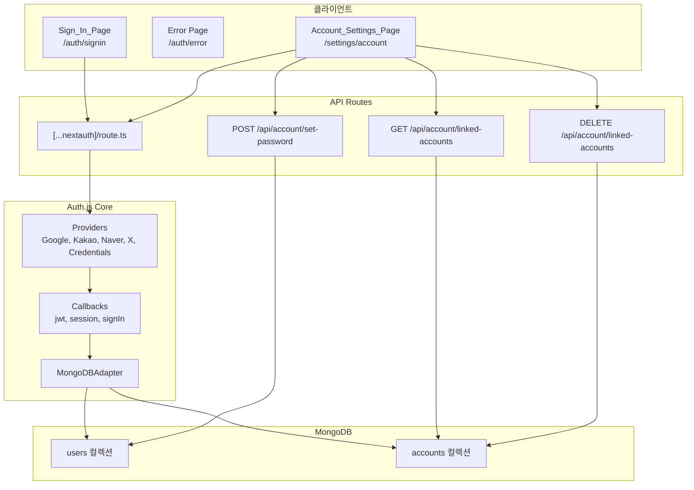
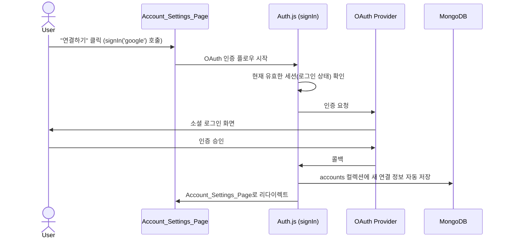

# Design Document: OAuth Integration

## Overview

Not a Trip 플랫폼의 OAuth 통합 기능을 설계한다. 핵심 목표는 다음과 같다:

1. X(Twitter) OAuth 2.0 프로바이더 추가
2. Auth.js 기본 보안 정책 준수 (자동 Account Linking 차단, OAuthAccountNotLinked 에러)
3. Account_Settings_Page를 통한 수동 Account Linking 구현
4. 소셜 전용 계정의 비밀번호 설정 기능
5. 로그인 오류 페이지 개선

현재 시스템은 NextAuth.js(Auth.js v5)를 JWT 전략 + MongoDBAdapter로 사용하며, Google/Kakao/Naver/Credentials 프로바이더가 설정되어 있다. Auth.js의 기본 동작으로 동일 이메일의 다른 프로바이더 로그인 시 `OAuthAccountNotLinked` 에러가 발생하며, 이 정책을 그대로 유지한다.

### 설계 결정 사항

- **자동 Account Linking 금지**: Auth.js 기본 보안 정책을 준수하여 `allowDangerousEmailAccountLinking`을 사용하지 않는다.
- **수동 연결 전용**: 계정 연결은 반드시 로그인된 상태에서 Account_Settings_Page를 통해서만 가능하다.
- **JWT 전략 유지**: 기존 JWT 세션 전략을 변경하지 않는다.
- **MongoDBAdapter 활용**: accounts 컬렉션 관리는 MongoDBAdapter의 기존 스키마를 따른다.

## Architecture



### 수동 Account Linking 플로우




## Components and Interfaces

### 1. Auth 설정 변경 (`src/lib/auth.ts`)

기존 NextAuth 설정에 X(Twitter) 프로바이더를 추가하고, `signIn` 콜백에서 Account Linking 보안 로직을 강화한다.

```typescript
// X(Twitter) 프로바이더 추가
import Twitter from 'next-auth/providers/twitter'

// providers 배열에 추가
Twitter({
  clientId: process.env.TWITTER_CLIENT_ID!,
  clientSecret: process.env.TWITTER_CLIENT_SECRET!,
})
```

`signIn` 콜백은 Auth.js 기본 동작(OAuthAccountNotLinked 에러)을 그대로 활용하므로 별도 커스텀 로직이 불필요하다. Auth.js는 동일 이메일이 다른 프로바이더로 이미 존재할 경우 자동으로 `OAuthAccountNotLinked` 에러를 발생시킨다.

### 2. Sign_In_Page 수정 (`src/app/auth/signin/page.tsx`)

X(Twitter) 로그인 버튼을 기존 소셜 로그인 버튼 영역에 추가한다.

```typescript
// useAuth hook의 loginWithProvider 타입 확장
loginWithProvider: (provider: 'google' | 'kakao' | 'naver' | 'twitter') => Promise<void>
```

### 3. Account_Settings_Page (`src/app/settings/account/page.tsx`)

새로 생성하는 페이지. 로그인된 사용자만 접근 가능하며, 다음 기능을 제공한다:

- 연결된 계정 목록 표시 (프로바이더 이름, 연결 상태)
- 미연결 프로바이더에 대한 "연결하기" 버튼
- 연결된 프로바이더에 대한 "연결 해제" 버튼
- 소셜 전용 계정의 비밀번호 설정 폼

### 4. Account Linking API 엔드포인트

#### `GET /api/account/linked-accounts`
- 인증된 사용자의 연결된 계정 목록 반환
- 응답: `{ accounts: LinkedAccount[], hasPassword: boolean }`

#### `DELETE /api/account/linked-accounts`
- 특정 프로바이더 연결 해제
- 요청: `{ provider: string, providerAccountId: string }`
- 마지막 로그인 수단 해제 시 400 에러 반환

#### 수동 Account Linking (Auth.js 기본 기능 활용)

별도의 커스텀 API를 구축하지 않고, 클라이언트에서 Auth.js가 제공하는 `signIn(provider, { callbackUrl: '/settings/account' })` 함수를 호출한다. Auth.js는 유효한 세션이 존재할 경우 기존 유저 ID를 기준으로 accounts 컬렉션에 새로운 프로바이더를 자동으로 삽입(Link)한다.

```typescript
// Account_Settings_Page에서의 사용 예시
import { signIn } from 'next-auth/react'

const handleLinkProvider = (provider: string) => {
  signIn(provider, { callbackUrl: '/settings/account' })
}
```

#### `POST /api/account/set-password`
- 소셜 전용 계정에 비밀번호 설정
- 요청: `{ password: string }`
- users 컬렉션의 password 필드 업데이트

### 5. Error Page 개선 (`src/app/auth/error/page.tsx`)

`OAuthAccountNotLinked` 에러 메시지를 Requirements 10.3에 맞게 업데이트한다.

```typescript
OAuthAccountNotLinked:
  '이미 다른 로그인 방식으로 가입된 이메일입니다. 기존 방식으로 로그인한 후 계정 설정에서 소셜 계정을 연결해주세요.'
```

### 6. useAuth Hook 확장 (`src/hooks/useAuth.ts`)

`loginWithProvider`의 provider 타입에 `'twitter'`를 추가한다.

### 7. useLinkedAccounts Hook (`src/hooks/useLinkedAccounts.ts`)

Account_Settings_Page에서 사용할 커스텀 훅. React Query를 활용하여 연결된 계정 목록 조회, 연결 해제, 비밀번호 설정 기능을 제공한다. 계정 연결(linking)은 Auth.js의 `signIn` 함수를 직접 호출하는 방식이므로 별도 API 호출이 아닌 클라이언트 측 래퍼로 제공한다.

```typescript
interface UseLinkedAccountsReturn {
  accounts: LinkedAccount[]
  hasPassword: boolean
  isLoading: boolean
  unlinkAccount: (provider: string, providerAccountId: string) => Promise<void>
  setPassword: (password: string) => Promise<void>
  linkAccount: (provider: string) => void  // signIn(provider, { callbackUrl }) 래퍼
}
```

## Data Models

### LinkedAccount (API 응답 타입)

```typescript
interface LinkedAccount {
  provider: string        // 'google' | 'kakao' | 'naver' | 'twitter' | 'credentials'
  providerAccountId: string
  linkedAt: string        // ISO 8601 날짜
}
```

### accounts 컬렉션 (MongoDBAdapter 기본 스키마)

MongoDBAdapter가 관리하는 기존 스키마를 그대로 사용한다. 수동 Account Linking 시에도 동일한 스키마로 삽입한다.

```typescript
// MongoDBAdapter의 accounts 컬렉션 문서 구조
interface AccountDocument {
  _id: ObjectId
  userId: ObjectId
  type: string              // 'oauth'
  provider: string          // 'google' | 'kakao' | 'naver' | 'twitter'
  providerAccountId: string
  access_token?: string
  refresh_token?: string
  expires_at?: number
  token_type?: string
  scope?: string
  id_token?: string
}
```

### users 컬렉션 (기존 스키마 확장)

```typescript
interface UserDocument {
  _id: ObjectId
  email: string | null      // X(Twitter)는 이메일 미제공 가능
  password?: string         // Credentials 또는 비밀번호 설정 시
  name: string
  nickname?: string
  image?: string | null
  provider: string          // Primary_Account 프로바이더
  emailVerified: Date | null
  role: 'user' | 'admin'
  createdAt: Date
  updatedAt: Date
}
```

### API 응답 타입

```typescript
// GET /api/account/linked-accounts 응답
interface LinkedAccountsResponse {
  accounts: LinkedAccount[]
  hasPassword: boolean
}

// DELETE /api/account/linked-accounts 요청
interface UnlinkAccountRequest {
  provider: string
  providerAccountId: string
}

// POST /api/account/set-password 요청
interface SetPasswordRequest {
  password: string
}
```


## Correctness Properties

*A property is a characteristic or behavior that should hold true across all valid executions of a system — essentially, a formal statement about what the system should do. Properties serve as the bridge between human-readable specifications and machine-verifiable correctness guarantees.*

### Property 1: Duplicate email rejection

*For any* OAuth provider and any email that already exists in the users collection under a different provider, attempting to sign in with that OAuth provider should be rejected and not create a new account or auto-link to the existing account.

**Validates: Requirements 3.1, 3.3, 8.1**

### Property 2: Manual linking adds provider to account

*For any* authenticated user and any OAuth provider not yet linked to their account, performing a manual link operation should result in the accounts collection containing a new entry for that provider associated with the user's ID.

**Validates: Requirements 4.1, 5.3**

### Property 3: Linked account enables dual login

*For any* Credentials user who has linked an OAuth provider, both the original Credentials login and the linked OAuth provider login should resolve to the same user ID.

**Validates: Requirements 4.2, 4.3**

### Property 4: Duplicate linking is idempotent

*For any* user and any OAuth provider already linked to their account, attempting to link the same provider again should not create a duplicate entry in the accounts collection, and the total number of linked accounts should remain unchanged.

**Validates: Requirements 4.4**

### Property 5: Unlinking removes provider from account

*For any* user with more than one login method and any linked OAuth provider, performing an unlink operation should remove exactly that provider's entry from the accounts collection, and the remaining accounts should be unaffected.

**Validates: Requirements 5.5, 6.2**

### Property 6: Last login method protection

*For any* user with exactly one remaining login method (whether Credentials or a single OAuth provider), attempting to unlink or remove that last method should be rejected with a 400 error, and the accounts collection should remain unchanged.

**Validates: Requirements 5.6, 6.5**

### Property 7: Password setting round trip

*For any* social-only user (no password set), setting a password via the set-password API and then attempting a Credentials login with that same password should succeed and resolve to the same user ID.

**Validates: Requirements 5.8**

### Property 8: Unauthenticated API rejection

*For any* account management API endpoint (linked-accounts, unlink, set-password, link), any request without a valid session should receive a 401 Unauthorized response.

**Validates: Requirements 6.3, 8.2**

### Property 9: Profile preservation on linking

*For any* user with existing profile data (name, image), linking a new OAuth provider should not modify the user's name, image, or provider fields in the users collection.

**Validates: Requirements 7.2, 7.3**

### Property 10: Email verification required for linking

*For any* OAuth provider that returns `email_verified: false`, attempting to link that provider to an existing account should be rejected.

**Validates: Requirements 8.3**

### Property 11: Error message mapping completeness

*For any* known Auth.js error type string, the error message mapping should return a non-empty, user-friendly Korean message string (not the default fallback).

**Validates: Requirements 10.1**

### Property 12: Linked accounts API returns complete list

*For any* authenticated user with N entries in the accounts collection, the GET linked-accounts API should return exactly N accounts, each with a valid provider name and providerAccountId.

**Validates: Requirements 5.1, 6.1**

### Property 13: Provider data consistency invariant

*For any* user in the users collection, their `provider` field value should correspond to at least one entry in the accounts collection (or they should have a password set if provider is 'credentials').

**Validates: Requirements 9.3**

## Error Handling

### OAuth 인증 오류

| 오류 유형 | HTTP 상태 | 사용자 메시지 | 처리 방식 |
|-----------|-----------|---------------|-----------|
| OAuthAccountNotLinked | 리다이렉트 | "이미 다른 로그인 방식으로 가입된 이메일입니다. 기존 방식으로 로그인한 후 계정 설정에서 소셜 계정을 연결해주세요." | `/auth/error?error=OAuthAccountNotLinked`로 리다이렉트 |
| OAuthSignin | 리다이렉트 | "소셜 로그인 시작 중 오류가 발생했습니다." | `/auth/error`로 리다이렉트 |
| OAuthCallback | 리다이렉트 | "소셜 로그인 처리 중 오류가 발생했습니다." | `/auth/error`로 리다이렉트 |

### Account Linking API 오류

| 오류 상황 | HTTP 상태 | 응답 |
|-----------|-----------|------|
| 미인증 요청 | 401 | `{ error: "인증이 필요합니다." }` |
| 존재하지 않는 프로바이더 해제 | 404 | `{ error: "연결된 계정을 찾을 수 없습니다." }` |
| 마지막 로그인 수단 해제 | 400 | `{ error: "최소 하나의 로그인 수단이 필요합니다." }` |
| 이미 연결된 프로바이더 | 409 | `{ error: "이미 연결된 계정입니다." }` |
| email_verified=false | 403 | `{ error: "이메일이 검증되지 않은 계정은 연결할 수 없습니다." }` |
| 비밀번호 형식 오류 | 400 | `{ error: "비밀번호는 최소 6자 이상이어야 합니다." }` |
| 이미 비밀번호 설정됨 | 409 | `{ error: "이미 비밀번호가 설정되어 있습니다." }` |
| 서버 내부 오류 | 500 | `{ error: "처리 중 오류가 발생했습니다." }` |

### 클라이언트 오류 처리

- Account_Settings_Page에서 API 오류 발생 시 toast 또는 인라인 에러 메시지로 표시
- 연결 해제 실패 시 기존 상태를 유지하고 React Query 캐시를 무효화하지 않음
- 네트워크 오류 시 재시도 안내 메시지 표시

## Testing Strategy

### Property-Based Testing

- **라이브러리**: `fast-check` (이미 devDependencies에 설치됨)
- **최소 반복 횟수**: 100회
- **태그 형식**: `Feature: 15-oauth-integration, Property {number}: {property_text}`

각 Correctness Property는 하나의 property-based 테스트로 구현한다:

| Property | 테스트 대상 | 생성 전략 |
|----------|------------|-----------|
| P1: Duplicate email rejection | signIn 콜백 로직 | 랜덤 이메일 + 랜덤 프로바이더 조합 생성 |
| P2: Manual linking | link API 핸들러 | 랜덤 userId + 랜덤 프로바이더 생성 |
| P3: Dual login | Credentials + OAuth 로그인 로직 | 랜덤 사용자 + 랜덤 비밀번호 + 랜덤 프로바이더 |
| P4: Duplicate linking idempotence | link API 핸들러 | 이미 연결된 프로바이더로 재연결 시도 |
| P5: Unlinking | unlink API 핸들러 | 2개 이상 연결된 사용자 + 랜덤 프로바이더 선택 |
| P6: Last method protection | unlink API 핸들러 | 정확히 1개 로그인 수단을 가진 사용자 생성 |
| P7: Password round trip | set-password + Credentials authorize | 랜덤 비밀번호 문자열 생성 |
| P8: Unauthenticated rejection | 모든 account API 엔드포인트 | 세션 없는 요청 생성 |
| P9: Profile preservation | link 후 user 문서 비교 | 랜덤 프로필 데이터 생성 |
| P10: Email verification | link API 핸들러 | email_verified=false인 OAuth 응답 생성 |
| P11: Error message mapping | errorMessages 객체 | 알려진 에러 타입 문자열 생성 |
| P12: Complete list | linked-accounts API | 랜덤 개수의 연결된 계정 생성 |
| P13: Data consistency | users + accounts 컬렉션 조회 | 랜덤 사용자 + 랜덤 계정 조합 생성 |

### Unit Testing

단위 테스트는 property 테스트가 커버하지 않는 구체적 예제와 엣지 케이스에 집중한다:

- X(Twitter) 이메일 미제공 시 계정 생성 (edge-case: 1.6)
- OAuth 이메일 미제공 시 충돌 없는 계정 생성 (edge-case: 3.4)
- 존재하지 않는 프로바이더 해제 시 404 응답 (edge-case: 6.4)
- OAuthAccountNotLinked 에러 메시지 정확성 (example: 10.3)
- Sign_In_Page에 X(Twitter) 버튼 렌더링 (example: 2.1, 2.2)
- 로딩 중 버튼 비활성화 (example: 2.3)
- 오류 페이지에 로그인 페이지 링크 존재 (example: 10.2)
