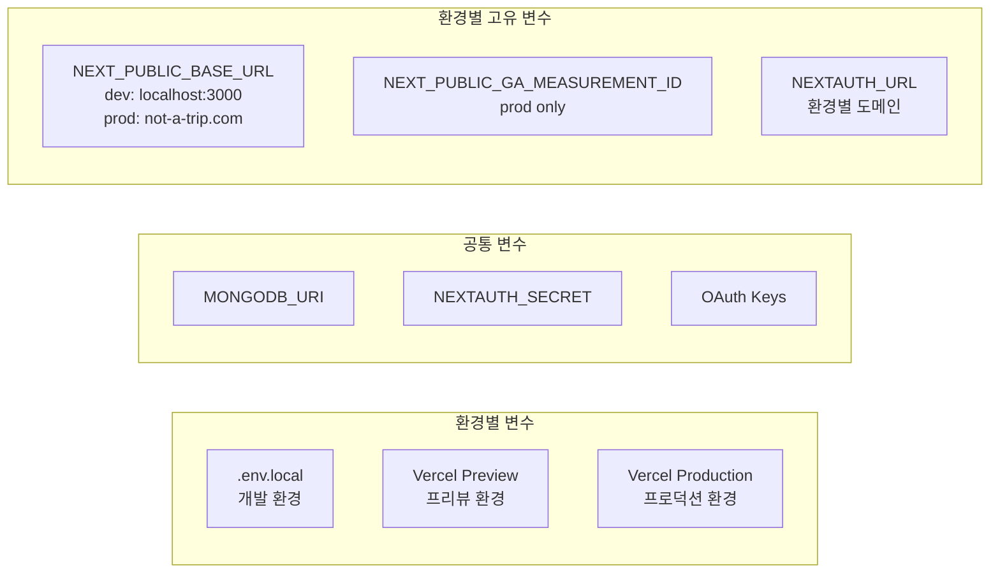

# Design Document: SEO 최적화 및 배포 환경 구축

## Overview

Not a Trip 플랫폼의 검색 엔진 최적화(SEO)와 Vercel 기반 프로덕션 배포 환경을 구축한다. 현재 시스템은 루트 레이아웃에 정적 `metadata` 객체만 설정되어 있으며, 모든 동적 페이지(`spots/[id]`, `routes/[id]`, `community/[id]` 등)가 `'use client'` 지시어를 사용하는 Client Component로 구현되어 있다.

이 설계의 핵심 과제는 다음과 같다:

1. **Server/Client Component 분리**: `generateMetadata`는 Server Component에서만 동작하므로, 현재 `'use client'` 페이지들을 Server Component 래퍼 + Client Component 콘텐츠 패턴으로 리팩토링
2. **동적 메타데이터 생성**: 스팟, 코스, 커뮤니티 페이지별 `generateMetadata` 구현
3. **OG 이미지 동적 렌더링**: `next/og` ImageResponse API를 활용한 동적 OG 이미지 생성
4. **Sitemap & Robots**: Next.js App Router 규약(`sitemap.ts`, `robots.ts`)을 활용한 크롤러 지원
5. **JSON-LD 구조화 데이터**: Schema.org 기반 구조화 데이터 삽입으로 리치 스니펫 지원
6. **배포 환경**: Vercel 배포, 환경 변수 관리, GA4 연동

## Architecture

### 전체 아키텍처 다이어그램

```mermaid
graph TB
    subgraph "Next.js App Router"
        subgraph "Server Components (메타데이터 레이어)"
            RL[app/layout.tsx<br/>정적 metadata + WebSite JSON-LD]
            SP[app/spots/[id]/page.tsx<br/>generateMetadata + JSON-LD]
            RP[app/routes/[id]/page.tsx<br/>generateMetadata + JSON-LD]
            CP[app/community/[id]/page.tsx<br/>generateMetadata]
        end

        subgraph "Client Components (UI 레이어)"
            SPC[SpotDetailClient]
            RPC[RouteDetailClient]
            CPC[PostDetailClient]
        end

        SP --> SPC
        RP --> RPC
        CP --> CPC

        subgraph "API Routes"
            OG[app/api/og/route.tsx<br/>OG Image Generator]
        end

        subgraph "SEO 파일 규약"
            SM[app/sitemap.ts]
            RB[app/robots.ts]
        end
    end

    subgraph "External"
        DB[(MongoDB)]
        GA[Google Analytics 4]
        VR[Vercel Edge Network]
    end

    SP --> DB
    RP --> DB
    CP --> DB
    SM --> DB
    OG --> DB
    OG --> VR
    RL --> GA
```

### Server/Client Component 분리 전략

현재 모든 동적 페이지가 `'use client'`를 사용하고 있어 `generateMetadata`를 직접 사용할 수 없다. 다음 패턴으로 리팩토링한다:

```
// 변경 전 (현재)
app/spots/[id]/page.tsx  →  'use client' + 전체 UI 로직

// 변경 후
app/spots/[id]/page.tsx  →  Server Component (generateMetadata + JSON-LD + Client import)
components/spot/SpotDetailClient.tsx  →  'use client' (기존 UI 로직 이동)
```

각 동적 페이지에 대해:
- `page.tsx`는 Server Component로 유지하여 `generateMetadata`와 JSON-LD `<script>` 태그를 렌더링
- 기존 `'use client'` 로직은 별도 Client Component 파일로 추출

**데이터 Fetch 전략 (의도된 분리):**
- 메타데이터 생성을 위한 Server DB 쿼리는 `projection`을 사용하여 최소한의 필드(id, name, description, address, category 등)만 가볍게 조회한다. 이 쿼리는 SEO 메타 태그와 JSON-LD 렌더링에만 사용된다.
- 이후 마운트되는 Client Component는 React Query를 사용해 전체 데이터를 클라이언트 사이드에서 독자적으로 fetch하는 기존 패턴을 유지한다.
- 이는 서버 쿼리(경량 projection)와 클라이언트 쿼리(전체 데이터 + 상태 관리)의 역할이 다르기 때문에 의도된 분리이다. 빠른 마이그레이션과 기존 React Query 캐싱/상태 관리 구조를 그대로 유지하기 위한 설계 결정이다.
- 향후 최적화가 필요할 경우, Server Component에서 조회한 데이터를 Client Component에 `initialData` props로 전달하여 React Query의 `initialData` 옵션에 활용하는 방식으로 전환할 수 있다.

### 환경 변수 아키텍처



## Components and Interfaces

### 1. Metadata Generator 모듈

#### `src/lib/seo/metadata.ts` — 메타데이터 유틸리티

```typescript
interface SeoMetadata {
  title: string
  description: string
  ogImage?: string
  url: string
  type?: 'website' | 'article'
}

/** 기본 메타데이터 생성 */
function getDefaultMetadata(): Metadata

/** 스팟 페이지 메타데이터 생성 */
function generateSpotMetadata(spot: SpotSeoData): Metadata

/** 코스 페이지 메타데이터 생성 */
function generateRouteMetadata(route: RouteSeoData): Metadata

/** 커뮤니티 게시글 메타데이터 생성 */
function generatePostMetadata(post: PostSeoData): Metadata

/** Base URL 반환 (환경 변수 기반) */
function getBaseUrl(): string
```

#### SEO 데이터 타입 (DB 조회 최소화용 경량 타입)

```typescript
interface SpotSeoData {
  id: string
  name: string
  description: string
  address: string
  category?: SpotCategory
  photos: string[]
  coordinates: { lat: number; lng: number }
}

interface RouteSeoData {
  id: string
  name: string
  description: string
  spots: Array<{ spotName: string }>
}

interface PostSeoData {
  id: string
  title: string
  content: string
}
```

### 2. OG Image Generator

#### `src/app/api/og/route.tsx`

```typescript
// GET /api/og?type=spot&id=xxx
// GET /api/og?type=route&id=xxx
// GET /api/og?type=default

interface OgImageParams {
  type: 'spot' | 'route' | 'default'
  id?: string
}
```

- `next/og`의 `ImageResponse` API 사용 (Node.js Runtime)
- **폰트 로드 전략**: Pretendard 폰트의 고정 웨이트(Regular, Bold) TTF 파일을 프로젝트 로컬 에셋(`src/assets/fonts/`)에 저장하고, 빌드 타임에 `fs.readFile` 또는 `import` 방식으로 로드하여 한글 렌더링 지원. 가변 폰트(Variable Font)는 파일 크기가 수십 MB에 달해 Edge Runtime 메모리 제한 초과 및 타임아웃을 유발하므로 사용하지 않는다. 외부 URL에서 매 요청마다 폰트를 fetch하는 방식도 동일한 이유로 지양한다.
- 1200×630px 이미지 생성
- `Cache-Control: public, s-maxage=86400, stale-while-revalidate=604800` 헤더 설정
- 데이터 조회 실패 시 기본 브랜드 이미지 반환
- **Runtime 선택**: `export const runtime = 'nodejs'`를 명시하여 Node.js Runtime에서 실행. Edge Runtime 대비 파일 시스템 접근이 자유롭고 메모리 제한이 넉넉하여 폰트 로드 및 이미지 렌더링에 안정적이다.

### 3. Sitemap Generator

#### `src/app/sitemap.ts`

```typescript
import { MetadataRoute } from 'next'

export default async function sitemap(): Promise<MetadataRoute.Sitemap>
```

- Next.js App Router의 `sitemap.ts` 규약 사용
- MongoDB에서 모든 공개 스팟, 코스, 게시글 ID를 조회
- 정적 페이지 + 동적 페이지 URL 생성
- `lastmod`, `changefreq`, `priority` 속성 포함
- 관리자/인증/테스트 페이지 제외

향후 URL 수 증가 시 `sitemap.ts`에서 사이트맵 인덱스 방식으로 전환 가능:
```typescript
// 미래 확장: app/sitemap/[category]/route.ts
// 카테고리별 분할 (spots, routes, community)
```

### 4. Robots.txt Generator

#### `src/app/robots.ts`

```typescript
import { MetadataRoute } from 'next'

export default function robots(): MetadataRoute.Robots
```

- `/api/*`, `/admin/*`, `/auth/*`, `/test/*` 크롤링 차단
- 공개 페이지 크롤링 허용
- 사이트맵 URL 명시

### 5. JSON-LD Renderer

#### `src/lib/seo/json-ld.ts`

```typescript
/** 스팟 TouristAttraction JSON-LD 생성 */
function generateSpotJsonLd(spot: SpotSeoData): object

/** 코스 TouristTrip JSON-LD 생성 */
function generateRouteJsonLd(route: RouteSeoData): object

/** WebSite JSON-LD 생성 (루트 레이아웃용) */
function generateWebSiteJsonLd(): object
```

#### `src/components/seo/JsonLd.tsx` — JSON-LD 렌더링 컴포넌트

```typescript
interface JsonLdProps {
  data: object
}

/** dangerouslySetInnerHTML을 사용한 JSON-LD script 태그 렌더링 */
function JsonLd({ data }: JsonLdProps): JSX.Element
```

Server Component에서 사용:
```tsx
// app/spots/[id]/page.tsx (Server Component)
<JsonLd data={generateSpotJsonLd(spotData)} />
<SpotDetailClient />
```

### 6. Google Analytics 컴포넌트

#### `src/components/seo/GoogleAnalytics.tsx`

```typescript
/** GA4 스크립트 삽입 (프로덕션 환경 + 측정 ID 존재 시에만) */
function GoogleAnalytics(): JSX.Element | null
```

- `NEXT_PUBLIC_GA_MEASUREMENT_ID` 환경 변수 확인
- `next/script`의 `afterInteractive` 전략 사용
- 프로덕션 환경에서만 활성화 (`process.env.NODE_ENV === 'production'`)

### 7. 페이지별 리팩토링 구조

| 페이지 | 현재 | 변경 후 page.tsx | Client Component |
|--------|------|-----------------|-----------------|
| `/spots/[id]` | `'use client'` | Server Component | `SpotDetailClient.tsx` |
| `/routes/[id]` | `'use client'` | Server Component | `RouteDetailClient.tsx` |
| `/community/[id]` | `'use client'` | Server Component | `PostDetailClient.tsx` |
| `/` | `'use client'` | `'use client'` 유지 (정적 metadata export) | — |
| `/gallery` | `'use client'` | `'use client'` 유지 (정적 metadata export) | — |
| `/routes` | `'use client'` | `'use client'` 유지 (정적 metadata export) | — |

정적 페이지(`/`, `/gallery`, `/routes`)는 `'use client'`를 유지하되, 해당 라우트 세그먼트의 `layout.tsx` 또는 별도 `metadata` export가 가능한 구조로 처리한다. Next.js에서는 `page.tsx`가 `'use client'`여도 같은 디렉토리의 `layout.tsx`에서 `metadata`를 export할 수 있다.

## Data Models

### SEO 관련 데이터 조회 패턴

메타데이터 생성을 위한 DB 조회는 기존 API를 재사용하지 않고, Server Component에서 직접 `getCollection`을 호출하여 필요한 필드만 projection으로 가져온다.

#### 스팟 SEO 데이터 조회

```typescript
// app/spots/[id]/page.tsx 내 generateMetadata에서 사용
const spot = await collection.findOne(
  { id },
  { projection: { id: 1, name: 1, description: 1, address: 1, category: 1, photos: 1, coordinates: 1 } }
)
```

#### 코스 SEO 데이터 조회

```typescript
// app/routes/[id]/page.tsx 내 generateMetadata에서 사용
const route = await collection.findOne(
  { id },
  { projection: { id: 1, name: 1, description: 1, spots: 1 } }
)
```

#### 커뮤니티 게시글 SEO 데이터 조회

```typescript
// app/community/[id]/page.tsx 내 generateMetadata에서 사용
const post = await collection.findOne(
  { _id: new ObjectId(id) },
  { projection: { title: 1, content: 1 } }
)
```

#### 사이트맵용 전체 ID 조회

```typescript
// app/sitemap.ts에서 사용
const spots = await spotsCollection.find({}, { projection: { id: 1, updatedAt: 1 } }).toArray()
const routes = await routesCollection.find({ isPublic: true }, { projection: { id: 1, updatedAt: 1 } }).toArray()
const posts = await postsCollection.find({}, { projection: { _id: 1, updatedAt: 1 } }).toArray()
```

### 환경 변수 모델

| 변수명 | 용도 | 환경 |
|--------|------|------|
| `NEXT_PUBLIC_BASE_URL` | 사이트 기본 URL (sitemap, OG 이미지, canonical URL) | 전체 |
| `NEXT_PUBLIC_GA_MEASUREMENT_ID` | GA4 측정 ID | Production |
| `MONGODB_URI` | MongoDB 연결 문자열 | 전체 |
| `NEXTAUTH_URL` | NextAuth 콜백 URL | 전체 |
| `NEXTAUTH_SECRET` | NextAuth 암호화 키 | 전체 |
| OAuth 키들 | Google, Kakao, Naver, Twitter | 전체 |


## Correctness Properties

*A property is a characteristic or behavior that should hold true across all valid executions of a system — essentially, a formal statement about what the system should do. Properties serve as the bridge between human-readable specifications and machine-verifiable correctness guarantees.*

### Property 1: 스팟 메타데이터 완전성

*For any* 유효한 스팟 데이터(name, description, address, category, photos 포함)에 대해, `generateSpotMetadata` 함수는 다음을 모두 만족하는 `Metadata` 객체를 반환해야 한다:
- `title`이 `"{스팟명} | Not a Trip"` 형식
- `description`이 스팟의 description 값과 일치
- `openGraph` 객체에 `title`, `description`, `images`, `url`, `type` 필드가 모두 존재
- `twitter` 객체에 `card`, `title`, `description`, `images` 필드가 모두 존재

**Validates: Requirements 1.1, 1.2, 1.3, 1.4**

### Property 2: 코스 메타데이터 완전성

*For any* 유효한 코스 데이터(name, description, spots 배열 포함)에 대해, `generateRouteMetadata` 함수는 다음을 만족하는 `Metadata` 객체를 반환해야 한다:
- `title`이 `"{코스명} | Not a Trip"` 형식
- `description`에 코스 설명과 스팟 수 정보가 포함

**Validates: Requirements 2.1, 2.2**

### Property 3: 게시글 메타데이터 완전성

*For any* 유효한 게시글 데이터(title, content 포함)에 대해, `generatePostMetadata` 함수는 다음을 만족하는 `Metadata` 객체를 반환해야 한다:
- `title`이 `"{게시글 제목} | Not a Trip 커뮤니티"` 형식
- `description`의 길이가 150자 이하이며, content의 앞부분과 일치

**Validates: Requirements 2.3, 2.4**

### Property 4: OG 이미지 응답 유효성

*For any* 유효한 OG 이미지 요청(type이 'spot' 또는 'route', 유효한 id)에 대해, OG Image API는 다음을 만족하는 응답을 반환해야 한다:
- HTTP 상태 코드가 200
- `Content-Type` 헤더가 `image/png`
- `Cache-Control` 헤더에 `s-maxage` 값이 포함

**Validates: Requirements 4.1, 4.2, 4.5**

### Property 5: 사이트맵 엔티티 커버리지

*For any* 데이터베이스에 존재하는 공개 스팟, 공개 코스, 게시글 집합에 대해, `sitemap()` 함수가 반환하는 URL 목록은 해당 엔티티들의 상세 페이지 URL(`/spots/{id}`, `/routes/{id}`, `/community/{id}`)을 모두 포함해야 한다.

**Validates: Requirements 5.3, 5.4, 5.5**

### Property 6: 사이트맵 엔트리 속성 완전성

*For any* `sitemap()` 함수가 반환하는 사이트맵 엔트리에 대해, 각 엔트리는 `url`, `lastModified`, `changeFrequency`, `priority` 속성을 모두 포함해야 한다.

**Validates: Requirements 5.6**

### Property 7: 사이트맵 비공개 경로 제외

*For any* `sitemap()` 함수가 반환하는 사이트맵 엔트리에 대해, 어떤 엔트리의 URL도 `/admin`, `/auth`, `/test`, `/api` 경로를 포함하지 않아야 한다.

**Validates: Requirements 5.7**

### Property 8: 스팟 JSON-LD 완전성

*For any* 유효한 스팟 데이터(name, description, address, coordinates, photos, category 포함)에 대해, `generateSpotJsonLd` 함수는 다음을 만족하는 JSON-LD 객체를 반환해야 한다:
- `@type`이 `"TouristAttraction"`
- `name` 필드가 스팟 이름과 일치
- `description` 필드가 스팟 설명과 일치
- `address` 필드가 스팟 주소와 일치
- `geo` 객체에 `latitude`, `longitude`가 포함
- `image` 필드가 스팟의 첫 번째 사진 URL과 일치
- `additionalType` 필드가 스팟 카테고리와 일치

**Validates: Requirements 7.1, 7.2, 7.3, 7.4**

### Property 9: 코스 JSON-LD 완전성

*For any* 유효한 코스 데이터(name, description, spots 배열 포함)에 대해, `generateRouteJsonLd` 함수는 다음을 만족하는 JSON-LD 객체를 반환해야 한다:
- `@type`이 `"TouristTrip"`
- `name` 필드가 코스 이름과 일치
- `description` 필드가 코스 설명과 일치
- `itinerary` 배열의 길이가 코스의 스팟 수와 일치

**Validates: Requirements 8.1, 8.2, 8.3**

## Error Handling

### 메타데이터 생성 실패

| 시나리오 | 처리 방식 |
|---------|----------|
| 스팟/코스/게시글 DB 조회 실패 | 기본 메타데이터 반환 (`getDefaultMetadata()`) |
| 스팟 description 비어있음 | 카테고리 + 주소 조합으로 대체 설명 생성 |
| 코스 description 비어있음 | 포함된 스팟 이름 조합으로 대체 설명 생성 |
| 잘못된 ID 형식 (community) | `ObjectId.isValid()` 검증 후 기본 메타데이터 반환 |

### OG 이미지 생성 실패

| 시나리오 | 처리 방식 |
|---------|----------|
| DB 조회 실패 | 기본 브랜드 OG 이미지 반환 (텍스트: "Not a Trip") |
| 잘못된 type 파라미터 | 기본 브랜드 OG 이미지 반환 |
| 로컬 폰트 파일 읽기 실패 | 시스템 기본 폰트(sans-serif)로 폴백하여 이미지 생성 |
| 이미지 렌더링 오류 | try-catch로 감싸고 기본 이미지 반환 |

### 사이트맵 생성 실패

| 시나리오 | 처리 방식 |
|---------|----------|
| DB 연결 실패 | 정적 페이지만 포함한 최소 사이트맵 반환 |
| 특정 컬렉션 조회 실패 | 해당 카테고리 제외하고 나머지 URL 반환 |

### GA4 연동

| 시나리오 | 처리 방식 |
|---------|----------|
| `NEXT_PUBLIC_GA_MEASUREMENT_ID` 미설정 | 컴포넌트가 `null` 반환, 페이지 정상 렌더링 |
| 비프로덕션 환경 | 컴포넌트가 `null` 반환 |

## Testing Strategy

### 단위 테스트 (Jest)

단위 테스트는 구체적인 예제와 엣지 케이스를 검증한다.

- **메타데이터 유틸리티**: `generateSpotMetadata`, `generateRouteMetadata`, `generatePostMetadata` 함수의 기본 동작 및 폴백 로직
- **JSON-LD 생성**: `generateSpotJsonLd`, `generateRouteJsonLd`, `generateWebSiteJsonLd` 함수의 출력 구조
- **robots.ts**: 차단/허용 경로 및 사이트맵 URL 포함 여부
- **정적 메타데이터**: 각 정적 페이지의 metadata export 값 검증
- **GA4 컴포넌트**: 환경 변수 유무에 따른 렌더링 여부
- **엣지 케이스**: 빈 description, null 데이터, 잘못된 ID 형식 등

### 속성 기반 테스트 (fast-check)

속성 기반 테스트는 모든 유효한 입력에 대해 보편적 속성을 검증한다. 프로젝트에 이미 `fast-check` 라이브러리가 설치되어 있으므로 이를 사용한다.

- 각 속성 테스트는 최소 100회 반복 실행
- 각 테스트에 설계 문서의 Property 번호를 태그로 포함
- 태그 형식: `Feature: 16-seo-deployment, Property {number}: {property_text}`

**테스트 대상 속성:**

| Property | 테스트 내용 | 생성기 |
|----------|-----------|--------|
| P1 | 스팟 메타데이터 완전성 | 랜덤 SpotSeoData 생성 |
| P2 | 코스 메타데이터 완전성 | 랜덤 RouteSeoData 생성 |
| P3 | 게시글 메타데이터 완전성 | 랜덤 PostSeoData 생성 |
| P5 | 사이트맵 엔티티 커버리지 | 랜덤 엔티티 ID 집합 생성 |
| P6 | 사이트맵 엔트리 속성 완전성 | P5 결과 재사용 |
| P7 | 사이트맵 비공개 경로 제외 | P5 결과 재사용 |
| P8 | 스팟 JSON-LD 완전성 | 랜덤 SpotSeoData 생성 |
| P9 | 코스 JSON-LD 완전성 | 랜덤 RouteSeoData 생성 |

Property 4 (OG 이미지 응답 유효성)는 `ImageResponse` API의 서버 환경 의존성으로 인해 통합 테스트로 검증한다.

### 통합 테스트

- OG 이미지 API 엔드포인트의 응답 상태, Content-Type, Cache-Control 헤더 검증
- 사이트맵 함수의 실제 DB 연동 테스트 (테스트 DB 사용)

### 테스트 파일 구조

```
src/
├── lib/seo/__tests__/
│   ├── metadata.test.ts          # 메타데이터 유틸리티 단위 + 속성 테스트
│   ├── json-ld.test.ts           # JSON-LD 생성 단위 + 속성 테스트
│   └── metadata.property.test.ts # 속성 기반 테스트 (P1-P3)
├── app/
│   ├── sitemap.test.ts           # 사이트맵 속성 테스트 (P5-P7)
│   └── api/og/__tests__/
│       └── og.test.ts            # OG 이미지 통합 테스트
```
