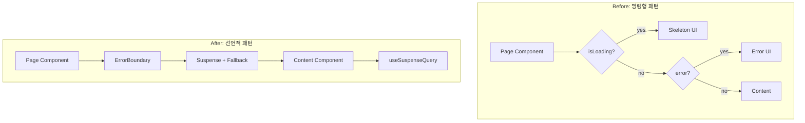
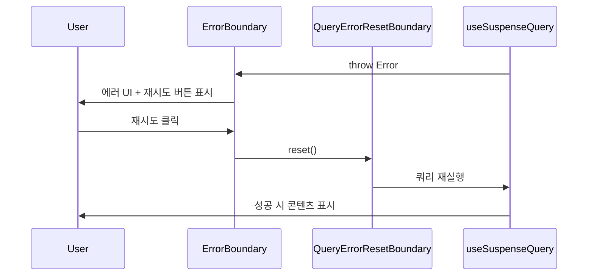

# 설계 문서: 선언적 리팩토링 (Declarative Refactoring)

## 개요

Not a Trip 프로젝트에 Toss 스타일의 선언적 프로그래밍 패턴을 도입하는 리팩토링이다. 현재 코드베이스에는 다음과 같은 문제가 존재한다:

1. **명령형 비동기 처리**: `isLoading`/`error` 상태를 컴포넌트 내부에서 직접 분기 처리하여 비즈니스 로직과 UI 로직이 혼재
2. **추상화 수준 불일치**: `page.tsx` 최상위 컴포넌트에 인라인 SVG, 스켈레톤 UI 등 저수준 코드가 혼재
3. **관심사 미분리**: 관리자 페이지 4곳에 동일한 세션 확인/권한 검사/리다이렉트 코드가 중복
4. **도메인 로직 결합**: SpotDetailClient, RouteDetailClient에 데이터 패칭, 권한 확인, 상태 관리 로직이 렌더링 코드와 결합

이 설계는 4가지 영역을 독립적으로 진행 가능하도록 구성하며, 기존 기능을 유지하면서 점진적으로 코드 구조를 개선한다.

### 기술 스택 참고

- **TanStack Query v5**: `useSuspenseQuery` 네이티브 지원 (v5.0+)
- **React 18+**: `<Suspense>` 컴포넌트 안정화
- **Next.js 15 App Router**: `loading.tsx`, `error.tsx` 파일 기반 경계와의 공존 고려

## 아키텍처

### 전체 구조 변경 개요



### Suspense & ErrorBoundary vs Next.js loading.tsx/error.tsx

Next.js App Router는 파일 기반 `loading.tsx`와 `error.tsx`를 제공하지만, 이 프로젝트에서는 컴포넌트 레벨 Suspense/ErrorBoundary를 사용한다:

| 구분 | Next.js 파일 기반 | 컴포넌트 레벨 (채택) |
|------|-------------------|---------------------|
| 적용 범위 | 라우트 세그먼트 단위 | 컴포넌트 트리 단위 |
| 세분화 | 페이지 전체 로딩/에러 | 섹션별 독립 로딩/에러 |
| 재시도 | 별도 구현 필요 | QueryErrorResetBoundary 연동 |
| SSR 호환 | 자동 처리 | useIsMounted 훅으로 클라이언트 마운트 후 렌더링 지연 |

**설계 결정**: 컴포넌트 레벨 경계를 사용하여 페이지 내 개별 섹션이 독립적으로 로딩/에러 상태를 관리할 수 있도록 한다. Next.js의 `loading.tsx`/`error.tsx`는 전체 페이지 수준의 폴백으로 유지한다.

### QueryErrorResetBoundary를 활용한 선언적 에러 복구



TanStack Query의 `QueryErrorResetBoundary`는 ErrorBoundary의 `onReset` 콜백과 연동하여, 재시도 시 실패한 쿼리의 에러 상태를 자동으로 초기화한다. 이를 통해 사용자가 "다시 시도" 버튼을 클릭하면 쿼리가 자동으로 재실행된다.

### SSR 하이드레이션 방어 전략

`useSuspenseQuery`는 SSR 환경에서 서버 렌더링 시 데이터를 기다리므로 하이드레이션 불일치가 발생할 수 있다. 대상 컴포넌트들이 `'use client'` 지시어를 사용하더라도, Next.js App Router는 최초 접속 시 서버에서 1회 프리렌더링(SSR)을 시도한다. 이때 내부에 `useSuspenseQuery`가 있으면 서버가 데이터를 기다리다가 에러를 발생시키거나 Suspense fallback을 HTML에 하드코딩하는 문제가 생긴다.

**해결 전략: `useIsMounted` 훅 도입**

`AsyncBoundary` 내부에 클라이언트 마운트 여부를 추적하는 `useIsMounted` 훅을 추가하여, 마운트가 완료된 후에만 `useSuspenseQuery`가 포함된 자식 컴포넌트를 렌더링하도록 지연시킨다. 마운트 전에는 `pendingFallback`을 표시한다.

```typescript
// src/hooks/useIsMounted.ts
function useIsMounted(): boolean
```

내부 동작:
1. `useState(false)`로 초기화
2. `useEffect`에서 `setIsMounted(true)` 호출 (클라이언트에서만 실행)
3. 서버 렌더링 시 항상 `false` 반환 → `pendingFallback` 표시
4. 클라이언트 마운트 완료 후 `true` 반환 → 자식 컴포넌트(useSuspenseQuery 포함) 렌더링

**AsyncBoundary 내부 적용**:
```tsx
function AsyncBoundary({ children, pendingFallback, rejectedFallback }: AsyncBoundaryProps) {
  const isMounted = useIsMounted()

  if (!isMounted) return <>{pendingFallback}</>

  return (
    <QueryErrorResetBoundary>
      {({ reset }) => (
        <ErrorBoundary onReset={reset} renderFallback={rejectedFallback}>
          <Suspense fallback={pendingFallback}>
            {children}
          </Suspense>
        </ErrorBoundary>
      )}
    </QueryErrorResetBoundary>
  )
}
```

## 컴포넌트 및 인터페이스

### 1. ErrorBoundary 컴포넌트

**파일**: `src/components/common/ErrorBoundary.tsx`

```typescript
interface ErrorBoundaryProps {
  children: React.ReactNode
  // 단순 UI 폴백 (ReactNode)
  fallback?: React.ReactNode
  // Render Props 패턴 — 에러 정보와 reset 함수를 받아 커스텀 에러 UI를 렌더링
  renderFallback?: (props: { error: Error; reset: () => void }) => React.ReactNode
  onReset?: () => void
}

interface ErrorBoundaryState {
  hasError: boolean
  error: Error | null
}
```

React 클래스 컴포넌트로 구현하며, `getDerivedStateFromError`와 `componentDidCatch`를 사용한다.

**fallback 우선순위**: `renderFallback` > `fallback` > 기본 에러 UI(에러 메시지 + 재시도 버튼). `renderFallback`이 제공되면 함수형 Render Props로 에러와 reset을 전달하고, `fallback`만 있으면 정적 ReactNode를 표시한다. 둘 다 없으면 기본 에러 UI를 표시한다. 이 분리를 통해 TypeScript가 `typeof fallback === 'function'` 분기 없이 타입을 명확하게 추론할 수 있다.

### 2. AsyncBoundary 컴포넌트 (편의 래퍼)

**파일**: `src/components/common/AsyncBoundary.tsx`

```typescript
interface AsyncBoundaryProps {
  children: React.ReactNode
  pendingFallback: React.ReactNode
  rejectedFallback?: (props: { error: Error; reset: () => void }) => React.ReactNode
}
```

`QueryErrorResetBoundary` + `ErrorBoundary` + `Suspense` + `useIsMounted`를 조합한 편의 컴포넌트. SSR 환경에서 마운트 전에는 `pendingFallback`을 표시하고, 마운트 후에만 자식 컴포넌트를 렌더링한다. 사용 예:

```tsx
<AsyncBoundary pendingFallback={<SpotDetailSkeleton />}>
  <SpotDetailContent spotId={spotId} />
</AsyncBoundary>
```

### 3. SVG 아이콘 컴포넌트

**디렉토리**: `src/components/icons/`

```typescript
interface IconProps {
  size?: 'sm' | 'md' | 'lg' | number  // sm=16, md=24, lg=32
  color?: string                        // CSS color 값, 기본값 'currentColor'
  className?: string
}
```

분리 대상 인라인 SVG 아이콘:

| 컴포넌트명 | 출처 | 용도 |
|-----------|------|------|
| `AlertTriangleIcon` | `page.tsx`, `SpotDetailClient.tsx` | 에러 상태 표시 |
| `SearchIcon` | `page.tsx` | 검색 결과 없음 |
| `FilterIcon` | `page.tsx` | 카테고리 필터 해제 |
| `MapPinIcon` | `SpotDetailClient.tsx` | 주소/위치 표시 |
| `ArrowLeftIcon` | `SpotDetailClient.tsx`, `RouteDetailClient.tsx` | 뒤로가기 |
| `SpinnerIcon` | `page.tsx` | 로딩 스피너 |

**배럴 파일**: `src/components/icons/index.ts`에서 모든 아이콘을 re-export한다.

### 4. 프레젠테이셔널 컴포넌트 분리

**디렉토리**: `src/components/common/` (기존 디렉토리 활용)

| 컴포넌트명 | 파일 | 출처 |
|-----------|------|------|
| `SpotLoadingSkeleton` | `SpotLoadingSkeleton.tsx` | `page.tsx` 내부 함수 |
| `SpotErrorDisplay` | `SpotErrorDisplay.tsx` | `page.tsx` 내부 함수 |
| `EmptySearchOverlay` | `EmptySearchOverlay.tsx` | `page.tsx` 인라인 JSX |
| `EmptyFilterOverlay` | `EmptyFilterOverlay.tsx` | `page.tsx` 인라인 JSX |

### 5. Headless 훅 (ViewModel) 인터페이스

#### useAdminAuth

**파일**: `src/hooks/useAdminAuth.ts`

```typescript
interface UseAdminAuthReturn {
  isLoading: boolean       // 세션 로딩 중 여부
  isAuthorized: boolean    // 관리자 권한 확인 결과
  session: Session | null  // NextAuth 세션 객체
}

function useAdminAuth(): UseAdminAuthReturn
```

내부 동작:
1. `useSession()`으로 세션 상태 확인
2. `status === 'loading'`이면 `{ isLoading: true, isAuthorized: false, session: null }` 반환
3. 세션이 없거나 `role !== 'admin'`이면 `router.push('/')`로 리다이렉트 후 `{ isLoading: false, isAuthorized: false, session: null }` 반환
4. 관리자이면 `{ isLoading: false, isAuthorized: true, session }` 반환

#### useSpotDetailViewModel

**파일**: `src/hooks/useSpotDetailViewModel.ts`

```typescript
interface UseSpotDetailViewModelProps {
  spotId: string
}

interface UseSpotDetailViewModelReturn {
  // 권한
  hasEditPermission: boolean
  hasDeletePermission: boolean

  // 삭제
  isDeleting: boolean
  handleDelete: () => Promise<void>

  // 정보 보완 폼
  showSupplementForm: boolean
  handleSupplementClick: () => void
  handleSupplementSuccess: () => void
  supplementKey: number

  // 상태 신고 폼
  showStatusReportForm: boolean
  handleStatusReportClick: () => void

  // 로그인 모달
  showLoginModal: boolean
  loginModalContext: 'supplement' | 'status'
}

function useSpotDetailViewModel(props: UseSpotDetailViewModelProps): UseSpotDetailViewModelReturn
```

#### useRouteDetailViewModel

**파일**: `src/hooks/useRouteDetailViewModel.ts`

```typescript
interface UseRouteDetailViewModelProps {
  routeId: string
}

interface UseRouteDetailViewModelReturn {
  route: Route | null
  isLoading: boolean
  error: string | null
}

function useRouteDetailViewModel(props: UseRouteDetailViewModelProps): UseRouteDetailViewModelReturn
```

이 훅은 기존 `useState`/`useEffect` 기반 수동 fetch를 React Query(`useQuery`)로 전환한다. `routeKeys` 팩토리 패턴을 활용하여 기존 `useRouteQueries.ts`와 캐시 호환성을 유지한다.

### 6. Admin 데이터 Fetching 설계

#### adminKeys 팩토리 패턴 확장

기존 `useAdminQueries.ts`의 `adminKeys`에 대시보드 요약 키를 추가한다:

```typescript
export const adminKeys = {
  all: ['admin'] as const,
  // ... 기존 키 유지
  dashboard: () => [...adminKeys.all, 'dashboard'] as const,
  dashboardSummary: () => [...adminKeys.dashboard(), 'summary'] as const,
}
```

#### useAdminDashboardSummary 훅

**파일**: `src/hooks/useAdminQueries.ts` (기존 파일에 추가)

```typescript
function useAdminDashboardSummary(): UseQueryResult<DashboardSummaryResponse>
```

기존 `AdminDashboardPage`의 `useState`/`useEffect` 기반 수동 fetch를 대체한다. `adminKeys.dashboardSummary()` queryKey를 사용하여 캐시 관리를 통일한다.

#### Admin 페이지 useQuery 전환 가이드

Admin Reports, Supplements, StatusReports 페이지는 이미 `useAdminReports`, `useAdminSupplements`, `useAdminStatusReports` 훅이 존재하지만, 페이지 컴포넌트 자체에서는 아직 `useSession`/`useEffect` 기반 권한 검사를 수동으로 수행하고 있다. 이를 `useAdminAuth` 훅으로 통일한다.

## 데이터 모델

이 리팩토링은 새로운 데이터 모델을 도입하지 않는다. 기존 데이터 모델(`Spot`, `Route`, `SpotReport`, `SpotStatusReport`, `SpotSupplement`, `DashboardSummaryResponse`)을 그대로 사용하며, 데이터 접근 패턴만 변경한다.

### 변경되는 데이터 접근 패턴

| 컴포넌트 | Before | After |
|---------|--------|-------|
| `AdminDashboardPage` | `useState` + `useEffect` + `fetch` | `useAdminDashboardSummary()` (useQuery) |
| `RouteDetailClient` | `useState` + `useEffect` + `fetch` | `useRouteDetailViewModel()` (useQuery) |
| `SpotDetailClient` | `useSpotDetail()` (useQuery) | `useSpotDetail()` (useSuspenseQuery 전환 가능) |
| `Main Page (Home)` | `useSpots()` (useQuery) | `useSpots()` (useSuspenseQuery 전환 가능) |

### Query Key 구조

```
admin
├── dashboard
│   └── summary          ← 신규
├── reports
│   └── { statusFilter, page }
├── statusReports
│   └── { reviewStatusFilter, statusFilter, page }
├── supplements
│   └── { statusFilter, page }
└── contentImages
    └── { search, page }

routes
├── list
│   └── { filters, page }
└── related
    └── { contentName }
```

## 정확성 속성 (Correctness Properties)

*속성(Property)이란 시스템의 모든 유효한 실행에서 참이어야 하는 특성 또는 동작이다. 속성은 사람이 읽을 수 있는 명세와 기계가 검증할 수 있는 정확성 보장 사이의 다리 역할을 한다.*

### Property 1: ErrorBoundary 에러 포착 및 대체 UI 표시

*For any* 에러를 throw하는 자식 컴포넌트와 임의의 에러 메시지에 대해, ErrorBoundary로 감싸면 자식 대신 에러 메시지가 포함된 대체 UI가 렌더링되어야 한다.

**Validates: Requirements 1.1**

### Property 2: ErrorBoundary 에러→리셋 라운드트립

*For any* 에러를 throw하는 자식 컴포넌트에 대해, ErrorBoundary가 에러를 포착한 후 reset을 호출하면 에러 상태가 초기화되어 자식 컴포넌트가 다시 렌더링을 시도해야 한다.

**Validates: Requirements 1.3, 8.1**

### Property 3: ErrorBoundary 투명성

*For any* 에러를 throw하지 않는 자식 컴포넌트에 대해, ErrorBoundary는 자식 컴포넌트의 렌더링 결과를 변경 없이 그대로 통과시켜야 한다.

**Validates: Requirements 1.4**

### Property 4: useAdminAuth 세션-권한 매핑

*For any* 세션 상태(로딩 중, 관리자 세션, 비관리자 세션, 세션 없음)에 대해, useAdminAuth는 다음을 만족해야 한다: 로딩 중이면 `isLoading: true`, 관리자이면 `isAuthorized: true`와 유효한 session, 비관리자이거나 세션이 없으면 `isAuthorized: false`.

**Validates: Requirements 4.1, 8.2**

### Property 5: useSpotDetailViewModel 권한 및 상태 관리 일관성

*For any* 사용자(관리자/일반/비인증)와 스팟(본인 작성/타인 작성) 조합에 대해, useSpotDetailViewModel은 다음을 만족해야 한다: (1) 관리자이거나 본인 스팟이면 `hasEditPermission`과 `hasDeletePermission`이 true, (2) 토글 핸들러 호출 시 해당 상태가 반전되어야 하며, (3) 비인증 사용자의 토글 핸들러 호출 시 로그인 모달이 표시되어야 한다.

**Validates: Requirements 6.1, 6.2**

## 에러 처리

### ErrorBoundary 계층 구조

```
App Layout
├── Next.js error.tsx (최상위 폴백)
└── Page Component
    └── AsyncBoundary (QueryErrorResetBoundary + ErrorBoundary + Suspense)
        └── Content Component (useSuspenseQuery)
```

### 에러 유형별 처리 전략

| 에러 유형 | 처리 방식 | 사용자 경험 |
|----------|----------|------------|
| API 네트워크 에러 | ErrorBoundary → 재시도 버튼 | 에러 메시지 + "다시 시도" 버튼 |
| 404 (데이터 없음) | 컴포넌트 내부 조건부 렌더링 | "찾을 수 없습니다" UI |
| 권한 없음 (403) | useAdminAuth → 리다이렉트 | 메인 페이지로 자동 이동 |
| 렌더링 에러 | ErrorBoundary → 기본 에러 UI | 에러 메시지 + 재시도 버튼 |

### 재시도 메커니즘

`QueryErrorResetBoundary`와 `ErrorBoundary`의 `onReset`을 연동하여:
1. 사용자가 "다시 시도" 클릭
2. `ErrorBoundary.onReset` → `QueryErrorResetBoundary.reset()` 호출
3. 실패한 쿼리의 에러 상태 초기화
4. 컴포넌트 재렌더링 → `useSuspenseQuery` 재실행
5. 성공 시 콘텐츠 표시, 실패 시 다시 ErrorBoundary 포착

## 테스트 전략

### 이중 테스트 접근법

이 프로젝트는 단위 테스트와 속성 기반 테스트를 병행한다:

- **단위 테스트**: 특정 예제, 엣지 케이스, 에러 조건 검증
- **속성 기반 테스트**: 모든 입력에 대한 보편적 속성 검증

### 속성 기반 테스트 설정

- **라이브러리**: `fast-check` (TypeScript/JavaScript용 PBT 라이브러리)
- **테스트 프레임워크**: Jest (기존 프로젝트 설정 활용)
- **최소 반복 횟수**: 각 속성 테스트당 100회
- **각 테스트에 설계 문서 속성 참조 태그 포함**
- **태그 형식**: `Feature: 17-declarative-refactoring, Property {number}: {property_text}`
- **각 정확성 속성은 단일 속성 기반 테스트로 구현**

### 단위 테스트 범위

| 테스트 대상 | 테스트 유형 | 검증 내용 |
|-----------|-----------|----------|
| ErrorBoundary | 단위 + 속성 | 에러 포착, 대체 UI, 리셋, 투명성 |
| AsyncBoundary | 단위 | Suspense + ErrorBoundary 조합 동작 |
| useAdminAuth | 단위 + 속성 | 세션 상태별 반환값, 리다이렉트 |
| useSpotDetailViewModel | 단위 + 속성 | 권한 확인, 토글 상태, 핸들러 동작 |
| useRouteDetailViewModel | 단위 | React Query 전환 후 데이터 패칭 |
| useAdminDashboardSummary | 단위 | 데이터 패칭, 에러 처리 |
| SVG 아이콘 컴포넌트 | 단위 | props(size, color) 적용, 렌더링 |
| 프레젠테이셔널 컴포넌트 | 단위 | 분리 전후 렌더링 동일성 |

### 속성 기반 테스트 매핑

| 속성 | 테스트 파일 | Generator |
|-----|-----------|-----------|
| Property 1 | `ErrorBoundary.property.test.tsx` | 임의의 에러 메시지 문자열 |
| Property 2 | `ErrorBoundary.property.test.tsx` | 임의의 에러 메시지 문자열 |
| Property 3 | `ErrorBoundary.property.test.tsx` | 임의의 자식 텍스트 콘텐츠 |
| Property 4 | `useAdminAuth.property.test.ts` | 임의의 세션 상태 (loading/admin/non-admin/null) |
| Property 5 | `useSpotDetailViewModel.property.test.ts` | 임의의 사용자 역할 × 스팟 소유자 조합 |
