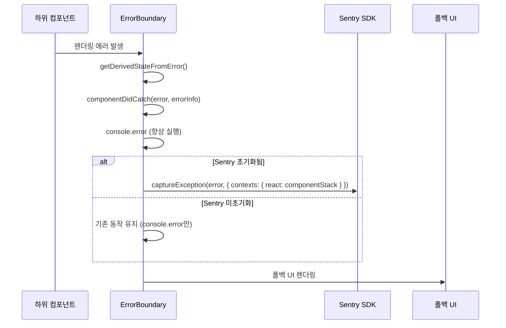

# Design Document: Sentry Integration

## Overview

Not a Trip 프로젝트에 `@sentry/nextjs` SDK를 통합하여 클라이언트(브라우저)와 서버(Node.js, Edge Runtime) 양쪽에서 발생하는 에러를 자동 수집한다. Next.js 15 App Router 환경에 맞춰 `instrumentation.ts` 기반 초기화, `withSentryConfig` 빌드 래퍼, `global-error.tsx` 최상위 에러 처리를 구성한다.

핵심 설계 원칙:
- DSN 미설정 시 Sentry 초기화를 건너뛰어 로컬 개발에 영향 없음
- development 환경에서는 모든 전송(에러, 트레이싱, 리플레이)을 비활성화
- 기존 `ErrorBoundary` 컴포넌트의 인터페이스를 유지하면서 Sentry 보고 기능만 추가
- 사용자 개인정보(이메일, 이름)는 절대 Sentry에 전송하지 않고 ID만 포함

## Architecture

```mermaid
graph TB
    subgraph "Build Time"
        NC[next.config.ts<br/>withSentryConfig] --> SM[Source Map Upload]
        SM --> SR[Sentry Release]
    end

    subgraph "Runtime - Client"
        SCC[sentry.client.config.ts] --> SDK_C[Sentry Client SDK]
        SDK_C --> EB[ErrorBoundary<br/>componentDidCatch]
        SDK_C --> GE[global-error.tsx]
        SDK_C --> TR[/monitoring<br/>Next.js rewrites proxy]
        TR --> SENTRY[Sentry Server]
        SDK_C --> REPLAY[Session Replay]
        SDK_C --> PERF_C[Performance Tracing]
    end

    subgraph "Runtime - Server"
        INST[src/instrumentation.ts] --> SCS[sentry.server.config.ts]
        INST --> SCE[sentry.edge.config.ts]
        SCS --> SDK_S[Sentry Server SDK]
        SCE --> SDK_E[Sentry Edge SDK]
        SDK_S --> SENTRY
        SDK_E --> SENTRY
    end

    subgraph "User Context"
        AUTH[useAuth / session] --> CTX[setSentryUser]
        CTX --> SDK_C
    end
```

### 초기화 흐름

1. **빌드 시**: `next.config.ts`에서 `withSentryConfig`가 소스맵을 Sentry에 업로드하고 배포 번들에서 제거
2. **서버 시작 시**: `instrumentation.ts`가 `sentry.server.config.ts` / `sentry.edge.config.ts`를 동적 import
3. **클라이언트 로드 시**: `sentry.client.config.ts`가 자동으로 브라우저 SDK 초기화
4. **에러 발생 시**: ErrorBoundary → `Sentry.captureException()`, API Route → 자동 캡처

### 설계 결정 사항

| 결정 | 선택 | 근거 |
|------|------|------|
| SDK 패키지 | `@sentry/nextjs` | Next.js 공식 통합, App Router 지원 |
| 터널 라우트 | Next.js `rewrites` 기반 `/monitoring` 프록시 | Sentry `tunnelRoute` 옵션은 Pages Router 전용이므로 App Router에서는 rewrites로 직접 구현 |
| instrumentation.ts 위치 | `src/instrumentation.ts` | Next.js 15 표준 런타임 훅, `src/` 디렉토리 바로 밑에 위치해야 정상 동작 |
| 사용자 컨텍스트 설정 위치 | `Providers` 컴포넌트 내 `useEffect` | SessionProvider 하위에서 세션 접근 가능 |
| 소스맵 전략 | 업로드 후 삭제 (`deleteSourcemapsAfterUpload`) | 클라이언트 노출 방지 |
| dev 환경 전송 | 완전 비활성화 (sampleRate: 0) | 불필요한 이벤트 방지, 로컬 개발 성능 보장 |

## Components and Interfaces

### 1. Sentry 설정 파일들

#### `sentry.client.config.ts` (신규)
```typescript
// 클라이언트 측 Sentry 초기화
interface ClientConfig {
  dsn: string | undefined          // NEXT_PUBLIC_SENTRY_DSN
  environment: string              // NODE_ENV
  tracesSampleRate: number         // prod: 0.1, dev: 0
  replaysSessionSampleRate: number // prod: 0.1, dev: 0
  replaysOnErrorSampleRate: number // prod: 1.0, dev: 0
  tunnel: string                   // "/monitoring" (rewrites 프록시 경로)
}
```

#### `sentry.server.config.ts` (신규)
```typescript
// 서버 측 Sentry 초기화
interface ServerConfig {
  dsn: string | undefined   // NEXT_PUBLIC_SENTRY_DSN
  environment: string       // NODE_ENV
  tracesSampleRate: number  // prod: 0.1, dev: 0
}
```

#### `sentry.edge.config.ts` (신규)
```typescript
// Edge Runtime Sentry 초기화
interface EdgeConfig {
  dsn: string | undefined   // NEXT_PUBLIC_SENTRY_DSN
  environment: string       // NODE_ENV
  tracesSampleRate: number  // prod: 0.1, dev: 0
}
```

#### `src/instrumentation.ts` (신규)
```typescript
// Next.js 15 표준 런타임 훅 (src/ 디렉토리 바로 밑에 위치해야 함)
// Next.js 15에서 정식 기능으로 승격되어 experimental 설정 불필요
export async function register(): Promise<void>
// - Node.js runtime → import sentry.server.config.ts
// - Edge runtime → import sentry.edge.config.ts
```

### 2. 수정 대상 컴포넌트

#### `ErrorBoundary` (수정)
```typescript
// 기존 인터페이스 유지, componentDidCatch에 Sentry 보고 추가
componentDidCatch(error: Error, errorInfo: React.ErrorInfo): void {
  // 기존: console.error만 수행
  // 변경: Sentry.captureException 추가 (SDK 초기화 여부 확인 후)
}
```

#### `global-error.tsx` (신규)
```typescript
// App Router 최상위 에러 처리 페이지
interface GlobalErrorProps {
  error: Error & { digest?: string }
  reset: () => void
}
export default function GlobalError({ error, reset }: GlobalErrorProps): JSX.Element
// - useEffect에서 Sentry.captureException 호출
// - "다시 시도" 버튼으로 reset() 호출
```

### 3. 사용자 컨텍스트 설정

#### `SentryUserManager` (신규 컴포넌트)
```typescript
// Providers 내부에서 세션 변경 시 Sentry 사용자 컨텍스트 업데이트
function SentryUserManager(): null
// - useSession()으로 세션 감지
// - 로그인: Sentry.setUser({ id: session.user.id })
// - 로그아웃: Sentry.setUser(null)
// - 이메일/이름 절대 포함하지 않음
```

### 4. Next.js 설정 수정

#### `next.config.ts` (수정)
```typescript
// withSentryConfig 래퍼 적용
import { withSentryConfig } from '@sentry/nextjs'

const nextConfig: NextConfig = {
  // ... 기존 images 설정 유지
  async rewrites() {
    return [
      {
        source: '/monitoring',
        destination: 'https://o<ORG_ID>.ingest.sentry.io/api/<PROJECT_ID>/envelope/',
        // DSN에서 추출한 Sentry ingest URL로 프록시
      },
    ]
  },
}

const sentryConfig = {
  org: process.env.SENTRY_ORG,
  project: process.env.SENTRY_PROJECT,
  authToken: process.env.SENTRY_AUTH_TOKEN,
  silent: true,                          // 빌드 로그 비활성화
  widenClientFileUpload: true,           // 클라이언트 소스맵 커버리지 확장
  deleteSourcemapsAfterUpload: true,     // 업로드 후 소스맵 삭제
  disableLogger: true,                   // Sentry 로거 번들 제거
  // ⚠️ tunnelRoute 옵션 사용하지 않음 (Pages Router 전용)
  // 대신 위의 rewrites()로 /monitoring → Sentry ingest 프록시 구현
}

export default withSentryConfig(nextConfig, sentryConfig)
```

> **⚠️ tunnelRoute 미사용 사유**: Sentry의 `tunnelRoute` 옵션은 내부적으로 Pages Router의 `/pages/api/` 기반 API Route를 자동 생성한다. App Router만 사용하는 본 프로젝트에서는 해당 API Route가 생성되지 않아 404 에러가 발생한다. 따라서 Next.js의 `rewrites` 기능으로 동일한 프록시 효과를 직접 구현한다.

## Data Models

### 환경 변수

| 변수명 | 용도 | 필수 여부 | 노출 범위 |
|--------|------|-----------|-----------|
| `NEXT_PUBLIC_SENTRY_DSN` | Sentry 프로젝트 DSN | 선택 (없으면 비활성화) | 클라이언트 + 서버 |
| `SENTRY_AUTH_TOKEN` | 소스맵 업로드 인증 | 빌드 시 필수 | 서버 (빌드) |
| `SENTRY_ORG` | Sentry 조직명 | 빌드 시 필수 | 서버 (빌드) |
| `SENTRY_PROJECT` | Sentry 프로젝트명 | 빌드 시 필수 | 서버 (빌드) |

### 환경별 설정 매트릭스

| 설정 항목 | development | production |
|-----------|-------------|------------|
| Error Sample Rate | 0.0 | 1.0 |
| Traces Sample Rate | 0.0 | 0.1 |
| Replay Session Rate | 0.0 | 0.1 |
| Replay Error Rate | 0.0 | 1.0 |
| Source Map Upload | 비활성화 | 활성화 |
| Tunnel Route | 활성화 | 활성화 |

### Sentry 이벤트에 포함되는 사용자 컨텍스트

```typescript
// 로그인 상태
Sentry.setUser({ id: "user_mongodb_id" })

// 로그아웃 상태
Sentry.setUser(null)

// ❌ 절대 포함하지 않는 정보
// email, username, name, ip_address
```


## Correctness Properties

*A property is a characteristic or behavior that should hold true across all valid executions of a system — essentially, a formal statement about what the system should do. Properties serve as the bridge between human-readable specifications and machine-verifiable correctness guarantees.*

### Property 1: 환경별 설정값 정합성 (Environment Config Mapping)

*For any* environment string (`"development"` or `"production"`), the generated Sentry configuration should produce the correct sample rates:
- development → `{ sampleRate: 0, tracesSampleRate: 0, replaysSessionSampleRate: 0, replaysOnErrorSampleRate: 0 }`
- production → `{ sampleRate: 1.0, tracesSampleRate: 0.1, replaysSessionSampleRate: 0.1, replaysOnErrorSampleRate: 1.0 }`

**Validates: Requirements 2.3, 2.4, 5.1, 5.2, 5.3, 5.4**

### Property 2: DSN 미설정 시 초기화 건너뛰기 (DSN Guard)

*For any* falsy DSN value (undefined, empty string, null), Sentry 초기화 함수는 `Sentry.init`을 호출하지 않아야 하며, 애플리케이션은 에러 없이 정상 실행되어야 한다.

**Validates: Requirements 2.7**

### Property 3: 에러 핸들러의 Sentry 보고 (Error Capture)

*For any* Error 객체가 에러 핸들러(ErrorBoundary의 `componentDidCatch` 또는 GlobalError)에 전달될 때, `Sentry.captureException`이 해당 에러와 함께 호출되어야 한다.

**Validates: Requirements 3.1, 3.3**

### Property 4: Sentry 미초기화 시 ErrorBoundary 정상 동작 (Graceful Degradation)

*For any* Error 객체가 ErrorBoundary에 전달될 때, Sentry SDK 초기화 여부와 관계없이 `console.error`가 호출되고 폴백 UI가 정상적으로 렌더링되어야 한다.

**Validates: Requirements 3.5**

### Property 5: 사용자 컨텍스트 PII 보호 (User Context Privacy)

*For any* 세션 상태에서, Sentry에 설정되는 사용자 컨텍스트는 `id` 필드만 포함해야 하며, `email`, `username`, `name`, `ip_address` 등 개인정보 필드를 절대 포함하지 않아야 한다. 로그아웃 상태에서는 `Sentry.setUser(null)`이 호출되어야 한다.

**Validates: Requirements 7.1, 7.2**

## Error Handling

### 에러 처리 전략

| 시나리오 | 처리 방식 |
|----------|-----------|
| DSN 미설정 | Sentry 초기화 건너뛰기, 기존 console.error 유지 |
| Sentry.init 실패 | try-catch로 감싸서 앱 실행에 영향 없도록 처리 |
| 소스맵 업로드 실패 | 빌드 계속 진행, 경고 로그 출력 (`silent: true` 아닌 `hideSourceMaps` 활용) |
| Sentry.captureException 실패 | SDK 내부에서 자동 처리, 앱에 영향 없음 |
| 세션 정보 없는 상태에서 에러 | 사용자 컨텍스트 없이 에러만 전송 |

### ErrorBoundary 에러 처리 흐름



### global-error.tsx 에러 처리

```typescript
// global-error.tsx는 html/body 태그를 직접 포함해야 함 (App Router 요구사항)
// useEffect에서 Sentry.captureException 호출
// reset() 호출로 에러 상태 초기화
```

## Testing Strategy

### 테스트 프레임워크

- **단위 테스트**: Jest + @testing-library/react (기존 프로젝트 설정)
- **속성 기반 테스트**: fast-check (이미 devDependencies에 포함)

### 속성 기반 테스트 (Property-Based Tests)

각 속성 테스트는 최소 100회 반복 실행한다.

| Property | 테스트 전략 | 생성기 |
|----------|-------------|--------|
| P1: 환경별 설정값 | `getSentryConfig(env)` 함수를 추출하여 환경별 반환값 검증 | `fc.constantFrom('development', 'production')` |
| P2: DSN Guard | falsy DSN 값으로 초기화 함수 호출 시 Sentry.init 미호출 확인 | `fc.constantFrom(undefined, '', null)` |
| P3: 에러 캡처 | 임의의 Error 객체로 componentDidCatch/GlobalError 호출 시 captureException 호출 확인 | `fc.string()` → `new Error(msg)` |
| P4: Graceful Degradation | Sentry mock 없이 ErrorBoundary에 에러 전달 시 폴백 UI 렌더링 확인 | `fc.string()` → `new Error(msg)` |
| P5: PII 보호 | 임의의 세션 데이터로 사용자 컨텍스트 설정 시 id만 포함 확인 | `fc.record({ id: fc.string(), email: fc.emailAddress(), name: fc.string() })` |

### 단위 테스트 (Unit Tests)

| 테스트 | 검증 내용 |
|--------|-----------|
| sentry.client.config 초기화 | Sentry.init이 올바른 옵션으로 호출되는지 확인 |
| sentry.server.config 초기화 | 서버 설정으로 Sentry.init 호출 확인 |
| instrumentation.ts register | 런타임별 올바른 config 파일 import 확인 |
| global-error.tsx 렌더링 | 에러 메시지 표시 및 "다시 시도" 버튼 동작 확인 |
| global-error.tsx Sentry 보고 | useEffect에서 captureException 호출 확인 |
| ErrorBoundary Sentry 통합 | componentDidCatch에서 captureException 호출 확인 |
| SentryUserManager 로그인 | 세션 존재 시 setUser({ id }) 호출 확인 |
| SentryUserManager 로그아웃 | 세션 없을 시 setUser(null) 호출 확인 |
| next.config.ts 설정 | withSentryConfig 옵션값 확인 |

### 테스트 태그 형식

```typescript
// Feature: sentry-integration, Property 1: 환경별 설정값 정합성
// Feature: sentry-integration, Property 2: DSN 미설정 시 초기화 건너뛰기
// Feature: sentry-integration, Property 3: 에러 핸들러의 Sentry 보고
// Feature: sentry-integration, Property 4: Sentry 미초기화 시 ErrorBoundary 정상 동작
// Feature: sentry-integration, Property 5: 사용자 컨텍스트 PII 보호
```

### 테스트 파일 구조

```
src/
├── lib/__tests__/
│   └── sentry-config.test.ts          # P1, P2 속성 테스트
├── components/common/__tests__/
│   └── ErrorBoundary.sentry.test.tsx   # P3, P4 속성 테스트
└── components/common/__tests__/
    └── SentryUserManager.test.tsx      # P5 속성 테스트
```
