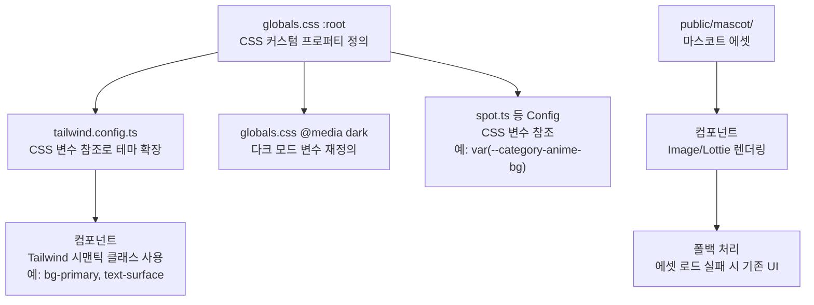
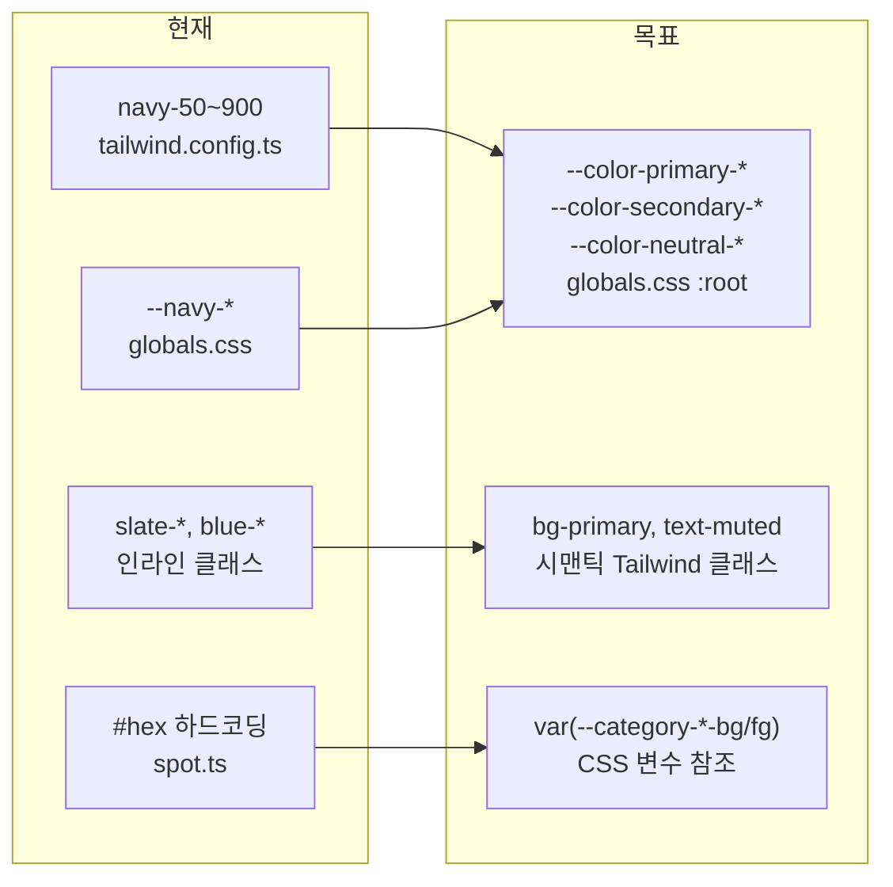

# 디자인 문서: 마스코트 기반 디자인 시스템 개편

## 개요

기존 Navy 기반 컬러 팔레트와 분산된 디자인 값을 마스코트 캐릭터에서 추출한 파스텔 톤 팔레트로 전면 교체하고, CSS 커스텀 프로퍼티 기반의 중앙 집중화된 디자인 토큰 시스템으로 재구축한다.

현재 컬러 정의가 `tailwind.config.ts` (navy 팔레트), `globals.css` (CSS 변수), `spot.ts` (하드코딩된 hex), 인라인 Tailwind 클래스 (`slate-*`, `blue-*`) 등 4곳 이상에 분산되어 있어 컬러 변경 시 다수 파일 수정이 필요하다. 이를 단일 CSS 변수 레이어로 통합하여, 값 변경 시 한 곳만 수정하면 전체 앱에 반영되는 구조를 만든다.

추가로 지도 마커, 상태 화면 일러스트, 로딩 애니메이션 등에 마스코트 에셋을 적용하여 브랜드 정체성을 완성한다.

### 핵심 설계 원칙

1. **단일 진실 원천 (Single Source of Truth)**: 모든 디자인 값은 `globals.css`의 `:root` CSS 변수에서만 정의
2. **시맨틱 네이밍**: 색상값이 아닌 용도 기반 이름 (`--color-primary`, `--color-surface`)
3. **토큰 참조 체인**: `globals.css` (값 정의) → `tailwind.config.ts` (CSS 변수 참조) → 컴포넌트 (Tailwind 클래스 사용)
4. **다크 모드 자동 대응**: `prefers-color-scheme: dark`에서 CSS 변수만 재정의
5. **에셋 폴백**: 마스코트 에셋 로드 실패 시 기존 SVG/아이콘으로 폴백

## 아키텍처

### 디자인 토큰 흐름



### 마이그레이션 전략




## 컴포넌트 및 인터페이스

### 1. 디자인 토큰 시스템 (핵심)

#### globals.css `:root` 변수 구조

시맨틱 컬러 토큰을 역할 기반으로 정의한다. 실제 hex 값은 참조용이며 사용자가 자주 변경할 수 있다. **투명도 유틸리티(bg-primary/50 등) 지원을 위해 CSS 변수에는 RGB 숫자값만 저장한다.**

```css
:root {
  /* === Primary (Crystal Blue 계열) === */
  /* ⚠️ hex 대신 RGB 숫자만 저장 (Tailwind 투명도 유틸리티 지원) */
  --color-primary-50: 230 240 250;  /* 가장 밝은 shade */
  --color-primary-100: ...;
  --color-primary-200: ...;
  --color-primary-300: ...;
  --color-primary-400: ...;
  --color-primary-500: 58 117 196;  /* 기본 Primary (#3A75C4) */
  --color-primary-600: ...;
  --color-primary-700: ...;
  --color-primary-800: ...;
  --color-primary-900: 17 24 39;    /* 가장 어두운 shade */

  /* === Secondary (Lavender Bloom 계열) === */
  --color-secondary-50: ...;
  /* ... 50~900 동일 구조 */

  /* === Neutral (Ghost Ivory, Soft Blush 계열) === */
  --color-neutral-50: ...;
  /* ... 50~900 동일 구조 */

  /* === 시맨틱 역할 토큰 === */
  --color-background: var(--color-neutral-50);    /* 주 배경 (Pure White) */
  --color-surface: var(--color-neutral-100);       /* 카드/Header 배경 (Ghost Ivory) */
  --color-accent-surface: var(--color-neutral-200);/* 강조 배경 (Soft Blush) */
  --color-text: var(--color-primary-900);          /* 기본 텍스트 (Midnight Grey) */
  --color-text-secondary: var(--color-primary-700);/* 보조 텍스트 */
  --color-muted: var(--color-neutral-400);         /* 비활성/플레이스홀더 */
  --color-border: var(--color-neutral-300);        /* 보더 */
  --color-danger: ...;                             /* 에러/삭제 */
  --color-danger-surface: ...;                     /* 에러 배경 */

  /* === 카테고리 컬러 (bg/fg 쌍) === */
  --category-anime-bg: ...;
  --category-anime-fg: ...;
  --category-sports-bg: ...;
  --category-sports-fg: ...;
  --category-movie-drama-bg: ...;
  --category-movie-drama-fg: ...;
  --category-music-bg: ...;
  --category-music-fg: ...;
  --category-game-bg: ...;
  --category-game-fg: ...;
  --category-other-bg: ...;
  --category-other-fg: ...;

  /* === 콘텐츠 타입 컬러 (bg/fg 쌍) === */
  --content-anime-bg: ...;
  --content-anime-fg: ...;
  /* ... 각 콘텐츠 타입별 동일 구조 */

  /* === 링크 타입 컬러 === */
  --link-official: ...;
  --link-ticket: ...;
  --link-schedule: ...;
  --link-sns: ...;
  --link-other: ...;

  /* === Border Radius 토큰 === */
  --radius-sm: 0.5rem;    /* 8px - 작은 요소 */
  --radius-md: 0.75rem;   /* 12px - 버튼, 입력 필드 */
  --radius-lg: 1rem;      /* 16px - 카드 */
  --radius-xl: 1.5rem;    /* 24px - 모달, 바텀시트 */
}
```

#### tailwind.config.ts 변경

```typescript
// tailwind.config.ts
// ⚠️ rgb(var(...) / <alpha-value>) 패턴으로 Tailwind 투명도 유틸리티 지원
// 예: bg-primary/50, text-primary/80 등 알파값 조합 가능
const config: Config = {
  theme: {
    extend: {
      colors: {
        primary: {
          50: 'rgb(var(--color-primary-50) / <alpha-value>)',
          // ... 100~900 동일 패턴
          DEFAULT: 'rgb(var(--color-primary-500) / <alpha-value>)',
        },
        secondary: {
          50: 'rgb(var(--color-secondary-50) / <alpha-value>)',
          // ... 100~900 동일 패턴
          DEFAULT: 'rgb(var(--color-secondary-500) / <alpha-value>)',
        },
        neutral: {
          50: 'rgb(var(--color-neutral-50) / <alpha-value>)',
          // ... 100~900 동일 패턴
        },
        // 시맨틱 역할 컬러 (동일하게 rgb() 래핑)
        background: 'rgb(var(--color-background) / <alpha-value>)',
        surface: 'rgb(var(--color-surface) / <alpha-value>)',
        'accent-surface': 'rgb(var(--color-accent-surface) / <alpha-value>)',
        'text-primary': 'rgb(var(--color-text) / <alpha-value>)',
        'text-secondary': 'rgb(var(--color-text-secondary) / <alpha-value>)',
        muted: 'rgb(var(--color-muted) / <alpha-value>)',
        border: 'rgb(var(--color-border) / <alpha-value>)',
        danger: 'rgb(var(--color-danger) / <alpha-value>)',
        'danger-surface': 'rgb(var(--color-danger-surface) / <alpha-value>)',
      },
      borderRadius: {
        sm: 'var(--radius-sm)',
        md: 'var(--radius-md)',
        lg: 'var(--radius-lg)',
        xl: 'var(--radius-xl)',
      },
    },
  },
}
```

> **투명도 유틸리티 동작 원리**: CSS 변수에 RGB 숫자만 저장(`--color-primary-500: 58 117 196`)하고, Tailwind 설정에서 `rgb(var(...) / <alpha-value>)` 패턴을 사용하면, `bg-primary/50` 같은 클래스가 `background-color: rgb(58 117 196 / 0.5)`로 컴파일된다. 이를 통해 별도의 opacity 변수 없이 모든 컬러에 투명도를 자유롭게 적용할 수 있다.

> **⚠️ 시맨틱 역할 토큰 주의**: `--color-background`, `--color-surface` 등 시맨틱 토큰이 `var(--color-neutral-50)` 같은 다른 CSS 변수를 참조하는 경우, 중첩 참조가 되어 `rgb()` 래핑이 동작하지 않을 수 있다. 이 경우 시맨틱 토큰도 직접 RGB 숫자값을 저장하거나, Tailwind에서 시맨틱 컬러는 `rgb(var(...))` 없이 `var(--color-background-rgb)` 형태의 별도 RGB 전용 변수를 사용해야 한다. 구현 시 이 부분을 검증하여 최적의 방식을 선택한다.

### 2. Header 컴포넌트 개편

현재 `slate-900` 배경 + `slate-300` 텍스트 → 시맨틱 토큰 기반으로 교체.

```
변경 전: bg-slate-900/95, text-slate-300, border-slate-700, bg-blue-600
변경 후: bg-surface/95, text-text-secondary, border-border, bg-primary
```

좌측 로고 영역에 마스코트 얼굴 아이콘 추가:
```tsx
<Link href="/" className="flex items-center gap-2">
  <Image src="/mascot/logo-face.webp" alt="마스코트" width={28} height={28} />
  <span className="text-xl font-bold text-text-primary">Not a Trip</span>
</Link>
```

### 3. 카테고리/콘텐츠 타입 Config 개편

`spot.ts`의 하드코딩된 hex 값을 CSS 변수 참조로 교체:

```typescript
// 변경 전
export const CATEGORY_CONFIG = {
  animation: { color: '#8B91B8', ... },
}

// 변경 후
export const CATEGORY_CONFIG = {
  animation: { 
    bgColor: 'var(--category-anime-bg)',
    fgColor: 'var(--category-anime-fg)',
    ...
  },
}
```

### 4. 지도 마커 개편

- **SpotPin**: 기존 SVG divIcon → 마스코트 테마 커스텀 마커 에셋. 카테고리별 색상은 Primary/Secondary 토큰 참조. 에셋 로드 실패 시 기존 SVG 핀으로 폴백.
- **CurrentLocationMarker**: 기존 파란 점 + 펄스 → 마스코트 얼굴/SD 캐릭터 에셋. 에셋 로드 실패 시 기존 파란 점으로 폴백.

### 5. 상태 화면 개편

| 컴포넌트 | 현재 | 변경 후 |
|---------|------|---------|
| EmptySearchOverlay | SearchIcon + navy 배경 | 돋보기 든 마스코트 일러스트 |
| EmptyFilterOverlay | FilterIcon + navy 배경 | 마스코트 일러스트 |
| SpotErrorDisplay | AlertTriangleIcon + navy 배경 | 당황한 마스코트 일러스트 + accent-surface 배경 |
| ErrorBoundary | AlertTriangleIcon + navy 버튼 | 당황한 마스코트 일러스트 + primary 버튼 |
| 로딩 스피너 | 회전 아이콘 | 마스코트 Lottie 애니메이션 |

### 6. Lottie 애니메이션 플레이어

번들 사이즈 최적화를 위해 `@dotlottie/react-player` (또는 `lottie-light-react`) 사용. 기존 `lottie-web` 전체 번들(~250KB) 대신 경량 플레이어(~50KB) 채택.

**`next/dynamic`을 사용한 동적 임포트**로 초기 번들에서 Lottie 플레이어를 제외하고, 로딩 중에는 CSS 스피너를 표시한다:

```tsx
// src/components/common/LottieLoader.tsx
import dynamic from 'next/dynamic'

// Lottie 플레이어를 동적 임포트 (SSR 비활성화 + CSS 스피너 로딩 폴백)
const DotLottieReact = dynamic(
  () => import('@lottiefiles/dotlottie-react').then((mod) => mod.DotLottieReact),
  {
    ssr: false,
    loading: () => (
      <div className="flex items-center justify-center" style={{ width: 120, height: 120 }}>
        <div
          className="animate-spin rounded-full border-4 border-muted border-t-primary"
          style={{ width: 40, height: 40 }}
        />
      </div>
    ),
  }
)

interface LottieLoaderProps {
  src: string
  width?: number
  height?: number
}

export function LottieLoader({ src, width = 120, height = 120 }: LottieLoaderProps) {
  return (
    <DotLottieReact
      src={src}
      loop
      autoplay
      style={{ width, height }}
    />
  )
}
```

> **동적 임포트 이점**: `next/dynamic`의 `ssr: false` 옵션으로 서버 사이드 렌더링을 건너뛰고, 클라이언트에서만 Lottie 플레이어를 로드한다. `loading` 콜백의 CSS 스피너가 플레이어 로드 완료까지 표시되어 사용자 경험을 유지한다.

### 7. 다크 모드 대응

`globals.css`의 `@media (prefers-color-scheme: dark)` 블록에서 모든 시맨틱 변수를 재정의:

```css
@media (prefers-color-scheme: dark) {
  :root {
    --color-background: /* 어두운 Primary 계열 */;
    --color-surface: /* 약간 밝은 어두운 톤 */;
    --color-text: /* 밝은 Neutral */;
    --color-muted: /* 중간 밝기 */;
    --color-border: /* 어두운 보더 */;
    /* 카테고리 컬러도 다크 모드용 대비 조정 */
    --category-anime-bg: /* 어두운 배경에서 가독성 확보 */;
    --category-anime-fg: /* WCAG AA 대비 충족 */;
    /* ... */
  }
}
```


## 데이터 모델

### 디자인 토큰 타입 정의

```typescript
// src/types/design-tokens.ts

/** 시맨틱 컬러 역할 */
export type SemanticColorRole =
  | 'background'
  | 'surface'
  | 'accent-surface'
  | 'text'
  | 'text-secondary'
  | 'muted'
  | 'border'
  | 'danger'
  | 'danger-surface'

/** 컬러 shade 단계 */
export type ColorShade = 50 | 100 | 200 | 300 | 400 | 500 | 600 | 700 | 800 | 900

/** 카테고리 컬러 토큰 (bg/fg 쌍) */
export interface CategoryColorToken {
  bgColor: string  // CSS 변수 참조 예: 'var(--category-anime-bg)'
  fgColor: string  // CSS 변수 참조 예: 'var(--category-anime-fg)'
}

/** 카테고리 Config (개편 후) */
export interface CategoryConfig {
  icon: string
  bgColor: string
  fgColor: string
  label: string
}

/** 콘텐츠 타입 Config (개편 후) */
export interface ContentTypeConfig {
  icon: string
  bgColor: string
  fgColor: string
  label: string
}

/** 링크 타입 Config (개편 후) */
export interface LinkTypeConfig {
  label: string
  icon: string
  color: string  // CSS 변수 참조
}
```

### 마스코트 에셋 경로 규약

```
public/mascot/
├── logo-face.webp          # Header 로고 옆 마스코트 얼굴 (28x28)
├── marker-default.webp     # 지도 기본 마커
├── marker-current.webp     # 현재 위치 마커
├── empty-search.webp       # 검색 결과 없음 일러스트
├── empty-filter.webp       # 필터 빈 상태 일러스트
├── error.webp              # 에러 상태 일러스트
├── loading.lottie          # 로딩 애니메이션 (dotLottie 형식)
└── loading.gif             # Lottie 폴백용 GIF
```

### 변경되는 Config 구조 (spot.ts)

```typescript
// 변경 전: 단일 color 필드 (hex 하드코딩)
export const CATEGORY_CONFIG: Record<SpotCategory, CategoryConfig> = {
  animation: { icon: '...', color: '#8B91B8', label: '애니메이션' },
}

// 변경 후: bg/fg 쌍 (CSS 변수 참조)
export const CATEGORY_CONFIG: Record<SpotCategory, CategoryConfig> = {
  animation: {
    icon: '/icons/categories/animation.webp',
    bgColor: 'var(--category-anime-bg)',
    fgColor: 'var(--category-anime-fg)',
    label: '애니메이션',
  },
  sports: {
    icon: '/icons/categories/sports.webp',
    bgColor: 'var(--category-sports-bg)',
    fgColor: 'var(--category-sports-fg)',
    label: '스포츠',
  },
  // ... 나머지 카테고리 동일 패턴
}
```


## 정확성 속성 (Correctness Properties)

*속성(Property)은 시스템의 모든 유효한 실행에서 참이어야 하는 특성 또는 동작이다. 속성은 사람이 읽을 수 있는 명세와 기계가 검증할 수 있는 정확성 보장 사이의 다리 역할을 한다.*

### Property 1: 토큰 시스템 무결성 — Tailwind 컬러 설정의 CSS 변수 참조

*For any* Tailwind 컬러 설정 항목, 해당 값은 `var(--...)` 형태의 CSS 변수 참조여야 하며, 참조된 CSS 변수는 `globals.css`의 `:root` 블록에 정의되어 있어야 하고, 변수 이름은 시맨틱 역할 기반 네이밍 패턴(`--color-*`, `--category-*`, `--content-*`, `--link-*`, `--radius-*`)을 따라야 한다.

**Validates: Requirements 1.1, 1.2, 1.5**

### Property 2: CSS 변수 변경 전파 — 단일 변경점 보장

*For any* CSS 커스텀 프로퍼티, `:root`에서 해당 변수의 값을 변경하면, 해당 변수를 참조하는 모든 Tailwind 유틸리티 클래스의 computed style이 변경된 값을 반영해야 한다.

**Validates: Requirements 1.4, 2.6**

### Property 3: 컬러 shade 완전성

*For any* 기본 컬러 팔레트(primary, secondary, neutral), 50, 100, 200, 300, 400, 500, 600, 700, 800, 900의 10개 shade가 모두 CSS 변수로 정의되어 있어야 한다.

**Validates: Requirements 2.5**

### Property 4: 레거시 컬러 참조 제거

*For any* 컴포넌트 소스 파일(`.tsx`, `.ts`, `.css`), `navy-`, `slate-`, `blue-` 접두사를 가진 하드코딩된 Tailwind 컬러 클래스 또는 CSS 변수 참조가 존재하지 않아야 한다.

**Validates: Requirements 3.1, 3.3**

### Property 5: Config 컬러 토큰화 — CSS 변수 참조 및 bg/fg 쌍

*For any* `CATEGORY_CONFIG`, `CONTENT_TYPE_CONFIG`, `LINK_TYPE_CONFIG`의 컬러 필드, 해당 값은 `var(--...)` 형태의 CSS 변수 참조여야 하며, 카테고리/콘텐츠 타입 Config는 `bgColor`와 `fgColor` 필드를 모두 포함해야 한다.

**Validates: Requirements 6.1, 6.2, 6.3, 6.4**

### Property 6: 다크 모드 시맨틱 변수 완전 재정의

*For any* `:root`에서 정의된 시맨틱 컬러 변수(`--color-*`, `--category-*-bg`, `--category-*-fg`), `@media (prefers-color-scheme: dark)` 블록에서도 해당 변수가 재정의되어 있어야 한다.

**Validates: Requirements 9.1**

### Property 7: 다크 모드 카테고리 컬러 WCAG AA 대비

*For any* 카테고리 컬러 쌍(bg/fg), 다크 모드에서의 computed 대비 비율이 WCAG AA 기준(일반 텍스트 4.5:1, 큰 텍스트 3:1) 이상이어야 한다.

**Validates: Requirements 9.5**

### Property 8: 카테고리별 마커 색상 분화

*For any* `SpotCategory`, 해당 카테고리의 SpotPin 마커는 해당 카테고리의 토큰 색상(`--category-*-bg` 또는 `--category-*-fg`)을 사용하여 렌더링되어야 하며, 서로 다른 카테고리의 마커는 시각적으로 구분 가능해야 한다.

**Validates: Requirements 12.2**


## 에러 처리

### 마스코트 에셋 로드 실패

| 에셋 | 폴백 전략 |
|------|----------|
| Header 마스코트 로고 | 기존 이모지(✈️) 또는 텍스트만 표시 |
| SpotPin 마커 에셋 | 기존 SVG divIcon으로 폴백 (현재 `createImagePinIcon` 로직 유지) |
| CurrentLocationMarker 에셋 | 기존 파란 점 + 펄스 효과로 폴백 |
| 상태 화면 일러스트 (empty, error) | 기존 아이콘 컴포넌트(SearchIcon, FilterIcon, AlertTriangleIcon)로 폴백 |
| Lottie 로딩 애니메이션 | GIF 폴백 → 최종 폴백으로 CSS 스피너 |

### 이미지 폴백 구현 패턴

```tsx
// Next.js Image onError 폴백 패턴
<Image
  src="/mascot/empty-search.webp"
  alt="검색 결과 없음"
  width={120}
  height={120}
  onError={(e) => {
    e.currentTarget.style.display = 'none'
    // 폴백 아이콘 표시 로직
  }}
/>
```

### Lottie 폴백 체인

```tsx
// LottieLoader 컴포넌트 내부에서 폴백 처리
// 1차: dotLottie (동적 임포트) → 2차: GIF → 3차: CSS 스피너
const [lottieError, setLottieError] = useState(false)

{!lottieError ? (
  <LottieLoader
    src="/mascot/loading.lottie"
    onError={() => setLottieError(true)}
  />
) : (
   {
      // CSS 스피너로 최종 폴백
      e.currentTarget.replaceWith(createCssSpinner())
    }}
  />
)}

// ※ LottieLoader 자체의 loading 콜백이 동적 임포트 중 CSS 스피너를 표시하므로,
//    Lottie 플레이어 로드 실패와 .lottie 파일 로드 실패를 구분하여 처리한다.
```

### CSS 변수 미정의 시 폴백

CSS 변수에 폴백 값을 지정하여 변수 미정의 시에도 UI가 깨지지 않도록 한다:

```css
:root {
  --color-primary-500: #7CB9E8; /* 폴백 값 포함 */
}

/* 사용 시 */
.element {
  color: var(--color-primary-500, #7CB9E8);
}
```

### 다크 모드 미지원 브라우저

`prefers-color-scheme` 미지원 브라우저에서는 라이트 모드 `:root` 값이 그대로 적용되므로 별도 처리 불필요.

## 테스트 전략

### 이중 테스트 접근법

속성 테스트(Property-Based Testing)와 단위 테스트(Unit Testing)를 병행하여 포괄적 검증을 수행한다.

### 속성 기반 테스트 (Property-Based Testing)

라이브러리: **fast-check** (이미 devDependencies에 포함)

각 속성 테스트는 최소 100회 반복 실행하며, 디자인 문서의 속성 번호를 태그로 참조한다.

| 속성 | 테스트 설명 | 태그 |
|------|-----------|------|
| Property 1 | Tailwind 컬러 설정의 모든 값이 CSS 변수 참조이고, globals.css에 정의되어 있는지 검증 | Feature: 20-mascot-design-system, Property 1: 토큰 시스템 무결성 |
| Property 2 | CSS 변수 값 변경 시 computed style 전파 검증 (JSDOM 환경) | Feature: 20-mascot-design-system, Property 2: CSS 변수 변경 전파 |
| Property 3 | 기본 컬러 팔레트별 10개 shade 존재 여부 검증 | Feature: 20-mascot-design-system, Property 3: 컬러 shade 완전성 |
| Property 4 | 소스 파일에서 레거시 컬러 참조 부재 검증 | Feature: 20-mascot-design-system, Property 4: 레거시 컬러 참조 제거 |
| Property 5 | Config 객체의 컬러 필드가 CSS 변수 참조이고 bg/fg 쌍을 가지는지 검증 | Feature: 20-mascot-design-system, Property 5: Config 컬러 토큰화 |
| Property 6 | 라이트 모드 시맨틱 변수가 다크 모드에서도 재정의되는지 검증 | Feature: 20-mascot-design-system, Property 6: 다크 모드 변수 완전 재정의 |
| Property 7 | 다크 모드 카테고리 bg/fg 대비 비율 WCAG AA 충족 검증 | Feature: 20-mascot-design-system, Property 7: 다크 모드 WCAG AA 대비 |
| Property 8 | 카테고리별 마커가 해당 토큰 색상을 사용하는지 검증 | Feature: 20-mascot-design-system, Property 8: 카테고리별 마커 색상 분화 |

### 단위 테스트 (Unit Testing)

단위 테스트는 특정 예제, 에지 케이스, 통합 포인트를 검증한다.

| 대상 | 테스트 항목 |
|------|-----------|
| Header 컴포넌트 | 시맨틱 클래스 적용 확인 (surface, text, border), 마스코트 로고 이미지 존재 확인 |
| 버튼 시스템 | Primary/Secondary/Danger 버튼의 시맨틱 클래스 확인, 호버/비활성/포커스 상태 |
| 폼/입력 필드 | border, focus, placeholder, error 상태의 시맨틱 클래스 확인 |
| 카드/배경 | background, surface, accent-surface, border 클래스 확인 |
| Bottom Navigation | surface, primary(활성), muted(비활성), border 클래스 확인 |
| globals.css | 스크롤바, 포커스, shimmer 스타일의 시맨틱 변수 참조 확인 |
| SpotPin 폴백 | 마커 에셋 로드 실패 시 기존 SVG 핀 폴백 동작 확인 |
| 상태 화면 | EmptySearchOverlay, EmptyFilterOverlay, SpotErrorDisplay, ErrorBoundary의 마스코트 일러스트 표시 확인 |
| Lottie 로딩 | 로딩 컴포넌트의 Lottie 플레이어 사용 확인, 에러 시 GIF 폴백 확인 |
| Border Radius 토큰 | --radius-sm/md/lg/xl 정의 확인 |

### 테스트 실행 설정

```bash
# 단위 테스트 + 속성 테스트 실행
npm run test -- --run

# 속성 테스트만 실행
npm run test -- --run --testPathPattern="__tests__/properties"
```

각 속성 테스트 파일에는 다음과 같은 태그 주석을 포함한다:

```typescript
// Feature: 20-mascot-design-system, Property 1: 토큰 시스템 무결성
describe('Property 1: 토큰 시스템 무결성', () => {
  it('모든 Tailwind 컬러 설정이 CSS 변수를 참조한다', () => {
    fc.assert(
      fc.property(
        fc.constantFrom(...Object.keys(tailwindColors)),
        (colorKey) => {
          // CSS 변수 참조 패턴 검증
        }
      ),
      { numRuns: 100 }
    )
  })
})
```

