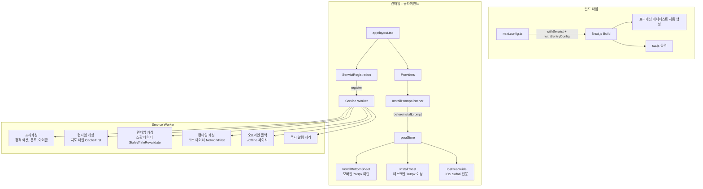
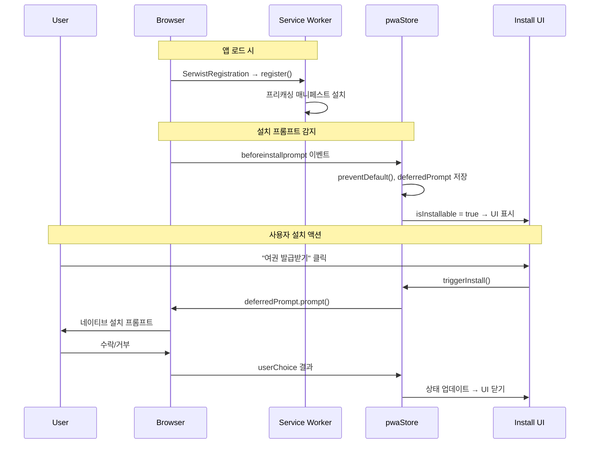
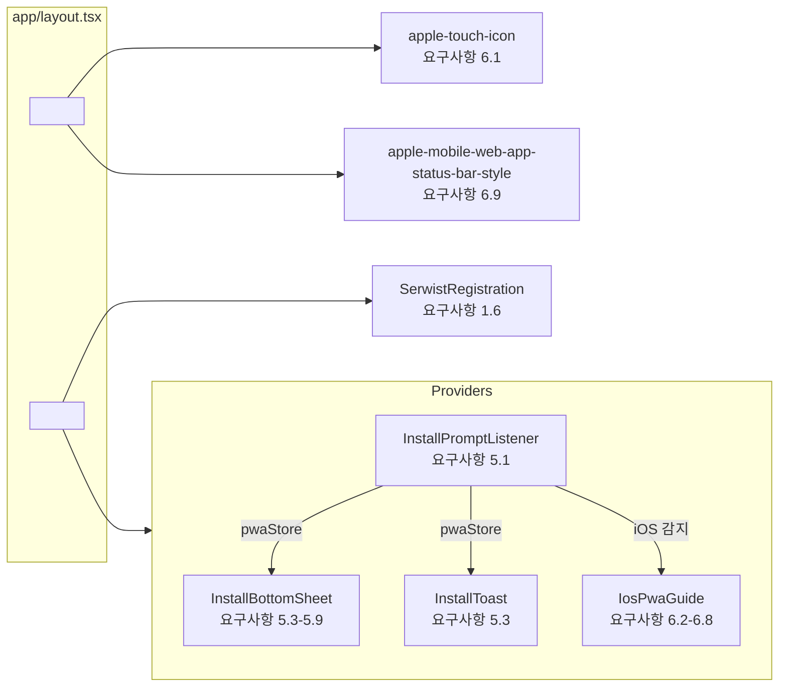

# 설계 문서: PWA Setup

## 개요

"Not a Trip" 프로젝트의 PWA 인프라를 `@serwist/next` 기반으로 전환하고, 오프라인 폴백 페이지, 커스텀 앱 설치 UX("여권 발급받기"), iOS Safari 대응 전략을 구현한다.

현재 상태:
- `public/sw.js`: 수동 작성된 Service Worker (캐싱 전략, 푸시 알림 포함)
- `public/manifest.json`: 기본 PWA 메타데이터
- `src/components/mobile/ServiceWorkerRegistrar.tsx`: 수동 SW 등록
- `src/components/mobile/IosPwaPrompt.tsx`: 기본적인 iOS 설치 안내
- `public/offline.html`: 정적 HTML 오프라인 페이지

전환 후:
- `@serwist/next`가 빌드 파이프라인에 통합되어 프리캐싱 매니페스트 자동 생성
- Next.js App Router 기반 `/offline` 페이지 (마스코트 일러스트 포함)
- Zustand 기반 `pwaStore`로 BeforeInstallPrompt 이벤트 관리
- 반응형 커스텀 설치 UI (모바일: 바텀 시트, 데스크탑: 헤더 버튼/토스트)
- 강화된 iOS Safari 단계별 설치 가이드

## 아키텍처

### 시스템 구성도



### 데이터 흐름



## 컴포넌트 및 인터페이스

### 1. next.config.ts 수정 (요구사항 1.1, 1.5)

기존 `withSentryConfig` 래퍼에 `withSerwist`를 체이닝한다.

```typescript
// next.config.ts
import withSerwistInit from '@serwist/next'
import { withSentryConfig } from '@sentry/nextjs'

const withSerwist = withSerwistInit({
  swSrc: 'src/sw.ts',        // Serwist SW 소스
  swDest: 'public/sw.js',    // 출력 경로
  disable: process.env.NODE_ENV === 'development',
})

const nextConfig: NextConfig = { /* 기존 설정 유지 */ }

// withSerwist → withSentryConfig 순서로 체이닝
export default withSentryConfig(withSerwist(nextConfig), { /* Sentry 옵션 */ })
```

### 2. Service Worker 소스 (요구사항 1.2, 1.3, 3.1-3.7)

`src/sw.ts`에 Serwist 기반 SW를 작성한다. 기존 `public/sw.js`의 캐싱 전략을 이전한다.

```typescript
// src/sw.ts
import { defaultCache } from '@serwist/next/worker'
import { Serwist } from 'serwist'
import type { PrecacheEntry, SerwistGlobalConfig } from 'serwist'

declare global {
  interface WorkerGlobalScope extends SerwistGlobalConfig {
    __SW_MANIFEST: (PrecacheEntry | string)[] | undefined
  }
}

declare const self: ServiceWorkerGlobalScope & typeof globalThis

const serwist = new Serwist({
  precacheEntries: self.__SW_MANIFEST,  // 빌드 시 자동 주입
  skipWaiting: true,
  clientsClaim: true,
  navigationPreload: true,
  runtimeCaching: [
    // 지도 타일: CacheFirst
    {
      urlPattern: /^https:\/\/(.*\.)?tile\.openstreetmap\.org/,
      handler: 'CacheFirst',
      options: {
        cacheName: 'map-tiles',
        expiration: { maxEntries: 500, maxAgeSeconds: 30 * 24 * 60 * 60 },
      },
    },
    // 스팟 데이터: StaleWhileRevalidate
    {
      urlPattern: /\/api\/spots/,
      handler: 'StaleWhileRevalidate',
      options: {
        cacheName: 'spot-data',
        expiration: { maxEntries: 100, maxAgeSeconds: 24 * 60 * 60 },
      },
    },
    // 코스 데이터: NetworkFirst
    {
      urlPattern: /\/api\/routes/,
      handler: 'NetworkFirst',
      options: {
        cacheName: 'route-data',
        networkTimeoutSeconds: 5,
      },
    },
    // 외부 타일 서버 (Carto 등): CacheFirst (요구사항 3.7)
    {
      urlPattern: /^https:\/\/.*basemaps\.cartocdn\.com/,
      handler: 'CacheFirst',
      options: {
        cacheName: 'external-tiles',
        expiration: { maxEntries: 500, maxAgeSeconds: 30 * 24 * 60 * 60 },
      },
    },
    ...defaultCache,
  ],
  fallbacks: {
    entries: [{ url: '/offline', matcher: ({ request }) => request.mode === 'navigate' }],
  },
})

serwist.addEventListeners()

// 푸시 알림 핸들러 (기존 sw.js에서 이전)
// ... push, notificationclick, message 이벤트 리스너
```

### 3. SerwistRegistration 컴포넌트 (요구사항 1.4, 1.6)

```typescript
// src/components/pwa/SerwistRegistration.tsx
'use client'

import { useEffect } from 'react'

export function SerwistRegistration() {
  useEffect(() => {
    if ('serviceWorker' in navigator) {
      navigator.serviceWorker.register('/sw.js')
    }
  }, [])
  return null
}
```

기존 `ServiceWorkerRegistrar`를 대체하여 `app/layout.tsx`에 주입한다.

### 4. pwaStore (요구사항 5.1, 5.2, 5.6, 5.8)

```typescript
// src/stores/pwaStore.ts
interface PwaState {
  deferredPrompt: BeforeInstallPromptEvent | null
  isInstallable: boolean
  isInstalled: boolean
  isDismissed: boolean
}

interface PwaStore extends PwaState {
  setDeferredPrompt: (event: BeforeInstallPromptEvent) => void
  triggerInstall: () => Promise<'accepted' | 'dismissed'>
  dismiss: () => void
  setInstalled: () => void
  reset: () => void
}
```

### 5. InstallPromptListener 컴포넌트 (요구사항 5.1)

```typescript
// src/components/pwa/InstallPromptListener.tsx
'use client'
// beforeinstallprompt 이벤트를 감지하여 pwaStore에 저장
// appinstalled 이벤트로 설치 완료 감지
// standalone 모드 감지 (display-mode: standalone)
```

### 6. InstallBottomSheet 컴포넌트 (요구사항 5.3, 5.4, 5.5, 5.7, 5.9)

모바일(768px 미만)에서 표시되는 바텀 시트. "Not a Trip 여권 발급받기 (앱 설치)" 문구 포함.

> **⚠️ Hydration 제약사항**: React Hydration 에러를 방지하기 위해, 컴포넌트 마운트 전(SSR 시점)에는 `null`을 반환해야 한다. `useEffect`가 실행되어 클라이언트 환경임이 보장된 이후에만 pwaStore 상태와 `window.matchMedia('(max-width: 767px)')`를 평가하여 렌더링한다. 서버는 유저의 화면 크기나 Standalone_Mode 여부를 알 수 없으므로, 초기 렌더링에서 조건부 UI를 출력하면 서버/클라이언트 불일치가 발생한다.

```typescript
// src/components/pwa/InstallBottomSheet.tsx 핵심 패턴
'use client'

export function InstallBottomSheet() {
  const [mounted, setMounted] = useState(false)
  
  useEffect(() => {
    setMounted(true)
  }, [])

  // SSR 시점에는 null 반환 → Hydration 불일치 방지
  if (!mounted) return null

  // 클라이언트에서만 matchMedia, pwaStore 평가
  const isMobile = window.matchMedia('(max-width: 767px)').matches
  if (!isMobile) return null
  // ... 바텀 시트 렌더링
}
```

### 7. InstallToast 컴포넌트 (요구사항 5.3)

데스크탑(768px 이상)에서 우측 하단 토스트 팝업 또는 헤더 '앱 설치' 버튼.

> **⚠️ Hydration 제약사항**: InstallBottomSheet와 동일한 패턴을 적용한다. SSR 시점에는 `null`을 반환하고, `useEffect` 이후 클라이언트에서만 `window.matchMedia('(min-width: 768px)')`를 평가하여 렌더링한다.

```typescript
// src/components/pwa/InstallToast.tsx 핵심 패턴
'use client'

export function InstallToast() {
  const [mounted, setMounted] = useState(false)
  
  useEffect(() => {
    setMounted(true)
  }, [])

  if (!mounted) return null

  const isDesktop = window.matchMedia('(min-width: 768px)').matches
  if (!isDesktop) return null
  // ... 토스트 렌더링
}
```

### 8. IosPwaGuide 컴포넌트 (요구사항 6.2-6.8)

기존 `IosPwaPrompt`를 강화. 단계별 시각적 안내, "다시 보지 않기" localStorage 저장.

### 9. 오프라인 페이지 (요구사항 4.1-4.7)

```
src/app/offline/page.tsx
```

Next.js App Router 페이지로 구현. 마스코트 일러스트(`캐릭터정면1.webp`), "네트워크가 연결되지 않았습니다" 문구, "다시 시도" 버튼, `navigator.onLine` 이벤트로 네트워크 복구 자동 감지.


### 파일 구조

```
src/
├── sw.ts                                    # Serwist SW 소스 (요구사항 1.2)
├── app/
│   ├── layout.tsx                           # SerwistRegistration 주입 (요구사항 1.6)
│   ├── offline/
│   │   └── page.tsx                         # 오프라인 폴백 페이지 (요구사항 4)
│   └── manifest.ts                          # 동적 manifest 생성 (요구사항 2.8) [선택]
├── components/
│   ├── pwa/
│   │   ├── SerwistRegistration.tsx          # SW 등록 Client Component (요구사항 1.6)
│   │   ├── InstallPromptListener.tsx        # beforeinstallprompt 감지 (요구사항 5.1)
│   │   ├── InstallBottomSheet.tsx           # 모바일 설치 바텀 시트 (요구사항 5.3-5.9)
│   │   ├── InstallToast.tsx                 # 데스크탑 설치 토스트 (요구사항 5.3)
│   │   ├── IosPwaGuide.tsx                  # iOS Safari 설치 가이드 (요구사항 6.2-6.8)
│   │   └── index.ts                         # barrel export
│   └── mobile/
│       ├── ServiceWorkerRegistrar.tsx        # [삭제 예정] → SerwistRegistration으로 대체
│       └── IosPwaPrompt.tsx                 # [삭제 예정] → IosPwaGuide로 대체
├── stores/
│   ├── pwaStore.ts                          # PWA 설치 상태 관리 (요구사항 5.2)
│   └── index.ts                             # pwaStore export 추가
└── types/
    └── pwa.d.ts                             # BeforeInstallPromptEvent 타입 선언

public/
├── sw.js                                    # [삭제 예정] → 빌드 시 자동 생성
├── manifest.json                            # 정비된 manifest (요구사항 2)
├── offline.html                             # [삭제 예정] → /offline 페이지로 대체
├── icons/
│   ├── icon-192x192.png                     # 일반 아이콘 (요구사항 2.3)
│   ├── icon-512x512.png                     # 일반 아이콘 (요구사항 2.4)
│   ├── icon-maskable-192x192.png            # Maskable 아이콘 (요구사항 2.5)
│   └── icon-maskable-512x512.png            # Maskable 아이콘 (요구사항 2.6)
└── fonts/
    └── PretendardVariable.woff2             # 프리캐싱 대상 (요구사항 3.1)
```

### 컴포넌트 통합 다이어그램



## 데이터 모델

### BeforeInstallPromptEvent 타입 (src/types/pwa.d.ts)

> **⚠️ 최신 명세 반영**: 구형 명세에서는 `userChoice`가 `{ outcome, platform }` 객체를 반환했으나, 최신 브라우저 규격(MDN)에서는 `platform` 필드가 제거되었다. 하위 호환성을 위해 `platform`을 optional로 선언한다.

```typescript
interface BeforeInstallPromptEvent extends Event {
  readonly platforms: string[]
  // 최신 명세: platform 필드 제거됨. 하위 호환을 위해 optional 처리
  readonly userChoice: Promise<{ outcome: 'accepted' | 'dismissed'; platform?: string }>
  prompt(): Promise<void>
}

declare global {
  interface WindowEventMap {
    beforeinstallprompt: BeforeInstallPromptEvent
  }
}
```

### pwaStore 상태 모델

```typescript
interface PwaState {
  /** 지연된 설치 프롬프트 이벤트 */
  deferredPrompt: BeforeInstallPromptEvent | null
  /** 설치 가능 여부 (beforeinstallprompt 수신 시 true) */
  isInstallable: boolean
  /** 설치 완료 여부 (appinstalled 이벤트 또는 standalone 모드) */
  isInstalled: boolean
  /** 사용자가 바텀 시트를 닫았는지 (세션 단위) */
  isDismissed: boolean
}
```

### Web App Manifest 스키마 (요구사항 2)

```json
{
  "name": "Not a Trip - 특별한 여행지 탐색",
  "short_name": "Not a Trip",
  "description": "애니메이션 성지순례, 영화 촬영지, 콘서트 장소 등 팬들만 아는 특별한 장소를 탐색하세요",
  "start_url": "/",
  "display": "standalone",
  "orientation": "portrait",
  "background_color": "#ffffff",
  "theme_color": "#4164a5",
  "categories": ["travel", "entertainment", "lifestyle"],
  "icons": [
    { "src": "/icons/icon-192x192.png", "sizes": "192x192", "type": "image/png", "purpose": "any" },
    { "src": "/icons/icon-512x512.png", "sizes": "512x512", "type": "image/png", "purpose": "any" },
    { "src": "/icons/icon-maskable-192x192.png", "sizes": "192x192", "type": "image/png", "purpose": "maskable" },
    { "src": "/icons/icon-maskable-512x512.png", "sizes": "512x512", "type": "image/png", "purpose": "maskable" }
  ]
}
```

### 프리캐싱 대상 에셋 목록 (요구사항 3)

| 에셋 | 경로 | 요구사항 |
|------|------|----------|
| 폰트 | `/fonts/PretendardVariable.woff2` | 3.1 |
| 마스코트 일러스트 | `/icons/raw/0329/캐릭터*.webp` | 3.2 |
| 앱 아이콘 | `/icons/icon-192x192.png`, `/icons/icon-512x512.png` | 3.4 |
| 오프라인 페이지 | `/offline` | 3.5 |
| 로딩 애니메이션 | Tailwind animate-spin (CSS 내장) | 3.3 |

> **참고**: 외부 도메인 에셋(지도 타일 등)은 프리캐싱이 아닌 런타임 캐싱으로 처리 (요구사항 3.7)

### iOS 설치 가이드 localStorage 키

```typescript
const IOS_DISMISS_KEY = 'not-a-trip-ios-guide-dismissed' // 요구사항 6.5, 6.6
```


## 정확성 속성 (Correctness Properties)

*속성(Property)은 시스템의 모든 유효한 실행에서 참이어야 하는 특성 또는 동작이다. 속성은 사람이 읽을 수 있는 명세와 기계가 검증할 수 있는 정확성 보장 사이의 다리 역할을 한다.*

### Property 1: pwaStore 상태 전이 일관성

*For any* BeforeInstallPromptEvent 객체가 pwaStore에 저장될 때, `isInstallable`은 반드시 `true`가 되어야 하고, `deferredPrompt`는 해당 이벤트 객체를 참조해야 한다. 또한 초기 상태에서 `isInstallable`은 `false`이고 `deferredPrompt`는 `null`이어야 한다.

**Validates: Requirements 5.1, 5.2**

### Property 2: userChoice 결과에 따른 상태 업데이트

*For any* userChoice 결과(`'accepted'` 또는 `'dismissed'`), `triggerInstall()` 호출 후 `'accepted'`이면 `isInstalled`가 `true`로, `deferredPrompt`가 `null`로 설정되어야 하고, `'dismissed'`이면 `isInstalled`는 `false`를 유지하고 `deferredPrompt`가 `null`로 설정되어야 한다.

**Validates: Requirements 5.6**

### Property 3: standalone 모드에서 설치 UI 미표시

*For any* 환경에서 `display-mode: standalone`이 활성화되어 있을 때, 설치 관련 UI(InstallBottomSheet, InstallToast, IosPwaGuide) 컴포넌트는 렌더링 결과가 `null`이어야 한다.

**Validates: Requirements 5.8, 6.7**

### Property 4: iOS Safari UA 감지 정확성

*For any* User-Agent 문자열에 대해, iOS Safari 감지 함수는 `iphone`, `ipad`, `ipod` 키워드가 포함된 UA에서만 `true`를 반환해야 하며, Android, Chrome, Firefox 등 비-iOS UA에서는 `false`를 반환해야 한다.

**Validates: Requirements 6.2**

### Property 5: dismiss 상태 localStorage 영속성

*For any* dismiss 액션 후, localStorage에 dismiss 키가 `'true'`로 저장되어야 하고, 이후 컴포넌트 재마운트 시 가이드가 표시되지 않아야 한다. 반대로 localStorage에 dismiss 키가 없거나 `'true'`가 아닌 경우, iOS Safari 환경에서 가이드가 표시되어야 한다.

**Validates: Requirements 6.5, 6.6**

## 에러 처리

### Service Worker 등록 실패

- `navigator.serviceWorker`가 지원되지 않는 브라우저에서는 SW 등록을 건너뛴다
- 등록 실패 시 `console.error`로 로깅하되, 앱 동작에는 영향을 주지 않는다
- Sentry에 에러를 보고하여 모니터링한다

### BeforeInstallPromptEvent 미지원

- iOS Safari, Firefox 등 `beforeinstallprompt`를 지원하지 않는 브라우저에서는 `pwaStore.isInstallable`이 `false`로 유지된다
- iOS Safari에서는 별도의 `IosPwaGuide` 컴포넌트가 수동 설치 방법을 안내한다

### 오프라인 폴백

- 네비게이션 요청 실패 시 프리캐시된 `/offline` 페이지로 폴백한다
- API 요청 실패 시 캐시된 데이터가 있으면 반환하고, 없으면 503 응답을 반환한다
- 지도 타일 요청 실패 시 빈 응답(408)을 반환한다

### manifest.json 로드 실패

- manifest.json이 로드되지 않아도 앱 자체는 정상 동작한다
- PWA 설치 기능만 비활성화된다

### localStorage 접근 실패

- 시크릿 모드 등에서 localStorage 접근이 차단될 수 있다
- try-catch로 감싸서 실패 시 기본값(미dismiss 상태)을 사용한다

## 테스팅 전략

### 속성 기반 테스트 (Property-Based Testing)

라이브러리: `fast-check` (이미 devDependencies에 설치됨)

각 속성 테스트는 최소 100회 반복 실행하며, 설계 문서의 속성 번호를 태그로 참조한다.

| 속성 | 테스트 대상 | 태그 |
|------|------------|------|
| Property 1 | pwaStore 상태 전이 | Feature: pwa-setup, Property 1: pwaStore 상태 전이 일관성 |
| Property 2 | triggerInstall() 결과 처리 | Feature: pwa-setup, Property 2: userChoice 결과에 따른 상태 업데이트 |
| Property 3 | standalone 모드 UI 숨김 | Feature: pwa-setup, Property 3: standalone 모드에서 설치 UI 미표시 |
| Property 4 | iOS Safari UA 감지 | Feature: pwa-setup, Property 4: iOS Safari UA 감지 정확성 |
| Property 5 | localStorage dismiss 영속성 | Feature: pwa-setup, Property 5: dismiss 상태 localStorage 영속성 |

### 단위 테스트 (Unit Tests)

단위 테스트는 특정 예제와 엣지 케이스에 집중한다.

| 테스트 대상 | 검증 내용 | 요구사항 |
|------------|----------|----------|
| manifest.json 필드 검증 | name, short_name, theme_color, display, orientation, start_url, icons 배열 | 2.1-2.7 |
| 오프라인 페이지 렌더링 | "네트워크가 연결되지 않았습니다" 문구, 마스코트 이미지, "다시 시도" 버튼 | 4.1-4.4 |
| 오프라인 페이지 네트워크 복구 감지 | online 이벤트 발생 시 UI 업데이트 | 4.7 |
| InstallBottomSheet 렌더링 | "여권 발급받기" 문구, 설치 버튼, 닫기 버튼 | 5.4, 5.7 |
| InstallBottomSheet prompt() 호출 | 설치 버튼 클릭 시 deferredPrompt.prompt() 호출 | 5.5 |
| IosPwaGuide 렌더링 | 공유 버튼 아이콘, 단계별 안내, "다시 보지 않기" 옵션 | 6.3-6.5 |
| layout.tsx head 태그 | apple-touch-icon, apple-mobile-web-app-status-bar-style 메타 태그 | 6.1, 6.9 |
| 런타임 캐싱 설정 | 외부 타일 도메인 패턴이 runtimeCaching에 포함 | 3.7 |

### 테스트 설정

- 속성 테스트: `fast-check` 라이브러리 사용, 각 테스트 최소 100회 반복
- 단위 테스트: `jest` + `@testing-library/react`
- 각 속성 테스트에는 설계 문서 속성 번호를 주석으로 태그
  - 형식: `// Feature: pwa-setup, Property {number}: {property_text}`
- 각 정확성 속성은 반드시 하나의 속성 기반 테스트로 구현

