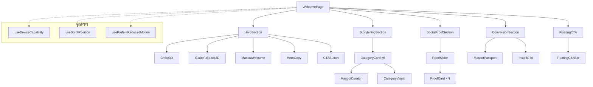
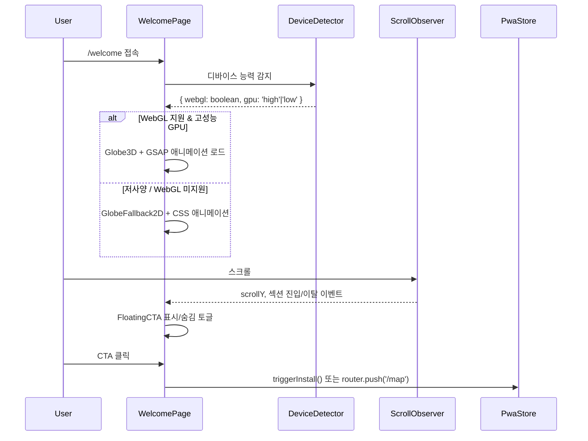

# 설계 문서: 랜딩 페이지 (Landing Page)

## 개요

"Not a Trip" 서비스의 신규 사용자 전용 랜딩 페이지를 설계한다. `/welcome` 경로에서 제공되며, 기존 지도 메인 페이지(`/`)는 `/map` 경로로 이전한다. 페이지는 4개의 핵심 섹션(히어로, 카테고리 스토리텔링, 소셜 프루프, 전환 영역)으로 구성되며, WebGL 기반 3D 지구본과 GSAP ScrollTrigger 기반 스크롤 애니메이션을 활용한다. 저사양 기기를 위한 2D 폴백 레이아웃을 필수로 포함하고, 기존 PWA 설치 바텀 시트 및 마스코트 디자인 시스템과 연동한다.

### 핵심 설계 결정

1. **3D 지구본**: `@react-three/fiber` + `@react-three/drei` 선택. Three.js 직접 사용 대비 React 생태계 통합이 우수하고, dynamic import로 번들 분리가 용이함
2. **스크롤 애니메이션**: GSAP ScrollTrigger 선택. Framer Motion 대비 3D transform 성능이 우수하고, 팝업북 스타일의 복잡한 타임라인 제어에 적합. `will-change: transform` 및 `translate3d(0,0,0)` 하드웨어 가속 강제 적용
3. **라우트 구조**: Next.js App Router의 Route Groups를 활용하여 `(landing)/welcome`과 `(main)/map`으로 분리. 루트 `/`는 `middleware.ts`에서 쿠키(`has_visited`) 기반으로 분기 — 신규 유저는 `/welcome`, 기존 유저는 `/map`으로 리다이렉트
4. **디바이스 감지**: WebGL 컨텍스트 생성 + `WEBGL_debug_renderer_info` 확장으로 GPU 성능 판별. 결과를 `sessionStorage`에 캐싱. SSR 시에는 무조건 2D Fallback 상태를 반환하고, 클라이언트 마운트 완료 후(`useEffect`)에만 sessionStorage에 접근하여 Hydration 에러를 방지
5. **GSAP React 통합**: `@gsap/react`의 `useGSAP()` 훅을 필수 사용하여 React 18 Strict Mode 및 Next.js 환경에서의 ScrollTrigger 중복 등록, 언마운트 시 클린업 누수 문제를 자동 해결
6. **다크모드 고정**: 랜딩 페이지(`/welcome`)는 라이트/다크 모드 구분 없이 항상 다크 모드 테마로 렌더링한다. `(landing)` Route Group의 layout에서 `dark` 클래스를 강제 적용하여 모든 하위 컴포넌트가 다크 모드 CSS 변수를 사용하도록 한다. 3D 지구본, 스크롤 애니메이션, 소셜 프루프 등 모든 섹션에 동일하게 적용된다.

## 아키텍처

### 라우트 구조 변경

```
src/
├── middleware.ts              # 루트(/) 접속 시 쿠키 기반 분기 리다이렉트
├── app/
│   ├── (landing)/
│   │   └── welcome/
│   │       └── page.tsx      # 랜딩 페이지 (신규)
│   ├── (main)/
│   │   └── map/
│   │       └── page.tsx      # 기존 지도 페이지 (이전)
│   ├── layout.tsx            # 공통 루트 레이아웃 (유지)
│   └── ...
```

#### 루트 경로 분기 로직 (middleware.ts)

```typescript
// src/middleware.ts
import { NextResponse } from 'next/server'
import type { NextRequest } from 'next/server'

export function middleware(request: NextRequest) {
  // 루트 경로(/)에만 적용
  if (request.nextUrl.pathname === '/') {
    const hasVisited = request.cookies.get('has_visited')?.value
    if (hasVisited === 'true') {
      return NextResponse.redirect(new URL('/map', request.url))
    }
    return NextResponse.redirect(new URL('/welcome', request.url))
  }
}

export const config = { matcher: ['/'] }
```

- `/welcome` 페이지에서 CTA 클릭 또는 페이지 이탈 시 `has_visited=true` 쿠키를 설정
- PWA `start_url`은 `/`로 유지하여 middleware가 자동 분기 처리
- 쿠키 만료: 365일 (1년간 재방문 시 랜딩 페이지 스킵)

### 컴포넌트 계층 구조



### 데이터 흐름



## 컴포넌트 및 인터페이스

### 페이지 컴포넌트

```typescript
// src/app/(landing)/welcome/page.tsx
// 서버 컴포넌트 — 메타데이터 제공, 클라이언트 컴포넌트 렌더링
export default function WelcomePage() // metadata export 포함
```

```typescript
// src/components/landing/WelcomePageClient.tsx
'use client'
interface WelcomePageClientProps {}
// useDeviceCapability, useScrollPosition, usePrefersReducedMotion 훅 사용
// 디바이스 능력에 따라 3D/2D 분기 렌더링
```

### 히어로 섹션

```typescript
// src/components/landing/HeroSection.tsx
interface HeroSectionProps {
  isHighEnd: boolean        // 고성능 디바이스 여부
  reducedMotion: boolean    // prefers-reduced-motion 활성화 여부
}

// src/components/landing/Globe3D.tsx (dynamic import)
interface Globe3DProps {
  dataPoints: GlobeDataPoint[]  // 성지순례 포인트 좌표
  className?: string
}

interface GlobeDataPoint {
  lat: number
  lng: number
  label: string
  category: SpotCategory
}

// src/components/landing/GlobeFallback2D.tsx
interface GlobeFallback2DProps {
  className?: string
}

// src/components/landing/CTAButton.tsx
interface CTAButtonProps {
  label: string             // "지도 탐색하기" | "성지순례 시작하기"
  href: string              // "/map"
  variant?: 'primary' | 'secondary'
  size?: 'md' | 'lg'
}
```

### 스토리텔링 섹션

```typescript
// src/components/landing/StorytellingSection.tsx
// ⚠️ GSAP 애니메이션은 반드시 @gsap/react의 useGSAP() 훅 내에서 실행한다.
// React 18 Strict Mode에서 ScrollTrigger 중복 등록 및 언마운트 시 클린업 누수를 자동 방지.
// 예시:
// import { useGSAP } from '@gsap/react'
// useGSAP(() => {
//   gsap.to('.card', { scrollTrigger: { ... }, rotateX: 15, ... })
// }, { scope: containerRef }) // scope 지정으로 컨텍스트 자동 정리
interface StorytellingSectionProps {
  isHighEnd: boolean
  reducedMotion: boolean
}

// src/components/landing/CategoryCard.tsx
interface CategoryCardProps {
  category: SpotCategory
  title: string
  description: string
  mascotProp: string        // 마스코트 소품 이미지 경로
  spotImage: string         // 대표 스팟 이미지 경로
  index: number             // 애니메이션 순서
  isHighEnd: boolean
  reducedMotion: boolean
}

// 카테고리 설정 데이터
interface CategoryStoryConfig {
  category: SpotCategory
  title: string
  description: string
  mascotProp: string        // 돋보기, 응원봉, 헤드폰 등
  spotImage: string
  colorToken: string        // CSS 변수명 (--category-anime-bg 등)
}
```

### 소셜 프루프 섹션

```typescript
// src/components/landing/SocialProofSection.tsx
interface SocialProofSectionProps {}

// src/components/landing/ProofCard.tsx
interface ProofCardProps {
  categoryTag: string
  spotName: string
  comment: string
  image?: string            // 인증샷 또는 마스코트 일러스트
}

// 더미 데이터 타입
interface ProofData {
  id: string
  categoryTag: SpotCategory
  spotName: string
  comment: string
  image: string
}
```

### 전환 영역 및 플로팅 CTA

```typescript
// src/components/landing/ConversionSection.tsx
interface ConversionSectionProps {
  isStandalone: boolean     // PWA standalone 모드 여부
}

// src/components/landing/FloatingCTA.tsx
// ⚠️ 모바일 브라우저 툴바 및 아이폰 홈 인디케이터와의 겹침 방지를 위해
// pb-[env(safe-area-inset-bottom)] (또는 pb-safe-bottom Tailwind 유틸리티) 클래스 적용 필수
interface FloatingCTAProps {
  visible: boolean          // Hero 이탈 후 ~ Conversion 진입 전
  isStandalone: boolean
  onInstallClick: () => void
  onExploreClick: () => void
}
// 레이아웃 제약: fixed bottom-0 inset-x-0 z-40 pb-safe-bottom
```

### 커스텀 훅

```typescript
// src/hooks/useDeviceCapability.ts
interface DeviceCapability {
  webglSupported: boolean
  gpuTier: 'high' | 'low'
  isHighEnd: boolean        // webglSupported && gpuTier === 'high'
  isReady: boolean          // 클라이언트 마운트 완료 여부 (SSR 시 false)
}
function useDeviceCapability(): DeviceCapability
// ⚠️ SSR/Hydration 안전 설계:
// - 초기 SSR 렌더링 시 { webglSupported: false, gpuTier: 'low', isHighEnd: false, isReady: false } 반환
// - useEffect 내에서만 sessionStorage 접근 및 WebGL 감지 수행
// - isReady가 false인 동안 2D Fallback(또는 Skeleton)을 표시하여 Hydration Mismatch 방지
// - isReady가 true로 전환된 후 3D/2D 모드 결정

// src/hooks/useScrollPosition.ts
interface ScrollState {
  scrollY: number
  heroExited: boolean       // Hero 섹션이 뷰포트를 벗어났는지
  conversionVisible: boolean // Conversion 섹션이 뷰포트에 진입했는지
}
function useScrollPosition(refs: {
  heroRef: RefObject<HTMLElement>
  conversionRef: RefObject<HTMLElement>
}): ScrollState

// src/hooks/usePrefersReducedMotion.ts
function usePrefersReducedMotion(): boolean
```

## 데이터 모델

### 디바이스 능력 감지 결과

```typescript
interface DeviceCapabilityResult {
  webglSupported: boolean
  gpuRenderer: string       // WEBGL_debug_renderer_info에서 추출
  gpuTier: 'high' | 'low'
}
```

감지 로직:
1. `document.createElement('canvas').getContext('webgl')` 시도
2. 성공 시 `WEBGL_debug_renderer_info` 확장에서 GPU 렌더러 문자열 추출
3. 알려진 저성능 GPU 키워드(`SwiftShader`, `llvmpipe`, `Software`, `Microsoft Basic Render`) 매칭
4. 결과를 `sessionStorage.setItem('device-capability', JSON.stringify(result))`로 캐싱

### Globe 데이터 포인트

```typescript
// 더미 데이터 — 실제 스팟 DB 연동 전 사용
const GLOBE_DATA_POINTS: GlobeDataPoint[] = [
  { lat: 35.6762, lng: 139.6503, label: '도쿄', category: 'animation' },
  { lat: 34.6937, lng: 135.5023, label: '오사카', category: 'movie_drama' },
  { lat: 37.5665, lng: 126.9780, label: '서울', category: 'music' },
  // ... 전 세계 주요 성지순례 포인트
]
```

### 소셜 프루프 더미 데이터

```typescript
const PROOF_DUMMY_DATA: ProofData[] = [
  {
    id: '1',
    categoryTag: 'animation',
    spotName: '스즈미야 하루히 성지',
    comment: '실제로 가보니 감동이었어요!',
    image: '/mascot/proof-anime.webp',
  },
  // ... 6~8개 더미 카드
]
```

### 카테고리 스토리 설정

```typescript
const CATEGORY_STORIES: CategoryStoryConfig[] = [
  {
    category: 'animation',
    title: '애니메이션 성지순례',
    description: '좋아하는 작품 속 그 장소를 직접 걸어보세요',
    mascotProp: '/mascot/prop-magnifier.webp',
    spotImage: '/landing/spot-anime.webp',
    colorToken: 'category-anime',
  },
  {
    category: 'sports',
    title: '스포츠 직관 여행',
    description: '경기장의 열기를 현장에서 느껴보세요',
    mascotProp: '/mascot/prop-cheerstick.webp',
    spotImage: '/landing/spot-sports.webp',
    colorToken: 'category-sports',
  },
  // ... movie_drama, music, game, other
]
```


## 정확성 속성 (Correctness Properties)

*속성(Property)은 시스템의 모든 유효한 실행에서 참이어야 하는 특성 또는 동작이다. 속성은 사람이 읽을 수 있는 명세와 기계가 검증할 수 있는 정확성 보장 사이의 다리 역할을 한다.*

### Property 1: 카테고리 "더 보기" 링크 라우팅 정확성

*For any* `SpotCategory` 값에 대해, 해당 카테고리의 "더 보기" 링크가 생성하는 URL은 반드시 `/map?category={category}` 형식이어야 하며, category 파라미터는 입력된 SpotCategory 값과 동일해야 한다.

**Validates: Requirements 2.8**

### Property 2: ProofCard 필수 정보 포함

*For any* 유효한 `ProofData` 객체에 대해, `ProofCard` 컴포넌트의 렌더링 결과는 반드시 `categoryTag`, `spotName`, `comment` 텍스트를 모두 포함해야 한다.

**Validates: Requirements 3.5**

### Property 3: FloatingCTA 표시 조건 불변식

*For any* 스크롤 상태 `{ heroExited: boolean, conversionVisible: boolean }`에 대해, `FloatingCTA`의 `visible` 값은 반드시 `heroExited && !conversionVisible`과 동일해야 한다.

**Validates: Requirements 4.5**

### Property 4: Standalone 모드 전환 영역 조건부 렌더링

*For any* `isStandalone` 상태에 대해, `isStandalone === true`이면 `ConversionSection`은 PWA 설치 유도 요소를 렌더링하지 않고 "지도 탐색하기" CTA만 렌더링해야 한다.

**Validates: Requirements 4.7**

### Property 5: 디바이스 능력 기반 렌더링 모드 분기

*For any* `DeviceCapability` 조합 `{ webglSupported, gpuTier }`에 대해:
- `webglSupported === true && gpuTier === 'high'`이면 `Globe3D` 컴포넌트와 GSAP 스크롤 애니메이션이 로드되어야 한다
- 그 외의 경우 `GlobeFallback2D` 컴포넌트와 CSS 페이드인/슬라이드인 애니메이션이 적용되어야 한다

**Validates: Requirements 5.2, 5.3**

### Property 6: 디바이스 감지 결과 세션 캐싱 라운드 트립

*For any* `DeviceCapabilityResult` 객체에 대해, `detectDeviceCapability()` 함수가 결과를 `sessionStorage`에 저장한 후, 동일 함수를 다시 호출하면 캐시에서 읽어온 결과가 원본과 동일해야 한다.

**Validates: Requirements 5.6**

### Property 7: 이미지 alt 텍스트 존재

*For any* 랜딩 페이지에서 렌더링되는 `` 요소에 대해, `alt` 속성이 반드시 존재하고 빈 문자열이 아니어야 한다.

**Validates: Requirements 7.3**

### Property 8: prefers-reduced-motion 시 애니메이션 비활성화

*For any* `reducedMotion === true` 상태에서, 랜딩 페이지의 모든 섹션은 GSAP ScrollTrigger 애니메이션을 실행하지 않고 정적 레이아웃을 표시해야 한다.

**Validates: Requirements 7.6**

## 에러 처리

### WebGL 초기화 실패

| 상황 | 처리 |
|------|------|
| WebGL 컨텍스트 생성 실패 | `GlobeFallback2D` 자동 전환, 콘솔 경고 로그 |
| `WEBGL_debug_renderer_info` 미지원 | GPU 티어를 `'low'`로 기본 설정 |
| Three.js/R3F 로딩 실패 | dynamic import의 `loading` 폴백 → `GlobeFallback2D` 표시 |

### GSAP 로딩 실패

| 상황 | 처리 |
|------|------|
| GSAP dynamic import 실패 | CSS `@keyframes` 기반 페이드인 애니메이션으로 폴백 |
| ScrollTrigger 초기화 에러 | 애니메이션 없이 정적 레이아웃 표시 |

### PWA 연동 에러

| 상황 | 처리 |
|------|------|
| `pwaStore.triggerInstall()` 실패 | 에러 무시, "지도 탐색하기" CTA로 폴백 |
| `Install_Bottom_Sheet` 렌더링 실패 | 기존 브라우저 설치 프롬프트 허용 |

### 이미지 로딩 실패

| 상황 | 처리 |
|------|------|
| 마스코트 일러스트 로딩 실패 | Next.js Image의 `onError`로 플레이스홀더 표시 |
| 카테고리 스팟 이미지 로딩 실패 | 카테고리 컬러 배경의 텍스트 카드로 폴백 |

### 라우팅 에러

| 상황 | 처리 |
|------|------|
| `/map` 라우트 미존재 (마이그레이션 전) | `router.push('/')` 폴백 |
| 클라이언트 사이드 라우팅 실패 | `window.location.href` 폴백 |
| `has_visited` 쿠키 읽기 실패 (middleware) | 신규 유저로 간주하여 `/welcome`으로 리다이렉트 |
| `has_visited` 쿠키 설정 실패 (클라이언트) | 다음 방문 시 다시 랜딩 페이지 노출 (치명적이지 않음) |

## 테스팅 전략

### 테스트 프레임워크

- **단위 테스트**: Jest + @testing-library/react (기존 프로젝트 설정 활용)
- **속성 기반 테스트 (PBT)**: fast-check (기존 프로젝트에 설치됨)
- **PBT 설정**: 각 속성 테스트는 최소 100회 반복 실행

### 단위 테스트 (예시 및 엣지 케이스)

| 테스트 대상 | 검증 내용 | 관련 요구사항 |
|------------|----------|-------------|
| `HeroSection` 렌더링 | 가치 제안 카피, CTA 버튼, 마스코트 이미지 존재 확인 | 1.1, 1.5, 1.6 |
| `CTAButton` 클릭 | `/map`으로 라우팅 발생 확인 | 1.8 |
| `StorytellingSection` 렌더링 | 6개 카테고리 섹션 모두 렌더링 확인 | 2.1 |
| `CategoryCard` 마스코트 소품 | 각 카테고리별 올바른 소품 이미지 매핑 확인 | 2.4, 2.5 |
| `SocialProofSection` 더미 폴백 | 실제 데이터 없을 때 더미 카드 표시 확인 | 3.2 |
| `ConversionSection` 설치 연동 | 설치 버튼 클릭 시 `pwaStore.triggerInstall()` 호출 확인 | 4.3 |
| `detectDeviceCapability()` | WebGL 미지원 시 `{ webglSupported: false }` 반환 확인 | 5.1 |
| `FallbackLayout` 핵심 콘텐츠 | 폴백 모드에서도 모든 섹션 렌더링 확인 | 5.4 |
| 시맨틱 HTML | `section`, `header` 등 시맨틱 태그 사용 확인 | 7.4 |
| CTA 키보드 접근성 | 탭 키로 CTA 버튼 포커스 가능 확인 | 7.5 |

### 속성 기반 테스트 (PBT)

각 속성 테스트는 설계 문서의 속성 번호를 참조하며, 다음 태그 형식을 사용한다:
**Feature: landing-page, Property {number}: {property_text}**

| 속성 | 테스트 전략 | 생성기 |
|------|-----------|--------|
| Property 1: 카테고리 링크 라우팅 | 임의의 SpotCategory 생성 → URL 생성 함수 호출 → `/map?category={category}` 형식 검증 | `fc.constantFrom('animation', 'sports', 'movie_drama', 'music', 'game', 'other')` |
| Property 2: ProofCard 필수 정보 | 임의의 ProofData 생성 → 렌더링 → 텍스트 포함 검증 | `fc.record({ categoryTag: fc.constantFrom(...), spotName: fc.string({minLength:1}), comment: fc.string({minLength:1}), ... })` |
| Property 3: FloatingCTA 표시 조건 | 임의의 `{ heroExited, conversionVisible }` 불리언 쌍 생성 → visible 계산 → `heroExited && !conversionVisible` 검증 | `fc.record({ heroExited: fc.boolean(), conversionVisible: fc.boolean() })` |
| Property 4: Standalone 조건부 렌더링 | `isStandalone: true/false` 생성 → ConversionSection 렌더링 → 설치 요소 존재 여부 검증 | `fc.boolean()` |
| Property 5: 디바이스 능력 분기 | 임의의 DeviceCapability 생성 → 렌더링 모드 결정 함수 호출 → 올바른 모드 반환 검증 | `fc.record({ webglSupported: fc.boolean(), gpuTier: fc.constantFrom('high', 'low') })` |
| Property 6: 감지 결과 캐싱 라운드 트립 | 임의의 DeviceCapabilityResult 생성 → sessionStorage 저장 → 재호출 → 동일 결과 검증 | `fc.record({ webglSupported: fc.boolean(), gpuRenderer: fc.string(), gpuTier: fc.constantFrom('high', 'low') })` |
| Property 7: 이미지 alt 텍스트 | 랜딩 페이지 렌더링 후 모든 img 요소의 alt 속성 비어있지 않음 검증 | 렌더링 기반 (생성기 불필요) |
| Property 8: reduced-motion 비활성화 | `reducedMotion: true` 상태에서 렌더링 → GSAP 관련 클래스/속성 부재 검증 | `fc.boolean()` (reducedMotion 상태) |

### 테스트 파일 구조

```
src/
├── components/landing/__tests__/
│   ├── HeroSection.test.tsx
│   ├── StorytellingSection.test.tsx
│   ├── SocialProofSection.test.tsx
│   ├── ConversionSection.test.tsx
│   ├── FloatingCTA.test.tsx
│   └── CTAButton.test.tsx
├── hooks/__tests__/
│   ├── useDeviceCapability.test.ts
│   └── useScrollPosition.test.ts
└── lib/__tests__/
    └── deviceCapability.pbt.test.ts   # PBT 전용
```
