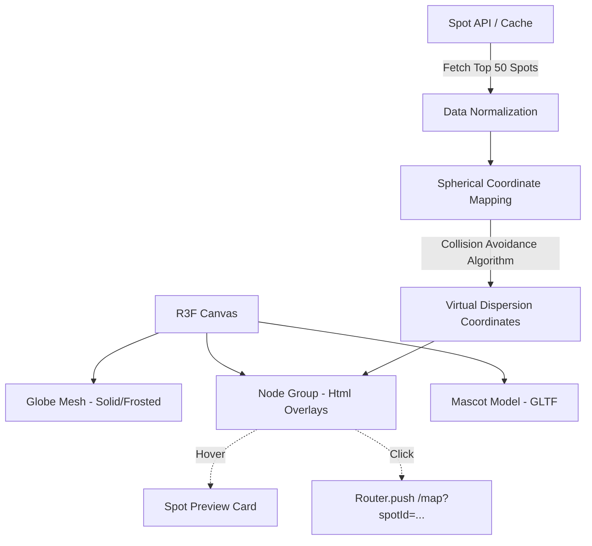

# Design Document: Interactive 3D Globe Component (`Globe3D`)

## Overview

랜딩 페이지 히어로 섹션의 핵심 비주얼인 `Globe3D` 컴포넌트를 설계한다. 이 지구본은 단순한 배경이 아니라 사용자와 상호작용하는 3D 인터랙티브 오브젝트다. 
주요 특징으로 1) 솔리드(Solid) 기반의 고급스러운 재질(MeshPhysicalMaterial) 적용, 2) 전체 데이터가 아닌 인기/조회수 기준 상위 N개의 데이터만 추출하여 노드로 렌더링, 3) 노드 간 겹침 방지를 위한 가상 분산 좌표계(Aesthetic Dispersion) 적용, 4) 섬네일 기반 핀 마커 및 호버/클릭 상호작용, 5) 구체 위를 걷는 마스코트 3D 모델(GLTF) 연동을 포함한다.

## Architecture

### 기술 스택
- **렌더러:** `@react-three/fiber` (R3F)
- **카메라/컨트롤:** `@react-three/drei` (`OrbitControls`, `PerspectiveCamera`)
- **HTML 오버레이:** `@react-three/drei` (`Html` 컴포넌트를 이용해 3D 공간 위에 DOM 섬네일 렌더링)
- **모델링 로더:** `useGLTF`, `useAnimations` (마스코트 3D 모델 로드)

### 데이터 및 렌더링 파이프라인


## Components and Interfaces

### 1. `Globe3D` 최상위 컴포넌트
Three.js Canvas를 초기화하고 하위 요소들을 그룹화한다.

```typescript
// src/components/landing/globe/Globe3D.tsx
import { Canvas } from '@react-three/fiber'
import { OrbitControls, Environment } from '@react-three/drei'

interface Globe3DProps {
  spots: SpotData[]       // 인기순 정렬된 상위 최대 50개의 스팟 데이터
  globeStyle?: 'solid' | 'frosted' // 추후 디자인 확장을 위한 프랍 (기본값 solid)
}

// Canvas 내부에는 Three.js 요소만 렌더링된다.
```

### 2. `GlobeMesh` (지구본 구체 본체)
색이 채워진(Solid) 형태를 기본으로 하되, 조명에 예쁘게 반응하는 재질을 사용한다.

```typescript
// src/components/landing/globe/GlobeMesh.tsx
// <Sphere args={[radius, 64, 64]}>
// Material: <meshPhysicalMaterial roughness={0.4} metalness={0.1} color="#e5e7eb" ... />
// 기능: 
// 1. useFrame을 이용한 느린 자동 회전 (autoRotate)
// 2. 사용자가 드래그(OrbitControls)할 때 자동 회전 일시 정지
```

### 3. `SpotNodeManager` 및 `SpotPin` (마커/노드)
실제 지리적 좌표(Lat/Lng)가 좁은 지역(예: 일본, 한국)에 몰려 겹치는 현상을 방지하기 위해 가상 좌표로 분산시킨다.

```typescript
// src/components/landing/globe/SpotPin.tsx
import { Html } from '@react-three/drei'

interface SpotPinProps {
  spot: SpotData
  position: [number, number, number] // 분산 알고리즘이 적용된 가상 3D 좌표 (x, y, z)
  thumbnailType: 'mascot_face' | 'category_icon' | 'spot_image'
}

// 상호작용 (Interaction):
// 1. Default: 작은 둥근 핀 (카테고리 아이콘 또는 마스코트 얼굴)
// 2. Hover (onPointerOver): 핀이 약간 커지며, 3D 공간 위에 HTML <SpotPreviewCard> 툴팁 노출
// 3. Click (onClick): 해당 스팟을 포커스한 상태로 지도 페이지로 라우팅 (/map?spotId=123)
```

### 4. `MascotWalker` (마스코트 상호작용)
지구본 북극(12시 방향) 또는 적도를 따라 걷는 마스코트 애니메이션.

```typescript
// src/components/landing/globe/MascotWalker.tsx
import { useGLTF, useAnimations } from '@react-three/drei'

interface MascotWalkerProps {
  globeRadius: number
  walkSpeed: number // 스크롤 속도에 비례하여 걷는 애니메이션 배속 처리
}

// 구현 명세:
// 1. 마스코트는 구체의 특정 위도(예: 북극점 근처)에 고정(Position & Rotation 픽스).
// 2. 지구본(GlobeMesh)이 자전함에 따라 마스코트가 그 위를 걷는 것처럼 연출.
// 3. 페이지 스크롤 이벤트 발생 시, 마스코트의 걷는 애니메이션(AnimationMixer) 속도를 일시적으로 증가시켜 생동감 부여.
```

## Logic & Algorithms

### 노드 분산 알고리즘 (Dispersion Algorithm)
상위 50개의 데이터가 도쿄, 오사카 등 특정 지역에 밀집되어 시각적으로 뭉치는 것을 막는다.

1. **초기 변환:** 스팟의 실제 Lat/Lng 좌표를 3D 구면 좌표계(Spherical Coordinates)의 벡터(Vector3)로 변환.
2. **반발력 적용 (Repulsive Force) 또는 그리드 스냅:** - 노드들을 렌더링하기 전, 배열 내에서 각 노드 간의 거리(distance)를 계산.
   - 거리가 특정 임계값(Threshold) 이하로 가까우면, 두 벡터를 서로 밀어내는 가상의 오프셋(Offset)을 적용.
   - 혹은 노드들을 피보나치 구면(Fibonacci Sphere) 기반의 균일한 그리드 포인트 중 원래 위치와 가장 가까운 빈 포인트로 강제 스냅(Snap).
3. **최종 렌더링:** 분산 처리된 새로운 가상 좌표(`Vector3`)에 `<SpotPin>` 렌더링.

## Correctness Properties

### Property 1: 노드 렌더링 제한 (Limit Integrity)
*For any* 원본 스팟 데이터 배열에 대해, `Globe3D` 컴포넌트가 렌더링하는 `<SpotPin>`의 개수는 설정된 최대 한도(예: 50개)를 절대 초과할 수 없으며, 노드들은 반드시 조회수(또는 찜하기) 기준으로 내림차순 정렬된 상위 데이터여야 한다.

### Property 2: 겹침 방지 보장 (Collision Avoidance)
*For any* 렌더링된 `<SpotPin>` 쌍에 대해, 두 핀 사이의 3D 공간상 거리는 설정된 최소 거리 임계값(Minimum Distance Threshold)보다 크거나 같아야 한다. (가상 좌표계 기반 분산 알고리즘 검증)

### Property 3: 섬네일 HTML 오버레이 가시성
*For any* 활성화된(Hovered) `<SpotPin>`에 대해, `@react-three/drei`의 `<Html>` 오버레이는 지구본 뒤편으로 넘어갈 때(Occlusion) 화면에서 정상적으로 숨김(Hide) 처리되거나 투명도가 0이 되어야 한다. (구체에 의한 가려짐 처리)

## Error Handling

### 3D 모델 및 텍스처 로드 실패
- **Mascot GLTF 실패:** 마스코트 로드에 실패하더라도 전체 에러 바운더리를 터뜨리지 않고, 지구본과 핀만 정상 렌더링된다. (마스코트 컴포넌트에 개별 `Suspense` 및 Fallback 적용)
- **WebGL Context Lost:** 브라우저 리소스 부족으로 3D 렌더링이 중단되면, `useDeviceCapability`에서 설계한 2D Fallback 레이아웃으로 부드럽게 컴포넌트를 교체(Unmount -> Mount)한다.
```

---
