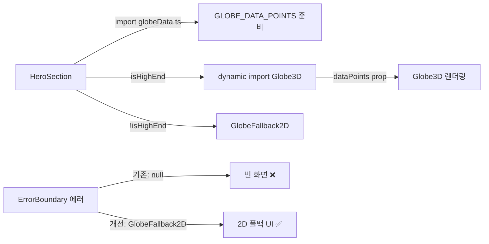

# 설계 문서: 랜딩 페이지 코드 품질 점검 및 실제 데이터 교체

## 개요

기존 랜딩 페이지(landing-page spec) 구현 완료 후 후속 작업으로, 두 가지 영역을 다룬다:

1. **코드 품질 개선**: Globe3D ErrorBoundary의 null 반환을 GlobeFallback2D로 교체, StorytellingSection의 프로덕션 console.warn 제거, CategoryCard 마스코트 소품 이미지 에러 핸들링 추가, Globe3D 매직 넘버를 설정 객체로 통합
2. **실제 데이터 교체**: Globe 데이터 포인트 25개 이상 확장(웹 검색 검증), 소셜 프루프 카드 12개 이상 확장, 카테고리 스토리 description에 실제 스팟 이름 포함

### 핵심 설계 결정

1. **Globe 데이터 분리 및 SSR Pre-fetch**: `src/components/landing/data/globeData.ts`로 데이터를 분리한다. 25개 좌표 데이터는 수십 KB 수준으로 메인 번들에 큰 영향이 없으므로, HeroSection(클라이언트 컴포넌트)에서 `globeData.ts`를 직접 import하여 `<Globe3D dataPoints={GLOBE_DATA_POINTS} />`로 Props 전달한다. Globe3D 내부에서 다시 비동기 로드하면 Waterfall(next/dynamic 로드 → 데이터 로드)이 발생하여 빈 화면을 2번 기다리게 되므로, Props 전달 방식이 UX에 훨씬 유리하다
2. **ErrorBoundary 폴백 개선**: `ErrorBoundaryFallback.render()`에서 `null` 대신 `<GlobeFallback2D />`를 렌더링하여 WebGL 에러 시에도 사용자에게 의미 있는 UI를 제공한다
3. **GLOBE_CONFIG 설정 객체**: 5개의 매직 넘버 상수(`GLOBE_RADIUS`, `AUTO_ROTATE_SPEED`, `RESUME_DELAY`, `DRAG_SENSITIVITY`, `MIN_NODE_DISTANCE`)를 단일 `GLOBE_CONFIG` 객체로 통합하고 JSDoc 주석을 추가한다. `Object.freeze()`를 적용하여 런타임에서 값 변경을 방지하고, Three.js 내부 `useMemo`/`useFrame`에서 참조 시 불필요한 의존성 리렌더링이 발생하지 않도록 참조 무결성을 보장한다
4. **console.warn 제거**: GSAP 로드 실패 시 `console.warn` 호출을 제거하고, CSS 폴백 처리만 수행한다. 에러 로깅이 필요하면 Sentry 등 모니터링 도구를 사용한다
5. **데이터 검증 원칙**: 모든 실제 데이터(좌표, 스팟 이름)는 웹 검색으로 팩트 체크 후 사용한다. AI가 임의로 생성한 가상 데이터는 사용하지 않는다
6. **Gemini CLI 위임**: 단순 반복 치환 작업(예: 대규모 문자열 교체)은 `node .kiro/hooks/run-gemini-cli.js bulk-replace`로 위임한다

## 아키텍처

### 변경 대상 파일 구조

```
src/components/landing/
├── Globe3D.tsx                    # ErrorBoundary 폴백 개선, GLOBE_CONFIG 통합
├── HeroSection.tsx                # GLOBE_DATA_POINTS 제거 → globeData.ts로 이동
├── StorytellingSection.tsx        # console.warn 제거, CSS 폴백 강화
├── CategoryCard.tsx               # mascotProp onError 핸들러 추가
├── ProofCard.tsx                  # (현재 구현 유지)
├── GlobeFallback2D.tsx            # (변경 없음, ErrorBoundary 폴백으로 재사용)
└── data/
    ├── globeData.ts               # [신규] Globe 데이터 포인트 25개+ (lazy load 대상)
    ├── proofData.ts               # 더미 → 실제 데이터 12개+ 교체
    └── categoryStories.ts         # description 실제 스팟 이름 포함으로 교체
```

### 데이터 로딩 흐름 변경



HeroSection이 `globeData.ts`를 직접 import하여 데이터를 미리 준비하고, Globe3D에 Props로 전달한다. Globe3D는 `next/dynamic`으로 비동기 로드되지만, 데이터는 이미 준비되어 있으므로 Waterfall 없이 즉시 렌더링할 수 있다.

## 컴포넌트 및 인터페이스

### Globe3D 변경사항

```typescript
// src/components/landing/Globe3D.tsx

/** 
 * Globe3D 설정 객체 — 기존 매직 넘버 5개를 통합
 * Requirements: 1.2, 1.3
 */
export const GLOBE_CONFIG = Object.freeze({
  /** 지구본 반지름 (Three.js 단위) */
  radius: 1.8,
  /** 자동 회전 속도 (라디안/프레임) */
  autoRotateSpeed: 0.003,
  /** 드래그 종료 후 자동 회전 재개까지 대기 시간 (ms) */
  resumeDelay: 100,
  /** 드래그 감도 (포인터 이동 px → 회전 라디안 변환 계수) */
  dragSensitivity: 0.008,
  /** 노드 분산 알고리즘의 최소 노드 간 거리 (Three.js 단위) */
  minNodeDistance: 0.35,
} as const)

// ErrorBoundaryFallback 클래스 변경:
// render() 메서드에서 null → <GlobeFallback2D /> 반환
class ErrorBoundaryFallback extends Component<ErrorBoundaryProps, ErrorBoundaryState> {
  // ...
  render() {
    if (this.state.hasError) {
      // 기존: return null
      // 개선: GlobeFallback2D 렌더링
      return <GlobeFallback2D />
    }
    return this.props.children
  }
}
```

### HeroSection 변경사항

```typescript
// src/components/landing/HeroSection.tsx
// GLOBE_DATA_POINTS 인라인 상수 제거 → globeData.ts에서 import
import { GLOBE_DATA_POINTS } from './data/globeData'

// Globe3D에 dataPoints를 Props로 전달 (Waterfall 방지)
<Globe3D dataPoints={GLOBE_DATA_POINTS} className="..." />
```

### Globe3D Props (변경 없음)

```typescript
// dataPoints prop은 필수 — HeroSection에서 전달
// 기본값 []은 테스트/에러 시 안전장치로 유지
interface Globe3DProps {
  dataPoints?: GlobeDataPoint[]  // optional — 미제공 시 빈 지구본
  className?: string
}
```

### StorytellingSection 변경사항

```typescript
// useGSAPAnimation 훅 내 catch 블록 변경:

// 변경 전:
catch (error) {
  console.warn('GSAP 로드 실패, CSS 폴백 적용:', error)
  if (containerRef.current) {
    containerRef.current.querySelectorAll<HTMLElement>('.gsap-card')
      .forEach((card) => {
        card.style.opacity = '1'
        card.style.transform = 'none'
      })
  }
}

// 변경 후:
catch {
  // GSAP 로드 실패 시 CSS 폴백만 적용 (console.warn 제거)
  if (containerRef.current) {
    containerRef.current.querySelectorAll<HTMLElement>('.gsap-card')
      .forEach((card) => {
        card.style.opacity = '1'
        card.style.transform = 'none'
      })
  }
}
```

### CategoryCard 마스코트 소품 에러 핸들링

```typescript
// src/components/landing/CategoryCard.tsx
// mascotProp 이미지에 onError 핸들러 추가

const [mascotError, setMascotError] = useState(false)

// 마스코트 소품 영역:
{!mascotError ? (
  <Image
    src={mascotProp}
    alt={`${title} 카테고리 아이콘`}
    fill
    className="object-contain"
    sizes="40px"
    onError={() => setMascotError(true)}
  />
) : (
  <span className="text-lg" role="img" aria-label={`${title} 아이콘`}>
    {CATEGORY_EMOJI[category]}
  </span>
)}

// 카테고리별 이모지 매핑
const CATEGORY_EMOJI: Record<SpotCategory, string> = {
  animation: '🎬',
  sports: '⚽',
  movie_drama: '🎥',
  music: '🎵',
  game: '🎮',
  other: '📍',
}
```

## 데이터 모델

### Globe 데이터 포인트 (globeData.ts)

```typescript
// src/components/landing/data/globeData.ts
import type { SpotCategory } from '@/types/spot'

export interface GlobeDataPoint {
  lat: number
  lng: number
  label: string
  category: SpotCategory
  thumbnail?: string
}

/**
 * 전 세계 성지순례 포인트 데이터 (25개 이상)
 * - 모든 좌표는 웹 검색으로 검증된 실제 값 (소수점 4자리 이상)
 * - 6개 카테고리 균형 배분 (카테고리당 최소 4개)
 * - 아시아, 유럽, 북미, 남미, 오세아니아, 중동/아프리카 대륙 분포
 * Requirements: 4.1~4.7
 */
export const GLOBE_DATA_POINTS: GlobeDataPoint[] = [
  // 웹 검색으로 검증된 실제 데이터가 여기에 들어감
  // 예시 구조:
  {
    lat: 35.6995,    // 아키하바라 전기거리 실제 좌표
    lng: 139.7710,
    label: '아키하바라 전기거리',
    category: 'animation',
    thumbnail: '/icons/categories/animation.webp',
  },
  // ... 25개 이상
]
```

데이터 요구사항:
- 최소 25개 포인트
- 6개 카테고리 각 최소 4개
- 대륙별 분포: 아시아 8~10, 유럽 5~6, 북미 4~5, 남미 2, 오세아니아 1~2, 중동/아프리카 1~2
- 좌표 정밀도: 소수점 4자리 이상
- label: 실제 명소의 정확한 이름 (웹 검색 검증)

### 소셜 프루프 데이터 (proofData.ts)

```typescript
// src/components/landing/data/proofData.ts — 기존 구조 유지, 데이터만 교체

export const PROOF_DUMMY_DATA: ProofData[] = [
  // 12개 이상, 카테고리당 최소 2개
  // spotName: 웹 검색으로 검증된 실제 성지순례 명소
  // comment: 해당 스팟에 대한 사실적인 한국어 후기 톤
  // image: 카테고리 아이콘 경로 유지
]
```

### 카테고리 스토리 데이터 (categoryStories.ts)

```typescript
// src/components/landing/data/categoryStories.ts — description만 교체

// 변경 전:
description: '좋아하는 작품 속 그 장소를 직접 걸어보세요'

// 변경 후 (예시):
description: '스즈미야 하루히의 니시노미야, 슬램덩크의 가마쿠라를 직접 걸어보세요'

// mascotProp, spotImage: 현재 값 유지 + TODO 주석 추가
mascotProp: '/icons/categories/animation.webp', // TODO: 실제 마스코트 소품 이미지로 교체
spotImage: '/icons/categories/animation.webp',   // TODO: 실제 대표 스팟 이미지로 교체
```


## 정확성 속성 (Correctness Properties)

*속성(Property)은 시스템의 모든 유효한 실행에서 참이어야 하는 특성 또는 동작이다. 속성은 사람이 읽을 수 있는 명세와 기계가 검증할 수 있는 정확성 보장 사이의 다리 역할을 한다.*

### Property 1: Globe 좌표 유효성 및 정밀도

*For any* `GLOBE_DATA_POINTS` 배열의 데이터 포인트에 대해, `lat`은 -90 이상 90 이하, `lng`은 -180 이상 180 이하의 유효한 범위여야 하며, `lat`과 `lng` 모두 소수점 4자리 이상의 정밀도를 가져야 한다.

**Validates: Requirements 4.1, 7.2**

### Property 2: 랜딩 페이지 데이터 이미지 경로 일관성

*For any* `GLOBE_DATA_POINTS`의 `thumbnail` 또는 `PROOF_DUMMY_DATA`의 `image`에 대해, 해당 값은 반드시 `/icons/categories/` 접두사로 시작하고 `.webp` 확장자로 끝나는 유효한 카테고리 아이콘 경로여야 한다.

**Validates: Requirements 4.5, 5.5**

### Property 3: 소셜 프루프 코멘트 최소 품질

*For any* `PROOF_DUMMY_DATA` 배열의 카드에 대해, `comment` 필드는 비어있지 않아야 하며 최소 10자 이상의 구체적인 문장이어야 한다.

**Validates: Requirements 5.3**

## 에러 처리

### Globe3D ErrorBoundary 개선

| 상황 | 기존 처리 | 개선 처리 |
|------|----------|----------|
| WebGL 렌더링 에러 | ErrorBoundary가 `null` 반환 → 빈 화면 | ErrorBoundary가 `<GlobeFallback2D />` 반환 → 2D 폴백 UI |
| ErrorBoundary `onError` 콜백 | `hasError` state를 true로 설정 → 상위에서도 GlobeFallback2D 표시 | 동일 (이중 안전장치 유지) |

### StorytellingSection GSAP 로드 실패

| 상황 | 기존 처리 | 개선 처리 |
|------|----------|----------|
| GSAP dynamic import 실패 | `console.warn` 출력 + CSS 폴백 적용 | `console.warn` 제거 + CSS 폴백만 적용 |
| containerRef가 null | 폴백 미적용 | 동일 (containerRef null 체크 유지) |

### CategoryCard 마스코트 소품 이미지 에러

| 상황 | 기존 처리 | 개선 처리 |
|------|----------|----------|
| mascotProp 이미지 로드 실패 | onError 핸들러 없음 → 깨진 이미지 표시 | `mascotError` state + 카테고리 이모지 폴백 |
| spotImage 이미지 로드 실패 | 카테고리 컬러 배경 + 제목 텍스트 폴백 (유지) | 동일 |

### 데이터 무결성

| 상황 | 처리 |
|------|------|
| globeData.ts 데이터 누락/빈 배열 | Globe3D의 dataPoints 기본값 `[]` → 빈 지구본 표시 |
| proofData.ts 데이터 누락 | 기존 폴백 로직 유지 (빈 배열 시 섹션 숨김 또는 최소 UI) |

## 테스팅 전략

### 테스트 프레임워크

- **단위 테스트**: Jest + @testing-library/react (기존 프로젝트 설정 활용)
- **속성 기반 테스트 (PBT)**: fast-check (기존 프로젝트에 설치됨)
- **PBT 설정**: 각 속성 테스트는 최소 100회 반복 실행

### PBT 적용 범위 평가

이 기능은 주로 코드 품질 리팩토링과 데이터 교체로 구성된다. PBT가 적합한 영역은 **데이터 무결성 검증**이다:
- Globe 좌표 유효성/정밀도 검증 → 25개+ 데이터 포인트에 대해 보편적 속성 검증
- 이미지 경로 패턴 일관성 → 모든 데이터 항목에 대해 경로 형식 검증
- 코멘트 최소 품질 → 12개+ 카드에 대해 문자열 길이 검증

코드 품질 개선(ErrorBoundary, console.warn 제거, 이미지 에러 핸들링)은 특정 시나리오 기반이므로 example-based 단위 테스트가 적합하다.

### 속성 기반 테스트 (PBT)

각 속성 테스트는 설계 문서의 속성 번호를 참조하며, 다음 태그 형식을 사용한다:
**Feature: landing-page-polish, Property {number}: {property_text}**

| 속성 | 테스트 전략 | 생성기 |
|------|-----------|--------|
| Property 1: Globe 좌표 유효성 및 정밀도 | `GLOBE_DATA_POINTS` 배열의 각 항목에 대해 lat/lng 범위 및 소수점 자릿수 검증 | `fc.constantFrom(...GLOBE_DATA_POINTS)` |
| Property 2: 이미지 경로 일관성 | Globe + Proof 데이터의 이미지 경로가 `/icons/categories/*.webp` 패턴을 따르는지 검증 | `fc.constantFrom(...allImagePaths)` |
| Property 3: 코멘트 최소 품질 | `PROOF_DUMMY_DATA`의 각 comment가 비어있지 않고 10자 이상인지 검증 | `fc.constantFrom(...PROOF_DUMMY_DATA)` |

### 단위 테스트 (예시 및 엣지 케이스)

| 테스트 대상 | 검증 내용 | 관련 요구사항 |
|------------|----------|-------------|
| `ErrorBoundaryFallback` | 에러 발생 시 `GlobeFallback2D` 렌더링 확인 (null이 아님) | 1.1 |
| `GLOBE_CONFIG` 객체 | 5개 속성(radius, autoRotateSpeed, resumeDelay, dragSensitivity, minNodeDistance) 존재 확인 | 1.2 |
| `useGSAPAnimation` GSAP 실패 | GSAP import 실패 시 console.warn 미호출 확인 | 2.1 |
| `useGSAPAnimation` CSS 폴백 | GSAP import 실패 시 .gsap-card에 opacity:1, transform:none 적용 확인 | 2.2 |
| `CategoryCard` mascotProp 에러 | mascotProp 이미지 에러 시 카테고리 이모지 폴백 표시 확인 | 3.4 |
| `GLOBE_DATA_POINTS` 개수 | 25개 이상 확인 | 4.2 |
| `GLOBE_DATA_POINTS` 카테고리 분포 | 6개 카테고리 모두 포함 확인 | 4.3 |
| `GLOBE_DATA_POINTS` 대륙 분포 | 양수/음수 위도, 양수/음수 경도 모두 존재 확인 | 4.6 |
| `PROOF_DUMMY_DATA` 개수 | 12개 이상 확인 | 5.2 |
| `PROOF_DUMMY_DATA` 카테고리 분포 | 6개 카테고리 각 최소 2개 확인 | 5.4 |
| `CATEGORY_STORIES` title 유지 | 6개 카테고리 title이 기존 값과 동일한지 확인 | 6.3 |

### Gemini CLI 위임 대상

다음 작업은 단순 반복 치환이므로 Gemini CLI로 위임한다:
- `GLOBE_CONFIG` 상수명 일괄 교체 (Globe3D.tsx 내부에서 `GLOBE_RADIUS` → `GLOBE_CONFIG.radius` 등)
- `proofData.ts`의 대규모 데이터 교체 (12개+ 카드 데이터 작성)
- `categoryStories.ts`의 description 일괄 교체

### 테스트 파일 구조

```
src/components/landing/__tests__/
├── Globe3D.test.tsx               # ErrorBoundary 폴백, GLOBE_CONFIG 테스트
├── StorytellingSection.test.tsx   # console.warn 제거, CSS 폴백 테스트
├── CategoryCard.test.tsx          # mascotProp 에러 핸들링 테스트
└── data/
    ├── globeData.test.ts          # Globe 데이터 무결성 테스트 (PBT 포함)
    ├── proofData.test.ts          # Proof 데이터 무결성 테스트 (PBT 포함)
    └── categoryStories.test.ts    # Category 데이터 무결성 테스트
```
