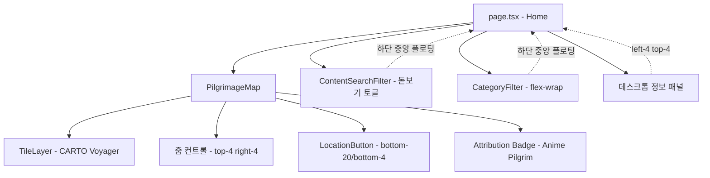
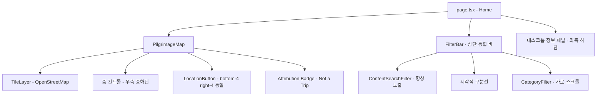

# Design Document: Map UI Overhaul

## Overview

지도 메인 페이지(Home)의 UI/UX를 전면 개편하는 설계 문서이다. 핵심 변경 사항은 다음과 같다:

1. **타일 프로바이더 전환**: CARTO Voyager → OpenStreetMap 기본 타일 (288255.xyz 서버 다운으로 폴백)
2. **필터 바 통합 및 위치 이동**: 하단 분리형 → 상단 통합 바 (`[🔍 검색 | 구분선 | 카테고리 스크롤]`)
3. **카테고리 필터 레이아웃**: flex-wrap → 가로 스크롤 (에어비앤비 스타일)
4. **컨트롤 위치 재조정**: 줌 컨트롤, LocationButton, 데스크톱 정보 패널 위치 변경
5. **부수적 UI 조정**: 로딩 배경색, map.css 배경색, attribution 텍스트, EmptyFilterOverlay 문구

모든 변경은 기존 컴포넌트 구조를 유지하면서 진행하며, 새로운 라이브러리 추가 없이 Tailwind CSS와 react-leaflet 내에서 해결한다.

## Architecture

### 현재 아키텍처



### 변경 후 아키텍처



### 변경 범위 요약

| 컴포넌트 | 변경 유형 | 영향도 |
|---------|----------|-------|
| `page.tsx` | 레이아웃 구조 변경 (필터 바 위치, 정보 패널 위치) | 높음 |
| `PilgrimageMap.tsx` | TileLayer URL, 줌 컨트롤 위치, LocationButton 위치, Attribution 텍스트 | 높음 |
| `CategoryFilter.tsx` | flex-wrap → overflow-x-auto, 스크롤바 숨김 | 중간 |
| `ContentSearchFilter.tsx` | 토글 제거, 항상 펼침 상태, 레이아웃 조정 | 중간 |
| `AutocompleteDropdown.tsx` | 드롭다운 방향 변경 (bottom-full → top-full) | 낮음 |
| `SpotLoadingSkeleton.tsx` | 배경색 변경 | 낮음 |
| `EmptyFilterOverlay.tsx` | 문구 변경 | 낮음 |
| `map.css` | 배경색 변경 | 낮음 |


## Components and Interfaces

### 1. FilterBar (통합 필터 바) — `page.tsx` 내 인라인 구조

기존 `page.tsx`의 하단 플로팅 영역을 상단 통합 바로 재구성한다. 별도 컴포넌트를 만들지 않고 `page.tsx` 내에서 레이아웃을 변경한다.

**변경 전** (`page.tsx`):
```
absolute bottom-6 left-1/2 -translate-x-1/2
  ├── ContentSearchFilter (돋보기 토글 버튼)
  └── CategoryFilter (flex-wrap, 검색 펼치면 숨김)
```

**변경 후** (`page.tsx`):
```
absolute top-0 left-0 right-0 (헤더 바로 아래)
  └── FilterBar 컨테이너 (bg-white/95 backdrop-blur, z-[1000])
      ├── 🔍 ContentSearchFilter (항상 노출, 고정 너비)
      ├── 구분선 (h-8 w-px bg-neutral-300)
      └── CategoryFilter (overflow-x-auto, flex-1)
```

**설계 결정**: 별도 `FilterBar.tsx` 컴포넌트를 만들지 않는다. `page.tsx`의 레이아웃 변경만으로 충분하며, 기존 `ContentSearchFilter`와 `CategoryFilter` 컴포넌트를 재사용한다.

### 2. CategoryFilter 변경

**현재**: `flex flex-wrap items-center gap-2`
**변경**: `flex items-center gap-2 overflow-x-auto` + 스크롤바 숨김 CSS

```css
/* globals.css에 추가 */
.scrollbar-hide {
  -ms-overflow-style: none;
  scrollbar-width: none;
}
.scrollbar-hide::-webkit-scrollbar {
  display: none;
}
```

카테고리 버튼은 `flex-shrink-0`을 추가하여 줄바꿈 없이 단일 행을 유지한다.

**터치 이벤트 전파 차단**: 필터 바가 지도 위에 오버레이되므로, 카테고리 스크롤 영역에서의 터치/마우스 이벤트가 하위 Leaflet 지도로 전파되어 지도 패닝이 발생하는 것을 방지해야 한다. FilterBar 컨테이너(또는 CategoryFilter 스크롤 영역)에 이벤트 전파 차단 핸들러를 적용한다:

```tsx
// FilterBar 컨테이너 또는 CategoryFilter 스크롤 영역에 적용
<div
  className="overflow-x-auto scrollbar-hide ..."
  onPointerDown={(e) => e.stopPropagation()} // 마우스/터치 이벤트 전파 차단
  onWheel={(e) => e.stopPropagation()}        // 마우스 휠 이벤트 전파 차단
>
```

이는 특히 iOS Safari에서 좌우 스크롤 시 지도 패닝과 충돌하는 문제를 방지한다.

### 3. ContentSearchFilter 변경

**제거 항목**:
- `isExpanded` 상태 및 토글 로직
- 접힌 상태의 돋보기 버튼 렌더링
- `onExpandChange` prop

**유지 항목**:
- 검색 입력 필드 (항상 노출)
- 300ms 디바운스 (`useAutocomplete` 훅)
- 자동완성 드롭다운 (`AutocompleteDropdown`)
- Enter 키 검색, Escape 키 초기화

**레이아웃 변경**:
- 독립 플로팅 → 통합 바 내 좌측 고정 영역
- 너비: `w-48 md:w-56` (통합 바 내에서 적절한 크기)
- 배경/테두리/그림자 제거 (부모 바가 담당)

### 4. AutocompleteDropdown 방향 변경

필터 바가 상단으로 이동하므로 드롭다운이 아래로 열려야 한다.

**변경**: `absolute bottom-full mb-1` → `absolute top-full mt-1`

### 5. PilgrimageMap 변경

#### 5.1 TileLayer
```tsx
// 변경 전
<TileLayer
  attribution='&copy; <a href="https://carto.com/attributions">CARTO</a>'
  url="https://{s}.basemaps.cartocdn.com/rastertiles/voyager/{z}/{x}/{y}{r}.png"
  maxZoom={19}
/>

// 변경 후
<TileLayer
  attribution='&copy; <a href="https://www.openstreetmap.org/copyright">OpenStreetMap</a> contributors'
  url="https://tile.openstreetmap.org/{z}/{x}/{y}.png"
  maxZoom={19}
/>
```

**설계 결정**: 288255.xyz는 서버 다운(503)으로 사용 불가하여 OSM 기본 타일로 폴백한다. `{s}` 서브도메인과 `{r}` (retina) 파라미터를 제거한다.

#### 5.2 줌 컨트롤 위치
```
변경 전: absolute right-4 top-4
변경 후: absolute right-4 bottom-20
```

LocationButton(bottom-4) 위에 위치하여 우측 하단 컨트롤 그룹을 형성한다.

#### 5.3 LocationButton 위치
```
변경 전: absolute bottom-20 right-4 z-[1000] md:bottom-4
변경 후: absolute bottom-4 right-4 z-[1000]
```

모바일/데스크톱 구분 없이 `bottom-4 right-4`로 통일한다.

#### 5.4 Attribution Badge
```
변경 전: "Anime Pilgrim"
변경 후: "Not a Trip"
```

### 6. SpotLoadingSkeleton 변경

```
변경 전: bg-primary-800
변경 후: bg-neutral-800
```

### 7. EmptyFilterOverlay 문구 변경

```
변경 전: "아래 필터에서 원하는 카테고리를 선택하세요"
변경 후: "필터에서 원하는 카테고리를 선택하세요"
```

방향 지시어("아래")를 제거하여 필터 바 위치에 무관한 문구로 변경한다.

### 8. map.css 배경색 변경

```css
/* 변경 전 */
.leaflet-container {
  background: #eeedfc; /* primary-50 */
}

/* 변경 후 */
.leaflet-container {
  background: #f4f4f5; /* neutral-100 */
}

/* 다크 모드 추가 */
.dark .leaflet-container {
  background: #27272a; /* neutral-800 */
}
```

### 9. 데스크톱 정보 패널 위치 변경

```
변경 전: absolute left-4 top-4 (필터 바와 겹침)
변경 후: absolute left-4 bottom-4 (좌측 하단)
```


## Data Models

이번 개편은 순수 UI/레이아웃 변경이므로 데이터 모델 변경은 없다. 기존 Zustand 스토어(`filterStore`, `mapStore`, `uiStore`)의 인터페이스는 그대로 유지된다.

### 상태 관리 변경 사항

#### filterStore (변경 없음)
```typescript
interface FilterStore {
  selectedCategories: SpotCategory[]
  searchQuery: string
  // ... 기존 액션들 유지
}
```

#### ContentSearchFilter 내부 상태 변경
```typescript
// 제거되는 상태
// isExpanded: boolean  — 항상 펼침이므로 불필요
// onExpandChange prop  — 부모에서 더 이상 사용하지 않음

// 유지되는 상태
inputValue: string
isDropdownOpen: boolean
```

#### page.tsx 내부 상태 변경
```typescript
// 제거되는 상태
// isSearchExpanded: boolean  — ContentSearchFilter 토글 제거로 불필요
```

### 컴포넌트 Props 변경

```typescript
// ContentSearchFilter — onExpandChange prop 제거
interface ContentSearchFilterProps {
  placeholder?: string
  className?: string
  // onExpandChange 제거
}
```

### 타일 설정 상수 (변경)

```typescript
// PilgrimageMap.tsx 내 TileLayer props
const TILE_URL = 'https://tile.openstreetmap.org/{z}/{x}/{y}.png'
const TILE_ATTRIBUTION = '&copy; <a href="https://www.openstreetmap.org/copyright">OpenStreetMap</a> contributors'
const TILE_MAX_ZOOM = 19
```


## Correctness Properties

*속성(Property)은 시스템의 모든 유효한 실행에서 참이어야 하는 특성 또는 동작이다. 속성은 사람이 읽을 수 있는 명세와 기계가 검증할 수 있는 정확성 보장 사이의 다리 역할을 한다.*

### Property 1: 카테고리 버튼 줄바꿈 방지

*For any* 카테고리 버튼 목록에서, 모든 버튼은 `flex-shrink-0` 속성을 가져야 하며, 부모 컨테이너는 `flex-wrap`이 아닌 `overflow-x-auto`를 사용하여 단일 행을 유지해야 한다.

**Validates: Requirements 2.2**

### Property 2: 검색 입력창 항상 노출

*For any* 렌더링 상태(초기 로드, 검색어 입력 중, 검색어 비어있음 등)에서, 검색 입력 필드(`input[role="combobox"]`)는 항상 DOM에 존재하고 visible 상태여야 한다. 토글 버튼이나 접힌 상태가 존재하지 않아야 한다.

**Validates: Requirements 3.2, 3.4**

### Property 3: 자동완성 활성화 조건

*For any* 2글자 이상의 검색어 입력에 대해, 자동완성 드롭다운이 열려야 한다. 반대로, *for any* 2글자 미만의 입력에 대해서는 드롭다운이 닫혀 있어야 한다.

**Validates: Requirements 3.5**

### Property 4: 검색 디바운스 타이밍 및 클린업

*For any* 연속된 검색어 입력 시퀀스에서, API 호출은 마지막 입력 후 300ms가 경과한 뒤에만 발생해야 한다. 300ms 이내의 연속 입력은 이전 타이머를 취소하고 새 타이머를 시작해야 한다. 또한 컴포넌트 언마운트 시 진행 중인 모든 타이머와 진행 중인 API 요청(AbortController)은 즉시 정리(Cleanup)되어 메모리 누수를 방지해야 한다.

**Validates: Requirements 3.6**

### Property 5: 필터 바 z-index 보장

*For any* 렌더링된 필터 바 컨테이너에서, z-index 값은 1000 이상이어야 한다. 이는 지도 핀(z-index 4), 팝업(z-index 6), Leaflet 컨트롤(z-index 10)보다 항상 위에 표시됨을 보장한다.

**Validates: Requirements 4.4**

### Property 6: LocationButton 위치 일관성

*For any* 뷰포트 크기(모바일, 태블릿, 데스크톱)에서, LocationButton의 위치 클래스는 반응형 분기(`md:`, `lg:` 등) 없이 동일한 `bottom-4 right-4`를 사용해야 한다.

**Validates: Requirements 6.1, 6.2**

### Property 7: EmptyFilterOverlay 방향 무관 문구

*For any* EmptyFilterOverlay 렌더링에서, 표시되는 텍스트에 방향 지시어("아래", "위", "왼쪽", "오른쪽")가 포함되지 않아야 한다.

**Validates: Requirements 7.1**

## Error Handling

### 타일 로딩 실패

288255.xyz는 SLA가 없는 best-effort 서비스이므로 타일 로딩 실패 가능성이 있다.

- **현재 동작**: Leaflet은 타일 로딩 실패 시 자동으로 재시도하며, 실패한 타일은 빈 영역으로 표시된다.
- **추가 대응 불필요**: `map.css`의 `.leaflet-container` 배경색이 neutral 톤으로 변경되므로, 타일 미로딩 시에도 시각적으로 자연스럽다.
- **폴백 전략**: 288255.xyz가 장기간 다운될 경우, `TILE_URL`을 OSM 기본 타일(`https://tile.openstreetmap.org/{z}/{x}/{y}.png`)로 교체하는 것으로 대응 가능하다. 이는 코드 1줄 변경으로 가능하므로 별도 자동 폴백 로직은 구현하지 않는다.

### 검색 입력 에러

- 기존 `useAutocomplete` 훅의 에러 처리 로직을 그대로 유지한다.
- AbortController를 통한 요청 취소, 에러 상태 관리가 이미 구현되어 있다.

### 가로 스크롤 접근성

- 카테고리 필터의 가로 스크롤은 키보드 탭 네비게이션으로도 접근 가능하다 (각 버튼이 focusable).
- 스크롤바를 숨기되 `overflow-x-auto`를 유지하므로 마우스 휠/트랙패드 스크롤도 동작한다.

## Testing Strategy

### 단위 테스트 (Jest + @testing-library/react)

UI 변경 사항의 구체적인 예시와 엣지 케이스를 검증한다.

1. **SpotLoadingSkeleton**: `bg-neutral-800` 클래스 존재, `bg-primary-800` 부재 확인
2. **CategoryFilter**: `overflow-x-auto` 클래스 존재, `flex-wrap` 부재 확인
3. **ContentSearchFilter**: 토글 버튼 부재, 입력 필드 항상 렌더링 확인
4. **AutocompleteDropdown**: `top-full` 방향 확인
5. **PilgrimageMap TileLayer**: 288255.xyz URL 사용 확인
6. **Attribution Badge**: "Not a Trip" 텍스트 확인
7. **EmptyFilterOverlay**: "아래" 텍스트 부재 확인
8. **데스크톱 정보 패널**: `top-4` 부재, `bottom-4` 존재 확인
9. **map.css**: `#f4f4f5` 배경색 확인, `.dark` 규칙 존재 확인

### 속성 기반 테스트 (Jest + fast-check)

각 테스트는 최소 100회 반복 실행하며, 설계 문서의 Property를 참조한다.

- **라이브러리**: `fast-check` (프로젝트에 이미 설치됨)
- **태그 형식**: `Feature: map-ui-overhaul, Property {number}: {property_text}`

| Property | 테스트 전략 |
|----------|-----------|
| Property 1 | 임의의 카테고리 부분집합을 생성하여 렌더링 후, 모든 버튼에 `flex-shrink-0` 존재 확인 |
| Property 2 | 임의의 searchQuery 상태를 생성하여 렌더링 후, `input[role="combobox"]` 존재 확인 |
| Property 3 | 임의의 문자열(0~100자)을 생성하여, 2글자 이상이면 드롭다운 open, 미만이면 closed 확인 |
| Property 4 | 임의의 입력 시퀀스와 타이밍을 생성하여, 300ms 디바운스 동작 확인 |
| Property 5 | 임의의 렌더링 조건에서 필터 바 z-index >= 1000 확인 |
| Property 6 | 임의의 뷰포트 크기에서 LocationButton className에 반응형 분기 부재 확인 |
| Property 7 | 임의의 렌더링에서 EmptyFilterOverlay 텍스트에 방향 지시어 부재 확인 |

### 수동 테스트

자동화가 어려운 시각적/인터랙션 항목:

- 288255.xyz 타일 렌더링 품질 및 로딩 속도 (Requirements 5.3, 5.4)
- 모바일 터치 스크롤 동작 (Requirements 2.3)
- 다크 모드 배경색 시각적 확인 (Requirements 8.2)
- 필터 바와 지도 컨트롤 간 겹침 없음 확인 (Requirements 10.1)

