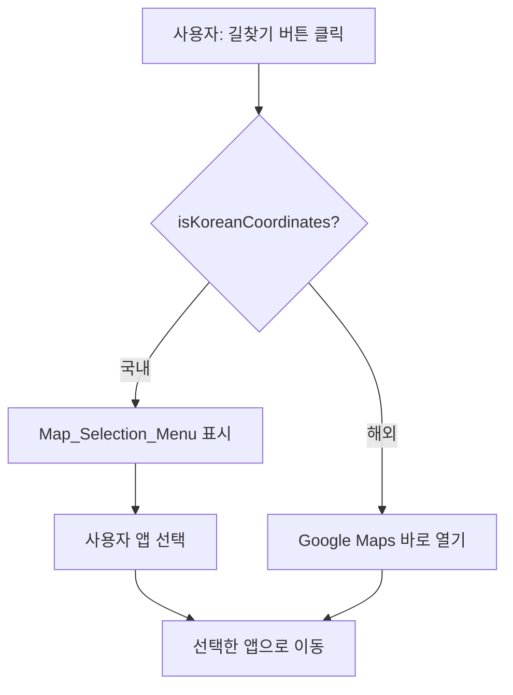

# Design Document

## Overview

해외 스팟에서 길찾기 버튼 클릭 시 불필요한 지도 앱 선택 메뉴를 제거하고, 바로 Google Maps로 이동하도록 개선한다. 국내 스팟에서는 기존 동작(Google Maps, 카카오맵, 네이버 지도 선택 메뉴)을 유지한다.

변경 범위는 최소화한다:
1. `src/lib/directions.ts`에 `isKoreanCoordinates()` 순수 함수 추가
2. `src/components/common/DirectionsButton.tsx`에 조건 분기 추가

## Architecture

기존 아키텍처를 그대로 유지하며, 유틸리티 함수 하나와 컴포넌트 내 조건 분기만 추가한다.



## Components and Interfaces

### 1. `isKoreanCoordinates(lat: number, lng: number): boolean`

**파일**: `src/lib/directions.ts`

좌표가 대한민국 영토 범위 내인지 판별하는 순수 함수.

```typescript
/** 대한민국 좌표 경계 */
const KOREA_BOUNDARY = {
  lat: { min: 33.0, max: 38.7 },
  lng: { min: 124.5, max: 132.0 },
} as const

/**
 * 좌표가 대한민국 영토 범위 내인지 판별
 * @param lat 위도
 * @param lng 경도
 * @returns 국내 좌표 여부
 */
export function isKoreanCoordinates(lat: number, lng: number): boolean {
  return (
    lat >= KOREA_BOUNDARY.lat.min &&
    lat <= KOREA_BOUNDARY.lat.max &&
    lng >= KOREA_BOUNDARY.lng.min &&
    lng <= KOREA_BOUNDARY.lng.max
  )
}
```

설계 결정:
- 바운딩 박스 방식 채택 — 단순하고 빠르며, 한국 영토 형태에 충분한 정확도
- 경계값 포함(`>=`, `<=`) — 경계선 위의 좌표도 국내로 분류
- `KOREA_BOUNDARY` 상수 분리 — 향후 경계 조정 용이

### 2. `DirectionsButton` 컴포넌트 수정

**파일**: `src/components/common/DirectionsButton.tsx`

버튼 클릭 핸들러에 조건 분기 추가:

```typescript
const isDomestic = isKoreanCoordinates(lat, lng)

const handleClick = useCallback(() => {
  if (isDomestic) {
    // 기존 동작: 선택 메뉴 토글
    setIsOpen((prev) => !prev)
  } else {
    // 해외: Google Maps 바로 열기
    openDirections(urls.google)
  }
}, [isDomestic, urls.google])
```

변경 사항:
- `onClick` 핸들러를 `handleClick`으로 교체
- 해외 스팟: `openDirections(urls.google)` 직접 호출, 메뉴 표시 안 함
- 국내 스팟: 기존 `setIsOpen` 토글 동작 유지
- `aria-haspopup`과 `aria-expanded`는 국내일 때만 설정

## Data Models

기존 데이터 모델 변경 없음. `Spot.coordinates`의 `{ lat, lng }` 값을 그대로 사용한다.

추가되는 상수:

```typescript
interface KoreaBoundary {
  lat: { min: number; max: number }
  lng: { min: number; max: number }
}

const KOREA_BOUNDARY: KoreaBoundary = {
  lat: { min: 33.0, max: 38.7 },
  lng: { min: 124.5, max: 132.0 },
}
```

## Correctness Properties

*A property is a characteristic or behavior that should hold true across all valid executions of a system — essentially, a formal statement about what the system should do. Properties serve as the bridge between human-readable specifications and machine-verifiable correctness guarantees.*

### Property 1: 좌표 경계 분류 정확성 (Boundary classification biconditional)

*For any* coordinate pair (lat, lng), `isKoreanCoordinates(lat, lng)` SHALL return `true` if and only if `33.0 <= lat <= 38.7` AND `124.5 <= lng <= 132.0`, and `false` otherwise.

**Validates: Requirements 1.2, 1.3, 4.4**

### Property 2: Google Maps URL에 좌표 포함

*For any* valid coordinate pair (lat, lng) and destination name, the Google Maps URL generated by `generateDirectionsUrls` SHALL contain the lat and lng values in the URL string.

**Validates: Requirements 2.2**

## Error Handling

이 기능은 에러 발생 가능성이 낮다:

- **좌표 미제공**: 기존 `SpotDetailClient`에서 `spot.coordinates && ...` 조건으로 이미 처리됨
- **NaN/Infinity 좌표**: `isKoreanCoordinates`는 비교 연산자 특성상 `NaN`에 대해 자동으로 `false` 반환 (해외로 분류) — 안전한 폴백
- **팝업 차단**: `openDirections`의 `window.open` 호출이 차단될 수 있으나, 이는 기존 동작과 동일한 제약

## Testing Strategy

### Property-Based Tests (fast-check)

PBT 라이브러리: `fast-check` (이미 프로젝트에 설치됨)

각 property test는 최소 100회 반복 실행한다.

| Property | 테스트 내용 | 태그 |
|----------|------------|------|
| Property 1 | 랜덤 좌표 생성 → `isKoreanCoordinates` 결과가 범위 조건과 일치하는지 검증 | Feature: navigation-google-maps-default, Property 1: Boundary classification biconditional |
| Property 2 | 랜덤 좌표/이름 생성 → Google Maps URL에 좌표 포함 검증 | Feature: navigation-google-maps-default, Property 2: Google Maps URL contains coordinates |

### Unit Tests (Jest)

Property test가 범위 전체를 커버하므로, unit test는 edge case와 컴포넌트 동작에 집중한다:

- **Edge cases**: 제주도(33.4, 126.5), 울릉도(37.5, 130.9) → 국내 분류
- **Edge cases**: 후쿠오카(33.6, 130.4), 쓰시마(34.4, 129.3) → 해외 분류
- **Component**: 해외 좌표로 DirectionsButton 렌더 → 클릭 시 메뉴 없이 Google Maps 열림
- **Component**: 국내 좌표로 DirectionsButton 렌더 → 클릭 시 선택 메뉴 표시

### 테스트 파일 위치

- `src/lib/__tests__/directions.test.ts` — `isKoreanCoordinates` 순수 함수 테스트 (PBT + edge cases)
- `src/components/common/__tests__/DirectionsButton.test.tsx` — 컴포넌트 동작 테스트
