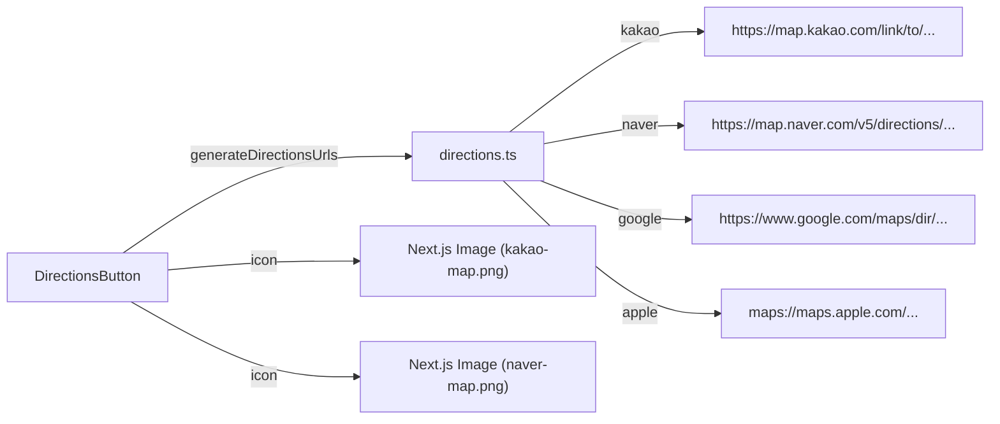

# Design Document: 지도 앱 딥링크 수정

## Overview

카카오맵과 네이버 지도의 길찾기 URL을 앱 전용 딥링크(`kakaomap://`, `nmap://`)에서 웹 브라우저에서도 동작하는 웹 URL(`https://`)로 변경한다. 동시에 DirectionsButton 컴포넌트의 이모지 아이콘을 실제 지도 앱 브랜드 아이콘 이미지로 교체한다.

변경 범위는 최소한으로 유지하며, 기존 `DirectionsUrls` 인터페이스와 Google Maps/Apple Maps URL은 그대로 유지한다.

## Architecture

기존 아키텍처를 그대로 유지한다. 변경은 두 파일에 국한된다:

```
src/lib/directions.ts          ← URL 생성 로직 변경 (kakao, naver)
src/components/common/DirectionsButton.tsx  ← 아이콘 렌더링 변경
public/icons/                   ← 아이콘 에셋 추가
```



## Components and Interfaces

### 1. `generateDirectionsUrls` (directions.ts)

기존 함수 시그니처와 반환 타입(`DirectionsUrls`)은 변경하지 않는다. 내부 URL 생성 로직만 수정한다.

**변경 전:**
```typescript
kakao: `kakaomap://route?ep=${destination.lat},${destination.lng}&by=FOOT`
naver: `nmap://route/walk?dlat=${destination.lat}&dlng=${destination.lng}&dname=${encodedName}&appname=com.notatrip`
```

**변경 후:**
```typescript
kakao: `https://map.kakao.com/link/to/${encodedName},${destination.lat},${destination.lng}`
naver: `https://map.naver.com/v5/directions/-/-/-/walk?c=${destination.lng},${destination.lat},15,0,0,0,dh`
```

### 2. `DirectionsButton` (DirectionsButton.tsx)

`MAP_APPS` 배열에서 카카오맵과 네이버 지도의 `icon` 필드를 이모지에서 `<Image>` 컴포넌트로 변경한다.

**변경 전:**
```typescript
{ key: 'kakao', label: '카카오맵', icon: '🟡' }
{ key: 'naver', label: '네이버 지도', icon: '🟢' }
```

**변경 후:**
```typescript
{ key: 'kakao', label: '카카오맵', icon: <Image src="/icons/kakao-map.png" alt="카카오맵" width={18} height={18} /> }
{ key: 'naver', label: '네이버 지도', icon: <Image src="/icons/naver-map.png" alt="네이버 지도" width={18} height={18} /> }
```

### 3. 아이콘 에셋

| 파일 | 설명 |
|------|------|
| `public/icons/kakao-map.png` | 카카오맵 브랜드 아이콘 (18×18 이상) |
| `public/icons/naver-map.png` | 네이버 지도 브랜드 아이콘 (18×18 이상) |

기존 `AppIcon` 컴포넌트 패턴을 따르지 않고, Next.js `Image` 컴포넌트를 직접 사용한다. 이유: 외부 지도 앱 아이콘은 프로젝트 내부 아이콘 시스템(`AppIcon`)과 성격이 다르며, `public/icons/` 루트에 직접 배치하는 것이 간결하다.

## Data Models

기존 데이터 모델 변경 없음. `DirectionsUrls` 인터페이스는 그대로 유지한다:

```typescript
export interface DirectionsUrls {
  google: string
  apple: string
  kakao: string
  naver: string
}
```

## Correctness Properties

*속성(property)이란 시스템의 모든 유효한 실행에서 참이어야 하는 특성 또는 동작을 의미한다. 속성은 사람이 읽을 수 있는 명세와 기계가 검증할 수 있는 정확성 보장 사이의 다리 역할을 한다.*

### Property 1: 카카오맵 URL 형식 정확성

*For any* 유효한 좌표 쌍 (lat, lng)과 목적지 이름에 대해, `generateDirectionsUrls`가 생성한 카카오맵 URL은 `https://map.kakao.com/link/to/`로 시작하고, URL 내에 lat과 lng 값을 포함해야 한다.

**Validates: Requirements 1.1, 1.2, 3.1**

### Property 2: 네이버 지도 URL 형식 정확성

*For any* 유효한 좌표 쌍 (lat, lng)에 대해, `generateDirectionsUrls`가 생성한 네이버 지도 URL은 `https://map.naver.com/v5/directions/-/-/-/walk`로 시작하고, URL 내에 lng과 lat 값을 포함해야 한다.

**Validates: Requirements 2.1, 2.2, 3.2**

### Property 3: 웹 URL 스킴만 사용 (딥링크 금지)

*For any* 유효한 좌표 쌍과 목적지 이름에 대해, `generateDirectionsUrls`가 생성한 카카오맵 URL은 `kakaomap://`으로 시작하지 않아야 하고, 네이버 지도 URL은 `nmap://`으로 시작하지 않아야 한다. 두 URL 모두 `https://`로 시작해야 한다.

**Validates: Requirements 1.4, 2.3**

### Property 4: 좌표 라운드트립

*For any* 유효한 좌표 쌍 (lat, lng)과 목적지 이름에 대해, 카카오맵 URL을 생성한 후 URL에서 좌표를 파싱하면 원래 좌표와 일치해야 하고, 네이버 지도 URL을 생성한 후 URL에서 좌표를 파싱하면 원래 좌표와 일치해야 한다.

**Validates: Requirements 3.1, 3.2, 3.3**

## Error Handling

이 변경은 에러 처리 로직을 추가하지 않는다. 기존 동작을 유지한다:

- `destinationName`이 `undefined`인 경우: 빈 문자열(`''`)로 대체 (기존 로직 유지)
- `encodeURIComponent`가 특수 문자를 자동으로 인코딩 (기존 로직 유지)
- URL 열기 실패: `window.open`의 기본 동작에 의존 (기존 로직 유지)

## Testing Strategy

### Property-Based Tests (fast-check)

기존 `src/lib/__tests__/directions.test.ts` 파일을 확장한다. 최소 100회 반복 실행.

| Property | 설명 | Tag |
|----------|------|-----|
| Property 1 | 카카오맵 URL 형식 검증 | `Feature: map-app-deeplink-fix, Property 1: 카카오맵 URL 형식 정확성` |
| Property 2 | 네이버 지도 URL 형식 검증 | `Feature: map-app-deeplink-fix, Property 2: 네이버 지도 URL 형식 정확성` |
| Property 3 | 웹 URL 스킴만 사용 검증 | `Feature: map-app-deeplink-fix, Property 3: 웹 URL 스킴만 사용` |
| Property 4 | 좌표 라운드트립 검증 | `Feature: map-app-deeplink-fix, Property 4: 좌표 라운드트립` |

### Unit Tests (Example-Based)

| 테스트 | 검증 내용 | Validates |
|--------|-----------|-----------|
| 카카오맵 이름 미제공 시 빈 문자열 사용 | `destinationName` 없이 호출 시 URL 형식 확인 | 1.3 |
| Google Maps URL 형식 유지 | 기존 Google Maps URL 형식 변경 없음 확인 | 6.1 |
| Apple Maps URL 형식 유지 | 기존 Apple Maps URL 형식 변경 없음 확인 | 6.2 |

### UI 테스트 (수동)

아이콘 교체(Requirements 4, 5)와 지도 앱 열기(Requirement 6.3)는 수동으로 검증한다:
- 카카오맵/네이버 지도 아이콘이 이모지 대신 이미지로 표시되는지 확인
- 각 지도 앱 클릭 시 올바른 웹 페이지가 열리는지 확인
