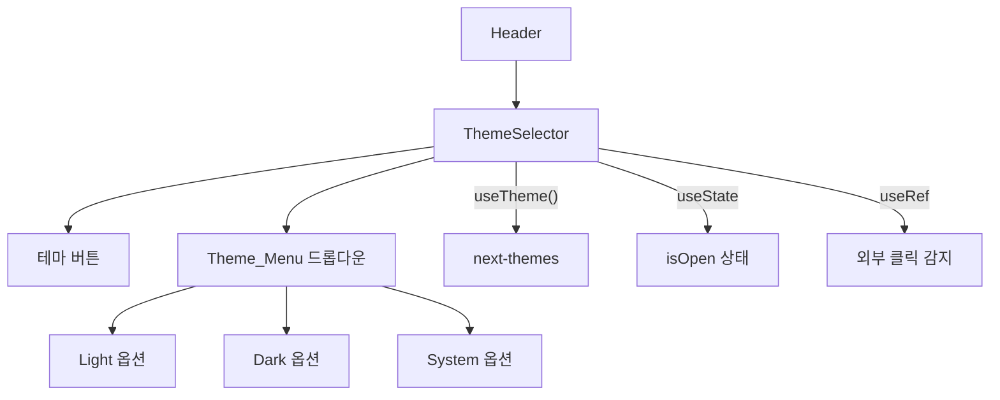

# 디자인 문서: Theme Selector Menu

## 개요

현재 `ThemeToggle` 컴포넌트의 순환 방식(system → light → dark) 테마 전환을 드롭다운 메뉴 방식으로 교체한다. 사용자가 Light / Dark / System 중 원하는 테마를 직접 선택할 수 있으며, 현재 활성 테마가 시각적으로 구분된다.

기존 `ThemeToggle.tsx` 파일을 그대로 사용하되, 컴포넌트 이름을 `ThemeSelector`로 변경하고 드롭다운 메뉴 패턴을 적용한다. `DirectionsButton.tsx`의 드롭다운 패턴(useState + useRef + useEffect mousedown 리스너)을 참고한다.

## 아키텍처

### 컴포넌트 구조



### 상태 관리

- `isOpen: boolean` — 드롭다운 메뉴 열림/닫힘 상태 (로컬 useState)
- `mounted: boolean` — 하이드레이션 안전성을 위한 마운트 상태 (로컬 useState)
- `theme` / `setTheme` — next-themes의 `useTheme` hook에서 제공

### 이벤트 흐름

1. 버튼 클릭 → `isOpen` 토글
2. 메뉴 옵션 클릭 → `setTheme(선택값)` 호출 + `isOpen = false`
3. 외부 클릭 (mousedown) → `isOpen = false`
4. Escape 키 → `isOpen = false`

## 컴포넌트 및 인터페이스

### ThemeSelector 컴포넌트

**파일:** `src/components/common/ThemeToggle.tsx` (파일명 유지, 컴포넌트명 변경)

```typescript
// 테마 옵션 정의
interface ThemeOption {
  value: 'light' | 'dark' | 'system'
  label: string
  iconName: AppIconType  // 'light-mode' | 'dark-mode' | 'settings'
}

const THEME_OPTIONS: ThemeOption[] = [
  { value: 'light', label: '라이트 모드', iconName: 'light-mode' },
  { value: 'dark', label: '다크 모드', iconName: 'dark-mode' },
  { value: 'system', label: '시스템 설정', iconName: 'settings' },
]
```

**핵심 로직:**

- `getIcon(theme)` — 현재 테마에 맞는 AppIcon 반환
- `getLabel(theme)` — 현재 테마에 맞는 한글 레이블 반환
- 외부 클릭 감지: `useRef<HTMLDivElement>` + `useEffect` mousedown 리스너
- Escape 키 감지: `useEffect` keydown 리스너

### 내보내기 변경

`src/components/common/index.ts`에서 `ThemeToggle` → `ThemeSelector`로 변경하고, 하위 호환을 위해 `ThemeToggle`도 re-export 유지 가능 (또는 Header에서 import 경로 변경).

**결정:** `ThemeToggle` 이름을 `ThemeSelector`로 변경하고, `index.ts`와 `Header.tsx`의 import도 함께 수정한다. 기존 `ThemeToggle` 이름은 유지하지 않는다 (사용처가 Header 1곳뿐이므로).

## 데이터 모델

별도의 데이터 모델 없음. 테마 상태는 `next-themes`의 `useTheme` hook이 관리하며, localStorage에 자동 저장된다.

**테마 옵션 매핑:**

| 테마 값 | 아이콘 | 레이블 |
|---------|--------|--------|
| `light` | `light-mode` | 라이트 모드 |
| `dark` | `dark-mode` | 다크 모드 |
| `system` | `settings` | 시스템 설정 |

## 정확성 속성 (Correctness Properties)

*속성(property)이란 시스템의 모든 유효한 실행에서 참이어야 하는 특성 또는 동작을 의미합니다. 속성은 사람이 읽을 수 있는 명세와 기계가 검증할 수 있는 정확성 보장 사이의 다리 역할을 합니다.*

### Property 1: 토글 상태 반전 및 aria-expanded 동기화

*임의의* isOpen 상태(true 또는 false)에서 토글 함수를 호출하면, isOpen 상태가 반전되어야 하며, 버튼의 `aria-expanded` 속성 값이 새로운 isOpen 상태와 일치해야 한다.

**Validates: Requirements 1.1, 5.1**

### Property 2: 테마-아이콘-레이블 매핑 일관성

*임의의* 유효한 테마 값(`light`, `dark`, `system`)에 대해, `getIcon` 함수는 올바른 AppIcon 이름을 반환하고, `getLabel` 함수는 올바른 한글 레이블을 반환해야 한다. 또한 `aria-label`에 해당 레이블이 포함되어야 한다.

**Validates: Requirements 2.3, 5.4**

### Property 3: 활성 테마 표시 정확성

*임의의* 유효한 테마 값에 대해, Theme_Menu가 열려 있을 때 정확히 하나의 Theme_Option만 활성 스타일(체크마크 또는 하이라이트)이 적용되어야 하며, 그 옵션의 value가 현재 테마 값과 일치해야 한다.

**Validates: Requirements 3.1, 3.2**

## 에러 처리

| 시나리오 | 처리 방법 |
|---------|----------|
| 하이드레이션 불일치 | `mounted` 상태가 `false`일 때 동일 크기의 플레이스홀더(`<div className="h-9 w-9" />`) 렌더링 |
| `useTheme`의 `theme`이 undefined | `system`을 기본값으로 사용 |
| 이벤트 리스너 메모리 누수 | `useEffect` cleanup에서 `mousedown` 및 `keydown` 리스너 제거 |

## 테스팅 전략

### 단위 테스트 (Jest + React Testing Library)

- 메뉴 열림/닫힘 토글 동작
- 각 테마 옵션 클릭 시 `setTheme` 호출 확인
- 외부 클릭 시 메뉴 닫힘
- Escape 키 시 메뉴 닫힘
- 접근성 속성 (`aria-expanded`, `aria-haspopup`, `role="menu"`, `role="menuitem"`) 존재 확인
- 마운트 전 플레이스홀더 렌더링

### 속성 기반 테스트 (fast-check)

이 기능은 UI 컴포넌트이며 테마 옵션이 3개로 고정되어 있어 입력 공간이 매우 제한적이다. 그러나 순수 매핑 함수(`getIcon`, `getLabel`)와 상태 토글 로직은 속성 기반 테스트로 검증할 수 있다.

- **Property 1**: 토글 상태 반전 — `fc.boolean()`으로 임의의 초기 상태 생성, 토글 후 상태 반전 확인 (100회 반복)
- **Property 2**: 테마-아이콘-레이블 매핑 — `fc.constantFrom('light', 'dark', 'system')`으로 임의의 테마 값 생성, 매핑 결과 검증 (100회 반복)
- **Property 3**: 활성 테마 표시 — `fc.constantFrom('light', 'dark', 'system')`으로 임의의 테마 값 생성, 정확히 하나의 옵션만 활성화 확인 (100회 반복)

**테스트 태그 형식:** `Feature: theme-selector-menu, Property {number}: {property_text}`

**테스트 라이브러리:** fast-check (프로젝트에 이미 설치됨)
**최소 반복 횟수:** 100회
