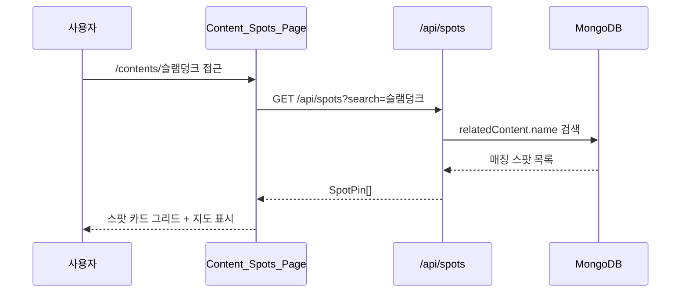

# 설계 문서: UX 품질 개선

## 개요

사용자 피드백과 코드 분석을 통해 발견된 4가지 UX 품질 이슈를 일괄 개선한다. 각 이슈는 독립적인 컴포넌트 수정 또는 신규 페이지 추가로 해결하며, 기존 코드 패턴과 API를 최대한 재활용한다.

| # | 이슈 | 심각도 | 해결 방식 |
|---|------|--------|-----------|
| 1 | 갤러리 피드 이미지 깨짐 | Critical | FeedTab.tsx에 onError + fallback 패턴 적용 |
| 2 | 지도 스팟 클릭 시 미이동 | Critical | console.log → router.push 교체 |
| 3 | 순례 코스 가이드 모드 | Enhancement | NavigationPanel → GuidePanel 교체 |
| 4 | 작품별 스팟 모아보기 | Enhancement | /contents/[name] 페이지 + 스팟 상세 섹션 추가 |

## 아키텍처

### 전체 변경 범위

```mermaid
graph TB
    subgraph "Requirement 1: 이미지 에러 핸들링"
        FT[FeedTab.tsx<br/>FeedGridItem] -->|onError + fallback| FB[/images/placeholder-spot.jpg/]
    end

    subgraph "Requirement 2: 마커 클릭 네비게이션"
        MP[map/page.tsx<br/>handleSpotSelect] -->|router.push| SD[/spots/id/]
    end

    subgraph "Requirement 3: 가이드 모드"
        RDC[RouteDetailContent.tsx] -->|교체| GP[GuidePanel.tsx<br/>신규 컴포넌트]
        GP -->|길찾기| DB[DirectionsButton]
        GP -->|인증| SD2[/spots/id/]
    end

    subgraph "Requirement 4: 작품별 스팟"
        CSP[/contents/name/<br/>신규 페이지] -->|fetch| API[/api/spots?search=name]
        SDC[SpotDetailClient.tsx] -->|섹션 추가| SCS[SameContentSpots<br/>신규 컴포넌트]
        SCS -->|fetch| API
    end
```

### 데이터 흐름



## 컴포넌트 및 인터페이스

### 1. FeedGridItem 수정 (Requirement 1)

기존 `ComparisonCard.tsx`의 `imageError` + `onError` 패턴을 그대로 적용한다.

```typescript
// src/components/gallery/FeedTab.tsx - FeedGridItem 수정
function FeedGridItem({ checkIn, spotName, isPriority, onClick }: Props) {
  const [imageError, setImageError] = useState(false)

  return (
    <button ...>
      <Image
        src={imageError ? '/images/placeholder-spot.jpg' : checkIn.photoUrl}
        alt={`${checkIn.userName}의 인증샷`}
        onError={() => setImageError(true)}
        ...
      />
      {/* 호버 오버레이 - 기존 유지 */}
    </button>
  )
}
```

**설계 결정**: ComparisonCard와 동일한 패턴(`useState(false)` + `onError` + 삼항 연산자)을 사용하여 코드베이스 일관성을 유지한다.

### 2. handleSpotSelect 수정 (Requirement 2)

```typescript
// src/app/(main)/map/page.tsx - MapContent 내부
const router = useRouter()

const handleSpotSelect = (spotId: string) => {
  router.push(`/spots/${spotId}`)
}
```

**설계 결정**: `useRouter`를 `MapContent` 컴포넌트 레벨에서 호출하고, `handleSpotSelect`에서 직접 `router.push`를 사용한다. 기존 `console.log`를 완전히 제거한다.

### 3. GuidePanel 신규 컴포넌트 (Requirement 3)

```typescript
// src/components/route/GuidePanel.tsx
interface GuidePanelProps {
  /** 코스의 전체 스팟 목록 */
  spots: RouteSpot[]
  /** 인증 완료 스팟 ID 목록 */
  checkedSpotIds: string[]
  /** 현재 목표 스팟 인덱스 */
  currentSpotIndex: number
  /** 진행률 (0-100) */
  progress: number
  /** 현재 위치 좌표 (길찾기 URL 생성용) */
  currentPosition: { lat: number; lng: number } | null
  /** GPS 정확도 (m) */
  accuracy: number | null
  /** 인증 버튼 클릭 핸들러 */
  onCheckIn: (spotId: string) => void
  /** 코스 종료 핸들러 */
  onEndRoute: () => void
  /** 완주 여부 */
  isCompleted: boolean
}

export function GuidePanel(props: GuidePanelProps): JSX.Element
```

**설계 결정**:
- NavigationPanel은 "현재 1개 스팟"에 집중하는 실시간 추적 UI였다. GuidePanel은 "전체 스팟 체크리스트"를 한눈에 보여주는 가이드 UI로 교체한다.
- `distanceToNext`, `estimatedTimeToNext` props를 제거하고, 각 스팟의 `distanceFromPrev`, `walkTimeFromPrev` 데이터를 직접 사용한다.
- `onMoveToNext` props를 제거한다. 체크리스트 방식이므로 사용자가 자유롭게 순서를 선택할 수 있다.
- DirectionsButton 컴포넌트를 재활용하여 각 스팟별 길찾기 기능을 제공한다.

### 4. ContentSpotsPage 신규 페이지 (Requirement 4)

```typescript
// src/app/(main)/contents/[name]/page.tsx
interface ContentSpotsPageProps {
  params: Promise<{ name: string }>
}

export default async function ContentSpotsPage(props: ContentSpotsPageProps)
```

```typescript
// src/components/content/ContentSpotsClient.tsx
interface ContentSpotsClientProps {
  contentName: string
}

export function ContentSpotsClient({ contentName }: ContentSpotsClientProps): JSX.Element
```

### 5. SameContentSpots 신규 컴포넌트 (Requirement 4.6, 4.7)

```typescript
// src/components/spot/SameContentSpots.tsx
interface SameContentSpotsProps {
  /** 현재 스팟 ID (자기 자신 제외용) */
  currentSpotId: string
  /** 관련 작품 목록 */
  relatedContent: RelatedContent[]
}

export function SameContentSpots(props: SameContentSpotsProps): JSX.Element | null
```

**설계 결정**: 첫 번째 relatedContent의 name을 기준으로 `/api/spots?search={name}`을 호출하여 같은 작품의 스팟을 조회한다. 현재 스팟은 결과에서 제외한다.

## 데이터 모델

### 기존 모델 활용 (변경 없음)

이 기능은 새로운 데이터 모델을 추가하지 않는다. 기존 모델을 그대로 활용한다.

```typescript
// 기존 SpotPin (지도 마커 + 카드 표시용)
interface SpotPin {
  id: string
  name: string
  coordinates: [number, number]
  thumbnailUrl: string
  category?: SpotCategory
  checkInCount?: number
}

// 기존 RelatedContent (작품 정보)
interface RelatedContent {
  name: string
  type: ContentType
  year?: number
  additionalInfo?: string
  imageUrl?: string
}

// 기존 RouteSpot (코스 내 스팟, GuidePanel에서 사용)
interface RouteSpot {
  spotId: string
  spotName: string
  coordinates: { lat: number; lng: number }
  thumbnailUrl: string
  distanceFromPrev: number | null
  walkTimeFromPrev: number | null
  note?: string
  isAvailable?: boolean
}
```

### API 엔드포인트 활용

| 엔드포인트 | 용도 | 변경 여부 |
|-----------|------|----------|
| `GET /api/spots?search={name}` | Content_Spots_Page 스팟 조회 | 변경 없음 |
| `GET /api/content-names?type=content` | 작품명 자동완성 (향후 확장) | 변경 없음 |

### Content_Spots_Page URL 설계

```
/contents/{encodedContentName}
```

- `name` 파라미터는 `decodeURIComponent`로 디코딩하여 사용
- 예: `/contents/%EC%8A%AC%EB%9E%A8%EB%8D%A9%ED%81%AC` → "슬램덩크"

## 정확성 속성 (Correctness Properties)

*속성(Property)은 시스템의 모든 유효한 실행에서 참이어야 하는 특성 또는 동작이다. 속성은 사람이 읽을 수 있는 명세와 기계가 검증할 수 있는 정확성 보장 사이의 다리 역할을 한다.*

### Property 1: 스팟 ID → URL 매핑 정확성

*임의의* spotId 문자열에 대해, `handleSpotSelect(spotId)` 호출 시 `router.push`가 정확히 `/spots/${spotId}` 경로로 호출되어야 한다.

**Validates: Requirements 2.3**

### Property 2: GuidePanel 스팟 목록 렌더링 완전성

*임의의* RouteSpot 배열에 대해, GuidePanel은 모든 스팟을 배열 순서대로 렌더링하며, 각 항목에는 스팟 이름(`spotName`), 이전 스팟으로부터의 거리(`distanceFromPrev`), 예상 이동 시간(`walkTimeFromPrev`) 정보가 포함되어야 한다.

**Validates: Requirements 3.2, 3.3**

### Property 3: 코스 진행률 계산 정확성

*임의의* 스팟 목록과 체크된 스팟 ID 집합에 대해, 진행률은 `(유효 스팟 중 체크된 수 / 전체 유효 스팟 수) × 100`과 정확히 일치해야 한다. 여기서 유효 스팟은 `isAvailable !== false`인 스팟이다.

**Validates: Requirements 3.7**

### Property 4: 소실 스팟 비활성 처리

*임의의* RouteSpot 배열에서, `isAvailable === false`인 모든 스팟은 비활성 스타일(line-through, 회색 배경)로 렌더링되어야 하며, 인증 버튼 대신 "건너뛰기" 표시가 있어야 한다.

**Validates: Requirements 3.9**

### Property 5: 스팟 카드 필수 정보 포함

*임의의* SpotPin 데이터에 대해, Content_Spots_Page의 스팟 카드 렌더링 결과에는 스팟 이름(`name`), 카테고리 정보가 반드시 포함되어야 한다.

**Validates: Requirements 4.3**

## 에러 핸들링

### Requirement 1: 이미지 에러

| 에러 상황 | 처리 방식 |
|----------|----------|
| 인증샷 이미지 로드 실패 | `onError` → `imageError` state → fallback 이미지 표시 |
| Fallback 이미지도 로드 실패 | Next.js Image 컴포넌트의 기본 동작 (빈 영역) |

### Requirement 2: 네비게이션 에러

| 에러 상황 | 처리 방식 |
|----------|----------|
| 잘못된 spotId로 이동 | SpotDetailClient의 기존 SpotNotFound UI 표시 |
| router.push 실패 | Next.js 기본 에러 핸들링 |

### Requirement 3: 가이드 모드 에러

| 에러 상황 | 처리 방식 |
|----------|----------|
| GPS 권한 거부 | 기존 useGeolocation 훅의 에러 처리 유지 |
| GPS 정확도 100m 초과 | 경고 배너 표시 (기존 RouteDetailContent 패턴 유지) |
| 네트워크 오프라인 | 외부 지도 앱 버튼 비활성화 (기존 NavigationPanel 패턴) |

### Requirement 4: 작품별 스팟 페이지 에러

| 에러 상황 | 처리 방식 |
|----------|----------|
| API 호출 실패 | AsyncBoundary의 rejectedFallback으로 에러 UI 표시 |
| 스팟 0건 | "등록된 스팟이 없습니다" 빈 상태 메시지 |
| 잘못된 content name | 빈 결과 → 빈 상태 메시지 표시 |

## 테스트 전략

### 이중 테스트 접근법

- **단위 테스트 (Jest + React Testing Library)**: 특정 시나리오, 에지 케이스, 에러 조건 검증
- **속성 기반 테스트 (fast-check)**: 모든 입력에 대한 보편적 속성 검증

### 속성 기반 테스트 (PBT)

라이브러리: `fast-check` (프로젝트에 이미 설치됨)

각 속성 테스트는 최소 100회 반복 실행하며, 설계 문서의 속성을 참조하는 태그를 포함한다.

| Property | 테스트 대상 | 태그 |
|----------|-----------|------|
| Property 1 | handleSpotSelect URL 생성 | `Feature: ux-quality-improvements, Property 1: spotId URL mapping` |
| Property 2 | GuidePanel 렌더링 완전성 | `Feature: ux-quality-improvements, Property 2: GuidePanel spot list completeness` |
| Property 3 | 진행률 계산 | `Feature: ux-quality-improvements, Property 3: progress calculation accuracy` |
| Property 4 | 소실 스팟 비활성 처리 | `Feature: ux-quality-improvements, Property 4: unavailable spot deactivation` |
| Property 5 | 스팟 카드 필수 정보 | `Feature: ux-quality-improvements, Property 5: spot card required info` |

### 단위 테스트

| 테스트 대상 | 검증 내용 | Requirements |
|-----------|----------|--------------|
| FeedGridItem | onError 시 fallback 이미지 전환 | 1.1, 1.2 |
| FeedGridItem | fallback 상태에서 클릭/호버 정상 동작 | 1.4 |
| MapContent | handleSpotSelect → router.push 호출 | 2.1, 2.2 |
| GuidePanel | 코스 시작 시 렌더링 | 3.1 |
| GuidePanel | 길찾기 버튼 존재 | 3.4 |
| GuidePanel | 인증 버튼 클릭 → 스팟 상세 이동 | 3.5, 3.6 |
| GuidePanel | 완료 상태 체크 표시 | 3.8 |
| GuidePanel | GPS 정확도 경고 | 3.10 |
| ContentSpotsClient | 스팟 목록 렌더링 | 4.1 |
| ContentSpotsClient | 헤더 정보 표시 | 4.2 |
| ContentSpotsClient | 카드 클릭 → 스팟 상세 이동 | 4.4 |
| ContentSpotsClient | 빈 상태 메시지 | 4.9 |
| SameContentSpots | relatedContent 존재 시 섹션 표시 | 4.6 |
| SameContentSpots | 항목 클릭 → 스팟 상세 이동 | 4.7 |
