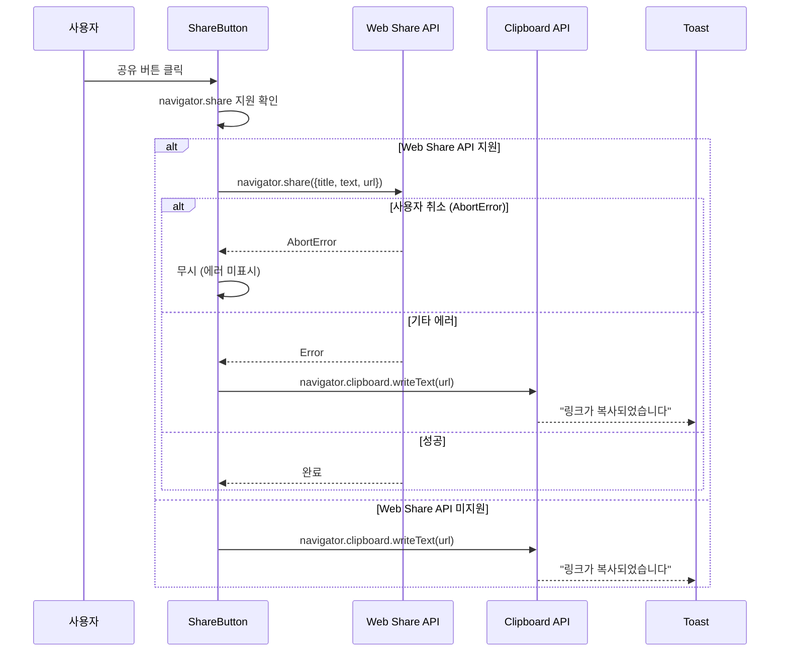
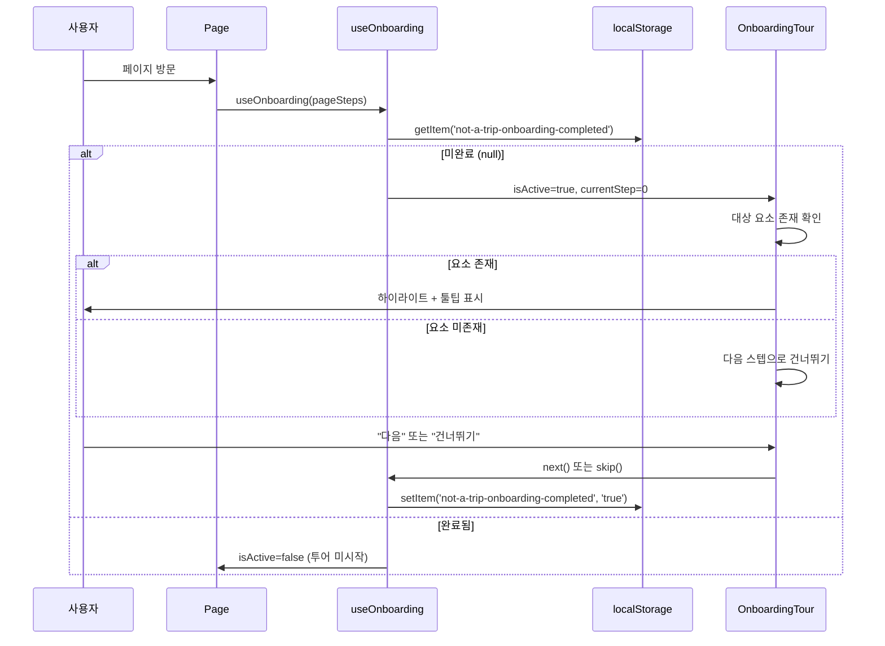

# 설계 문서: UX 품질 개선 Phase 2

## 개요

UX 품질 개선 2차 작업으로 3가지 독립적인 기능을 추가한다:

1. **코스 생성 최소 스팟 수 유연화** — 기존 2개 → 1개로 변경하여 콘텐츠 생성 진입 장벽을 낮춤
2. **스팟/코스 공유 기능** — Web Share API + 클립보드 폴백으로 바이럴 공유 촉진
3. **신규 사용자 온보딩 가이드 투어** — 오버레이 + 툴팁 기반 가이드로 서비스 이해도 향상

각 기능은 기존 코드 패턴(Zustand, React Query, Tailwind CSS)을 따르며, 독립적으로 구현/배포 가능하다.

## 아키텍처

### 전체 변경 범위

```mermaid
graph TB
    subgraph "Requirement 1: 최소 스팟 수 유연화"
        RFC[RouteFormContent.tsx<br/>validate: spots >= 1] --> API[/api/routes POST/PUT<br/>spots.length >= 1]
        SOL[SpotOrderList.tsx<br/>격려 메시지 추가] --> RFC
        GP[GuidePanel.tsx<br/>단일 스팟 처리]
    end

    subgraph "Requirement 2: 공유 기능"
        SB[ShareButton.tsx<br/>공통 컴포넌트] --> WSA[Web Share API]
        SB --> CF[Clipboard Fallback]
        CF --> TN[Toast Notification]
        SDC[SpotDetailClient.tsx] --> SB
        RDC[RouteDetailContent.tsx] --> SB
    end

    subgraph "Requirement 3: 온보딩 투어"
        OT[OnboardingTour.tsx<br/>오버레이 + 툴팁] --> TS[TourStep 설정]
        UO[useOnboarding Hook] --> LS[localStorage 상태]
        OT --> UO
    end
```

### 데이터 흐름: 공유 기능



### 데이터 흐름: 온보딩 투어



## 컴포넌트 및 인터페이스

### 1. 코스 생성 최소 스팟 수 변경

#### RouteFormContent.tsx 수정

```typescript
// 변경 전
if (spots.length < 2) errs.push('코스에는 최소 2개의 스팟이 필요합니다')

// 변경 후
if (spots.length < 1) errs.push('코스에는 최소 1개의 스팟이 필요합니다')
```

#### /api/routes/route.ts (POST) 수정

```typescript
// 변경 전
if (!Array.isArray(body.spots) || body.spots.length < 2)
  errors.push('코스에는 최소 2개의 스팟이 필요합니다')

// 변경 후
if (!Array.isArray(body.spots) || body.spots.length < 1)
  errors.push('코스에는 최소 1개의 스팟이 필요합니다')
```

#### /api/routes/[id]/route.ts (PUT) 수정

동일한 패턴으로 `< 2` → `< 1` 변경.

#### SpotOrderList.tsx 수정

```typescript
// 기존: spots.length < 2 경고
// 변경: spots.length === 1일 때 격려 메시지
{spots.length === 1 && (
  <p className="mt-2 text-center text-xs text-primary">
    💡 더 많은 스팟을 추가하면 풍성한 순례 경험을 만들 수 있어요!
  </p>
)}
```

빈 상태 메시지도 "최소 2개" → "최소 1개"로 변경.

#### GuidePanel.tsx 수정

스팟이 1개인 경우 거리/시간 정보가 자연스럽게 표시되지 않음 (기존 `idx > 0` 조건으로 이미 처리됨). 추가로 단일 스팟 시 "다음 스팟" 관련 UI를 숨기는 조건 확인.

### 2. 공유 기능

#### ShareButton 컴포넌트 (신규)

```typescript
// src/components/common/ShareButton.tsx

interface ShareButtonProps {
  /** 공유 제목 */
  title: string
  /** 공유 텍스트 */
  text: string
  /** 공유 URL (기본: 현재 페이지 URL) */
  url?: string
  /** 버튼 스타일 변형 */
  variant?: 'icon' | 'button'
  /** 추가 className */
  className?: string
}
```

#### 공유 텍스트 포맷팅 유틸리티

```typescript
// src/lib/share-utils.ts

/** 스팟 공유 텍스트 생성 */
export function formatSpotShareText(spotName: string, contentName?: string): string {
  if (contentName) {
    return `[Not a Trip] ${contentName}의 성지순례 스팟 ${spotName}을 확인해보세요!`
  }
  return `[Not a Trip] 성지순례 스팟 ${spotName}을 확인해보세요!`
}

/** 코스 공유 텍스트 생성 */
export function formatRouteShareText(routeName: string): string {
  return `[Not a Trip] ${routeName} 순례 코스를 확인해보세요!`
}

/** Web Share API 지원 여부 확인 */
export function canShare(): boolean {
  return typeof navigator !== 'undefined' && !!navigator.share
}

/** 공유 실행 (Web Share API → Clipboard 폴백) */
export async function executeShare(data: {
  title: string
  text: string
  url: string
}): Promise<'shared' | 'copied' | 'cancelled'> {
  if (canShare()) {
    try {
      await navigator.share(data)
      return 'shared'
    } catch (error) {
      if (error instanceof Error && error.name === 'AbortError') {
        return 'cancelled'
      }
      // 기타 에러 시 클립보드 폴백
    }
  }
  await navigator.clipboard.writeText(data.url)
  return 'copied'
}
```

#### Toast 컴포넌트 (신규)

프로젝트에 범용 토스트 시스템이 없으므로 경량 토스트를 신규 구현한다.

```typescript
// src/components/common/Toast.tsx

interface ToastProps {
  message: string
  isVisible: boolean
  onClose: () => void
  duration?: number // 기본 3000ms
}
```

#### useToast 훅 (신규)

```typescript
// src/hooks/useToast.ts

interface UseToastReturn {
  toast: { message: string; isVisible: boolean } | null
  showToast: (message: string, duration?: number) => void
  hideToast: () => void
}
```

간단한 상태 관리로 구현하며, 전역 상태가 필요하지 않으므로 Zustand 없이 로컬 상태로 처리한다. ShareButton 내부에서 자체적으로 토스트 상태를 관리한다.

### 3. 온보딩 가이드 투어

#### OnboardingTour 컴포넌트 (신규)

```typescript
// src/components/common/OnboardingTour.tsx

interface TourStep {
  /** 대상 요소의 CSS selector 또는 data-tour 속성값 */
  target: string
  /** 툴팁 제목 */
  title: string
  /** 툴팁 설명 */
  description: string
  /** 툴팁 위치 */
  placement?: 'top' | 'bottom' | 'left' | 'right'
}

interface OnboardingTourProps {
  steps: TourStep[]
  isActive: boolean
  currentStep: number
  onNext: () => void
  onSkip: () => void
  onComplete: () => void
}
```

#### useOnboarding 훅 (신규)

```typescript
// src/hooks/useOnboarding.ts

const ONBOARDING_KEY = 'not-a-trip-onboarding-completed'

interface UseOnboardingReturn {
  isActive: boolean
  currentStep: number
  next: () => void
  skip: () => void
  reset: () => void
}

export function useOnboarding(steps: TourStep[]): UseOnboardingReturn
```

#### 페이지별 Tour 설정

```typescript
// src/lib/tour-config.ts

export const MAP_PAGE_STEPS: TourStep[] = [
  {
    target: '[data-tour="category-filter"]',
    title: '카테고리 필터',
    description: '원하는 카테고리를 선택하여 스팟을 필터링할 수 있어요',
    placement: 'bottom',
  },
  {
    target: '[data-tour="search-input"]',
    title: '스팟 검색',
    description: '작품명이나 장소명으로 스팟을 검색해보세요',
    placement: 'bottom',
  },
  {
    target: '[data-tour="map-marker"]',
    title: '마커 클릭',
    description: '지도의 마커를 클릭하면 스팟 상세 정보를 볼 수 있어요',
    placement: 'top',
  },
]

export const ROUTE_PAGE_STEPS: TourStep[] = [
  {
    target: '[data-tour="start-route"]',
    title: '코스 시작',
    description: '코스 시작 버튼을 누르면 가이드 모드가 시작됩니다',
    placement: 'top',
  },
]

export const GALLERY_PAGE_STEPS: TourStep[] = [
  {
    target: '[data-tour="upload-checkin"]',
    title: '인증샷 업로드',
    description: '스팟에서 찍은 인증샷을 업로드하고 공유해보세요',
    placement: 'bottom',
  },
]
```

#### 오버레이 렌더링 방식

- 전체 화면 반투명 오버레이 (`fixed inset-0 bg-black/50 z-[9999]`)
- 대상 요소 영역만 `clip-path` 또는 `box-shadow` 기법으로 하이라이트
- 대상 요소의 `getBoundingClientRect()`로 위치 계산
- 뷰포트 경계 체크로 툴팁 위치 자동 조정

## 데이터 모델

### 기존 모델 변경 없음

이번 기능은 기존 데이터 모델(Route, Spot)을 변경하지 않는다. 유효성 검사 조건만 완화한다.

### 클라이언트 상태

| 상태 | 저장소 | 키 | 값 |
|------|--------|-----|-----|
| 온보딩 완료 여부 | localStorage | `not-a-trip-onboarding-completed` | `'true'` 또는 미존재 |
| 토스트 메시지 | 컴포넌트 로컬 state | - | `{ message, isVisible }` |

## Correctness Properties

*A property is a characteristic or behavior that should hold true across all valid executions of a system—essentially, a formal statement about what the system should do. Properties serve as the bridge between human-readable specifications and machine-verifiable correctness guarantees.*

### Property 1: 유효한 스팟 수에 대한 유효성 검사 통과

*For any* spots 배열의 길이가 1 이상이고 나머지 필수 필드(name, description, estimatedDuration)가 유효한 경우, validate 함수는 스팟 관련 에러 메시지를 반환하지 않아야 한다.

**Validates: Requirements 1.1, 1.3**

### Property 2: 공유 텍스트 포맷팅 일관성

*For any* 유효한 스팟명/작품명/코스명 문자열에 대해, formatSpotShareText는 항상 "[Not a Trip]" 접두사와 "확인해보세요!" 접미사를 포함하고 입력된 스팟명을 포함하는 문자열을 반환해야 하며, formatRouteShareText는 항상 "[Not a Trip]" 접두사와 "순례 코스를 확인해보세요!" 접미사를 포함하고 입력된 코스명을 포함하는 문자열을 반환해야 한다.

**Validates: Requirements 2.6, 2.7**

### Property 3: 투어 스텝 필터링 — DOM 미존재 요소 건너뛰기

*For any* TourStep 배열에서, DOM에 존재하지 않는 target selector를 가진 스텝은 건너뛰고, 다음으로 DOM에 존재하는 target을 가진 스텝으로 진행해야 한다.

**Validates: Requirements 3.12**

## 에러 처리

### 공유 기능 에러 처리

| 에러 상황 | 처리 방식 |
|-----------|-----------|
| Web Share API AbortError (사용자 취소) | 무시, 에러 메시지 미표시 |
| Web Share API 기타 에러 | 클립보드 폴백으로 전환 |
| Clipboard API 실패 | "공유에 실패했습니다" 토스트 표시 |
| navigator.share/clipboard 모두 미지원 | 공유 버튼 비활성화 또는 숨김 |

### 온보딩 투어 에러 처리

| 에러 상황 | 처리 방식 |
|-----------|-----------|
| 대상 요소 DOM에 미존재 | 해당 스텝 건너뛰기 |
| localStorage 접근 실패 | 투어를 매번 표시 (graceful degradation) |
| 모든 스텝의 대상 요소가 미존재 | 투어 자동 종료 |

### 유효성 검사 에러 처리

| 에러 상황 | 처리 방식 |
|-----------|-----------|
| 스팟 0개로 제출 | "코스에는 최소 1개의 스팟이 필요합니다" 에러 표시 |
| API 유효성 검사 실패 | 400 응답 + 에러 메시지 반환 |

## 테스팅 전략

### Property-Based Testing (fast-check)

PBT가 적합한 영역:
- **유효성 검사 함수**: 다양한 spots 배열 길이에 대한 validate 함수 동작 검증
- **공유 텍스트 포맷팅**: 다양한 문자열 입력에 대한 출력 형식 검증
- **투어 스텝 필터링**: 다양한 DOM 상태에서의 스텝 건너뛰기 로직 검증

라이브러리: `fast-check` (프로젝트에 이미 설치됨)
최소 100회 반복 실행.
태그 형식: `Feature: 29-ux-quality-phase2, Property {number}: {property_text}`

### Unit Tests (Jest + Testing Library)

- ShareButton: Web Share API mock, Clipboard mock, AbortError 처리
- useOnboarding: localStorage 상태에 따른 동작
- OnboardingTour: 스텝 진행, 건너뛰기, 완료 동작
- GuidePanel: 단일 스팟 시 UI 렌더링

### Integration Tests

- /api/routes POST: 스팟 1개 코스 생성 성공 확인
- /api/routes PUT: 스팟 1개로 수정 성공 확인

### 수동 테스트

- 모바일에서 Web Share API 네이티브 공유 시트 동작 확인
- 온보딩 투어 오버레이 시각적 확인
- 다양한 뷰포트에서 툴팁 위치 조정 확인
