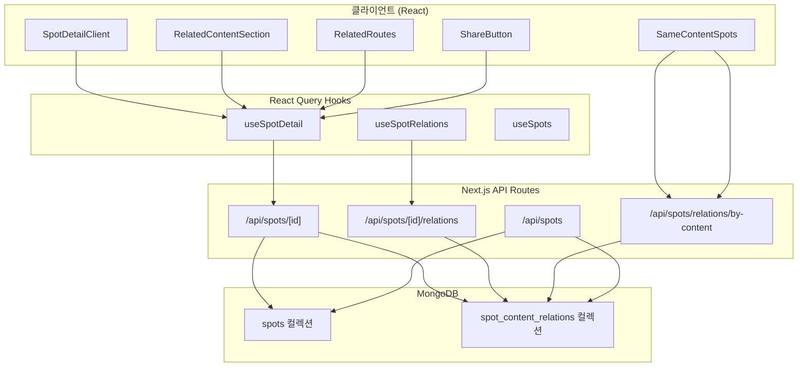
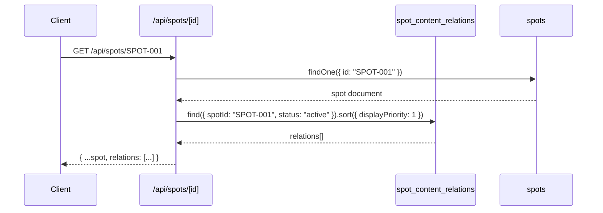
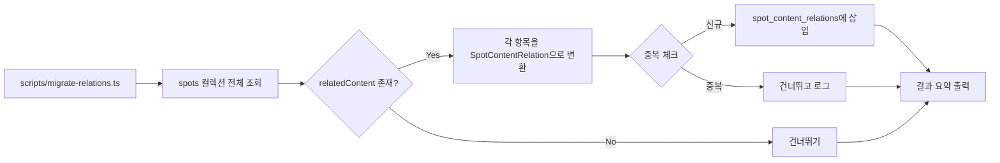

# Design Document: SpotContentRelation 독립 엔티티 마이그레이션

## Overview

이 설계는 기존 `Spot.relatedContent[]` 내장 배열을 독립 `SpotContentRelation` 엔티티로 승격시키는 Phase 1 마이그레이션을 다룬다. `docs/spot-content-relation-architecture.md`에 정의된 장기 아키텍처의 1~2단계(관계 엔티티 도입 + 읽기 경로 전환)를 구현한다.

### 핵심 변경 범위

1. **데이터 모델**: `SpotContentRelation` TypeScript 인터페이스 및 MongoDB `spot_content_relations` 컬렉션 정의
2. **마이그레이션**: 기존 `relatedContent[]` → `spot_content_relations` 일회성 이관 스크립트
3. **API 계층**: 새 Relations API 엔드포인트 + 기존 Spots API 확장
4. **UI 계층**: `RelatedContentSection`, `SameContentSpots`, `RelatedRoutes`, `ShareButton` 컴포넌트 전환
5. **하위 호환성**: 과도기 동안 `relatedContent` 필드와 `relations` 필드 병행 반환

### 설계 원칙

- **점진적 전환**: 기존 `relatedContent` 필드를 즉시 제거하지 않고 과도기 병행 운영
- **읽기 최적화**: 스팟 상세 API에서 relations를 함께 반환하여 추가 API 호출 최소화
- **대표 관계 중심 UI**: `displayPriority` 기반 정렬로 핵심 관계를 먼저 노출

## Architecture

### 시스템 구조 다이어그램



### 데이터 흐름 다이어그램



### 마이그레이션 흐름



## Components and Interfaces

### 새로 추가되는 파일

| 파일 경로 | 역할 |
|---|---|
| `src/types/spot.ts` (확장) | `SpotContentRelation`, enum 타입 추가 |
| `src/app/api/spots/[id]/relations/route.ts` | Relations API 엔드포인트 |
| `src/app/api/spots/relations/by-content/route.ts` | 작품별 스팟 조회 API |
| `src/hooks/useSpotRelations.ts` | Relations React Query 훅 |
| `scripts/migrate-relations.ts` | 마이그레이션 스크립트 |

### 수정되는 파일

| 파일 경로 | 변경 내용 |
|---|---|
| `src/lib/db.ts` | `COLLECTIONS`에 `SPOT_CONTENT_RELATIONS` 추가 |
| `src/lib/api-routes.ts` | `SPOTS.RELATIONS`, `SPOTS.BY_CONTENT` 경로 추가 |
| `src/app/api/spots/[id]/route.ts` | GET 응답에 `relations` 필드 추가, PUT/DELETE에 relations 동기화 |
| `src/app/api/spots/route.ts` | POST에 relations 동기화, GET 검색에 relations 조회 추가 |
| `src/hooks/useSpots.ts` | `SpotDetailData`에 `relations` 필드 추가 |
| `src/components/spot/RelatedContentSection.tsx` | `relations` 기반 렌더링으로 전환 |
| `src/components/spot/SameContentSpots.tsx` | `relations` 기반 대표 작품 조회로 전환 |
| `src/components/spot/SpotDetailClient.tsx` | `relations` 데이터 전달 경로 변경 |
| `src/lib/share-utils.ts` | `relations` 기반 대표 작품명 추출 |

### 컴포넌트 인터페이스 변경

```typescript
// RelatedContentSection — props 변경
interface RelatedContentSectionProps {
  relations: SpotContentRelation[]       // 새 필드 (우선)
  contents?: RelatedContent[]            // 폴백용 (과도기)
  initialDisplayCount?: number
}

// SameContentSpots — props 변경
interface SameContentSpotsProps {
  currentSpotId: string
  relations: SpotContentRelation[]       // 새 필드 (우선)
  relatedContent?: RelatedContent[]      // 폴백용 (과도기)
}

// RelatedRoutes — props 변경 없음 (contentNames 추출 로직만 변경)
interface RelatedRoutesProps {
  contentNames: string[]
}
```

## Data Models

### SpotContentRelation 인터페이스

```typescript
// src/types/spot.ts에 추가

/** 관계 유형 */
export type RelationType =
  | 'scene_depicted'          // 장면 등장
  | 'inspired_by'             // 모티프
  | 'filming_location'        // 촬영지
  | 'collaboration_event'     // 콜라보 이벤트
  | 'merchandise_spot'        // 굿즈/전시
  | 'fan_inferred'            // 팬 추정 성지
  | 'promotional_reference'   // 홍보 등장

/** 신뢰도 */
export type ConfidenceLevel = 'high' | 'medium' | 'low'

/** 공식성 */
export type Officialness =
  | 'official'
  | 'community_verified'
  | 'user_submitted'
  | 'unverified'

/** 관계 상태 */
export type RelationStatus = 'active' | 'expired' | 'scheduled' | 'archived'

/** 관계 유형 한글 라벨 */
export const RELATION_TYPE_LABELS: Record<RelationType, string> = {
  scene_depicted: '장면 등장',
  inspired_by: '모티프',
  filming_location: '촬영지',
  collaboration_event: '콜라보 이벤트',
  merchandise_spot: '굿즈/전시',
  fan_inferred: '팬 추정 성지',
  promotional_reference: '홍보 등장',
}

/** SpotContentRelation 엔티티 */
export interface SpotContentRelation {
  /** 고유 ID */
  id: string
  /** 연결된 스팟 ID */
  spotId: string
  /** 콘텐츠 식별자 ({spotId}_{normalizedContentName}) */
  contentId: string
  /** 작품명 */
  contentName: string
  /** 작품 타입 */
  contentType: ContentType
  /** 작품 대표 이미지 URL */
  contentImageUrl?: string
  /** 관계 유형 */
  relationType: RelationType
  /** 신뢰도 */
  confidenceLevel: ConfidenceLevel
  /** 공식성 */
  officialness: Officialness
  /** 표시 우선순위 (낮을수록 먼저) */
  displayPriority: number
  /** 관계 상태 */
  status: RelationStatus
  /** 요약 설명 */
  summary?: string
  /** 시작일 (기간성 관계) */
  startDate?: Date
  /** 종료일 (기간성 관계) */
  endDate?: Date
  /** 증거 수 */
  sourceCount?: number
  /** 검증 점수 */
  verificationScore?: number
  /** 생성자 ID */
  createdBy?: string
  /** 수정자 ID */
  updatedBy?: string
  /** 생성일 */
  createdAt: Date
  /** 수정일 */
  updatedAt: Date
}
```

### MongoDB 컬렉션 스키마

**컬렉션명**: `spot_content_relations`

**인덱스 설계**:

| 인덱스 | 필드 | 유형 | 용도 |
|---|---|---|---|
| `idx_spotId` | `{ spotId: 1 }` | 단일 | 스팟별 관계 조회 |
| `idx_contentName` | `{ contentName: 1 }` | 단일 | 작품별 스팟 조회 |
| `idx_spotId_contentName` | `{ spotId: 1, contentName: 1 }` | 복합 유니크 | 중복 방지 |
| `idx_status` | `{ status: 1 }` | 단일 | 상태별 필터링 |

### SpotDetailData 확장

```typescript
// src/hooks/useSpots.ts — SpotDetailData 확장
export interface SpotDetailData {
  // ... 기존 필드 유지
  relatedContent?: RelatedContent[]      // 하위 호환성 유지
  relations?: SpotContentRelation[]      // 새 필드 추가
}
```

### 마이그레이션 변환 규칙

| 기존 필드 | 새 필드 | 변환 규칙 |
|---|---|---|
| `relatedContent[i].name` | `contentName` | 그대로 복사 |
| `relatedContent[i].type` | `contentType` | 그대로 복사 |
| `relatedContent[i].imageUrl` | `contentImageUrl` | 그대로 복사 |
| `relatedContent[i].year` + `additionalInfo` | `summary` | `"{year}년 · {additionalInfo}"` 형식 결합 |
| (없음) | `contentId` | `{spotId}_{normalize(contentName)}` |
| (없음) | `relationType` | 기본값 `scene_depicted` |
| (없음) | `confidenceLevel` | 기본값 `medium` |
| (없음) | `officialness` | 기본값 `user_submitted` |
| (없음) | `displayPriority` | 배열 인덱스 (0, 1, 2, ...) |
| (없음) | `status` | 기본값 `active` |


## Correctness Properties

*A property is a characteristic or behavior that should hold true across all valid executions of a system — essentially, a formal statement about what the system should do. Properties serve as the bridge between human-readable specifications and machine-verifiable correctness guarantees.*

### Property 1: Enum 필드 유효성 검증

*For any* 임의의 문자열 값에 대해, `relationType`, `confidenceLevel`, `officialness`, `status` 각 필드의 유효성 검사 함수는 해당 값이 허용된 열거값 집합에 포함될 때만 `true`를 반환하고, 그 외에는 `false`를 반환해야 한다.

**Validates: Requirements 1.4, 1.5, 1.6, 1.7**

### Property 2: RelatedContent → SpotContentRelation 변환 데이터 보존 (Round-trip)

*For any* 유효한 `RelatedContent` 객체와 `spotId`에 대해, 변환 함수를 적용하면 결과 `SpotContentRelation`의 `contentName`은 원본 `name`과 동일하고, `contentType`은 원본 `type`과 동일하고, `contentImageUrl`은 원본 `imageUrl`과 동일하며, 원본에 `year`나 `additionalInfo`가 있으면 `summary`에 해당 값이 포함되어야 한다.

**Validates: Requirements 1.3, 3.4, 3.5**

### Property 3: 마이그레이션 변환 완전성

*For any* `relatedContent[]` 배열을 가진 스팟에 대해, 마이그레이션 변환 함수는 배열 길이와 동일한 수의 `SpotContentRelation` 문서를 생성하며, 각 문서의 `relationType`은 `scene_depicted`, `confidenceLevel`은 `medium`, `officialness`는 `user_submitted`, `status`는 `active`이고, `displayPriority`는 배열 인덱스와 동일해야 한다.

**Validates: Requirements 3.1, 3.3**

### Property 4: contentId 형식 일관성

*For any* `spotId`와 `contentName` 조합에 대해, 생성된 `contentId`는 `{spotId}_{normalize(contentName)}` 형식을 따라야 하며, 동일한 입력에 대해 항상 동일한 `contentId`를 생성해야 한다 (결정적).

**Validates: Requirements 3.2**

### Property 5: 마이그레이션 중복 건너뛰기 (멱등성)

*For any* `relatedContent[]` 배열에 동일한 `(spotId, contentName)` 조합이 여러 번 포함되어 있을 때, 변환 결과에는 해당 조합이 정확히 한 번만 포함되어야 한다.

**Validates: Requirements 3.6**

### Property 6: Active 관계 필터링 및 displayPriority 정렬

*For any* 스팟에 연결된 다양한 `status`의 관계 집합에 대해, Relations API 및 Spot Detail API의 `relations` 필드는 `status`가 `active`인 관계만 포함하며, 반환된 목록의 `displayPriority`는 오름차순으로 정렬되어야 한다.

**Validates: Requirements 4.1, 4.2, 5.2**

### Property 7: 작품별 스팟 조회 정확성

*For any* `contentName`에 대해, by-content API는 `spot_content_relations` 컬렉션에서 해당 `contentName`과 `active` 상태를 가진 모든 고유 `spotId`를 반환해야 한다.

**Validates: Requirements 6.1, 6.4**

### Property 8: 대표 관계 선택 (최소 displayPriority)

*For any* 비어있지 않은 관계 목록에 대해, 대표 관계 선택 함수는 `displayPriority`가 가장 낮은 관계를 반환해야 한다.

**Validates: Requirements 6.2, 7.2**

### Property 9: relations 부재 시 relatedContent 폴백

*For any* 스팟 데이터에서 `relations`가 비어있거나 `undefined`일 때, contentName 추출 함수와 공유 텍스트 생성 함수는 `relatedContent` 배열에서 데이터를 가져와야 하며, `relations`가 존재할 때는 `relations`에서 가져와야 한다.

**Validates: Requirements 7.3, 7.4**

### Property 10: 관계 카드 필수 정보 포함

*For any* `SpotContentRelation` 객체에 대해, 관계 카드 렌더링 결과에는 `contentName`, `contentType`의 한글 라벨, `relationType`의 한글 라벨이 포함되어야 하며, `summary`가 존재하면 해당 텍스트도 포함되어야 하고, `/contents/{encodedContentName}` 형식의 링크가 포함되어야 한다.

**Validates: Requirements 8.3, 8.4, 8.5, 8.7**

### Property 11: 검색 결과 합산 및 중복 제거

*For any* 검색어에 대해, 스팟 검색 결과는 `spot_content_relations.contentName` 매칭 결과와 `spots.relatedContent.name` 매칭 결과의 합집합이며, 결과에 중복 `spotId`가 없어야 한다.

**Validates: Requirements 9.1, 9.2, 9.3**

### Property 12: CRUD 동기화 일관성

*For any* 스팟 생성/수정/삭제 작업 후, `spot_content_relations` 컬렉션의 해당 스팟 관계는 스팟의 `relatedContent` 배열과 일치해야 한다. 구체적으로: 생성 시 N개의 `relatedContent`에 대해 N개의 관계가 생성되고, 수정 시 기존 관계가 삭제되고 새 `relatedContent` 기반으로 재생성되며, 삭제 시 해당 스팟의 모든 관계가 제거되어야 한다.

**Validates: Requirements 10.1, 10.2, 10.3, 10.4**

## Error Handling

### API 에러 처리

| 상황 | HTTP 상태 | 응답 형식 | 처리 방식 |
|---|---|---|---|
| 존재하지 않는 스팟 ID | 404 | `{ error: "스팟을 찾을 수 없습니다" }` | Relations API, Spot Detail API 공통 |
| DB 연결 실패 | 500 | `{ error: "서버 오류가 발생했습니다" }` | try-catch로 감싸고 console.error 로깅 |
| 잘못된 쿼리 파라미터 | 400 | `{ error: "잘못된 요청입니다", details: [...] }` | by-content API에서 contentName 누락 시 |
| 인증 실패 (POST/PUT/DELETE) | 401 | `{ error: "로그인이 필요합니다" }` | 기존 패턴 유지 |

### 마이그레이션 에러 처리

- **개별 항목 실패**: 해당 항목을 건너뛰고 에러 로그 기록, 나머지 항목 계속 처리
- **DB 연결 실패**: 스크립트 즉시 종료, 에러 메시지 출력
- **중복 키 에러**: 건너뛰고 카운터 증가 (멱등성 보장)

### 클라이언트 에러 처리

- **Relations 로딩 실패**: 기존 `relatedContent` 데이터로 폴백 렌더링
- **by-content API 실패**: `SameContentSpots` 섹션 숨김 (기존 동작 유지)
- **네트워크 에러**: React Query의 retry 메커니즘 활용 (기본 3회)

### 과도기 폴백 전략

```
relations 데이터 존재? → relations 사용
  ↓ (없음)
relatedContent 데이터 존재? → relatedContent 사용
  ↓ (없음)
섹션 숨김
```

## Testing Strategy

### 테스트 프레임워크

- **단위 테스트**: Jest
- **속성 기반 테스트 (PBT)**: fast-check
- **PBT 최소 반복 횟수**: 100회

### 속성 기반 테스트 (Property-Based Tests)

각 Correctness Property에 대해 fast-check 기반 PBT를 작성한다.

| Property | 테스트 파일 | 태그 |
|---|---|---|
| Property 1 | `__tests__/spot-content-relation/validation.property.test.ts` | Feature: 30-spot-content-relation, Property 1: Enum 필드 유효성 검증 |
| Property 2 | `__tests__/spot-content-relation/conversion.property.test.ts` | Feature: 30-spot-content-relation, Property 2: 변환 데이터 보존 |
| Property 3 | `__tests__/spot-content-relation/conversion.property.test.ts` | Feature: 30-spot-content-relation, Property 3: 마이그레이션 변환 완전성 |
| Property 4 | `__tests__/spot-content-relation/conversion.property.test.ts` | Feature: 30-spot-content-relation, Property 4: contentId 형식 일관성 |
| Property 5 | `__tests__/spot-content-relation/conversion.property.test.ts` | Feature: 30-spot-content-relation, Property 5: 마이그레이션 중복 건너뛰기 |
| Property 6 | `__tests__/spot-content-relation/api.property.test.ts` | Feature: 30-spot-content-relation, Property 6: Active 관계 필터링 및 정렬 |
| Property 7 | `__tests__/spot-content-relation/api.property.test.ts` | Feature: 30-spot-content-relation, Property 7: 작품별 스팟 조회 정확성 |
| Property 8 | `__tests__/spot-content-relation/utils.property.test.ts` | Feature: 30-spot-content-relation, Property 8: 대표 관계 선택 |
| Property 9 | `__tests__/spot-content-relation/utils.property.test.ts` | Feature: 30-spot-content-relation, Property 9: relations 부재 시 폴백 |
| Property 10 | `__tests__/spot-content-relation/ui.property.test.ts` | Feature: 30-spot-content-relation, Property 10: 관계 카드 필수 정보 |
| Property 11 | `__tests__/spot-content-relation/search.property.test.ts` | Feature: 30-spot-content-relation, Property 11: 검색 합산 및 중복 제거 |
| Property 12 | `__tests__/spot-content-relation/sync.property.test.ts` | Feature: 30-spot-content-relation, Property 12: CRUD 동기화 일관성 |

### 단위 테스트 (Example-Based)

| 테스트 대상 | 테스트 내용 |
|---|---|
| Relations API 404 | 존재하지 않는 스팟 ID로 요청 시 404 반환 |
| Relations API 500 | DB 오류 시 500 반환 |
| Relations API 빈 결과 | 관계 없는 스팟 조회 시 `{ relations: [], total: 0 }` 반환 |
| 마이그레이션 로그 출력 | 처리 수, 생성 수, 건너뛴 수 콘솔 출력 확인 |
| RelatedContentSection 빈 목록 | 빈 배열 시 null 반환 |

### 테스트 구조

```
__tests__/
└── spot-content-relation/
    ├── validation.property.test.ts    # Property 1
    ├── conversion.property.test.ts    # Property 2, 3, 4, 5
    ├── api.property.test.ts           # Property 6, 7
    ├── utils.property.test.ts         # Property 8, 9
    ├── ui.property.test.ts            # Property 10
    ├── search.property.test.ts        # Property 11
    ├── sync.property.test.ts          # Property 12
    └── api.unit.test.ts               # Example-based unit tests
```

### PBT 생성기 (Generators)

테스트에서 사용할 fast-check 커스텀 생성기:

```typescript
// RelatedContent 생성기
const relatedContentArb = fc.record({
  name: fc.string({ minLength: 1, maxLength: 50 }),
  type: fc.constantFrom('anime', 'movie', 'drama', 'sports_team', 'artist', 'game', 'other'),
  year: fc.option(fc.integer({ min: 1900, max: 2100 })),
  additionalInfo: fc.option(fc.string({ maxLength: 100 })),
  imageUrl: fc.option(fc.webUrl()),
})

// SpotContentRelation 생성기
const relationArb = fc.record({
  id: fc.uuid(),
  spotId: fc.stringMatching(/^SPOT-\d{3,}$/),
  contentName: fc.string({ minLength: 1, maxLength: 50 }),
  contentType: fc.constantFrom('anime', 'movie', 'drama', 'sports_team', 'artist', 'game', 'other'),
  relationType: fc.constantFrom('scene_depicted', 'inspired_by', 'filming_location', 'collaboration_event', 'merchandise_spot', 'fan_inferred', 'promotional_reference'),
  confidenceLevel: fc.constantFrom('high', 'medium', 'low'),
  officialness: fc.constantFrom('official', 'community_verified', 'user_submitted', 'unverified'),
  displayPriority: fc.nat({ max: 100 }),
  status: fc.constantFrom('active', 'expired', 'scheduled', 'archived'),
  summary: fc.option(fc.string({ maxLength: 200 })),
})
```
