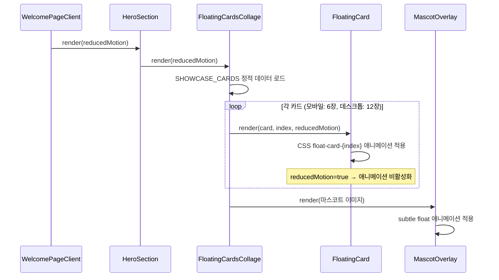
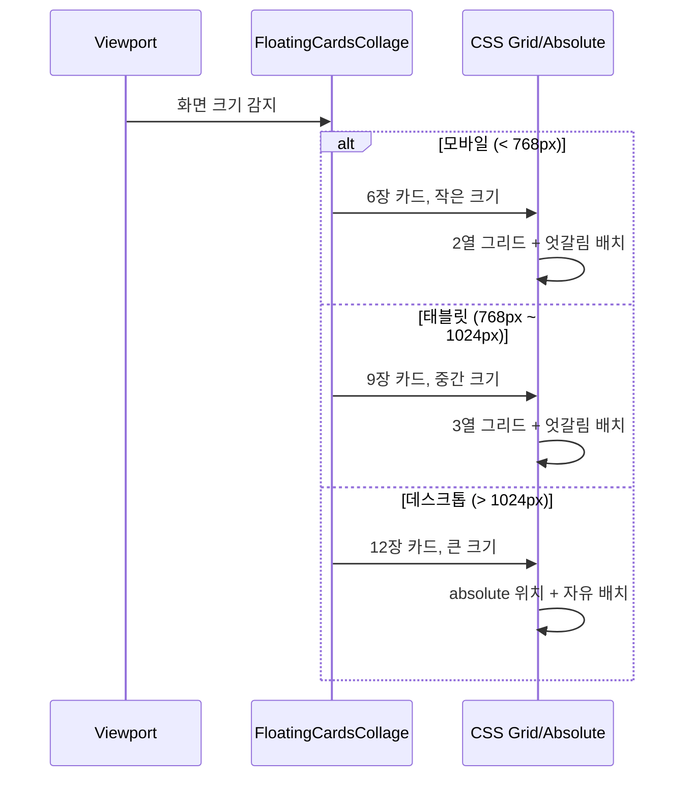

# Design Document: Landing Hero Floating Cards

## Overview

랜딩 페이지 히어로 섹션의 Three.js 3D 지구본을 "플로팅 카드 콜라주"로 교체한다. 현재 지구본은 카테고리 아이콘만 표시하여 시각적으로 밋밋하고, 회색 반투명 구체가 단조로우며, Three.js 의존성(`three`, `@react-three/fiber`, `@react-three/drei`)이 번들 사이즈를 크게 증가시킨다.

새로운 플로팅 카드 콜라주는 실제 스팟 사진과 작품명이 표시된 카드들이 다크 배경 위에서 천천히 떠다니는 Pinterest/Dribbble 스타일의 시각적으로 풍부한 레이아웃이다. CSS 애니메이션 기반으로 구현하여 Three.js 의존성을 완전히 제거하고, 마스코트(흰 고양이)는 카드 콜라주 위에 자연스럽게 통합한다. 모바일에서도 카드 수와 크기를 조절하여 최적의 경험을 제공한다.

## Architecture

```mermaid
graph TD
    WPC[WelcomePageClient] --> HS[HeroSection]
    HS --> FCC[FloatingCardsCollage]
    HS --> CTA[CTAButton]
    
    FCC --> FC1[FloatingCard ×N]
    FCC --> MC[MascotOverlay]
    
    FC1 --> |CSS keyframes| ANI[float-card-N animations]
    MC --> |static/subtle animation| MANI[mascot-float animation]
    
    FCC --> |데이터| SCD[SHOWCASE_CARDS 정적 데이터]
    
    subgraph "제거 대상"
        G3D[Globe3D]
        GF2D[GlobeFallback2D]
        MW[MascotWalker]
        GD[globeData.ts]
    end
    
    subgraph "번들 제거"
        THREE[three]
        RTF[@react-three/fiber]
        RTD[@react-three/drei]
    end
```

## Sequence Diagrams

### 히어로 섹션 렌더링 플로우



### 반응형 카드 배치 플로우



## Components and Interfaces

### Component 1: FloatingCardsCollage

**Purpose**: 히어로 섹션의 비주얼 영역. 여러 장의 스팟 카드가 떠다니는 콜라주를 렌더링한다.

```typescript
interface FloatingCardsCollageProps {
  /** 모션 감소 설정 (prefers-reduced-motion) */
  reducedMotion: boolean
  /** 추가 CSS 클래스 */
  className?: string
}
```

**Responsibilities**:
- SHOWCASE_CARDS 정적 데이터에서 카드 목록을 가져와 렌더링
- 반응형 카드 수 조절 (모바일 6장, 태블릿 9장, 데스크톱 12장)
- 각 카드에 고유한 float 애니메이션 딜레이/속도 부여
- 마스코트 오버레이를 카드 콜라주 위에 배치
- reducedMotion=true 시 애니메이션 비활성화 (정적 배치)
- 접근성: `role="img"`, `aria-label` 제공

### Component 2: FloatingCard

**Purpose**: 개별 플로팅 카드. 스팟 이미지와 작품명을 표시한다.

```typescript
interface ShowcaseCard {
  /** 카드 ID */
  id: string
  /** 스팟 이름 */
  spotName: string
  /** 관련 작품명 */
  contentName: string
  /** 카테고리 */
  category: SpotCategory
  /** 이미지 URL (정적 에셋 또는 외부 URL) */
  imageUrl: string
}

interface FloatingCardProps {
  /** 카드 데이터 */
  card: ShowcaseCard
  /** 카드 인덱스 (애니메이션 딜레이 계산용) */
  index: number
  /** 모션 감소 설정 */
  reducedMotion: boolean
  /** 카드 크기 variant */
  size: 'sm' | 'md' | 'lg'
}
```

**Responsibilities**:
- Next.js Image 컴포넌트로 이미지 최적화 (lazy loading, WebP)
- 카테고리별 accent 색상 표시 (하단 바 또는 테두리)
- 다크 테마에 어울리는 카드 스타일 (반투명 배경, 미세한 글로우)
- 호버 시 살짝 확대 + 그림자 강화 (데스크톱)
- 각 카드마다 고유한 CSS 애니메이션 (float 방향, 속도, 딜레이 다름)

### Component 3: MascotOverlay

**Purpose**: 마스코트(흰 고양이)를 카드 콜라주 위에 자연스럽게 배치한다.

```typescript
interface MascotOverlayProps {
  /** 모션 감소 설정 */
  reducedMotion: boolean
  /** 추가 CSS 클래스 */
  className?: string
}
```

**Responsibilities**:
- 마스코트 이미지를 카드 콜라주 우하단에 배치
- 미세한 float 애니메이션 (위아래 2~3px 움직임)
- 모바일에서는 크기 축소 또는 숨김 처리
- reducedMotion=true 시 정적 배치

### Component 4: HeroSection (수정)

**Purpose**: 기존 HeroSection에서 Globe3D/GlobeFallback2D를 FloatingCardsCollage로 교체한다.

```typescript
interface HeroSectionProps {
  /** reducedMotion 설정 (isHighEnd는 더 이상 불필요) */
  reducedMotion: boolean
}
```

**Responsibilities**:
- 기존 `isHighEnd` prop 제거 (Three.js 분기 불필요)
- Globe3D/GlobeFallback2D 대신 FloatingCardsCollage 렌더링
- 텍스트 + CTA 영역은 기존 유지
- 레이아웃: 모바일은 텍스트 위 + 카드 아래, 데스크톱은 좌우 배치

## Data Models

### ShowcaseCard (정적 데이터)

```typescript
interface ShowcaseCard {
  id: string
  spotName: string
  contentName: string
  category: SpotCategory
  imageUrl: string
}
```

**Validation Rules**:
- `id`는 고유해야 함
- `imageUrl`은 유효한 이미지 경로 (정적 에셋 또는 외부 URL)
- `category`는 SpotCategory 유니온 타입 중 하나

### SHOWCASE_CARDS 정적 데이터

```typescript
/**
 * 히어로 섹션에 표시할 쇼케이스 카드 데이터
 * - 12장 (데스크톱 전체 표시, 모바일은 6장만)
 * - 6개 카테고리 균형 배분 (카테고리당 2장)
 * - 실제 스팟 데이터 기반 (globeData.ts의 대표 스팟 활용)
 */
const SHOWCASE_CARDS: ShowcaseCard[] = [
  {
    id: 'sc-1',
    spotName: '가마쿠라코코마에역',
    contentName: '슬램덩크',
    category: 'animation',
    imageUrl: '/images/showcase/kamakura.webp',
  },
  // ... 총 12장
]
```

### 카드 배치 설정

```typescript
/**
 * 각 카드의 위치/크기/애니메이션 설정
 * 데스크톱에서 absolute 배치 시 사용
 */
interface CardPlacement {
  /** top 위치 (%) */
  top: number
  /** left 위치 (%) */
  left: number
  /** 회전 각도 (deg) */
  rotate: number
  /** 카드 크기 */
  size: 'sm' | 'md' | 'lg'
  /** 애니메이션 딜레이 (s) */
  delay: number
  /** 애니메이션 주기 (s) */
  duration: number
  /** z-index */
  zIndex: number
}

const CARD_PLACEMENTS: CardPlacement[] = [
  { top: 5, left: 10, rotate: -8, size: 'lg', delay: 0, duration: 6, zIndex: 3 },
  { top: 15, left: 55, rotate: 5, size: 'md', delay: 0.5, duration: 7, zIndex: 2 },
  { top: 40, left: 5, rotate: 3, size: 'md', delay: 1, duration: 8, zIndex: 2 },
  { top: 35, left: 65, rotate: -5, size: 'lg', delay: 1.5, duration: 6.5, zIndex: 3 },
  { top: 60, left: 25, rotate: 7, size: 'sm', delay: 2, duration: 7.5, zIndex: 1 },
  { top: 65, left: 70, rotate: -3, size: 'md', delay: 0.8, duration: 8.5, zIndex: 2 },
  { top: 10, left: 35, rotate: -12, size: 'sm', delay: 1.2, duration: 7, zIndex: 1 },
  { top: 50, left: 45, rotate: 10, size: 'sm', delay: 1.8, duration: 6, zIndex: 1 },
  { top: 75, left: 10, rotate: -6, size: 'sm', delay: 2.5, duration: 8, zIndex: 1 },
  { top: 80, left: 50, rotate: 4, size: 'md', delay: 0.3, duration: 7, zIndex: 2 },
  { top: 25, left: 80, rotate: -10, size: 'sm', delay: 1.6, duration: 6.5, zIndex: 1 },
  { top: 55, left: 85, rotate: 8, size: 'sm', delay: 2.2, duration: 7.5, zIndex: 1 },
]
```

## Algorithmic Pseudocode

### 카드 Float 애니메이션 알고리즘

```typescript
/**
 * 각 카드에 고유한 float 애니메이션을 생성하는 알고리즘
 * 
 * ALGORITHM generateFloatAnimation
 * INPUT: index (카드 인덱스), placement (CardPlacement)
 * OUTPUT: CSS animation 속성 문자열
 * 
 * 1. 기본 translateY 범위: -8px ~ 8px (카드가 위아래로 떠다님)
 * 2. 미세한 translateX 범위: -3px ~ 3px (좌우 미세 움직임)
 * 3. 미세한 rotate 범위: ±2deg (살짝 기울어짐 변화)
 * 4. duration: placement.duration (6~8.5초, 카드마다 다름)
 * 5. delay: placement.delay (0~2.5초, 카드마다 다름)
 * 6. timing: ease-in-out (부드러운 왕복)
 * 7. iteration: infinite (무한 반복)
 * 8. direction: alternate (왕복)
 */
function getFloatStyle(index: number, placement: CardPlacement): React.CSSProperties {
  // 각 카드마다 다른 float 패턴을 위해 index 기반 오프셋 계산
  const yOffset = 8 + (index % 3) * 2       // 8~12px
  const xOffset = 2 + (index % 4)           // 2~5px
  const rotateOffset = 1 + (index % 3)      // 1~3deg

  return {
    animation: `float-${index} ${placement.duration}s ease-in-out ${placement.delay}s infinite alternate`,
    // CSS keyframes는 글로벌 스타일시트에 정의
  }
}
```

**Preconditions:**
- `index`는 0 이상의 정수
- `placement`는 유효한 CardPlacement 객체

**Postconditions:**
- 반환된 스타일은 유효한 CSS animation 속성
- 각 카드의 애니메이션은 서로 다른 타이밍을 가짐

### 반응형 카드 수 결정 알고리즘

```typescript
/**
 * ALGORITHM selectVisibleCards
 * INPUT: allCards (ShowcaseCard[]), viewportWidth (number)
 * OUTPUT: visibleCards (ShowcaseCard[])
 * 
 * 1. IF viewportWidth < 768 THEN count = 6
 * 2. ELSE IF viewportWidth < 1024 THEN count = 9
 * 3. ELSE count = 12
 * 4. RETURN allCards.slice(0, count)
 * 
 * 카테고리 균형을 위해 SHOWCASE_CARDS는 카테고리 순환 배치:
 * [anim, sports, movie, music, game, other, anim, sports, movie, music, game, other]
 * → 6장 슬라이스 시 각 카테고리 1장씩 보장
 */
```

**Preconditions:**
- `allCards`는 12장, 카테고리 순환 배치
- `viewportWidth`는 양수

**Postconditions:**
- 반환 배열 길이: 6, 9, 또는 12
- 6장 슬라이스 시 6개 카테고리 각 1장 보장

## Key Functions with Formal Specifications

### Function 1: FloatingCardsCollage

```typescript
function FloatingCardsCollage({ reducedMotion, className }: FloatingCardsCollageProps): JSX.Element
```

**Preconditions:**
- `reducedMotion`은 boolean 값
- SHOWCASE_CARDS 데이터가 12장 이상 존재

**Postconditions:**
- 반응형 카드 수만큼 FloatingCard 렌더링
- reducedMotion=true 시 모든 카드 애니메이션 비활성화
- MascotOverlay가 카드 위에 렌더링
- `role="img"`, `aria-label` 접근성 속성 포함

### Function 2: FloatingCard

```typescript
function FloatingCard({ card, index, reducedMotion, size }: FloatingCardProps): JSX.Element
```

**Preconditions:**
- `card`는 유효한 ShowcaseCard 객체
- `index`는 0 이상의 정수
- `size`는 'sm' | 'md' | 'lg' 중 하나

**Postconditions:**
- Next.js Image 컴포넌트로 이미지 렌더링 (lazy loading)
- 카테고리별 accent 색상 적용
- reducedMotion=false 시 float 애니메이션 적용
- 호버 시 scale(1.05) + shadow 강화 (데스크톱)

### Function 3: getCategoryAccentColor

```typescript
function getCategoryAccentColor(category: SpotCategory): string
```

**Preconditions:**
- `category`는 유효한 SpotCategory 값

**Postconditions:**
- 해당 카테고리의 CSS 변수 기반 accent 색상 문자열 반환
- 알 수 없는 카테고리 시 기본 색상 반환

## Example Usage

```typescript
// HeroSection에서 FloatingCardsCollage 사용
export function HeroSection({ reducedMotion }: HeroSectionProps) {
  return (
    <section className="relative flex min-h-screen items-center justify-center overflow-hidden bg-background px-4 py-16">
      {/* 배경 그라데이션 */}
      <div className="pointer-events-none absolute inset-0 bg-gradient-to-b from-primary-900/20 via-transparent to-transparent" />

      <div className="relative z-10 mx-auto flex w-full max-w-6xl flex-col items-center gap-8 lg:flex-row lg:gap-12">
        {/* 텍스트 + CTA */}
        <header className="flex flex-1 flex-col items-center text-center lg:items-start lg:text-left">
          <h1>관광지가 아닌 <span className="text-primary-500">성지</span>를 탐험하세요</h1>
          <p>애니메이션 성지순례, 영화 촬영지, 콘서트 장소 등...</p>
          <CTAButton label="지도 탐색하기" href="/map" size="lg" />
        </header>

        {/* 플로팅 카드 콜라주 (Globe3D 대체) */}
        <FloatingCardsCollage
          reducedMotion={reducedMotion}
          className="h-72 w-72 md:h-[400px] md:w-[400px] lg:h-[500px] lg:w-[500px]"
        />
      </div>
    </section>
  )
}

// FloatingCard 개별 사용 예시
<FloatingCard
  card={{
    id: 'sc-1',
    spotName: '가마쿠라코코마에역',
    contentName: '슬램덩크',
    category: 'animation',
    imageUrl: '/images/showcase/kamakura.webp',
  }}
  index={0}
  reducedMotion={false}
  size="lg"
/>
```

## Correctness Properties

1. **카드 수 일관성**: ∀ viewportWidth, 표시되는 카드 수는 정확히 6(모바일), 9(태블릿), 12(데스크톱) 중 하나
2. **카테고리 균형**: 6장 표시 시 6개 카테고리가 각 1장씩 포함됨
3. **애니메이션 독립성**: ∀ card_i, card_j (i ≠ j), card_i.delay ≠ card_j.delay ∨ card_i.duration ≠ card_j.duration
4. **reducedMotion 준수**: reducedMotion=true → ∀ card, animation = 'none'
5. **접근성**: FloatingCardsCollage는 항상 `role="img"`와 `aria-label`을 가짐
6. **이미지 최적화**: ∀ card, 이미지는 Next.js Image 컴포넌트로 렌더링 (lazy loading, WebP)
7. **Three.js 제거**: 빌드 후 번들에 `three`, `@react-three/fiber`, `@react-three/drei` 미포함
8. **다크 테마 호환**: 카드 배경과 텍스트가 다크 모드에서 가독성 유지

## Error Handling

### Error Scenario 1: 이미지 로드 실패

**Condition**: ShowcaseCard의 imageUrl이 404 또는 네트워크 오류
**Response**: Next.js Image의 `onError` 콜백으로 감지, 카테고리 아이콘 폴백 이미지 표시
**Recovery**: 카드 자체는 유지하되 이미지만 폴백으로 대체. 사용자 경험에 영향 최소화

### Error Scenario 2: 정적 이미지 에셋 누락

**Condition**: `/images/showcase/` 디렉토리에 이미지 파일이 없는 경우
**Response**: 빌드 타임에 감지 불가하므로, 런타임에 onError 폴백 처리
**Recovery**: 카테고리별 기본 아이콘(`/icons/categories/{category}.webp`)을 폴백으로 사용

### Error Scenario 3: CSS 애니메이션 미지원 브라우저

**Condition**: 매우 오래된 브라우저에서 CSS keyframes 미지원
**Response**: 카드가 정적 위치에 표시됨 (graceful degradation)
**Recovery**: 애니메이션 없이도 카드 콜라주 레이아웃은 유지됨

## Testing Strategy

### Unit Testing Approach

- FloatingCard 컴포넌트: 카드 데이터가 올바르게 렌더링되는지 확인
- getCategoryAccentColor: 모든 카테고리에 대해 올바른 색상 반환 확인
- SHOWCASE_CARDS 데이터: 12장, 카테고리 균형 배분 확인
- reducedMotion prop: true 시 애니메이션 클래스 미적용 확인

### Property-Based Testing Approach

**Property Test Library**: fast-check

- **카테고리 균형 속성**: 임의의 카드 배열에서 처음 6장을 슬라이스했을 때 6개 카테고리가 모두 포함되는지
- **애니메이션 고유성 속성**: 임의의 인덱스 쌍에 대해 delay 또는 duration이 다른지
- **카드 배치 범위 속성**: 모든 CardPlacement의 top/left가 0~100% 범위 내인지

### Integration Testing Approach

- HeroSection이 FloatingCardsCollage를 올바르게 렌더링하는지
- WelcomePageClient에서 HeroSection으로 reducedMotion prop이 전달되는지
- Three.js 관련 import가 완전히 제거되었는지 (번들 분석)

## Performance Considerations

1. **번들 사이즈 개선**: Three.js(`three` ~600KB gzipped) + `@react-three/fiber` + `@react-three/drei` 제거로 초기 로드 크게 감소
2. **이미지 최적화**: Next.js Image 컴포넌트의 자동 WebP 변환, lazy loading, srcSet 활용
3. **CSS 애니메이션**: GPU 가속 속성(`transform`, `opacity`)만 사용하여 60fps 유지
4. **will-change 최적화**: 플로팅 카드에 `will-change: transform` 적용하여 합성 레이어 생성
5. **이미지 사이즈**: 쇼케이스 이미지는 최대 400x300px WebP로 제한 (카드 크기에 맞춤)
6. **정적 데이터**: API 호출 없이 정적 데이터 사용으로 네트워크 요청 제거

## Security Considerations

- 외부 이미지 URL 사용 시 `next.config.ts`의 `images.remotePatterns` 설정 필요
- 정적 에셋 사용 시 보안 이슈 없음
- 사용자 입력 데이터 없음 (정적 쇼케이스 데이터)

## Dependencies

### 제거 대상
- `three` (^0.183.2) — 3D 렌더링 엔진
- `@react-three/fiber` (^9.5.0) — React Three.js 바인딩
- `@react-three/drei` (^10.7.7) — Three.js 유틸리티
- `@types/three` (^0.183.1) — Three.js 타입 정의

### 유지
- `next` (^15.1.0) — Next.js Image 컴포넌트
- `tailwindcss` (^3.4.17) — 스타일링
- CSS keyframes — 플로팅 애니메이션 (추가 의존성 없음)

### 신규 추가 없음
- Framer Motion 등 추가 애니메이션 라이브러리 불필요
- 순수 CSS 애니메이션으로 충분
