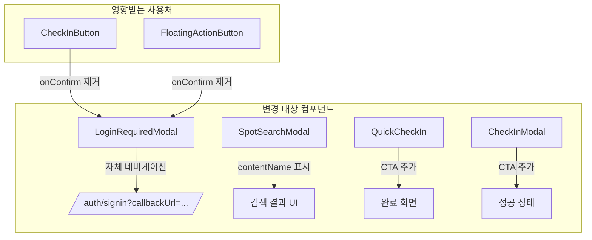

# Design Document: 인증 플로우 UX 개선

## Overview

인증 업로드 유저의 전환 경로(Funnel)에 존재하는 3가지 결함을 수정한다:

1. **LoginRequiredModal 로그인 전환 통일** — 비로그인 유저가 인증 시도 시 모달만 닫히는 문제를 해결하여, 확인 버튼 클릭 시 `/auth/signin?callbackUrl=...`로 이동하도록 모달을 자체 완결형으로 리팩토링
2. **SpotSearchModal 작품 맥락 표시** — 검색 결과에 연결된 작품명(contentName)을 표시하여 동명 스팟 구분 가능하게 개선
3. **인증 완료 후 CTA** — 인증 완료 화면에 "내 인증 보기", "같은 작품 더 보기" 등 다음 행동 유도 버튼 추가

## Architecture

### 컴포넌트 변경 다이어그램



### 변경 범위

| 컴포넌트 | 변경 유형 | 설명 |
|---------|----------|------|
| `LoginRequiredModal` | 리팩토링 | `onConfirm` prop 제거, 내부에서 `useRouter` + `usePathname` 사용 |
| `CheckInButton` | 수정 | `LoginRequiredModal`에 `onConfirm` 전달 제거 |
| `FloatingActionButton` | 수정 | `LoginRequiredModal`에 `onConfirm` 전달 제거 |
| `SpotSearchModal` | 수정 | 검색 결과 매핑에 `contentName` 추가, UI에 작품명 표시 |
| `QuickCheckIn` | 수정 | 완료 단계에 CTA 버튼 3개 추가 |
| `CheckInModal` | 수정 | 성공 상태 UI 추가 (CTA 버튼) |

### 설계 결정 및 근거

1. **LoginRequiredModal 자체 완결형 설계**: 각 사용처에서 `onConfirm`으로 네비게이션 로직을 전달하는 대신, 모달 내부에서 처리한다. 이렇게 하면 모든 사용처에서 동일한 동작이 보장되고, 새로운 사용처 추가 시 실수를 방지할 수 있다.

2. **새 API 엔드포인트 불필요**: `/api/spots?search=...` API는 이미 spots 컬렉션의 전체 데이터를 조회하지만, 응답을 `SpotPin` 형태로 변환할 때 `relatedContent`를 포함하지 않는다. API 응답에 `relatedContent[0].name`을 추가하면 프론트엔드에서 바로 사용 가능하다.

3. **contentName 전달 경로**: QuickCheckIn/CheckInModal은 이미 `relations` 데이터를 조회하므로, 선택된 relation의 `contentName`을 완료 화면에서 바로 사용할 수 있다.

## Components and Interfaces

### LoginRequiredModal (리팩토링)

```typescript
// Before
interface LoginRequiredModalProps {
  isOpen: boolean
  title?: string
  description?: string
  onConfirm: () => void  // 각 사용처에서 전달
}

// After
interface LoginRequiredModalProps {
  isOpen: boolean
  title?: string
  description?: string
  callbackUrl?: string  // 선택적, 기본값: usePathname() 결과
  onClose?: () => void  // 모달 닫기 (배경 클릭 등)
}
```

### SpotSearchResult (확장)

```typescript
interface SpotSearchResult {
  id: string
  name: string
  thumbnailUrl: string
  category?: string
  contentName?: string  // 추가: relatedContent[0].name
}
```

### SpotPin API 응답 확장

```typescript
// GET /api/spots 응답의 SpotPin에 contentName 추가
interface SpotPin {
  id: string
  name: string
  coordinates: [number, number]
  thumbnailUrl: string
  category?: string
  checkInCount: number
  contentName?: string  // 추가
}
```

### QuickCheckIn / CheckInModal CTA Props

```typescript
// 내부 상태로 관리 (별도 props 불필요)
// selectedRelationId → relations에서 contentName 추출
```

## Data Models

### SpotPin 응답 확장

기존 `SpotPin` 타입에 `contentName` 필드를 추가한다:

```typescript
// src/types/index.ts
export interface SpotPin {
  id: string
  name: string
  coordinates: [number, number]
  thumbnailUrl: string
  category?: SpotCategory
  checkInCount: number
  contentName?: string  // NEW: 첫 번째 relatedContent의 name
}
```

### API 매핑 변경

```typescript
// src/app/api/spots/route.ts — GET 핸들러 매핑 부분
const spotPins: SpotPin[] = spots.map((spot) => ({
  id: spot.id,
  name: spot.name,
  coordinates: [spot.coordinates.lat, spot.coordinates.lng],
  thumbnailUrl: spot.photos[0] || '',
  category: spot.category,
  checkInCount: checkInCountMap.get(spot.id) || 0,
  contentName: spot.relatedContent?.[0]?.name,  // NEW
}))
```

## Algorithmic Pseudocode

### LoginRequiredModal 네비게이션 로직

```
function handleConfirm():
  currentPath = usePathname() 또는 props.callbackUrl
  encodedCallback = encodeURIComponent(currentPath)
  router.push("/auth/signin?callbackUrl=" + encodedCallback)
```

### SpotSearchModal contentName 매핑

```
function mapSearchResults(apiResponse):
  for each spot in apiResponse.spots:
    result = {
      id: spot.id,
      name: spot.name,
      thumbnailUrl: spot.thumbnailUrl,
      category: spot.category,
      contentName: spot.contentName  // API에서 이미 매핑됨
    }
  return results
```

### QuickCheckIn 완료 화면 CTA 로직

```
function renderCompleteStep():
  contentName = getContentNameFromSelectedRelation()
  
  render "내 인증 보기" → navigate("/gallery?tab=my")
  
  if contentName exists:
    render "같은 작품 더 보기" → navigate("/contents/" + contentName)
  
  render "확인" → onClose()
```

## Correctness Properties

*A property is a characteristic or behavior that should hold true across all valid executions of a system—essentially, a formal statement about what the system should do. Properties serve as the bridge between human-readable specifications and machine-verifiable correctness guarantees.*

### Property 1: callbackUrl 구성 정확성

*For any* 유효한 pathname 문자열에 대해, LoginRequiredModal의 확인 버튼 클릭 시 생성되는 URL은 반드시 `/auth/signin?callbackUrl={encodeURIComponent(pathname)}` 형태여야 한다.

**Validates: Requirements 1.3**

### Property 2: contentName 매핑 정확성

*For any* relatedContent 배열을 가진 스팟 데이터에 대해, API 응답 매핑 함수는 `relatedContent[0].name`을 `contentName` 필드로 정확히 추출해야 하며, relatedContent가 비어있거나 없는 경우 `contentName`은 undefined여야 한다.

**Validates: Requirements 2.1, 2.3, 2.4**

### Property 3: 작품 페이지 CTA URL 생성 정확성

*For any* 유효한 contentName 문자열에 대해, "같은 작품 더 보기" CTA의 링크는 반드시 `/contents/{contentName}` 형태여야 한다.

**Validates: Requirements 3.5**

## Error Handling

| 시나리오 | 처리 방식 |
|---------|----------|
| `usePathname()` 반환값이 null | 기본값 `/` 사용 |
| API 검색 결과에 `contentName`이 없는 스팟 | 작품명 영역 비표시, 카테고리만 표시 |
| 선택된 relation이 없는 상태에서 완료 | "같은 작품 더 보기" CTA 비표시 |
| `router.push` 실패 | 에러 무시 (브라우저 기본 동작에 위임) |
| 인증 완료 후 relations 데이터 유실 | CTA에서 contentName 관련 버튼 숨김 |

## Testing Strategy

### 단위 테스트 (Jest + @testing-library/react)

1. **LoginRequiredModal**
   - 확인 버튼 클릭 시 `router.push`가 올바른 URL로 호출되는지 확인
   - `callbackUrl` prop이 전달되면 해당 값 사용, 없으면 `usePathname()` 결과 사용
   - 모달이 닫힌 상태에서 렌더링되지 않는지 확인

2. **SpotSearchModal**
   - 검색 결과에 `contentName`이 표시되는지 확인
   - `contentName`이 없는 결과에서 작품명 영역이 비어있는지 확인

3. **QuickCheckIn 완료 화면**
   - "내 인증 보기" 버튼이 `/gallery?tab=my` 링크를 가지는지 확인
   - contentName이 있을 때 "같은 작품 더 보기" 버튼이 표시되는지 확인
   - contentName이 없을 때 "같은 작품 더 보기" 버튼이 숨겨지는지 확인
   - "확인" 버튼 클릭 시 `onClose`가 호출되는지 확인

4. **CheckInModal 성공 상태**
   - 인증 성공 후 CTA UI가 표시되는지 확인

### 속성 기반 테스트 (fast-check)

- **라이브러리**: fast-check (이미 프로젝트에 설치됨)
- **최소 반복 횟수**: 100회

| Property | 테스트 내용 | Tag |
|----------|-----------|-----|
| Property 1 | 임의의 pathname에 대한 callbackUrl 구성 | Feature: 33-auth-flow-fix, Property 1: callbackUrl 구성 정확성 |
| Property 2 | 임의의 relatedContent 배열에 대한 contentName 매핑 | Feature: 33-auth-flow-fix, Property 2: contentName 매핑 정확성 |
| Property 3 | 임의의 contentName에 대한 CTA URL 생성 | Feature: 33-auth-flow-fix, Property 3: 작품 페이지 CTA URL 생성 정확성 |

### 통합 테스트

- LoginRequiredModal이 CheckInButton, FloatingActionButton 등 모든 사용처에서 동일하게 동작하는지 확인
- SpotSearchModal에서 실제 API 응답 구조와 매핑이 일치하는지 확인
