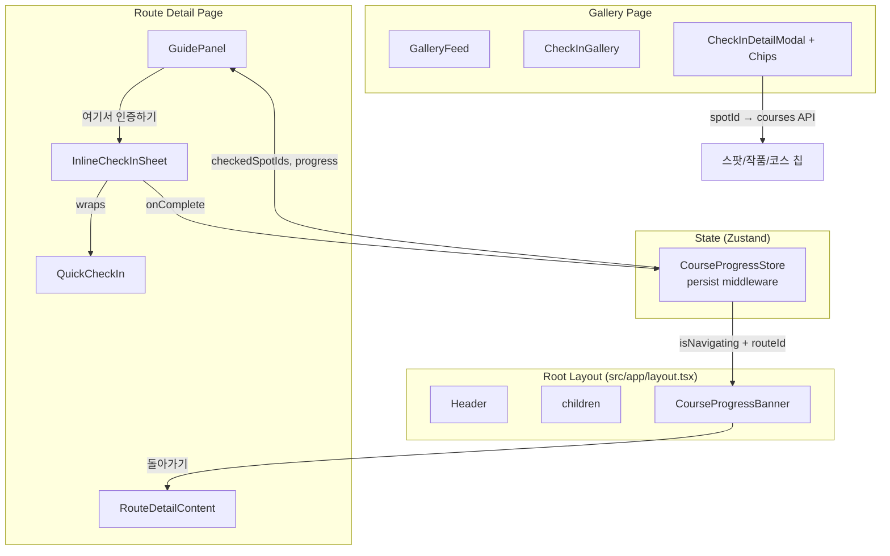
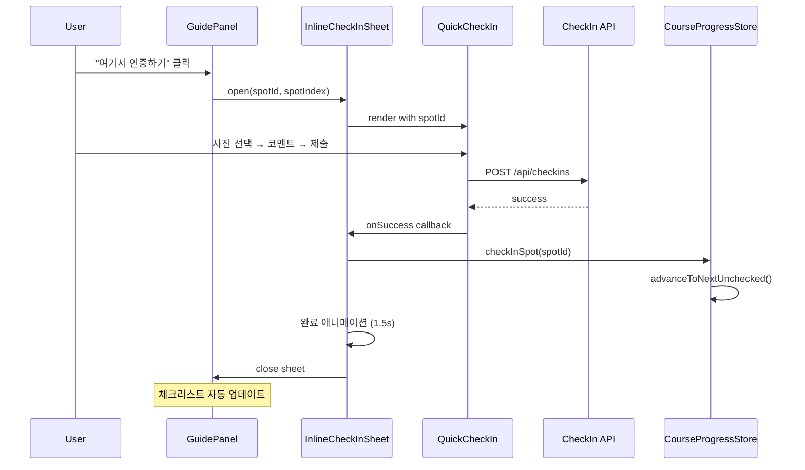

# Design Document: 코스 인라인 체크인

## Overview

코스 진행 중 인증 시 페이지 이탈 없이 바텀시트에서 인증을 완료하고, 자동으로 다음 스팟으로 진행하는 기능이다. 추가로 코스 진행 상태를 글로벌로 유지하여 다른 페이지에서도 "코스 진행 중" 배너를 표시하고, 갤러리 카드에서 스팟/작품/코스 연결을 강화한다.

### 핵심 변경사항

1. **InlineCheckInSheet**: GuidePanel의 "여기서 인증하기" → 바텀시트 오버레이로 QuickCheckIn 렌더링
2. **CourseProgressStore 확장**: persist 미들웨어 추가, 자동 진행 로직 내장
3. **CourseProgressBanner**: 글로벌 플로팅 배너 (코스 상세 페이지 외 모든 페이지)
4. **Gallery 카드 연결 강화**: 인증 카드에 스팟/작품/코스 칩 추가

## Architecture

### 컴포넌트 다이어그램



### 상태 흐름 (State Flow)



## Components and Interfaces

### 1. InlineCheckInSheet

```typescript
// src/components/route/InlineCheckInSheet.tsx

interface InlineCheckInSheetProps {
  /** 인증할 스팟 ID */
  spotId: string
  /** 스팟 이름 (헤더 표시용) */
  spotName: string
  /** 코스 내 스팟 순서 (1-based, 헤더 표시용) */
  spotIndex: number
  /** 시트 열림 상태 */
  isOpen: boolean
  /** 닫기 핸들러 */
  onClose: () => void
  /** 인증 완료 콜백 */
  onComplete: (spotId: string) => void
}
```

**구현 방식:**
- CSS `fixed` 포지셔닝 + backdrop (`bg-black/50`)
- 내부에 QuickCheckIn 컴포넌트 렌더링
- QuickCheckIn의 `onSuccess` 콜백에서:
  1. `onComplete(spotId)` 호출 → Store 업데이트
  2. 1.5초 딜레이 후 `onClose()` 호출
- 배경 클릭 또는 X 버튼으로 닫기 가능 (인증 진행 중에는 비활성화)

### 2. CourseProgressStore 확장

```typescript
// src/stores/courseProgressStore.ts (기존 파일 수정)

interface CourseProgressState {
  activeRouteId: string | null
  activeRoute: Route | null
  currentSpotIndex: number
  checkedSpotIds: Set<string>
  startedAt: Date | null
  isNavigating: boolean
  /** 배너 일시 숨김 여부 (dismiss 시 true) */
  isBannerDismissed: boolean
}

interface CourseProgressActions {
  startRoute: (route: Route, userId: string) => Promise<void>
  checkInSpot: (spotId: string) => void
  /** 다음 미인증 스팟으로 자동 이동 */
  advanceToNextUnchecked: () => void
  moveToNextSpot: () => void
  endRoute: () => void
  resetProgress: () => void
  /** 배너 일시 숨김 */
  dismissBanner: () => void
  /** 배너 다시 표시 */
  showBanner: () => void
}
```

**변경사항:**
- `persist` 미들웨어 추가 (localStorage, Set → Array 직렬화)
- `advanceToNextUnchecked()` 액션 추가
- `isBannerDismissed` 상태 추가
- `dismissBanner()` / `showBanner()` 액션 추가

### 3. CourseProgressBanner

```typescript
// src/components/course/CourseProgressBanner.tsx

interface CourseProgressBannerProps {
  // props 없음 - Store에서 직접 구독
}
```

**렌더링 위치:** `src/app/layout.tsx`의 `<Providers>` 내부, `<main>` 아래

**표시 조건:**
- `isNavigating === true`
- `isBannerDismissed === false`
- 현재 경로가 `/routes/{activeRouteId}`가 아닌 경우

**UI 구성:**
- 하단 고정 플로팅 바 (z-30, bottom-safe)
- 코스명 (truncate) + 진행률 % + "돌아가기" 버튼 + X 닫기 버튼

### 4. Gallery CheckIn Card 연결 강화

```typescript
// src/components/checkin/CheckInDetailModal.tsx (기존 파일 수정)

// 추가할 칩 데이터 타입
interface CheckInRelatedInfo {
  spot: { id: string; name: string }
  content?: { id: string; name: string; type: string }
  courses: Array<{ id: string; name: string }>
}
```

**새 API:**
```typescript
// GET /api/spots/[id]/courses
// Response: { courses: Array<{ id: string; name: string }> }
```

### 5. RouteDetailContent 수정

```typescript
// handleCheckIn 변경: router.push → InlineCheckInSheet 열기

const [inlineCheckIn, setInlineCheckIn] = useState<{
  spotId: string
  spotName: string
  spotIndex: number
} | null>(null)

const handleCheckIn = (spotId: string) => {
  const spotIdx = route.spots.findIndex(s => s.spotId === spotId)
  const spot = route.spots[spotIdx]
  setInlineCheckIn({
    spotId,
    spotName: spot.spotName,
    spotIndex: spotIdx + 1,
  })
}

const handleCheckInComplete = (spotId: string) => {
  nav.checkInSpot(spotId)
  // advanceToNextUnchecked는 store 내부에서 자동 호출
}
```

## Data Models

### CourseProgressStore (Zustand + persist)

```typescript
// 직렬화 형태 (localStorage)
interface PersistedCourseProgress {
  activeRouteId: string | null
  activeRoute: Route | null  // 전체 Route 객체 저장
  currentSpotIndex: number
  checkedSpotIds: string[]   // Set → Array로 직렬화
  startedAt: string | null   // Date → ISO string
  isNavigating: boolean
  isBannerDismissed: boolean
}

// persist 설정
{
  name: 'course-progress',
  storage: createJSONStorage(() => localStorage),
  partialize: (state) => ({
    activeRouteId: state.activeRouteId,
    activeRoute: state.activeRoute,
    currentSpotIndex: state.currentSpotIndex,
    checkedSpotIds: Array.from(state.checkedSpotIds),
    startedAt: state.startedAt?.toISOString() ?? null,
    isNavigating: state.isNavigating,
    isBannerDismissed: state.isBannerDismissed,
  }),
  // rehydrate 시 Array → Set, string → Date 변환
}
```

### 새 API: GET /api/spots/[id]/courses

```typescript
// Request
GET /api/spots/{spotId}/courses

// Response
{
  courses: Array<{
    id: string       // Route ID
    name: string     // 코스명
  }>
}
```

**MongoDB 쿼리:**
```javascript
db.routes.find(
  { "spots.spotId": spotId, isPublic: true },
  { _id: 1, name: 1 }
)
```

## Algorithmic Pseudocode

### Auto-Advance 로직

```
function advanceToNextUnchecked():
  route = activeRoute
  if route is null: return

  availableSpots = route.spots.filter(s => s.isAvailable !== false)
  currentIdx = currentSpotIndex

  // 현재 인덱스 이후부터 순환 탐색
  for i in range(currentIdx + 1, availableSpots.length):
    if availableSpots[i].spotId NOT IN checkedSpotIds:
      set currentSpotIndex = i (원본 spots 배열 기준 인덱스)
      return

  // 현재 인덱스 이전도 탐색 (순환)
  for i in range(0, currentIdx):
    if availableSpots[i].spotId NOT IN checkedSpotIds:
      set currentSpotIndex = i
      return

  // 모든 스팟 인증 완료 → 인덱스 유지 (완주 상태)
```

### Banner 표시 조건 로직

```
function shouldShowBanner(pathname: string):
  if NOT isNavigating: return false
  if isBannerDismissed: return false
  if activeRouteId is null: return false
  if pathname === `/routes/${activeRouteId}`: return false
  return true
```

### InlineCheckInSheet 완료 후 흐름

```
function onCheckInSuccess(spotId):
  1. store.checkInSpot(spotId)        // checkedSpotIds에 추가
  2. store.advanceToNextUnchecked()   // 다음 미인증 스팟으로 이동
  3. show completion animation
  4. wait 1500ms
  5. close sheet
  6. if all available spots checked:
       trigger completion effect
```

## Correctness Properties

*A property is a characteristic or behavior that should hold true across all valid executions of a system — essentially, a formal statement about what the system should do. Properties serve as the bridge between human-readable specifications and machine-verifiable correctness guarantees.*

### Property 1: 체크인 후 자동 진행 불변식

*For any* 코스 상태(N개의 유효 스팟, 임의의 체크인 부분집합)에서 특정 스팟을 체크인하면, 해당 spotId가 checkedSpotIds에 포함되어야 하고, currentSpotIndex는 다음 미인증 유효 스팟을 가리켜야 한다. 모든 스팟이 인증된 경우 인덱스는 변경되지 않는다.

**Validates: Requirements 2.1, 2.3**

### Property 2: 배너 표시 조건 정합성

*For any* 페이지 경로와 코스 진행 상태 조합에서, CourseProgressBanner는 `isNavigating === true` AND 현재 경로가 `/routes/{activeRouteId}`가 아닌 경우에만 표시되어야 한다. 코스 상세 페이지에서는 절대 표시되지 않는다.

**Validates: Requirements 3.1**

### Property 3: 코스 진행 상태 직렬화 라운드트립

*For any* 유효한 CourseProgressStore 상태에 대해, persist 미들웨어의 직렬화(serialize) 후 역직렬화(deserialize)를 수행하면 원본과 동등한 상태가 복원되어야 한다. (checkedSpotIds Set ↔ Array, startedAt Date ↔ ISO string 변환 포함)

**Validates: Requirements 3.5**

### Property 4: 진행률 계산 정확성

*For any* 코스(N개의 유효 스팟)와 임의의 체크인 부분집합에 대해, progress 값은 항상 `(checkedAvailableCount / totalAvailableCount) * 100`과 동일해야 한다. 유효 스팟이 0개인 경우 progress는 0이다.

**Validates: Requirements 2.1, 3.2**

## Error Handling

| 시나리오 | 처리 방식 |
|---------|----------|
| 인증 API 실패 (네트워크/서버) | InlineCheckInSheet에서 에러 메시지 표시 + "다시 시도" 버튼 |
| 이미지 업로드 실패 | "이미지 업로드에 실패했습니다" 메시지 + 재시도 |
| courses API 실패 (갤러리 칩) | 칩 영역 숨김 (graceful degradation) |
| localStorage 접근 불가 | persist 실패 시 메모리 상태만 유지 (새로고침 시 초기화) |
| 코스 데이터 불일치 (스팟 삭제됨) | isAvailable 필터링으로 유효 스팟만 처리 |
| 동시 인증 시도 (더블 클릭) | isSubmitting 상태로 중복 제출 방지 |

## Testing Strategy

### Unit Tests (Example-based)

- InlineCheckInSheet 열기/닫기 동작
- 배경 클릭 시 시트 닫힘
- 인증 진행 중 닫기 버튼 비활성화
- 완료 애니메이션 후 1.5초 자동 닫힘 (타이머 mock)
- CourseProgressBanner 렌더링 조건
- "돌아가기" 버튼 클릭 시 올바른 경로 이동
- Gallery 칩 렌더링 (스팟/작품/코스)
- courses API 응답에 따른 칩 표시/숨김

### Property-Based Tests (fast-check)

- **Property 1**: 임의의 코스 상태에서 checkInSpot + advanceToNextUnchecked 후 불변식 검증
- **Property 2**: 임의의 pathname + store 상태 조합에서 배너 표시 조건 검증
- **Property 3**: 임의의 store 상태 직렬화/역직렬화 라운드트립
- **Property 4**: 임의의 spots 배열 + checkedSpotIds 조합에서 진행률 계산 정확성

**PBT 라이브러리:** fast-check (프로젝트 기존 설정)
**최소 반복 횟수:** 100회/property
**태그 형식:** `Feature: 35-course-inline-checkin, Property {N}: {title}`

### Integration Tests

- GET /api/spots/[id]/courses API 응답 검증
- InlineCheckInSheet → QuickCheckIn → API → Store 전체 플로우
