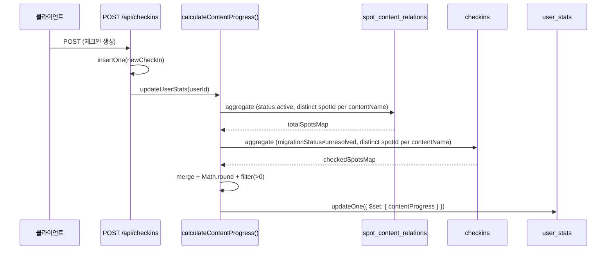
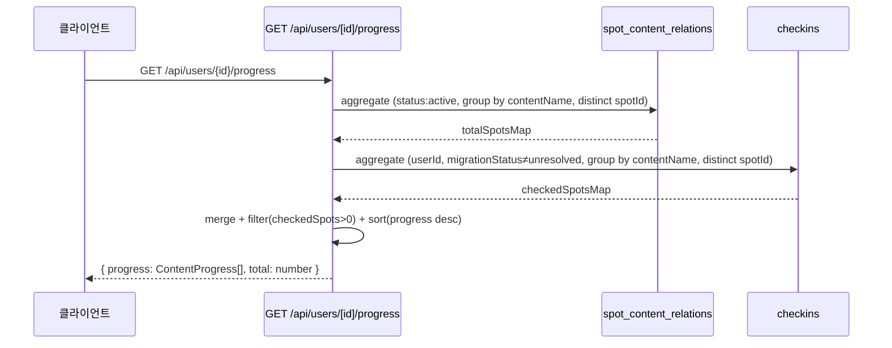
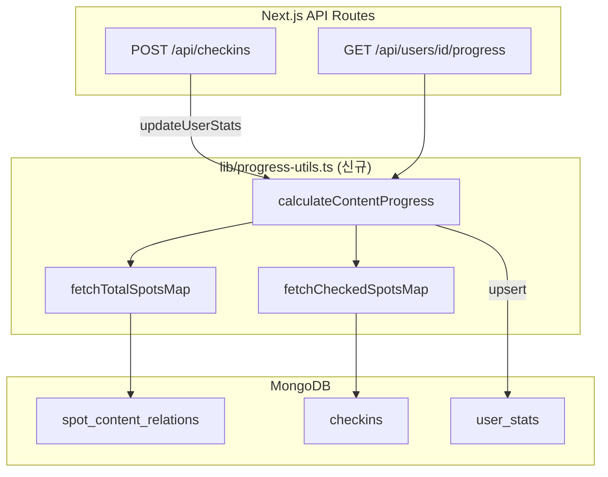

# Design Document: 체크인 콘텐츠 진행률 계산

## Overview

체크인 발생 시 유저의 작품별 진행률(`contentProgress`)을 `spot_content_relations` 컬렉션 기반으로 계산하여 `user_stats`에 저장하고, `GET /api/users/[id]/progress` API가 이 데이터를 반환하도록 교체한다.

### 핵심 변경 범위

1. **`updateUserStats` 함수**: `contentProgress: []` TODO를 실제 MongoDB aggregate 로직으로 대체
2. **`GET /api/users/[id]/progress` API**: `spots.relatedContent` 기반 로직을 `spot_content_relations` 기반으로 교체
3. **데이터 소스 단일화**: 진행률 계산의 분모(총 스팟 수)와 분자(인증 스팟 수) 모두 단일 aggregate 파이프라인으로 처리

### 설계 원칙

- **단일 aggregate 파이프라인**: 두 컬렉션을 한 번의 DB 왕복으로 처리하여 성능 최적화
- **distinct 기반 집계**: 동일 스팟 중복 체크인, 동일 스팟 다중 relation 모두 1회로 계산
- **0% 제외**: `checkedSpots === 0`인 작품은 저장 및 반환 대상에서 제외

## Architecture

### 데이터 흐름





### 컴포넌트 구조



## Components and Interfaces

### 신규 파일

| 파일 경로 | 역할 |
|---|---|
| `src/lib/progress-utils.ts` | `calculateContentProgress` 순수 계산 함수 및 DB 집계 헬퍼 |

### 수정 파일

| 파일 경로 | 변경 내용 |
|---|---|
| `src/app/api/checkins/route.ts` | `updateUserStats` 내 `contentProgress: []` → `calculateContentProgress` 호출 |
| `src/app/api/users/[id]/progress/route.ts` | `spots.relatedContent` 기반 로직 → `spot_content_relations` 기반으로 전면 교체 |

### `progress-utils.ts` 인터페이스

```typescript
// src/lib/progress-utils.ts

import { ContentProgress } from '@/types'

/**
 * spot_content_relations에서 contentName별 총 스팟 수 집계
 * - status: 'active'인 문서만 포함
 * - 동일 contentName에 동일 spotId가 여러 relation으로 연결된 경우 1회로 계산
 */
export async function fetchTotalSpotsMap(): Promise<Map<string, number>>

/**
 * checkins에서 userId별 contentName별 인증 스팟 수 집계
 * - migrationStatus: { $ne: 'unresolved' }인 문서만 포함
 * - 동일 스팟에 여러 번 체크인이 있어도 1회로 계산 (distinct spotId)
 */
export async function fetchCheckedSpotsMap(
  userId: string
): Promise<Map<string, number>>

/**
 * totalSpotsMap과 checkedSpotsMap을 병합하여 ContentProgress[] 계산
 * - checkedSpots === 0인 항목 제외
 * - progress = Math.round((checkedSpots / totalSpots) * 100)
 */
export function mergeProgressMaps(
  totalSpotsMap: Map<string, number>,
  checkedSpotsMap: Map<string, number>
): ContentProgress[]
```

## Data Models

### MongoDB Aggregate 파이프라인

#### 총 스팟 수 집계 (`spot_content_relations`)

```javascript
// fetchTotalSpotsMap 내부 파이프라인
[
  // 1. active 상태만 필터
  { $match: { status: 'active' } },

  // 2. contentName별로 distinct spotId 집계
  {
    $group: {
      _id: { contentName: '$contentName', spotId: '$spotId' }
    }
  },

  // 3. contentName별 고유 스팟 수 카운트
  {
    $group: {
      _id: '$_id.contentName',
      totalSpots: { $sum: 1 }
    }
  }
]
```

#### 인증 스팟 수 집계 (`checkins`)

```javascript
// fetchCheckedSpotsMap 내부 파이프라인
[
  // 1. 해당 유저 + unresolved 제외 필터
  {
    $match: {
      userId: userId,
      migrationStatus: { $ne: 'unresolved' },
      contentName: { $exists: true, $ne: null }
    }
  },

  // 2. contentName별로 distinct spotId 집계
  {
    $group: {
      _id: { contentName: '$contentName', spotId: '$spotId' }
    }
  },

  // 3. contentName별 고유 인증 스팟 수 카운트
  {
    $group: {
      _id: '$_id.contentName',
      checkedSpots: { $sum: 1 }
    }
  }
]
```

### ContentProgress 타입 (기존 유지)

```typescript
// src/types/checkin.ts — 변경 없음
export interface ContentProgress {
  contentName: string
  totalSpots: number
  checkedSpots: number
  progress: number  // 0~100 정수
}
```

### `mergeProgressMaps` 계산 로직

```typescript
function mergeProgressMaps(
  totalSpotsMap: Map<string, number>,
  checkedSpotsMap: Map<string, number>
): ContentProgress[] {
  const result: ContentProgress[] = []

  for (const [contentName, totalSpots] of totalSpotsMap) {
    const checkedSpots = checkedSpotsMap.get(contentName) ?? 0

    // checkedSpots === 0인 작품 제외 (Requirement 1.4)
    if (checkedSpots === 0) continue

    const progress = Math.round((checkedSpots / totalSpots) * 100)

    result.push({ contentName, totalSpots, checkedSpots, progress })
  }

  return result
}
```

### `updateUserStats` 변경 (checkins/route.ts)

```typescript
// 기존
contentProgress: [], // TODO: 콘텐츠별 진행률 계산

// 변경 후
const [totalSpotsMap, checkedSpotsMap] = await Promise.all([
  fetchTotalSpotsMap(),
  fetchCheckedSpotsMap(userId),
])
const contentProgress = mergeProgressMaps(totalSpotsMap, checkedSpotsMap)
```

### `GET /api/users/[id]/progress` 교체 로직

```typescript
// 기존: spots 컬렉션의 relatedContent 기반
// 변경 후: spot_content_relations 기반

const [totalSpotsMap, checkedSpotsMap] = await Promise.all([
  fetchTotalSpotsMap(),
  fetchCheckedSpotsMap(userId),
])

const progress = mergeProgressMaps(totalSpotsMap, checkedSpotsMap)
  .sort((a, b) => b.progress - a.progress) // 진행률 높은 순 (Requirement 3.3)

return NextResponse.json({ progress, total: progress.length })
```

## Correctness Properties

*A property is a characteristic or behavior that should hold true across all valid executions of a system — essentially, a formal statement about what the system should do. Properties serve as the bridge between human-readable specifications and machine-verifiable correctness guarantees.*

### Property 1: 총 스팟 수 집계 정확성 (active + distinct)

*For any* `spot_content_relations` 데이터셋에서, `fetchTotalSpotsMap`이 반환하는 각 `contentName`의 `totalSpots`는 해당 `contentName`에 `status: 'active'`인 문서들의 distinct `spotId` 수와 정확히 일치해야 한다.

**Validates: Requirements 1.1, 2.1, 2.2, 2.3**

### Property 2: 인증 스팟 수 집계 정확성 (unresolved 제외 + distinct)

*For any* `checkins` 데이터셋과 `userId`에서, `fetchCheckedSpotsMap`이 반환하는 각 `contentName`의 `checkedSpots`는 해당 유저의 `migrationStatus !== 'unresolved'`인 체크인들의 distinct `spotId` 수와 정확히 일치해야 한다.

**Validates: Requirements 1.2, 1.6, 4.3**

### Property 3: 진행률 범위 및 공식 준수

*For any* 유효한 `(checkedSpots, totalSpots)` 쌍 (`0 ≤ checkedSpots ≤ totalSpots`, `totalSpots > 0`)에 대해, `Math.round((checkedSpots / totalSpots) * 100)` 계산 결과는 항상 0 이상 100 이하의 정수여야 한다.

**Validates: Requirements 1.3**

### Property 4: 0% 작품 제외 필터링

*For any* `ContentProgress[]` 배열에 대해, `mergeProgressMaps`가 반환하는 결과에는 `checkedSpots === 0`인 항목이 포함되지 않아야 한다.

**Validates: Requirements 1.4, 3.2**

### Property 5: 진행률 내림차순 정렬

*For any* `ContentProgress[]` 배열에 대해, 정렬 함수 적용 후 결과 배열의 인접한 두 항목 `a[i]`와 `a[i+1]`에 대해 항상 `a[i].progress >= a[i+1].progress`가 성립해야 한다.

**Validates: Requirements 3.3**

## Error Handling

| 상황 | HTTP 상태 | 응답 | 처리 방식 |
|---|---|---|---|
| DB 조회 오류 (progress API) | 500 | `{ error: '진행률 조회에 실패했습니다' }` | try-catch + console.error |
| `updateUserStats` 내 집계 오류 | — | 오류 전파 (체크인 생성 실패) | 기존 패턴 유지 |
| `contentName`이 없는 체크인 | — | 집계에서 자동 제외 | `$match: { contentName: { $exists: true, $ne: null } }` |
| `totalSpots === 0`인 contentName | — | 결과에서 제외 | `mergeProgressMaps`에서 totalSpotsMap 기준으로만 순회 |

### 에러 처리 원칙

- `fetchTotalSpotsMap`과 `fetchCheckedSpotsMap`은 `Promise.all`로 병렬 실행하여 성능 최적화
- 어느 한쪽이 실패하면 전체 `updateUserStats`가 실패하여 체크인 생성도 실패 처리
- progress API는 독립적으로 에러를 처리하여 500 반환

## Testing Strategy

### 테스트 프레임워크

- **단위 테스트**: Jest
- **속성 기반 테스트 (PBT)**: fast-check
- **PBT 최소 반복 횟수**: 100회

### 속성 기반 테스트 (Property-Based Tests)

| Property | 테스트 파일 | 태그 |
|---|---|---|
| Property 1 | `__tests__/checkin-content-progress/progress-utils.property.test.ts` | Feature: 38-checkin-content-progress, Property 1: 총 스팟 수 집계 정확성 |
| Property 2 | `__tests__/checkin-content-progress/progress-utils.property.test.ts` | Feature: 38-checkin-content-progress, Property 2: 인증 스팟 수 집계 정확성 |
| Property 3 | `__tests__/checkin-content-progress/progress-utils.property.test.ts` | Feature: 38-checkin-content-progress, Property 3: 진행률 범위 및 공식 준수 |
| Property 4 | `__tests__/checkin-content-progress/progress-utils.property.test.ts` | Feature: 38-checkin-content-progress, Property 4: 0% 작품 제외 필터링 |
| Property 5 | `__tests__/checkin-content-progress/progress-utils.property.test.ts` | Feature: 38-checkin-content-progress, Property 5: 진행률 내림차순 정렬 |

### 단위 테스트 (Example-Based)

| 테스트 대상 | 테스트 내용 |
|---|---|
| progress API 응답 형식 | `{ progress: ContentProgress[], total: number }` 형태 반환 확인 |
| progress API 500 처리 | DB 오류 모킹 시 500 + 한국어 메시지 반환 확인 |
| `mergeProgressMaps` 빈 입력 | 빈 Map 입력 시 빈 배열 반환 |
| `mergeProgressMaps` 전체 인증 | `checkedSpots === totalSpots`일 때 `progress === 100` |

### 테스트 구조

```
__tests__/
└── checkin-content-progress/
    ├── progress-utils.property.test.ts   # Property 1~5 (PBT)
    └── progress-api.unit.test.ts         # Example-based unit tests
```

### PBT 생성기 (fast-check)

```typescript
// SpotContentRelation 문서 생성기
const relationDocArb = fc.record({
  contentName: fc.string({ minLength: 1, maxLength: 50 }),
  spotId: fc.stringMatching(/^SPOT-\d{3,}$/),
  status: fc.constantFrom('active', 'expired', 'scheduled', 'archived'),
})

// CheckIn 문서 생성기
const checkinDocArb = fc.record({
  userId: fc.string({ minLength: 1, maxLength: 30 }),
  spotId: fc.stringMatching(/^SPOT-\d{3,}$/),
  contentName: fc.option(fc.string({ minLength: 1, maxLength: 50 })),
  migrationStatus: fc.constantFrom('resolved', 'unresolved', null),
})

// (checkedSpots, totalSpots) 쌍 생성기
const progressInputArb = fc.nat({ max: 1000 }).chain((total) =>
  fc.tuple(
    fc.constant(total),
    fc.nat({ max: total })
  )
).map(([total, checked]) => ({ totalSpots: total, checkedSpots: checked }))
  .filter(({ totalSpots }) => totalSpots > 0)
```

### 테스트 범위 요약

- **Property 1**: `fetchTotalSpotsMap` 로직을 인메모리 구현으로 재현하여 검증 (DB 모킹)
- **Property 2**: `fetchCheckedSpotsMap` 로직을 인메모리 구현으로 재현하여 검증 (DB 모킹)
- **Property 3**: `mergeProgressMaps` 내 순수 계산 함수 직접 검증
- **Property 4, 5**: `mergeProgressMaps` 출력 배열 속성 검증
