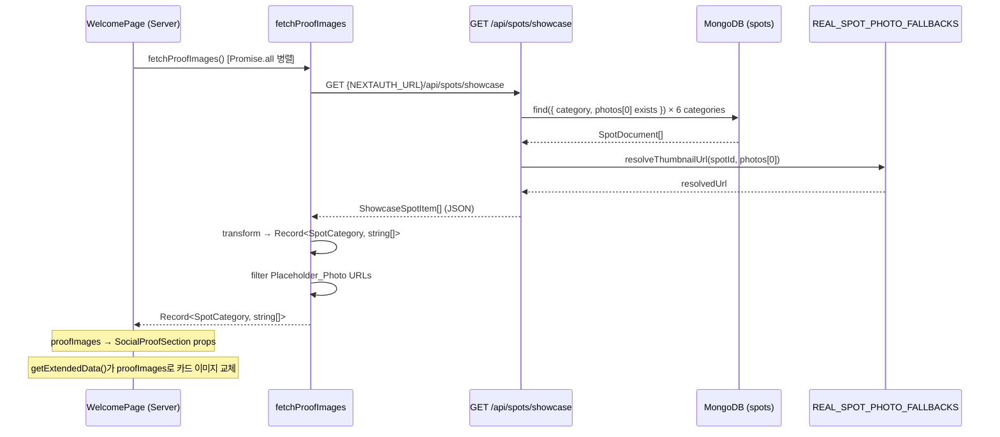

# Design Document

## 39 - Landing Social Proof Real Data

---

## Overview

랜딩 페이지 소셜프루프 섹션(`SocialProofSection`)이 현재 하드코딩된 카테고리 아이콘 이미지를 사용하는 문제를 해결한다. 실제 DB 스팟 데이터를 기반으로 방문자에게 진짜 성지순례 장소 사진을 보여주는 것이 목표다.

핵심 변경 사항은 두 가지다:

1. **`GET /api/spots/showcase` 신규 API 엔드포인트**: MongoDB에서 카테고리별 대표 스팟을 조회하여 `thumbnailUrl`을 포함한 경량 응답을 반환한다. `REAL_SPOT_PHOTO_FALLBACKS` 해결 로직을 포함하여 플레이스홀더 사진 스팟도 Wikimedia 이미지로 대체한다.

2. **`fetchProofImages` 함수 교체**: 기존 DB 직접 접근 방식에서 Showcase API HTTP 호출 방식으로 전환한다. API 실패 시 카테고리 아이콘 폴백으로 graceful degradation한다.

`SocialProofSection` 컴포넌트와 `proofData.ts`의 이미지 교체 로직은 이미 `getExtendedData` 함수에 구현되어 있으므로 `fetchProofImages`가 올바른 데이터를 반환하면 자동으로 동작한다.

---

## Architecture



### 폴백 흐름

```mermaid
flowchart TD
    A[fetchProofImages 호출] --> B{API 호출 성공?}
    B -- 아니오 --> C[console.warn 로깅]
    C --> D[Category_Icon_Fallback 반환]
    B -- 예 --> E[응답 파싱]
    E --> F[Placeholder_Photo URL 필터링]
    F --> G[Record<SpotCategory, string[]> 변환]
    G --> H[반환]

    subgraph API 내부
        I[DB 조회] --> J{photos[0] 존재?}
        J -- 아니오 --> K[스팟 제외]
        J -- 예 --> L{Placeholder_Photo?}
        L -- 아니오 --> M[photos[0] 사용]
        L -- 예 --> N{REAL_SPOT_PHOTO_FALLBACKS에 ID 존재?}
        N -- 예 --> O[Wikimedia URL 사용]
        N -- 아니오 --> P[스팟 제외]
    end
```

---

## Components and Interfaces

### 1. `GET /api/spots/showcase` — 신규 API 엔드포인트

**파일**: `src/app/api/spots/showcase/route.ts`

```typescript
// 응답 타입
interface ShowcaseSpotItem {
  id: string
  name: string
  category: SpotCategory
  thumbnailUrl: string  // 항상 non-null, non-empty (필터링 후)
}

// 응답 형태: ShowcaseSpotItem[]
// 에러 응답: { error: string }, status 500
```

**DB 조회 전략**:
- 6개 카테고리를 `Promise.all`로 병렬 조회
- 각 카테고리당 `photos[0]`이 존재하는 스팟을 최대 8개 조회 (필터링 후 4개 보장)
- MongoDB 정렬: `photos[0]`이 플레이스홀더가 아닌 스팟 우선 (`$cond` 정렬 필드 활용)
- `resolveThumbnailUrl` 함수로 `REAL_SPOT_PHOTO_FALLBACKS` 해결
- `thumbnailUrl`이 null/empty인 스팟은 응답에서 제외
- 카테고리당 최대 4개로 슬라이스

**`resolveThumbnailUrl` 함수** (기존 `resolveLandingPhoto`와 동일 로직):
```typescript
function resolveThumbnailUrl(spotId: string, photoUrl?: string | null): string | null {
  if (photoUrl && !isPlaceholderPhoto(photoUrl)) {
    return photoUrl
  }
  return REAL_SPOT_PHOTO_FALLBACKS[spotId]?.imageUrl ?? null
}
```

### 2. `fetchProofImages` — API 호출 방식으로 교체

**파일**: `src/components/landing/data/fetchShowcaseSpots.ts` (기존 함수 수정)

```typescript
export async function fetchProofImages(): Promise<Record<SpotCategory, string[]>> {
  const iconFallback: Record<SpotCategory, string[]> = {
    animation: ['/icons/categories/animation.webp'],
    sports: ['/icons/categories/sports.webp'],
    movie_drama: ['/icons/categories/movie_drama.webp'],
    music: ['/icons/categories/music.webp'],
    game: ['/icons/categories/game.webp'],
    other: ['/icons/categories/other.webp'],
  }

  try {
    const baseUrl = process.env.NEXTAUTH_URL || 'http://localhost:3000'
    const res = await fetch(`${baseUrl}/api/spots/showcase`, {
      next: { revalidate: 3600 }, // 1시간 캐시
    })

    if (!res.ok) {
      throw new Error(`Showcase API returned ${res.status}`)
    }

    const spots: ShowcaseSpotItem[] = await res.json()

    // Record<SpotCategory, string[]> 변환
    const result: Record<SpotCategory, string[]> = {
      animation: [], sports: [], movie_drama: [],
      music: [], game: [], other: [],
    }

    for (const spot of spots) {
      if (spot.category && spot.thumbnailUrl && !isPlaceholderPhoto(spot.thumbnailUrl)) {
        result[spot.category].push(spot.thumbnailUrl)
      }
    }

    return result
  } catch (error) {
    console.warn('[fetchProofImages] Showcase API 호출 실패, 카테고리 아이콘 폴백 사용:', error)
    return iconFallback
  }
}
```

### 3. 기존 컴포넌트 — 변경 없음

- **`SocialProofSection`**: `proofImages` prop을 받아 `getExtendedData`에서 이미지 교체. 변경 불필요.
- **`ProofCard`**: `onError` 시 `ImageFallback` 표시. 변경 불필요.
- **`WelcomePage`**: `Promise.all`로 `fetchProofImages` 병렬 호출. 변경 불필요.
- **`proofData.ts`**: 더미 데이터의 `image` 필드는 `getExtendedData`에서 `proofImages`로 교체됨. 변경 불필요.

---

## Data Models

### ShowcaseSpotItem (API 응답)

```typescript
interface ShowcaseSpotItem {
  id: string           // 스팟 ID (예: "REAL-ANI-001")
  name: string         // 스팟 이름
  category: SpotCategory  // 카테고리
  thumbnailUrl: string // 해결된 썸네일 URL (항상 non-null)
}
```

### SpotDocument (DB 조회용 내부 타입)

```typescript
interface SpotDocument {
  id: string
  name: string
  photos: string[]
  category?: SpotCategory
}
```

### isPlaceholderPhoto 판별 기준

기존 `fetchShowcaseSpots.ts`의 로직을 그대로 사용:
```typescript
function isPlaceholderPhoto(url?: string | null): boolean {
  if (!url) return true
  return url.includes('picsum.photos/seed/') || url.startsWith('/icons/')
}
```

---

## Correctness Properties

*A property is a characteristic or behavior that should hold true across all valid executions of a system — essentially, a formal statement about what the system should do. Properties serve as the bridge between human-readable specifications and machine-verifiable correctness guarantees.*

### Property 1: API 응답 객체는 항상 필수 필드를 포함한다

*For any* 유효한 스팟 문서 배열에 대해, `resolveThumbnailUrl`을 거쳐 생성된 모든 `ShowcaseSpotItem` 객체는 `id`, `name`, `category`, `thumbnailUrl` 필드를 모두 포함하며, `thumbnailUrl`은 항상 non-null, non-empty 문자열이어야 한다.

**Validates: Requirements 1.2, 5.5**

---

### Property 2: 실제 사진 스팟은 플레이스홀더 스팟보다 항상 앞에 온다

*For any* 카테고리의 스팟 목록에서, 실제 사진(non-Placeholder)을 가진 스팟은 플레이스홀더 사진을 가진 스팟보다 항상 앞에 정렬되어야 한다.

**Validates: Requirements 1.3, 5.1**

---

### Property 3: 카테고리당 반환 스팟 수는 최대 4개를 초과하지 않는다

*For any* 카테고리에 임의 개수의 스팟이 존재하더라도, Showcase API 응답에서 해당 카테고리의 스팟 수는 항상 4개 이하여야 한다.

**Validates: Requirements 1.4, 5.2**

---

### Property 4: fetchProofImages 변환 결과는 항상 올바른 Record 형태다

*For any* Showcase API 응답 배열에 대해, `fetchProofImages`의 변환 결과는 항상 6개 카테고리 키를 모두 포함하는 `Record<SpotCategory, string[]>` 형태여야 하며, 각 값은 string 배열이어야 한다.

**Validates: Requirements 2.2**

---

### Property 5: 플레이스홀더 URL은 fetchProofImages 결과에 포함되지 않는다

*For any* Showcase API 응답에 플레이스홀더 URL이 포함되어 있더라도, `fetchProofImages`의 반환값에는 플레이스홀더 URL이 포함되지 않아야 한다.

**Validates: Requirements 2.5, 4.4**

---

### Property 6: REAL_SPOT_PHOTO_FALLBACKS 해결 로직은 올바르게 동작한다

*For any* 스팟 ID와 `photos[0]` 조합에 대해, `resolveThumbnailUrl` 함수는 다음 우선순위를 항상 따라야 한다: (1) `photos[0]`이 실제 사진이면 그대로 반환, (2) `photos[0]`이 플레이스홀더이고 ID가 `REAL_SPOT_PHOTO_FALLBACKS`에 있으면 Wikimedia URL 반환, (3) 그 외에는 null 반환.

**Validates: Requirements 5.4**

---

### Property 7: 라운드로빈 배분은 카테고리 내 카드 순서를 따른다

*For any* 카테고리의 N개 카드와 M개 이미지(M > 0)에 대해, `getExtendedData`의 이미지 배분 결과에서 k번째 카드의 이미지는 `images[k % M]`이어야 한다.

**Validates: Requirements 3.4**

---

## Error Handling

| 상황 | 처리 방식 |
|------|-----------|
| DB 연결 실패 (API 내부) | HTTP 500 + `{ error: "Failed to fetch showcase spots" }` |
| API 비정상 응답 (fetchProofImages) | `console.warn` 후 `iconFallback` 반환 |
| 네트워크 오류 (fetchProofImages) | `console.warn` 후 `iconFallback` 반환 |
| 카테고리에 유효 스팟 없음 | 해당 카테고리 빈 배열 반환 (iconFallback 유지) |
| `thumbnailUrl` 로드 실패 (브라우저) | `ProofCard`의 `ImageFallback` 컴포넌트 표시 (📍 이모지) |
| `REAL_SPOT_PHOTO_FALLBACKS`에 없는 플레이스홀더 스팟 | API 응답에서 해당 스팟 제외 |

### Graceful Degradation 계층

```
실제 스팟 thumbnailUrl
  → REAL_SPOT_PHOTO_FALLBACKS Wikimedia URL
    → Category_Icon_Fallback (/icons/categories/*.webp)
      → ImageFallback 컴포넌트 (📍)
```

---

## Testing Strategy

### 단위 테스트 (Jest)

**`resolveThumbnailUrl` 함수**:
- 실제 사진 URL → 그대로 반환
- 플레이스홀더 URL + REAL_SPOT_PHOTO_FALLBACKS에 있는 ID → Wikimedia URL 반환
- 플레이스홀더 URL + REAL_SPOT_PHOTO_FALLBACKS에 없는 ID → null 반환
- null/undefined → null 반환

**`fetchProofImages` 함수**:
- 정상 API 응답 → 올바른 Record 변환
- API 실패 → iconFallback 반환 + console.warn 호출
- 플레이스홀더 URL 포함 응답 → 필터링 후 반환
- NEXTAUTH_URL 환경 변수 → 올바른 base URL 사용

### 속성 기반 테스트 (fast-check)

**라이브러리**: `fast-check` (프로젝트 기존 사용)
**최소 반복 횟수**: 100회

```typescript
// Property 1: API 응답 객체 필수 필드
// Feature: 39-landing-social-proof-real-data, Property 1: API 응답 객체는 항상 필수 필드를 포함한다
fc.assert(fc.property(fc.array(arbitrarySpotDocument), (spots) => {
  const items = spots.map(s => buildShowcaseItem(s)).filter(Boolean)
  return items.every(item =>
    item.id && item.name && item.category && item.thumbnailUrl
  )
}))

// Property 2: 정렬 우선순위
// Feature: 39-landing-social-proof-real-data, Property 2: 실제 사진 스팟은 플레이스홀더 스팟보다 항상 앞에 온다
fc.assert(fc.property(fc.array(arbitrarySpotDocument), (spots) => {
  const sorted = sortByPhotoQuality(spots)
  const firstPlaceholderIdx = sorted.findIndex(s => isPlaceholderPhoto(s.photos[0]))
  const lastRealIdx = sorted.map(s => !isPlaceholderPhoto(s.photos[0])).lastIndexOf(true)
  return firstPlaceholderIdx === -1 || lastRealIdx === -1 || lastRealIdx < firstPlaceholderIdx
}))

// Property 3: 카테고리당 최대 4개
// Feature: 39-landing-social-proof-real-data, Property 3: 카테고리당 반환 스팟 수는 최대 4개를 초과하지 않는다
fc.assert(fc.property(fc.array(arbitrarySpotDocument, { maxLength: 20 }), (spots) => {
  const result = groupByCategory(spots)
  return Object.values(result).every(arr => arr.length <= 4)
}))

// Property 5: 플레이스홀더 필터링
// Feature: 39-landing-social-proof-real-data, Property 5: 플레이스홀더 URL은 fetchProofImages 결과에 포함되지 않는다
fc.assert(fc.property(fc.array(arbitraryShowcaseItem), (items) => {
  const result = transformToProofImages(items)
  return Object.values(result).flat().every(url => !isPlaceholderPhoto(url))
}))

// Property 6: resolveThumbnailUrl 우선순위
// Feature: 39-landing-social-proof-real-data, Property 6: REAL_SPOT_PHOTO_FALLBACKS 해결 로직은 올바르게 동작한다
fc.assert(fc.property(arbitrarySpotId, arbitraryPhotoUrl, (id, photoUrl) => {
  const result = resolveThumbnailUrl(id, photoUrl)
  if (!isPlaceholderPhoto(photoUrl)) return result === photoUrl
  if (REAL_SPOT_PHOTO_FALLBACKS[id]) return result === REAL_SPOT_PHOTO_FALLBACKS[id].imageUrl
  return result === null
}))

// Property 7: 라운드로빈 배분
// Feature: 39-landing-social-proof-real-data, Property 7: 라운드로빈 배분은 카테고리 내 카드 순서를 따른다
fc.assert(fc.property(
  fc.array(arbitraryProofData, { minLength: 1 }),
  fc.record({ animation: fc.array(fc.string(), { minLength: 1 }) }),
  (cards, proofImages) => {
    const result = getExtendedData(proofImages, undefined)
    // 같은 카테고리 카드들의 이미지가 round-robin 순서를 따르는지 확인
    // ...
  }
))
```

### 통합 테스트

- `GET /api/spots/showcase` 엔드포인트 응답 구조 검증 (실제 DB 또는 MongoDB Memory Server)
- `WelcomePage`에서 `Promise.all` 병렬 처리 확인 (코드 리뷰)

### 테스트 파일 위치

```
src/
├── app/api/spots/showcase/
│   ├── route.ts
│   └── __tests__/
│       └── route.test.ts
└── components/landing/data/
    └── __tests__/
        └── fetchProofImages.test.ts
```
