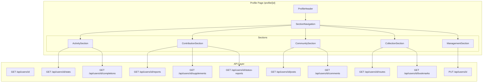
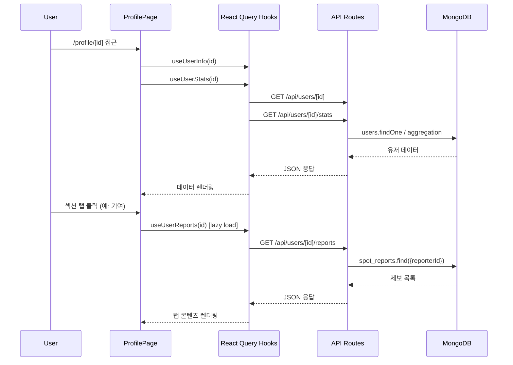

# Design Document

## 45-profile-complete: 프로필 페이지 활동 허브 완성

## Overview

프로필 페이지(`/profile/[id]`)를 기존 4탭 구조에서 **활동 / 기여 / 커뮤니티 / 보관함 / 관리** 5개 섹션 허브로 재설계한다. `/settings/account` 페이지를 관리 섹션에 통합하고, 헤더 프로필 링크를 수정하며, 프로필 편집 기능을 구현한다.

### 핵심 변경 범위

1. **프로필 페이지 재구조화**: 5개 섹션 + 각 섹션별 하위 탭
2. **API 확장**: 8개 신규 GET 엔드포인트 + PUT 프로필 업데이트
3. **헤더 링크 변경**: `/settings/account` → `/profile/{userId}`
4. **리다이렉트 설정**: `/settings/account` → `/profile/{userId}?section=management`
5. **프로필 편집**: 이름/이미지 변경 폼 + 유효성 검사
6. **계정 설정 통합**: OAuth 연동, 비밀번호 설정을 관리 섹션으로 이동

---

## Architecture

### 전체 구조



### 데이터 흐름



### 섹션 구조

| 섹션 | 하위 탭 | 데이터 소스 |
|------|---------|------------|
| 활동 | 인증 갤러리, 코스 완주, 트로피 룸, 진행 현황 | checkins, route_completions, user_badges, user_stats |
| 기여 | 등록한 스팟, 신규 제보, 정보보완, 상태신고 | spots, spot_reports, spot_supplements, spot_status_reports |
| 커뮤니티 | 내 게시글, 내 댓글 | posts, comments |
| 보관함 | 내가 만든 코스, 저장한 코스 | routes, route_bookmarks |
| 관리 | 프로필 편집, 계정 연동, 알림 설정 | users, accounts, push_subscriptions |

### 리다이렉트 전략

```
/settings/account (로그인) → /profile/{userId}?section=management
/settings/account (비로그인) → /auth/signin?callbackUrl=/settings/account
```

Next.js 페이지 레벨에서 `redirect()` 사용 (서버 컴포넌트) 또는 클라이언트 `useRouter().replace()` 사용.

---

## Components and Interfaces

### 1. ProfileHeader 컴포넌트

**파일**: `src/components/profile/ProfileHeader.tsx`

```typescript
interface ProfileHeaderProps {
  userInfo: UserInfo
  stats: ExtendedUserStats
  isOwner: boolean
  onEditClick: () => void
}
```

표시 항목:
- 유저 이름, 프로필 이미지, 가입일
- 통계: 총 인증 수, 방문 스팟 수, 획득 배지 수, 완주 코스 수, 등록 스팟 수, 제보 수, 게시글 수
- Owner일 때만 "편집" 버튼 표시

### 2. SectionNavigation 컴포넌트

**파일**: `src/components/profile/SectionNavigation.tsx`

```typescript
type ProfileSection = 'activity' | 'contribution' | 'community' | 'collection' | 'management'

interface SectionNavigationProps {
  activeSection: ProfileSection
  onSectionChange: (section: ProfileSection) => void
  isOwner: boolean  // 관리 섹션 표시 여부
}
```

- 가로 스크롤 지원 (`overflow-x-auto`)
- 활성 섹션 시각적 구분 (하단 보더 또는 배경색)
- `isOwner === false`일 때 "관리" 탭 미표시

### 3. SubTabNavigation 컴포넌트

**파일**: `src/components/profile/SubTabNavigation.tsx`

```typescript
interface SubTabNavigationProps {
  tabs: { key: string; label: string }[]
  activeTab: string
  onTabChange: (tab: string) => void
}
```

### 4. 섹션 컴포넌트

#### ActivitySection

**파일**: `src/components/profile/sections/ActivitySection.tsx`

```typescript
interface ActivitySectionProps {
  userId: string
  isOwner: boolean
}
```

하위 탭: 인증 갤러리 | 코스 완주 | 트로피 룸 | 진행 현황

#### ContributionSection

**파일**: `src/components/profile/sections/ContributionSection.tsx`

```typescript
interface ContributionSectionProps {
  userId: string
}
```

하위 탭: 등록한 스팟 | 신규 제보 | 정보보완 | 상태신고

#### CommunitySection

**파일**: `src/components/profile/sections/CommunitySection.tsx`

```typescript
interface CommunitySectionProps {
  userId: string
}
```

하위 탭: 내 게시글 | 내 댓글

#### CollectionSection

**파일**: `src/components/profile/sections/CollectionSection.tsx`

```typescript
interface CollectionSectionProps {
  userId: string
  isOwner: boolean
}
```

하위 탭: 내가 만든 코스 | 저장한 코스

#### ManagementSection

**파일**: `src/components/profile/sections/ManagementSection.tsx`

```typescript
interface ManagementSectionProps {
  userId: string
}
```

하위 탭: 프로필 편집 | 계정 연동 | 알림 설정

기존 `/settings/account` 페이지의 `AccountSettingsContent` 로직을 재사용.

### 5. API 엔드포인트

#### GET /api/users/[id]/routes

```typescript
// 응답 (200 OK)
{
  routes: Array<{
    id: string
    name: string
    spotCount: number
    bookmarkCount: number
    createdAt: string
  }>
}
```

#### GET /api/users/[id]/bookmarks

```typescript
// 응답 (200 OK)
{
  bookmarks: Array<{
    id: string          // route ID
    name: string        // route name
    authorName: string
    spotCount: number
    bookmarkedAt: string
  }>
}
```

#### GET /api/users/[id]/completions

```typescript
// 응답 (200 OK)
{
  completions: Array<{
    id: string
    routeId: string
    routeName: string
    spotCount: number
    completedAt: string
  }>
}
```

#### GET /api/users/[id]/reports

```typescript
// 응답 (200 OK)
{
  reports: Array<{
    id: string
    spotName: string
    status: 'pending' | 'approved' | 'rejected'
    createdAt: string
  }>
}
```

#### GET /api/users/[id]/supplements

```typescript
// 응답 (200 OK)
{
  supplements: Array<{
    id: string
    spotName: string
    type: string        // 보완 유형
    status: 'pending' | 'approved' | 'rejected'
    createdAt: string
  }>
}
```

#### GET /api/users/[id]/status-reports

```typescript
// 응답 (200 OK)
{
  statusReports: Array<{
    id: string
    spotName: string
    reportedStatus: string
    resolved: boolean
    createdAt: string
  }>
}
```

#### GET /api/users/[id]/posts

```typescript
// 응답 (200 OK)
{
  posts: Array<{
    id: string
    title: string
    contentPreview: string  // 내용 앞 100자
    viewCount: number
    commentCount: number
    createdAt: string
  }>
}
```

#### GET /api/users/[id]/comments

```typescript
// 응답 (200 OK)
{
  comments: Array<{
    id: string
    postId: string
    postTitle: string
    contentPreview: string  // 댓글 내용 앞 80자
    createdAt: string
  }>
}
```

#### PUT /api/users/[id]

```typescript
// 요청 Body
{
  name?: string
  image?: string
}

// 응답 (200 OK)
{
  id: string
  name: string
  image: string | null
  updatedAt: string
}

// 응답 (400 Bad Request)
{ error: '이름을 입력해주세요' }

// 응답 (403 Forbidden)
{ error: '본인의 프로필만 수정할 수 있습니다' }

// 응답 (404 Not Found)
{ error: '유저를 찾을 수 없습니다' }
```

### 6. API 상수 확장

**파일**: `src/lib/api-routes.ts`

```typescript
USERS: {
  INFO: (id: string) => `/api/users/${id}`,
  STATS: (id: string) => `/api/users/${id}/stats`,
  BADGES: (id: string) => `/api/users/${id}/badges`,
  PROGRESS: (id: string) => `/api/users/${id}/progress`,
  // 신규 추가
  ROUTES: (id: string) => `/api/users/${id}/routes`,
  BOOKMARKS: (id: string) => `/api/users/${id}/bookmarks`,
  COMPLETIONS: (id: string) => `/api/users/${id}/completions`,
  REPORTS: (id: string) => `/api/users/${id}/reports`,
  SUPPLEMENTS: (id: string) => `/api/users/${id}/supplements`,
  STATUS_REPORTS: (id: string) => `/api/users/${id}/status-reports`,
  POSTS: (id: string) => `/api/users/${id}/posts`,
  COMMENTS: (id: string) => `/api/users/${id}/comments`,
  UPDATE: (id: string) => `/api/users/${id}`,
}
```

### 7. React Query 훅 확장

**파일**: `src/hooks/useUserQueries.ts`

```typescript
// 쿼리 키 팩토리 확장
export const userKeys = {
  all: ['users'] as const,
  info: (userId: string) => [...userKeys.all, 'info', userId] as const,
  stats: (userId: string) => [...userKeys.all, 'stats', userId] as const,
  badges: (userId: string) => [...userKeys.all, 'badges', userId] as const,
  progress: (userId: string) => [...userKeys.all, 'progress', userId] as const,
  reportedSpots: (userId: string) => [...userKeys.all, 'reportedSpots', userId] as const,
  // 신규 추가
  routes: (userId: string) => [...userKeys.all, 'routes', userId] as const,
  bookmarks: (userId: string) => [...userKeys.all, 'bookmarks', userId] as const,
  completions: (userId: string) => [...userKeys.all, 'completions', userId] as const,
  reports: (userId: string) => [...userKeys.all, 'reports', userId] as const,
  supplements: (userId: string) => [...userKeys.all, 'supplements', userId] as const,
  statusReports: (userId: string) => [...userKeys.all, 'statusReports', userId] as const,
  posts: (userId: string) => [...userKeys.all, 'posts', userId] as const,
  comments: (userId: string) => [...userKeys.all, 'comments', userId] as const,
}

// 신규 훅들
export function useUserRoutes(userId: string, enabled?: boolean)
export function useUserBookmarks(userId: string, enabled?: boolean)
export function useUserCompletions(userId: string, enabled?: boolean)
export function useUserReports(userId: string, enabled?: boolean)
export function useUserSupplements(userId: string, enabled?: boolean)
export function useUserStatusReports(userId: string, enabled?: boolean)
export function useUserPosts(userId: string, enabled?: boolean)
export function useUserComments(userId: string, enabled?: boolean)
export function useUpdateProfile(userId: string)  // useMutation
```

각 훅은 `enabled` 파라미터로 lazy loading을 지원한다. 해당 섹션/탭이 활성화될 때만 `enabled: true`로 전환.

### 8. 헤더 수정

**파일**: `src/components/layout/Header.tsx`

변경 사항:
- 데스크톱 프로필 링크: `href="/settings/account"` → `href={`/profile/${user.id}`}`
- 모바일 메뉴 "계정 설정" 링크: `href="/settings/account"` → `href={`/profile/${user.id}`}`
- 모바일 메뉴 텍스트: "계정 설정" → "마이페이지"

---

## Data Models

### ExtendedUserStats (확장 통계)

기존 `UserStats`를 확장하여 추가 통계를 포함한다.

```typescript
interface ExtendedUserStats extends UserStats {
  /** 완주한 코스 수 */
  completedRoutes: number
  /** 등록한 스팟 수 */
  registeredSpots: number
  /** 제보 수 (spot_reports) */
  reportCount: number
  /** 게시글 수 */
  postCount: number
}
```

기존 `GET /api/users/[id]/stats` 엔드포인트를 확장하여 추가 필드를 반환한다.

### UserRoute (유저 코스)

```typescript
interface UserRoute {
  id: string
  name: string
  spotCount: number
  bookmarkCount: number
  createdAt: string
}
```

### UserBookmark (저장한 코스)

```typescript
interface UserBookmark {
  id: string          // route ID
  name: string
  authorName: string
  spotCount: number
  bookmarkedAt: string
}
```

### UserCompletion (코스 완주)

```typescript
interface UserCompletion {
  id: string
  routeId: string
  routeName: string
  spotCount: number
  completedAt: string
}
```

### UserReport (신규 제보)

```typescript
interface UserReport {
  id: string
  spotName: string
  status: 'pending' | 'approved' | 'rejected'
  createdAt: string
}
```

### UserSupplement (정보보완)

```typescript
interface UserSupplement {
  id: string
  spotName: string
  type: string
  status: 'pending' | 'approved' | 'rejected'
  createdAt: string
}
```

### UserStatusReport (상태신고)

```typescript
interface UserStatusReport {
  id: string
  spotName: string
  reportedStatus: string
  resolved: boolean
  createdAt: string
}
```

### UserPost (게시글)

```typescript
interface UserPost {
  id: string
  title: string
  contentPreview: string
  viewCount: number
  commentCount: number
  createdAt: string
}
```

### UserComment (댓글)

```typescript
interface UserComment {
  id: string
  postId: string
  postTitle: string
  contentPreview: string
  createdAt: string
}
```

### MongoDB 컬렉션 매핑

| 데이터 타입 | 컬렉션 | 필터 필드 |
|------------|--------|-----------|
| 유저 코스 | `routes` | `authorId` |
| 저장한 코스 | `route_bookmarks` | `userId` |
| 코스 완주 | `route_completions` | `userId` |
| 신규 제보 | `spot_reports` | `reporterId` |
| 정보보완 | `spot_supplements` | `contributorId` |
| 상태신고 | `spot_status_reports` | `reporterId` |
| 게시글 | `posts` | `userId` |
| 댓글 | `comments` | `userId` |
| 등록 스팟 | `spots` | `authorId` |

---

## Correctness Properties

*A property is a characteristic or behavior that should hold true across all valid executions of a system — essentially, a formal statement about what the system should do. Properties serve as the bridge between human-readable specifications and machine-verifiable correctness guarantees.*

### Property 1: 헤더 프로필 링크 정확성

*For any* 로그인된 유저 세션에 대해, 헤더의 모든 프로필 관련 링크(데스크톱 및 모바일)의 href는 `/profile/{session.user.id}` 형식이어야 하며, `/settings/account`를 가리키는 링크가 존재하지 않아야 한다.

**Validates: Requirements 1.2, 1.3, 1.4**

### Property 2: Owner 전용 UI 가시성

*For any* `sessionUserId`와 `urlUserId` 조합에 대해, "관리" 섹션과 "편집" 버튼은 `sessionUserId === urlUserId`인 경우에만 표시되고, 그 외(불일치 또는 세션 없음)에는 표시되지 않아야 한다.

**Validates: Requirements 2.4, 2.5, 2.6, 3.4, 8.2, 8.3**

### Property 3: 섹션 네비게이션 상태 일관성

*For any* 프로필 섹션 탭 클릭에 대해, 클릭된 섹션이 활성 상태로 전환되고 해당 섹션의 콘텐츠가 렌더링되어야 한다.

**Validates: Requirements 2.2**

### Property 4: 목록 항목 필드 완전성

*For any* 유효한 데이터 레코드에 대해, 각 목록 항목의 렌더링 결과는 해당 타입에 정의된 모든 필수 필드를 포함해야 한다:
- 코스 완주: 코스 이름, 완주일, 스팟 수
- 등록 스팟: 이름, 주소, 카테고리, 등록일
- 신규 제보: 스팟 이름, 제보일, 처리 상태
- 게시글: 제목/미리보기, 작성일, 조회수, 댓글 수
- 댓글: 내용 미리보기, 작성일, 원문 게시글 링크
- 코스: 이름, 스팟 수, 생성일, 북마크 수

**Validates: Requirements 3.3, 3.6, 4.3, 4.5, 4.7, 4.9, 5.3, 5.6, 6.3, 6.5**

### Property 5: 상세 페이지 네비게이션 정확성

*For any* 목록 항목(게시글, 댓글, 코스)에 대해, 해당 항목의 링크 href는 올바른 상세 페이지 경로를 가리켜야 한다:
- 게시글 → `/community/posts/{postId}`
- 댓글 → `/community/posts/{comment.postId}`
- 코스 → `/routes/{routeId}`

**Validates: Requirements 5.4, 5.7, 6.6**

### Property 6: 프로필 이름 유효성 검사

*For any* 빈 문자열 또는 공백만으로 구성된 문자열을 프로필 이름으로 제출하면, 시스템은 이를 거부하고 "이름을 입력해주세요" 에러를 표시해야 한다.

**Validates: Requirements 7.5**

### Property 7: 프로필 헤더 데이터 완전성

*For any* 유효한 `UserInfo`와 `ExtendedUserStats` 데이터에 대해, 프로필 헤더는 유저 이름, 프로필 이미지(또는 기본 아이콘), 가입일, 그리고 모든 통계 항목(총 인증 수, 방문 스팟 수, 획득 배지 수, 완주 코스 수, 등록 스팟 수, 제보 수, 게시글 수)을 표시해야 한다.

**Validates: Requirements 8.1, 8.4, 8.5**

### Property 8: API 유저 데이터 필터링 정확성

*For any* 유저 ID와 데이터 컬렉션에 대해, `GET /api/users/[id]/{resource}` 엔드포인트는 해당 유저의 데이터만 반환해야 한다. 즉, 반환된 모든 레코드의 소유자 필드(authorId, userId, reporterId, contributorId)가 요청된 유저 ID와 일치해야 한다.

**Validates: Requirements 9.1, 9.2, 9.3, 9.4, 9.5, 9.6, 9.7, 9.8**

### Property 9: 프로필 업데이트 라운드트립

*For any* 유효한 이름과 이미지 URL에 대해, `PUT /api/users/[id]`로 업데이트한 후 `GET /api/users/[id]`로 조회하면 업데이트된 이름과 이미지가 반환되어야 한다.

**Validates: Requirements 9.9**

### Property 10: 프로필 업데이트 권한 검증

*For any* 두 개의 서로 다른 유저 ID(세션 유저 ID ≠ URL 파라미터 ID)에 대해, `PUT /api/users/[id]` 요청은 HTTP 403 응답을 반환해야 한다.

**Validates: Requirements 9.10**

### Property 11: /settings/account 리다이렉트

*For any* 로그인된 유저가 `/settings/account` 경로에 접근하면, `/profile/{session.user.id}` 경로로 리다이렉트되어야 한다.

**Validates: Requirements 10.1**

### Property 12: 빈 상태 Owner 액션 링크

*For any* 섹션/탭 조합에서 데이터가 비어있고 `isOwner === true`인 경우, 빈 상태 UI에는 관련 기능으로 이동하는 액션 링크가 포함되어야 한다.

**Validates: Requirements 11.2, 11.3**

---

## Error Handling

### API Route 에러 처리

| 상황 | HTTP 상태 | 응답 본문 |
|------|-----------|-----------|
| 유저 없음 | 404 | `{ error: '유저를 찾을 수 없습니다' }` |
| 권한 없음 (PUT) | 403 | `{ error: '본인의 프로필만 수정할 수 있습니다' }` |
| 유효성 검사 실패 | 400 | `{ error: '이름을 입력해주세요' }` |
| DB 오류 | 500 | `{ error: '데이터 조회에 실패했습니다' }` |
| 잘못된 ObjectId | 400 | `{ error: '잘못된 유저 ID입니다' }` |

### 클라이언트 에러 처리

- **React Query `isError` 상태**: 각 섹션별로 에러 메시지 + 재시도 버튼 표시
- **네트워크 오류**: "네트워크 연결을 확인해주세요" 메시지
- **인증 만료**: 로그인 페이지로 리다이렉트

### 프로필 편집 유효성 검사

| 필드 | 검증 규칙 | 에러 메시지 |
|------|-----------|------------|
| name | 빈 문자열 또는 공백만 | "이름을 입력해주세요" |
| name | 50자 초과 | "이름은 50자 이내로 입력해주세요" |
| image | 유효하지 않은 URL | "올바른 이미지 URL이 아닙니다" |

### 빈 상태 처리

각 탭별 빈 상태 메시지:

| 탭 | 빈 상태 메시지 | Owner 액션 링크 |
|----|---------------|----------------|
| 인증 갤러리 | "아직 인증 기록이 없습니다" | "성지 탐색하러 가기" → `/` |
| 코스 완주 | "아직 완주한 코스가 없습니다" | "코스 탐색하기" → `/routes` |
| 트로피 룸 | "아직 획득한 배지가 없습니다" | — |
| 등록한 스팟 | "아직 등록한 스팟이 없습니다" | "스팟 등록하기" → `/spots/register` |
| 신규 제보 | "아직 제보한 스팟이 없습니다" | "스팟 제보하기" → `/reports/new` |
| 내 게시글 | "아직 작성한 게시글이 없습니다" | "커뮤니티 가기" → `/community` |
| 내가 만든 코스 | "아직 만든 코스가 없습니다" | "코스 만들기" → `/routes/create` |
| 저장한 코스 | "아직 저장한 코스가 없습니다" | "코스 탐색하기" → `/routes` |

---

## Testing Strategy

### 단위 테스트 (Unit Tests)

**API Route 테스트**:
- 각 GET 엔드포인트: 정상 응답, 유저 없음 404, DB 오류 500
- PUT 엔드포인트: 정상 업데이트, 권한 없음 403, 유효성 실패 400, 유저 없음 404

**컴포넌트 테스트**:
- `SectionNavigation`: 탭 클릭 시 콜백 호출 확인
- `ProfileHeader`: 통계 데이터 렌더링 확인
- 각 섹션 컴포넌트: 로딩/빈 상태/데이터 상태 렌더링

**유틸 함수 테스트**:
- `formatJoinDate`: 다양한 날짜 입력에 대한 포맷 확인
- 프로필 이름 유효성 검사 함수

### 속성 기반 테스트 (Property-Based Tests)

**라이브러리**: `fast-check` (프로젝트 기존 사용)

**Property 2 — Owner 전용 UI 가시성**:
```typescript
// Feature: 45-profile-complete, Property 2: Owner 전용 UI 가시성
fc.assert(fc.property(
  fc.string({ minLength: 1 }),
  fc.string({ minLength: 1 }),
  (sessionUserId, urlUserId) => {
    const isOwner = sessionUserId === urlUserId
    // isOwner일 때만 관리 섹션과 편집 버튼이 표시되어야 함
    const managementVisible = isOwner
    const editButtonVisible = isOwner
    return managementVisible === isOwner && editButtonVisible === isOwner
  }
), { numRuns: 100 })
```

**Property 6 — 프로필 이름 유효성 검사**:
```typescript
// Feature: 45-profile-complete, Property 6: 프로필 이름 유효성 검사
fc.assert(fc.property(
  fc.stringOf(fc.constantFrom(' ', '\t', '\n', '\r', '')),
  (whitespaceOnlyName) => {
    const result = validateProfileName(whitespaceOnlyName)
    return result.valid === false && result.error === '이름을 입력해주세요'
  }
), { numRuns: 100 })
```

**Property 8 — API 유저 데이터 필터링 정확성**:
```typescript
// Feature: 45-profile-complete, Property 8: API 유저 데이터 필터링 정확성
fc.assert(fc.asyncProperty(
  fc.string({ minLength: 1 }),
  fc.array(fc.record({ authorId: fc.string(), name: fc.string() })),
  async (targetUserId, routes) => {
    // mock DB에 routes 삽입 후 API 호출
    const response = await callRoutesApi(targetUserId)
    const body = await response.json()
    // 반환된 모든 route의 authorId가 targetUserId와 일치해야 함
    return body.routes.every((r: { authorId: string }) => r.authorId === targetUserId)
  }
), { numRuns: 100 })
```

**Property 9 — 프로필 업데이트 라운드트립**:
```typescript
// Feature: 45-profile-complete, Property 9: 프로필 업데이트 라운드트립
fc.assert(fc.asyncProperty(
  fc.string({ minLength: 1, maxLength: 50 }),
  fc.webUrl(),
  async (newName, newImage) => {
    // PUT으로 업데이트 후 GET으로 조회
    await callPutApi(userId, { name: newName, image: newImage })
    const response = await callGetApi(userId)
    const body = await response.json()
    return body.name === newName && body.image === newImage
  }
), { numRuns: 100 })
```

**Property 10 — 프로필 업데이트 권한 검증**:
```typescript
// Feature: 45-profile-complete, Property 10: 프로필 업데이트 권한 검증
fc.assert(fc.asyncProperty(
  fc.string({ minLength: 1 }),
  fc.string({ minLength: 1 }),
  fc.string({ minLength: 1 }),
  async (sessionUserId, urlUserId, newName) => {
    fc.pre(sessionUserId !== urlUserId)  // 서로 다른 ID만 테스트
    const response = await callPutApiWithSession(sessionUserId, urlUserId, { name: newName })
    return response.status === 403
  }
), { numRuns: 100 })
```

**Property 11 — /settings/account 리다이렉트**:
```typescript
// Feature: 45-profile-complete, Property 11: /settings/account 리다이렉트
fc.assert(fc.property(
  fc.string({ minLength: 1 }),
  (userId) => {
    const redirectUrl = getSettingsRedirectUrl(userId)
    return redirectUrl === `/profile/${userId}`
  }
), { numRuns: 100 })
```

### 테스트 구성

- 각 속성 테스트는 최소 **100회 반복** 실행
- 각 테스트에 **Feature: 45-profile-complete, Property N: {title}** 태그 포함
- `fast-check` 라이브러리 사용 (프로젝트 기존 의존성)

### 통합 테스트

- 프로필 페이지 전체 렌더링 (로그인/비로그인 상태)
- 섹션 전환 및 데이터 로딩 확인
- `/settings/account` 리다이렉트 동작 확인
- 프로필 편집 폼 제출 → API 호출 → UI 업데이트 흐름
