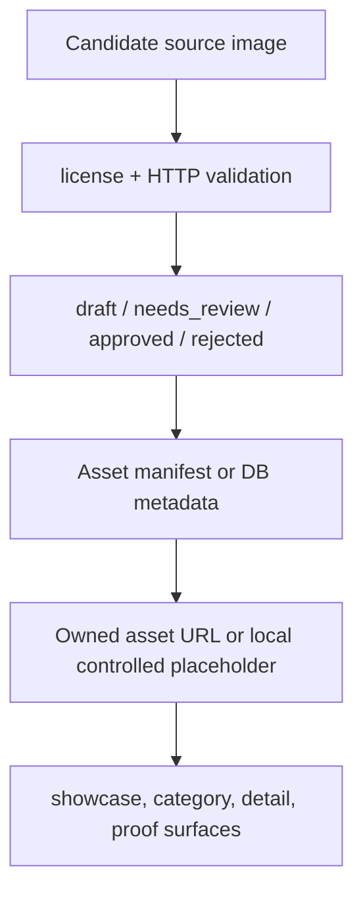

# Design Document

## 47 - Real Image Data Collection

## Overview

Spec 47 removes the production dependency on runtime Wikimedia image hotlinks and
defines the data contract for future real spot image collection. The immediate
implementation uses controlled local showcase assets as the safe fallback because
R2/CDN write credentials are not guaranteed in local agent sessions. The design
keeps source/attribution metadata separate from renderable image URLs so legal
traceability survives after runtime URLs move to owned assets.

This intentionally reverses the temporary Spec 39 behavior where
`REAL_SPOT_PHOTO_FALLBACKS` returned Wikimedia URLs for placeholder spot photos.
That strategy was useful for realism but unsafe for production reliability:
external rate limits and broken Commons files can flood `_next/image` with
429/404 responses.

## Current Runtime Flow

```mermaid
flowchart TD
  DB[(spots.photos[0])] --> H[/api/spots/showcase helpers/]
  F[REAL_SPOT_PHOTO_FALLBACKS] --> H
  H --> API[/api/spots/showcase]
  API --> Landing[fetchProofImages / landing cards]
  Landing --> NextImage[next/image optimizer]
```

Before Spec 47, placeholder or missing photos could resolve to
`upload.wikimedia.org` or `commons.wikimedia.org`. Next Image then proxied those
URLs at runtime, so an unstable external host became a user-facing production
failure.

## Target Runtime Flow



Runtime render fields must contain only:

- local controlled assets such as `/images/showcase/*.webp`
- app upload paths such as `/uploads/**` or `/api/images/**`
- future approved storage/CDN URLs such as R2 public URLs

Source evidence may still contain Commons file page URLs, but those fields are
metadata only and must not be rendered as images.

## Components and Interfaces

### `src/lib/real-image-data.ts`

Owns the Spec 47 contract:

- `RealSpotData`
- `SourceEvidence`
- `LicensedImage`
- `ImageDerivative`
- `AssetManifestEntry`
- `DataReviewStatus`
- external hotlink detection
- license and required-field validation
- controlled local fallback selection
- monitoring action classification

### `src/components/landing/data/realSpotPhotoFallbacks.ts`

Keeps attribution metadata for former Wikimedia candidates but changes
`imageUrl` to controlled local assets. `sourcePageUrl` remains metadata.

### `/api/spots/showcase`

Treats Wikimedia, placeholder, and unapproved external image hosts as
placeholder-equivalent. Placeholder-equivalent photos resolve to controlled local
fallbacks instead of external hotlinks.

### `next.config.ts`

No longer allowlists Wikimedia hosts in production `images.remotePatterns`.
Future collected assets should use the configured R2 public host or another
approved app-controlled CDN.

### `scripts/validate-approved-images.mjs`

Provides a safe, repeatable, non-mutating validation command for approved image
manifests:

```bash
npm run validate:images -- path/to/approved-images.json
```

The script reports host, status, content type, affected spot IDs, and an
operator action.

## Data Model Rules

1. Approved spots require source evidence.
2. Approved images require license metadata.
3. Image approval and spot approval are independent.
4. Renderable URL fields must not contain External Hotlink hosts:
   - `upload.wikimedia.org`
   - `commons.wikimedia.org`
   - `picsum.photos`
   - `via.placeholder.com`
5. Attribution/source URLs are metadata; they are not render URLs.
6. Derivative filenames include variant and content hash for cache invalidation.

## Error Handling

- 404 / 410: replace the asset.
- 429: retry later; do not promote to approved.
- 5xx: investigate storage credentials or upstream source health.
- Missing license: reject.
- Missing owned asset: keep `needs_review`.
- No approved image for a spot: render a controlled local/category fallback.

## Testing Strategy

- Unit tests validate schema/status/license behavior.
- Showcase API helper tests prove Wikimedia URLs are treated as unsafe
  placeholder-equivalent inputs.
- Static image-config tests prove Wikimedia hosts are absent from
  `next.config.ts`.
- Fallback data tests prove production fallback render URLs are controlled local
  paths, not Commons/upload URLs.
- Script smoke tests run the validator with an empty manifest to prove the
  command is safe and non-mutating by default.
